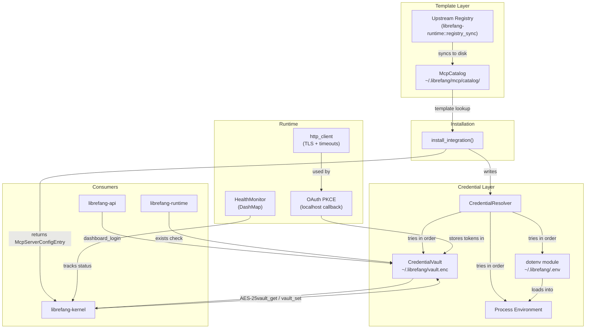

# Extensions & Vault

# Extensions & Vault Module

## Purpose

`librefang-extensions` provides the infrastructure for managing MCP server integrations, encrypted credential storage, and runtime health monitoring. It bridges the gap between the upstream MCP server registry (a set of TOML templates) and the running kernel by resolving catalog entries into live `McpServerConfigEntry` values, provisioning their credentials, and tracking their health.

Every installed MCP server is an `[[mcp_servers]]` entry in `~/.librefang/config.toml`. An optional `template_id` field links it back to the catalog entry it originated from.

## Architecture



## Core Types (`lib.rs`)

The crate root defines the shared vocabulary used across all submodules:

- **`McpCatalogEntry`** — A bundled MCP server template. Contains id, name, transport config, required environment variables, optional OAuth template, health check config, tags, i18n overrides, and setup instructions. Deserialized from TOML files in the catalog directory.
- **`McpCategory`** — Classification enum: `DevTools`, `Productivity`, `Communication`, `Data`, `Cloud`, `AI`.
- **`McpStatus`** — Lifecycle state: `Ready`, `Setup` (missing credentials), `Available` (catalog-only), `Error(String)`, `Disabled`.
- **`McpCatalogTransport`** — How to launch the server: `Stdio { command, args }`, `Sse { url }`, or `Http { url }`.
- **`McpCatalogRequiredEnv`** — Describes a required credential: env var name, human label, help text, secret flag, and optional URL to obtain the key.
- **`OAuthTemplate`** — OAuth2 provider config template with auth/token URLs and scopes.
- **`ExtensionError`** — Error enum covering `NotFound`, `VaultLocked`, `VaultKeyMismatch`, `OAuth`, `Io`, etc.

---

## MCP Catalog (`catalog.rs`)

An in-memory, read-only view of all TOML template files under `~/.librefang/mcp/catalog/`. Templates are refreshed from the upstream registry by `librefang_runtime::registry_sync`.

### File Layout

Two on-disk layouts are supported:

| Layout | Pattern | ID Source |
|--------|---------|-----------|
| Flat file | `<id>.toml` | Filename minus extension |
| Directory | `<id>/MCP.toml` | Directory name |

`McpCatalog::load()` scans the catalog directory, parses every valid entry, and rebuilds the internal `HashMap<String, McpCatalogEntry>`. A full reload clears existing entries first so deleted files don't linger.

### Key Methods

| Method | Description |
|--------|-------------|
| `McpCatalog::new(home_dir)` | Create an empty catalog rooted at `home_dir/mcp/catalog/` |
| `load(&mut self, home_dir)` | Full reload from disk; returns count of entries parsed |
| `get(id)` | Look up a single entry by ID |
| `list()` | All entries sorted by ID |
| `list_by_category(category)` | Filter by `McpCategory` |
| `search(query)` | Case-insensitive search across id, name, description, and tags |

---

## Credential Vault (`vault.rs`)

AES-256-GCM encrypted secret storage at `~/.librefang/vault.enc`. The vault provides the primary credential store for API keys, OAuth tokens, and other secrets.

### Master Key Resolution

The master key is resolved in priority order:

1. **Cached key** — If the vault instance was previously unlocked, the key is reused from memory.
2. **Environment variable** — `LIBREFANG_VAULT_KEY` (base64-encoded 32-byte key). Takes priority over keyring to survive re-opens in CI/headless.
3. **OS keyring** — Windows Credential Manager, macOS Keychain, or Linux Secret Service (via the `keyring` crate). On macOS this is **disabled by default** because the Keychain ACL is per-binary-signature; every `cargo build` invalidates it and triggers a prompt.
4. **File fallback** — `<data_local_dir>/librefang/.keyring` (mode 0600, AES-256-GCM wrapped with an Argon2id-derived machine-fingerprint key). Used when OS keyring is unavailable or disabled.

The `LIBREFANG_VAULT_NO_KEYRING=1` env var forces the file-based fallback regardless of config.

### Encryption Scheme

```
master_key (32 bytes)
  → Argon2id(master_key, salt) → derived_key (32 bytes)
    → AES-256-GCM(derived_key, nonce, plaintext, AAD) → ciphertext
```

- **KDF**: Argon2id with 256 MB memory, 3 iterations, degree 4 parallelism.
- **AAD**: `schema_version_le_bytes || vault_path_bytes` — binds the ciphertext to both the file path and the schema version, preventing file-swap attacks.
- **On-disk format**: `OFV1` magic header + JSON with base64-encoded salt, nonce, and ciphertext.
- **File permissions**: 0600 enforced on Unix; atomic write via `.tmp` + `fsync` + `rename`.

### Startup Sentinel (#3651)

Every vault contains a reserved key `__sentinel__` with value `librefang-vault-sentinel-v1`. Written at `init()` time and verified on every `unlock()` via `verify_or_install_sentinel()`. If the sentinel is present but doesn't match, the daemon refuses to boot with `VaultKeyMismatch` — this catches the case where `LIBREFANG_VAULT_KEY` points to a wrong key without silently losing credentials.

The sentinel key is excluded from `list_keys()` and cannot be written or removed by external callers.

### Key Operations

| Method | Description |
|--------|-------------|
| `init()` | Generate master key, store in keyring, create empty vault with sentinel |
| `init_with_key(key)` | Same but with an explicit 32-byte key |
| `unlock()` | Load and decrypt vault using resolved master key |
| `unlock_with_key(key)` | Same but with an explicit key |
| `get(key)` | Retrieve a `Zeroizing<String>` value |
| `set(key, value)` | Store a secret; rejects the reserved sentinel key |
| `remove(key)` | Delete a secret; rejects the sentinel key |
| `list_keys()` | All user-visible keys (sentinel excluded) |
| `list_keys_including_internal()` | All keys including sentinel (for key rotation) |
| `iter_all_entries()` | Iterator over all (key, value) pairs including sentinel |
| `rewrap_with_new_key(new_key)` | Re-encrypt entire vault under a new master key |
| `verify_or_install_sentinel()` | Ensure sentinel is present and matches; backfill on legacy vaults |
| `exists()` | Check if `vault.enc` file is present |

### Key Rotation Flow

`rewrap_with_new_key()` re-encrypts all entries (including the sentinel) under the provided key. The caller is responsible for persisting the new key. Used by `librefang vault rotate-key`.

---

## Credential Resolution (`credentials.rs`)

`CredentialResolver` implements a priority chain for resolving secrets at runtime.

### Resolution Order

1. **Encrypted vault** (`vault.enc`) — if unlocked
2. **Dotenv file** (`~/.librefang/.env`) — boot-time snapshot
3. **Process environment variable** — `std::env::var`
4. **Interactive prompt** — CLI only, when `with_interactive(true)` is set

All resolved values are wrapped in `Zeroizing<String>` to minimize secret lifetime in memory.

### Key Methods

| Method | Description |
|--------|-------------|
| `new(vault, dotenv_path)` | Construct with optional vault and `.env` path |
| `with_interactive(bool)` | Enable/disable terminal prompting as last resort |
| `resolve(key)` | Try all sources in order, return first match |
| `has_credential(key)` | Check availability without prompting |
| `resolve_all(keys)` | Resolve multiple keys into a `HashMap` |
| `missing_credentials(keys)` | Return which keys from a list have no source |
| `store_in_vault(key, value)` | Write a credential to the vault |
| `clear_dotenv_cache(key)` | Evict a stale entry from the boot-time `.env` snapshot |

---

## Dotenv Loader (`dotenv.rs`)

A shared `.env` file loader used by the CLI, desktop app, and kernel. Call `load_dotenv()` from synchronous `main()` **before** spawning any tokio runtime — `std::env::set_var` is UB in Rust 1.80+ once other threads exist.

### Priority (highest first)

1. System environment variables (already present) — **never overridden**
2. Credential vault (`vault.enc`)
3. `~/.librefang/.env`
4. `~/.librefang/secrets.env`

### File Format

Standard `KEY=VALUE` lines. Supports:
- Comments (`#`) and blank lines
- Double-quoted values with escape sequences (`\\`, `\n`, `\r`, `\"`)
- Single-quoted values (literal, no escaping)
- Surrounding whitespace trimming

### Atomic Writes

`save_env_key()` and `remove_env_key()` modify `~/.librefang/.env` using an atomic write pattern:

1. Write to `<path>.tmp.<pid>` with mode 0600 (created `create_new` so no TOCTOU race)
2. `fsync` + `sync_all`
3. `rename` over the target file

This prevents three classes of corruption: mid-write crashes leaving a truncated file, default-perms TOCTOU windows, and concurrent saves colliding on the same staging path.

---

## Health Monitor (`health.rs`)

Tracks the status of configured MCP servers with auto-reconnect support.

### `McpHealth` Record

| Field | Description |
|-------|-------------|
| `status` | Current `McpStatus` |
| `tool_count` | Number of tools available |
| `last_ok` | Timestamp of last successful health check |
| `last_error` | Most recent error message |
| `consecutive_failures` | Unbroken failure count |
| `reconnecting` / `reconnect_attempts` | Auto-reconnect state |

### `HealthMonitor`

Backed by a `DashMap<String, McpHealth>` for lock-free concurrent access from background health-check tasks. Key methods:

- **`register(id)`** / **`unregister(id)`** — Add/remove servers from monitoring
- **`report_ok(id, tool_count)`** — Mark healthy; resets failure counters
- **`report_error(id, error)`** — Record a failure; increments `consecutive_failures`
- **`should_reconnect(id)`** — Returns true if status is `Error` and attempts remain
- **`backoff_duration(attempt)`** — Exponential backoff: 5s → 10s → 20s → ... → capped at 300s

Default config: 60s check interval, 10 max reconnect attempts, 300s max backoff.

---

## OAuth2 PKCE (`oauth.rs`)

Implements the full OAuth2 Authorization Code flow with PKCE for Google, GitHub, Microsoft, and Slack.

### Flow

1. Generate random PKCE verifier + SHA-256 challenge
2. Bind a temporary localhost HTTP server to `127.0.0.1:0` (random port)
3. Build HMAC-signed state token binding the flow to `(provider, client_id, redirect_uri, nonce, expiry)`
4. Open the browser to the authorization URL
5. Wait for callback with authorization code (5-minute timeout)
6. Exchange code for tokens via the token endpoint

### State Token Security (#3791)

State tokens are HMAC-SHA256-signed and contain:
- `provider` — auth URL of the OAuth template
- `client_id` — OAuth app registration
- `redirect_uri` — loopback listener address
- `nonce` — 16-byte random value
- `exp` — absolute UNIX timestamp (10-minute TTL)

Verification rejects mismatched providers, client IDs, redirect URIs, expired tokens, and invalid signatures. The HMAC key is re-seeded on every daemon restart, invalidating any in-flight flows from a prior process.

### Client ID Resolution

`resolve_client_ids(config)` merges defaults with config overrides. Default client IDs are safe to embed — PKCE doesn't require a client secret.

---

## Installer (`installer.rs`)

Pure transforms from catalog entries into `McpServerConfigEntry` values. **No side effects** — callers decide when to persist the result.

### `install_integration(catalog, resolver, id, provided_keys)`

1. Look up the catalog template by ID (returns `NotFound` if missing)
2. Store provided credentials in the vault (best effort — warns on failure)
3. Check which required env vars still lack a credential source
4. Convert the template transport + env into a `McpServerConfigEntry`
5. Return `InstallResult` with status (`Ready` or `Setup`), missing credential list, and user-facing message

The returned `InstallResult.server` has `template_id` set to the catalog entry ID so the kernel/dashboard can trace its origin.

### `catalog_entry_to_mcp_server(entry)`

Maps `McpCatalogTransport` → `McpTransportEntry`, collects required env var names, and optionally converts `OAuthTemplate` → `McpOAuthConfig`.

### Scaffolding

- `scaffold_integration(dir)` — Creates a `mcp.toml` template for a custom MCP server
- `scaffold_skill(dir)` — Creates `skill.toml` + `SKILL.md` for a new custom skill

---

## HTTP Client (`http_client.rs`)

Shared `reqwest::Client` builder with:

- **TLS**: `rustls` with native CA roots first; falls back to bundled `webpki-roots` if none found
- **Connect timeout**: 10 seconds
- **Read timeout**: 30 seconds
- **Redirect policy**: Max 5 redirects (prevents SSRF amplification)

Use `new_client()` for a ready-built client or `client_builder()` to customize further.

---

## Integration with the Rest of the Codebase

### Kernel (`librefang-kernel`)

The kernel's `mcp_oauth_provider` module is the primary consumer of the vault:

- **`vault_get`** → `CredentialVault::unlock()` → `resolve_master_key()` → `get()`
- **`vault_set`** → `CredentialVault::exists()` → `init()` → `unlock()` → `set()`
- **`vault_remove`** → `CredentialVault::exists()` → `remove()`

These are called during TOTP setup, auth callbacks, dashboard login, and OAuth token persistence.

### Runtime (`librefang-runtime`)

Uses `CredentialVault::exists()` as a general "is LibreFang initialized?" check across the context engine, checkpoint manager, browser discovery, artifact store, and catalog sync.

### API (`librefang-api`)

The `dashboard_login` endpoint resolves the dashboard credential by unlocking the vault and comparing the stored value — this flows through `unlock()` → `resolve_master_key()` → `decode_master_key()`.

### Boot Sequence

A typical daemon startup invokes:

1. `dotenv::load_dotenv()` — injects vault + `.env` secrets into the process environment (sync, before tokio)
2. `CredentialVault::init_with_config(use_os_keyring)` — sets the process-global keyring preference
3. `CredentialVault::unlock()` — decrypts the vault
4. `CredentialVault::verify_or_install_sentinel()` — validates the correct key was used