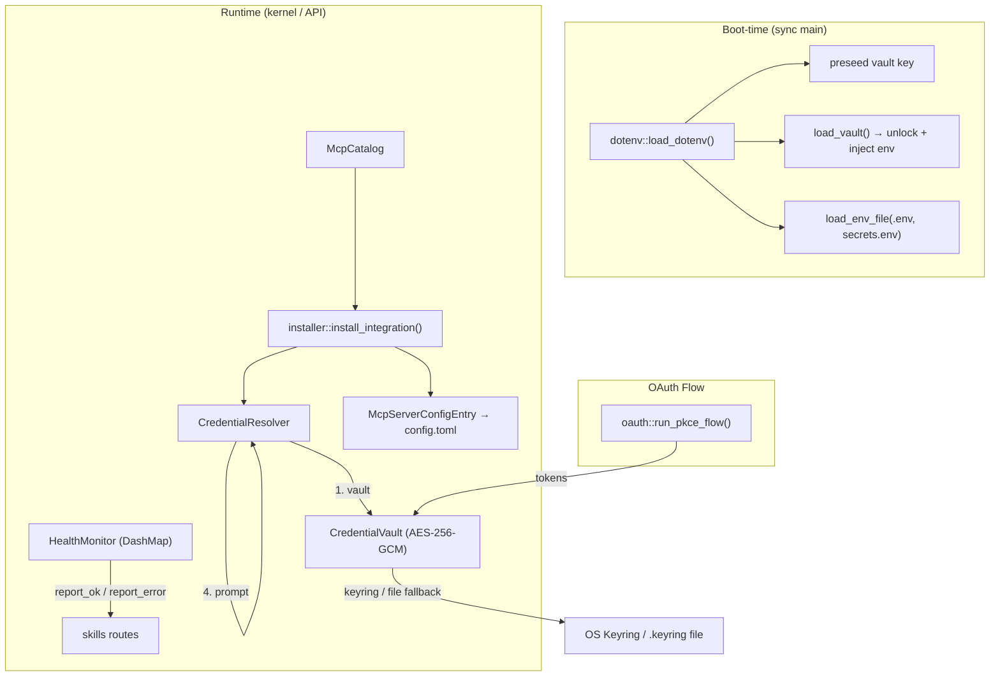

# Extensions & Vault

# Extensions & Vault

The `librefang-extensions` crate manages the full lifecycle of external integrations: discovering MCP server templates, resolving their credentials from multiple secure sources, installing them into the user's config, monitoring their health, and handling OAuth2 authentication flows.

## Architecture



**Credential priority** (highest wins, never overridden):

| Priority | Source | Loaded at |
|----------|--------|-----------|
| 1 | System environment variables | Process start |
| 2 | Credential vault (`vault.enc`) | `load_dotenv()` boot path |
| 3 | `~/.librefang/.env` | `load_dotenv()` boot path |
| 4 | `~/.librefang/secrets.env` | `load_dotenv()` boot path |

---

## Credential Vault (`vault.rs`)

AES-256-GCM encrypted file store at `~/.librefang/vault.enc`. The master key is resolved from (in order):

1. `LIBREFANG_VAULT_KEY` environment variable
2. OS keyring (macOS Keychain, Windows Credential Manager, Linux Secret Service)
3. File-based fallback at `<data_local_dir>/librefang/.keyring` (AES-256-GCM wrapped with an Argon2id-derived machine fingerprint key)

### Key concepts

**Sentinel validation (#3651).** Every vault contains a reserved `__sentinel__` key with known plaintext `"librefang-vault-sentinel-v1"`. On boot, after `unlock()`, the daemon calls `verify_or_install_sentinel()` to confirm the decrypting key matches the encrypting key. A mismatch returns `ExtensionError::VaultKeyMismatch` and halts boot — preventing silent data loss from a wrong `LIBREFANG_VAULT_KEY`.

**Path-bound AAD.** Ciphertext includes the vault file path as Additional Authenticated Data. Moving or renaming `vault.enc` causes decryption to fail, preventing file-swap attacks.

**Atomic writes.** Every `save()` writes to a `.tmp` file (mode 0600), calls `fsync`, then renames over the target. This prevents truncated files on crash and avoids a permissions TOCTOU window.

### Core API

```rust
let mut vault = CredentialVault::new(home.join("vault.enc"));

// First-time setup — generates key, stores in OS keyring
vault.init()?;

// Subsequent opens
vault.unlock()?;
let secret = vault.get("GITHUB_TOKEN");
vault.set("SLACK_TOKEN".into(), Zeroizing::new("xoxb-...".into()))?;
vault.remove("SLACK_TOKEN")?;

// Key rotation
vault.rewrap_with_new_key(new_key)?;
```

**Lazy init on first `set()`.** If the vault file doesn't exist when `set()` is called, it automatically runs `init()` so the credential is persisted rather than silently dropped. This is the contract `kernel::vault_handle()` relies on.

**Reserved key protection.** `set()` and `remove()` reject operations on `SENTINEL_KEY` to prevent external callers from corrupting the startup validation contract.

### OS keyring behavior

- **macOS**: OS keyring is **disabled by default** (macOS Keychain ACLs are per-binary-signature; every `cargo build` invalidates the ACL and triggers an allow prompt). The file fallback at `<data_local_dir>/librefang/.keyring` is used instead.
- **Linux / Windows**: OS keyring is enabled by default.
- Override: set `LIBREFANG_VAULT_NO_KEYRING=1` to force the file fallback on any platform.
- Programmatic override: `CredentialVault::init_with_config(use_os_keyring)` called once from `LibreFangKernel::boot_with_config`.

### Vault file format

```
OFV1<magic> <JSON VaultFile>
```

```rust
struct VaultFile {
    version: u8,           // always 1
    salt: String,          // base64, 16 bytes
    nonce: String,         // base64, 12 bytes
    ciphertext: String,    // base64, AES-256-GCM(JSON VaultEntries)
    schema_version: u32,   // AAD schema version (0 = legacy path-only, 1 = current)
}
```

---

## Credential Resolver (`credentials.rs`)

`CredentialResolver` provides a unified interface for looking up secrets at runtime. It chains through vault → dotenv cache → environment variable → interactive prompt (CLI only), returning the first hit.

### Vault ownership models

The resolver supports two vault backing models via the `VaultSource` enum:

- **`VaultSource::Owned`** — short-lived callers (CLI subcommands, tests) that construct their own `CredentialVault`. Created via `CredentialResolver::new()`.
- **`VaultSource::Shared`** — long-lived callers (API request handlers) that route through the kernel's cached `Arc<RwLock<CredentialVault>>` handle, avoiding re-running the Argon2id KDF on every request. Created via `CredentialResolver::with_vault_handle()`.

### Core API

```rust
// Short-lived (CLI, tests)
let mut resolver = CredentialResolver::new(Some(vault), Some(dotenv_path));

// Long-lived (API handlers) — uses kernel's cached vault
let resolver = CredentialResolver::with_vault_handle(
    kernel.vault_handle(),
    Some(dotenv_path),
);

// Resolve a single credential
let token = resolver.resolve("GITHUB_TOKEN"); // Option<Zeroizing<String>>

// Batch resolution
let creds = resolver.resolve_all(&["GITHUB_TOKEN", "SLACK_TOKEN"]);

// Check what's missing
let missing = resolver.missing_credentials(&["API_KEY", "CLIENT_ID"]);

// Store into vault
resolver.store_in_vault("API_KEY", Zeroizing::new("sk-...".into()))?;
```

---

## Dotenv Boot Loader (`dotenv.rs`)

**Must be called from synchronous `main()` before spawning the tokio runtime.** `std::env::set_var` is UB once other threads exist (Rust 1.80+).

`load_dotenv()` is guarded by a `Once` gate — repeated calls are no-ops. The loading sequence:

1. **Preseed `LIBREFANG_VAULT_KEY`** from `.env` / `secrets.env` if not already in the process environment. This is the only key extracted early — the vault's `resolve_master_key()` reads straight from `std::env`, so the key must be present before `load_vault()` runs (#5139).
2. **Unlock vault** and inject all vault secrets into `std::env` (skipping keys already set by the system environment).
3. **Load `.env`** into `std::env` (skipping already-set keys).
4. **Load `secrets.env`** into `std::env` (skipping already-set keys).

### File mutation API

```rust
// Upsert — atomic write (tmp file + rename, mode 0600 on Unix)
dotenv::save_env_key("GITHUB_TOKEN", "ghp_...")?;

// Remove
dotenv::remove_env_key("GITHUB_TOKEN")?;

// Query
let keys = dotenv::list_env_keys();
let exists = dotenv::env_file_exists();
```

**Escaping rules:** Values are written double-quoted when they contain spaces, `#`, `"`, `\`, newlines, or `=`. Escape sequences inside double quotes: `\\` → `\`, `\n` → newline, `\r` → carriage return, `\"` → `"`. Single-quoted values are literal (no escape processing).

### Home directory resolution

`$LIBREFANG_HOME` env var overrides the default `~/.librefang`. All file paths are derived from this root.

---

## MCP Catalog (`catalog.rs`)

Read-only in-memory index of MCP server templates cached at `~/.librefang/mcp/catalog/`. Refreshed from the upstream `librefang-registry` by `librefang_runtime::registry_sync`.

### Template file layouts

Two formats are recognized:

- **Flat**: `<catalog_dir>/<id>.toml` — ID from filename
- **Directory**: `<catalog_dir>/<id>/MCP.toml` — ID from directory name (for multi-file MCP packages)

`load()` performs a full reload (clears existing entries first) to avoid stale entries lingering after deletion or rename.

### Query API

```rust
let mut catalog = McpCatalog::new(&home);
let count = catalog.load(&home);

let entry = catalog.get("github");
let all = catalog.list();                    // sorted by ID
let tools = catalog.list_by_category(&McpCategory::DevTools);
let results = catalog.search("search");      // matches id, name, description, tags
```

Installed MCP servers reference catalog entries via an optional `template_id` field in their `[[mcp_servers]]` config.

---

## Health Monitor (`health.rs`)

Thread-safe health tracker for configured MCP servers, backed by a `DashMap<String, McpHealth>`.

### Reconnect backoff

Exponential backoff: 5s → 10s → 20s → 40s → ... → capped at 5 minutes. Maximum 10 reconnect attempts before giving up (configurable via `HealthMonitorConfig`).

### Core API

```rust
let monitor = HealthMonitor::new(HealthMonitorConfig::default());

monitor.register("github");
monitor.report_ok("github", 12);              // 12 tools available
monitor.report_error("slack", "Connection refused".into());
monitor.mark_reconnecting("slack");

let health = monitor.get_health("github");     // Option<McpHealth>
let should = monitor.should_reconnect("slack"); // bool
let backoff = monitor.backoff_duration(3);     // Duration
let all = monitor.all_health();                // Vec<McpHealth>

monitor.unregister("github");
```

The `HealthMonitor` is consumed by the kernel's background health-check task and by `src/routes/skills.rs` which queries `get_health()` to surface extension status in the API.

---

## OAuth2 PKCE (`oauth.rs`)

Implements the complete Authorization Code + PKCE flow for Google, GitHub, Microsoft, and Slack. Launches a temporary localhost HTTP server, opens the browser, receives the callback, and exchanges the code for tokens.

### State token security (#3791)

The `state` parameter is HMAC-SHA256 signed and binds to the triple `(provider auth_url, client_id, redirect_uri)` plus a random nonce and absolute expiry (10 minutes). Verification rejects:

- Bad HMAC (tampering)
- Expired tokens
- Provider mismatch (cross-flow injection)
- Client ID mismatch
- Redirect URI mismatch (listener swap)
- Nonce mismatch (replay)
- Duplicate callbacks (first-wins, subsequent get "Gone")

The HMAC key is process-local and re-seeded on every daemon restart, invalidating any in-flight flows from a prior process.

### Core API

```rust
let tokens = oauth::run_pkce_flow(&template, "my-client-id").await?;
// tokens.access_token, tokens.refresh_token, tokens.expires_in, tokens.scope

// Client ID resolution (defaults + config overrides)
let ids = oauth::resolve_client_ids(&oauth_config);
```

---

## Installer (`installer.rs`)

Pure-transform functions that convert a catalog entry + provided credentials into a `McpServerConfigEntry` suitable for persisting into `config.toml`. **No side effects** — callers decide when to store the result.

### `install_integration` flow

1. Look up the template in the catalog by ID
2. Store any user-provided credentials in the vault (best-effort)
3. Check which required env vars still have no credential
4. Build the `McpServerConfigEntry` (transport, env list, OAuth config)
5. Return an `InstallResult` with status (`Ready` or `Setup`), missing credentials, and a user-facing message

```rust
let result = install_integration(&catalog, &mut resolver, "github", &provided_keys)?;
// result.id, result.server (McpServerConfigEntry), result.status, result.missing_credentials
```

### Scaffold generators

- `scaffold_integration(dir)` — creates a `mcp.toml` template for a custom MCP server
- `scaffold_skill(dir)` — creates `skill.toml` + `SKILL.md` for a custom skill

---

## HTTP Client (`http_client.rs`)

Shared `reqwest::ClientBuilder` preconfigured with:

- Native CA roots (falling back to bundled `webpki-roots` if none found)
- `rustls` with `aws_lc_rs` crypto provider
- 10s connect timeout, 30s read timeout (prevents hung requests / SSRF amplification)
- Max 5 redirects (prevents redirect-loop amplification)

Use `new_client()` for a ready-built `reqwest::Client`, or `client_builder()` to customize before building.

---

## Error Handling

All errors flow through `ExtensionError`:

| Variant | Meaning |
|---------|---------|
| `NotFound(id)` | Catalog entry doesn't exist |
| `AlreadyInstalled(id)` | Server already in config |
| `NotInstalled(id)` | Server not in config |
| `CredentialNotFound(key)` | No source has this key |
| `Vault(msg)` | Vault I/O or crypto error |
| `VaultLocked` | No master key available |
| `VaultKeyMismatch { hint }` | Sentinel verification failed — wrong key |
| `OAuth(msg)` | OAuth flow error |
| `TomlParse(msg)` | Catalog TOML parse error |
| `Io(err)` | Filesystem error |
| `Http(msg)` | HTTP request error |
| `HealthCheck(msg)` | MCP health check failure |

---

## Integration Points

- **Boot path**: `load_dotenv()` is called from `librefang-desktop`'s `main()` and `lib.rs` before the tokio runtime starts.
- **API server**: `resolve_dashboard_credential()` in `librefang-api` calls `vault.unlock()` then `vault.get()` for auth token validation on every request.
- **Skills routes**: `get_health()` is queried by `status_str_for_catalog`, `get_extension`, and `list_extensions` in `src/routes/skills.rs`.
- **TUI**: `init_wizard::run()` and `free_provider_guide::submit_key()` call `save_env_key()` to persist user-supplied API keys.
- **CLI**: `vault_rotate_key` integration tests exercise `init_with_key`, `set`, `rewrap_with_new_key`, `verify_or_install_sentinel`, and `iter_all_entries`.