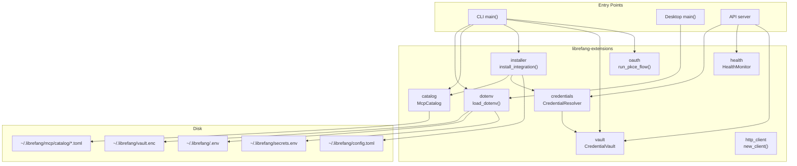

# Extensions & Vault

# Extensions & Vault (`librefang-extensions`)

## Overview

`librefang-extensions` is the infrastructure layer responsible for everything surrounding external service integration: discovering MCP server templates, storing and resolving credentials, running OAuth flows, monitoring server health, and installing new servers into the user's config. It is consumed by the CLI (`librefang-cli`), desktop app (`librefang-desktop`), API server (`librefang-api`), and the TUI init wizard.

All installed MCP servers live as `[[mcp_servers]]` entries in `~/.librefang/config.toml`. An optional `template_id` field on each entry points back to the catalog template it was installed from. There is no separate `integrations.toml`.

## Architecture


```mermaid
graph TD
    subgraph Entry Points
        CLI["CLI main()"]
        Desktop["Desktop main()"]
        API["API server"]
    end

    subgraph "librefang-extensions"
        Dotenv["dotenv<br/>load_dotenv()"]
        Vault["vault<br/>CredentialVault"]
        CredResolver["credentials<br/>CredentialResolver"]
        Catalog["catalog<br/>McpCatalog"]
        Installer["installer<br/>install_integration()"]
        HealthMon["health<br/>HealthMonitor"]
        OAuth["oauth<br/>run_pkce_flow()"]
        HTTP["http_client<br/>new_client()"]
    end

    subgraph "Disk"
        EnvFile["~/.librefang/.env"]
        SecretsFile["~/.librefang/secrets.env"]
        VaultFile["~/.librefang/vault.enc"]
        CatalogDir["~/.librefang/mcp/catalog/*.toml"]
        ConfigFile["~/.librefang/config.toml"]
    end

    CLI --> Dotenv
    Desktop --> Dotenv
    Dotenv --> VaultFile
    Dotenv --> EnvFile
    Dotenv --> SecretsFile

    CLI --> Catalog
    CLI --> Installer
    CLI --> Vault
    CLI --> OAuth

    Installer --> Catalog
    Installer --> CredResolver
    CredResolver --> Vault

    API --> CredResolver
    API --> HealthMon
    API --> Vault

    Catalog --> CatalogDir
    Installer --> ConfigFile
```

## Credential Resolution Chain

Credentials are resolved from multiple sources with a strict priority order. The chain exists in two forms: a **boot-time injection** path (`dotenv::load_dotenv`) that populates `std::env` before any threads exist, and a **runtime query** path (`CredentialResolver`) used by the installer and API layer.

### Boot-time injection (`dotenv::load_dotenv`)

Called from synchronous `main()` **before** spawning the tokio runtime. `std::env::set_var` is UB once other threads exist (Rust 1.80+), so this must happen first.

Priority (highest first):

1. **System environment variables** — never overridden
2. **Credential vault** (`vault.enc`) — unlocked using the master key
3. **`.env` file** — `~/.librefang/.env`
4. **`secrets.env` file** — `~/.librefang/secrets.env`

A critical ordering constraint (#5139): the vault master key (`LIBREFANG_VAULT_KEY`) may itself be defined in `.env`. The boot sequence pre-seeds *only* that one key from the dotenv files before calling `load_vault()`, so the vault can unlock. All other keys retain their vault-first priority.

```
preseed_vault_key_from(.env)    // only LIBREFANG_VAULT_KEY
preseed_vault_key_from(secrets.env)
load_vault()                    // injects vault secrets into std::env
load_env_file(.env)             // remaining keys, never overriding
load_env_file(secrets.env)
```

The function is gated by `Once` — repeated calls are no-ops.

### Runtime query (`CredentialResolver`)

Used after boot by the installer and API layer to resolve individual secrets without mutating the process environment. Tries sources in order:

1. **Encrypted vault** (`vault.enc`) — if unlocked
2. **Dotenv file** — cached at construction time
3. **Process environment variable**
4. **Interactive prompt** — CLI only, when `with_interactive(true)`

Two constructors cover different caller lifetimes:

- `CredentialResolver::new(vault, dotenv_path)` — short-lived callers (CLI subcommands, tests). Takes an owned `CredentialVault`.
- `CredentialResolver::with_vault_handle(handle, dotenv_path)` — long-lived callers (API request handlers). Takes `Arc<RwLock<CredentialVault>>` so requests share the kernel's already-unlocked vault cache instead of re-running Argon2id on every call (#3598).

Key methods:
- `resolve(key)` → `Option<Zeroizing<String>>` — returns the first hit across all sources
- `has_credential(key)` → `bool` — checks without prompting
- `missing_credentials(&[keys])` → `Vec<String>` — used by the installer to compute status
- `store_in_vault(key, value)` — persists to the vault
- `clear_dotenv_cache(key)` — evicts a stale entry after dashboard deletion

## Credential Vault (`vault`)

AES-256-GCM encrypted file at `~/.librefang/vault.enc`. Master key resolution:

1. **`LIBREFANG_VAULT_KEY` env var** — base64-encoded 32-byte key. Wins over everything for CI/headless determinism.
2. **OS keyring** — macOS Keychain, Windows Credential Manager, Linux Secret Service (via the `keyring` crate). Disabled by default on macOS (Keychain ACL is per-binary signature; `cargo build` invalidates it, causing prompt fatigue).
3. **File-based fallback** — `<data_local_dir>/librefang/.keyring` (mode 0600), AES-256-GCM wrapped with an Argon2id-derived key from a machine fingerprint (`/etc/machine-id`, `ioreg` serial, etc.).

The `LIBREFANG_VAULT_NO_KEYRING=1` env var and `CredentialVault::init_with_config()` both force the file fallback regardless of platform.

### On-disk format

```
[4 bytes: magic "OFV1"]
[TOML body: VaultFile { version, salt, nonce, ciphertext, schema_version }]
```

Encryption uses Argon2id to derive a 256-bit key from the master key + random salt, then AES-256-GCM with the vault file path as Additional Authenticated Data (AAD). Schema version 1 prepends the schema version bytes to the path in the AAD, binding the ciphertext to both the file location and the format version.

### Startup sentinel (#3651)

Every vault contains a reserved key `__sentinel__` with plaintext value `librefang-vault-sentinel-v1`. Written at `init()` time and verified on every `unlock()`. If the sentinel decrypts to a different value, the boot path returns `VaultKeyMismatch` and refuses to start — catching a mismatched `LIBREFANG_VAULT_KEY` before any credential is silently corrupted.

The sentinel key is write-protected: `set()` and `remove()` reject it. It is filtered from `list_keys()` but included in `list_keys_including_internal()` for the `rotate-key` workflow.

### Key operations

| Method | Description |
|--------|-------------|
| `init()` | Creates a new vault, generates/persists master key, writes sentinel, verifies round-trip |
| `unlock()` | Decrypts and loads entries using resolved master key |
| `get(key)` | Returns `Option<Zeroizing<String>>` |
| `set(key, value)` | Lazy-inits vault on first write; persists encrypted |
| `remove(key)` | Removes and re-encrypts |
| `verify_or_install_sentinel()` | Boot-path check: backfills on legacy vaults, rejects mismatches |
| `rewrap_with_new_key(key)` | Re-encrypts under a new master key (rotate-key workflow) |
| `init_with_key(key)` / `unlock_with_key(key)` | Explicit-key variants for testing |

### Post-init verification

`init()` immediately opens a sibling `CredentialVault` instance and walks the full `unlock()` path against the file it just wrote. If the round-trip fails, the vault file is rolled back (unlinked) and an error is surfaced. This catches init/unlock key divergence at the source rather than as an opaque `aead::Error` on the next `vault_set` (#5069).

## MCP Catalog (`catalog`)

Read-only in-memory index of MCP server templates at `~/.librefang/mcp/catalog/`. Refreshed from the upstream registry by `librefang_runtime::registry_sync`.

Two file layouts are supported:
- **Flat:** `<id>.toml` — ID from filename
- **Directory-backed:** `<id>/MCP.toml` — ID from directory name (multi-file packages)

`McpCatalog::load()` performs a full reload (clears existing entries, re-scans directory). Each entry deserializes as `McpCatalogEntry` from `librefang_types::mcp`.

Query methods:
- `get(id)` — lookup by ID
- `list()` — all entries sorted by ID
- `list_by_category(category)` — filtered by `McpCategory`
- `search(query)` — case-insensitive match against ID, name, description, tags

## Installer (`installer`)

Pure transforms — no disk writes, no network calls. `install_integration()` takes a catalog, a credential resolver, a template ID, and a map of user-provided keys, and returns an `InstallResult` containing:

- `server: McpServerConfigEntry` — the `[[mcp_servers]]` entry the caller should persist
- `status: McpStatus` — `Ready` if all required credentials are available, `Setup` if missing
- `missing_credentials: Vec<String>` — env var names still unresolved
- `message: String` — user-facing status text

The caller (CLI `cmd_mcp_add`, API endpoint) is responsible for writing to `config.toml` and triggering a kernel reload.

`catalog_entry_to_mcp_server()` maps transport types (`Stdio`, `Sse`, `Http`) and required env vars into the config entry format. The `template_id` field is set so the dashboard can link back to the catalog.

Scaffolding functions generate template files:
- `scaffold_integration(dir)` — writes a sample `mcp.toml`
- `scaffold_skill(dir)` — writes `skill.toml` + `SKILL.md`

## OAuth (`oauth`)

Implements OAuth2 Authorization Code flow with PKCE (S256). `run_pkce_flow()`:

1. Generates a PKCE verifier/challenge pair
2. Binds a random localhost port, builds a signed state token
3. Opens the browser to the authorization URL
4. Spawns a temporary axum server on `/callback`
5. Exchanges the authorization code for tokens
6. Returns `OAuthTokens` (access token, refresh token, expiry, scopes)

### State token security (#3791)

State tokens are HMAC-SHA256 signed and bind to `(provider, client_id, redirect_uri, nonce, exp)`. The HMAC key is per-process (`OnceLock` + `rand::random`), so a daemon restart invalidates any in-flight flows. Verification uses constant-time comparison. Only the first valid callback wins; subsequent hits on the same listener return "Gone".

Client IDs default to placeholder values; override them via `OAuthConfig` in the kernel config.

## Health Monitor (`health`)

Tracks runtime status for configured MCP servers using a `DashMap<String, McpHealth>`. Thread-safe for concurrent reads/writes from background health-check tasks.

`McpHealth` records track:
- Current status (`Available`, `Ready`, `Error`, etc.)
- Tool count from last successful check
- Consecutive failures
- Reconnect state (attempts, in-progress flag)
- Timestamps (`last_ok`, `connected_since`)

Auto-reconnect uses exponential backoff: 5s → 10s → 20s → 40s → … → 300s max, 10 attempts max. Configurable via `HealthMonitorConfig`.

The kernel's API routes query `get_health(id)` to surface server status in the dashboard's extension list.

## HTTP Client (`http_client`)

Shared `reqwest::Client` builder with:
- Bundled CA roots (native certs first, falling back to `webpki-roots`)
- `rustls` with `aws_lc_rs` crypto provider
- 10s connect timeout, 30s read timeout
- 5-redirect limit (SSRF mitigation)

`new_client()` returns a ready-to-use `reqwest::Client`. `client_builder()` returns a `ClientBuilder` for further customization.

## Error Handling (`lib.rs`)

`ExtensionError` covers all failure modes:

| Variant | Typical cause |
|---------|--------------|
| `NotFound(id)` | Catalog template doesn't exist |
| `AlreadyInstalled(id)` | Server already in config |
| `Vault(msg)` | Encryption/decryption failure |
| `VaultLocked` | Vault not yet unlocked |
| `VaultKeyMismatch { hint }` | Sentinel mismatch (#3651) |
| `OAuth(msg)` | PKCE flow failure |
| `Io(err)` | Filesystem errors |
| `Http(msg)` | Network errors |

`From<ExtensionError>` for `IntegrationError` (from `librefang_types`) preserves discriminants the API layer uses for HTTP status codes: `NotFound` → 404, vault family → folded into `Vault`, everything else → `Other` with the original message.

## Dotenv File Management (`dotenv`)

Beyond boot-time loading, the module provides CRUD operations for `~/.librefang/.env`:

- `save_env_key(key, value)` — upsert with atomic write (`<path>.tmp.<pid>`, mode 0600, `fsync` + `rename`)
- `remove_env_key(key)` — delete from file and process env
- `list_env_keys()` — key names only (no values)
- `env_file_exists()` — existence check

The atomic write pattern (#3944) prevents three failure modes:
1. Mid-write crashes leaving a truncated `.env`
2. TOCTOU window where the file is world-readable between `open` and `chmod`
3. Concurrent saves colliding on the same staging path (PID-uniquified)

Value escaping handles `\n`, `\r`, `\\`, `"` inside double-quoted values. Single-quoted values are treated as literals. Round-trip correctness is enforced by tests (#3790).

## Integration Points

**CLI** (`librefang-cli`):
- `main()` calls `dotenv::load_dotenv()` before tokio
- `cmd_mcp_catalog` → `McpCatalog::load()` + `list()` / `search()`
- `cmd_mcp_add` → `install_integration()` + `CredentialResolver::with_interactive(true)`
- `cmd_vault_*` → `CredentialVault::init/unlock/set/remove`
- `cmd_config_set_key` / `cmd_config_delete_key` → `dotenv::save_env_key` / `remove_env_key`
- `cmd_scaffold` → `scaffold_integration()` / `scaffold_skill()`
- `cmd_doctor` → `McpCatalog::load()` for registry health check

**API server** (`librefang-api`):
- `resolve_dashboard_credential()` → `CredentialVault::unlock()` + `get()` for auth token validation
- `run_daemon()` → vault unlock for bind auth safety check
- Skills routes → `HealthMonitor::get_health()` for extension status

**Desktop app** (`librefang-desktop`):
- `main()` calls `dotenv::load_dotenv()` before tokio

**TUI init wizard**:
- `run()` → `dotenv::save_env_key()` for API key submission