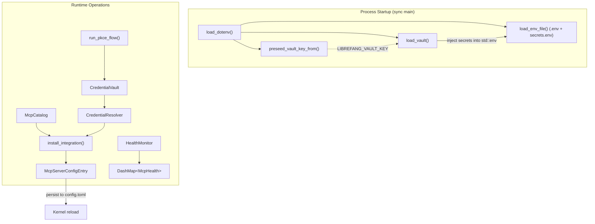

# Extensions & Vault

# Extensions & Vault (`librefang-extensions`)

## Purpose

`librefang-extensions` manages the full lifecycle of MCP (Model Context Protocol) server integrations: discovering server templates, storing and resolving credentials, installing servers into the user's config, monitoring health, and handling OAuth authentication flows. It is consumed by the CLI, TUI, desktop app, API server, and kernel.

## Architecture Overview


```mermaid
graph TD
    subgraph Startup ["Process Startup (sync main)"]
        A["load_dotenv()"] --> B["preseed_vault_key_from()"]
        A --> C["load_vault()"]
        A --> D["load_env_file() (.env + secrets.env)"]
    end

    subgraph Runtime ["Runtime Operations"]
        E["McpCatalog"] --> F["install_integration()"]
        G["CredentialResolver"] --> F
        H["CredentialVault"] --> G
        F --> I["McpServerConfigEntry"]
        J["HealthMonitor"] --> K["DashMap&lt;McpHealth&gt;"]
        L["run_pkce_flow()"] --> H
    end

    B -.->|"LIBREFANG_VAULT_KEY"| C
    C -->|"inject secrets into std::env"| D
    I -->|"persist to config.toml"| M["Kernel reload"]
```

## Modules

### Vault (`vault.rs`)

AES-256-GCM encrypted secret storage at `~/.librefang/vault.enc`.

**Key derivation.** The master key is resolved from (in priority order):

1. `LIBREFANG_VAULT_KEY` environment variable (base64-encoded 32 bytes)
2. OS keyring (Windows Credential Manager, macOS Keychain, Linux Secret Service)
3. File fallback at `<data_local_dir>/librefang/.keyring` — an AES-256-GCM-wrapped key derived from a per-machine fingerprint via Argon2id

The raw master key feeds into `derive_key()`, which runs Argon2id to produce the actual AES-256-GCM encryption key. This means the on-disk file is doubly protected: you need the master key *and* the Argon2 salt to decrypt.

**On-disk format.** A `VaultFile` (TOML-serializable) containing:
- `version` — file format version (currently 1)
- `salt` — Argon2 salt (base64)
- `nonce` — AES-256-GCM nonce (base64)
- `ciphertext` — encrypted `VaultEntries` JSON (base64)
- `schema_version` — AAD schema version (0 = legacy path-only, 1 = schema version + path bytes)

**Sentinel validation (#3651).** Every vault contains a reserved key `__sentinel__` with known plaintext `"librefang-vault-sentinel-v1"`. On boot, `verify_or_install_sentinel()` confirms the sentinel decrypts correctly — a mismatch means the master key is wrong, and the daemon refuses to start. This prevents silent data loss from a misconfigured `LIBREFANG_VAULT_KEY`. The sentinel is backfilled on legacy vaults that predate this feature.

**Lazy initialization.** `set()` on a handle with no existing vault file automatically runs `init()`, so the first credential write materializes the vault. The reserved sentinel key is rejected before any disk side effects.

**Key rotation.** `rewrap_with_new_key()` re-encrypts the entire vault under a new master key using the same atomic write path as normal saves.

**macOS keyring behavior.** The OS keyring is disabled by default on macOS because the Keychain ACL is per-binary-code-signature — every `cargo build` invalidates it and triggers a prompt. Set `LIBREFANG_VAULT_NO_KEYRING=1` on other platforms to force the file fallback.

**Platform gating.** The `os_keyring` module is conditionally compiled: real `keyring` crate calls on glibc Linux, macOS, and Windows; a stub returning "unavailable" everywhere else (musl, Android).

### Dotenv (`dotenv.rs`)

Loads secrets into the process environment from multiple sources. Called **once** from synchronous `main()` before the tokio runtime starts — `std::env::set_var` is UB once other threads exist (Rust 1.80+).

**Priority order** (highest first, existing env vars are never overridden):

| Priority | Source | Notes |
|----------|--------|-------|
| 1 | System environment variables | Already in `std::env` |
| 2 | Credential vault (`vault.enc`) | Injected by `load_vault()` |
| 3 | `~/.librefang/.env` | Standard dotenv format |
| 4 | `~/.librefang/secrets.env` | Secondary file |

**Vault key bootstrap (#5139).** A chicken-and-egg problem: the vault master key (`LIBREFANG_VAULT_KEY`) may itself live in `.env`, but `load_vault()` needs it in the process environment. `preseed_vault_key_from()` scans `.env` and `secrets.env` for *only* this one key and sets it before `load_vault()` runs. All other keys respect the normal priority order.

**File writing.** `save_env_key()` and `remove_env_key()` manage `~/.librefang/.env` with:
- Atomic writes via `.env.tmp.<pid>` staging file
- Mode 0600 at creation time (no TOCTOU window)
- `fsync` + `sync_all` + `rename` for crash safety
- Proper escape handling for embedded newlines, backslashes, and quotes (`escape_env_value` / `unescape_env_value`)

**Idempotency.** `load_dotenv()` is gated by `Once` — repeated calls are no-ops.

### Credentials (`credentials.rs`)

Multi-source credential resolution for MCP integrations. Tries each source in order:

1. **Encrypted vault** (`~/.librefang/vault.enc`) — only if unlocked
2. **Dotenv file** (loaded at construction, snapshot from boot time)
3. **Process environment variable**
4. **Interactive prompt** (CLI only, when `interactive` is `true`)

**Vault source abstraction.** `VaultSource` enum provides two modes:

- `Owned(CredentialVault)` — for short-lived callers (CLI subcommands, tests) that manage their own vault
- `Shared(Arc<RwLock<CredentialVault>>)` — for long-lived callers (API request handlers) that share the kernel's cached vault handle, avoiding re-running Argon2id KDF on every request

Construct with `CredentialResolver::new()` for owned mode or `CredentialResolver::with_vault_handle()` for shared mode.

**Key methods:**
- `resolve(key)` → `Option<Zeroizing<String>>` — tries all sources in order
- `resolve_all(&[keys])` → `HashMap<String, Zeroizing<String>>` — batch resolution
- `missing_credentials(&[keys])` → `Vec<String>` — check which keys are unavailable (no prompting)
- `store_in_vault(key, value)` — write a credential to the backing vault
- `clear_dotenv_cache(key)` — invalidate a boot-time dotenv snapshot after a dashboard deletion

### Catalog (`catalog.rs`)

Read-only in-memory index of MCP server templates loaded from `~/.librefang/mcp/catalog/`. Templates are refreshed from the upstream `librefang-registry` by `librefang_runtime::registry_sync`.

**Two on-disk layouts:**

| Layout | Pattern | ID source |
|--------|---------|-----------|
| Flat file | `<id>.toml` | Filename minus `.toml` |
| Directory | `<id>/MCP.toml` | Directory name |

**Full-reload semantics.** `load()` clears all entries before scanning, so deleted/renamed files don't linger.

**Query methods:**
- `get(id)` → single entry lookup
- `list()` → all entries sorted by ID
- `list_by_category(category)` → filtered by `McpCategory`
- `search(query)` → case-insensitive match against ID, name, description, and tags

Installed servers reference catalog entries via `template_id` in their `[[mcp_servers]]` config, but the catalog itself is never modified by user actions.

### Installer (`installer.rs`)

Pure transforms — no side effects. Converts a catalog entry + provided credentials into an `McpServerConfigEntry` that the caller persists to `config.toml`.

**`install_integration()` flow:**
1. Look up the catalog template by ID
2. Store any provided credentials in the vault (best-effort)
3. Check which required env vars are still missing
4. Map the template's transport + env requirements into a `McpServerConfigEntry`
5. Return an `InstallResult` with status (`Ready` or `Setup`), missing credential names, and a user-facing message

**`catalog_entry_to_mcp_server()`** maps `McpCatalogTransport` to `McpTransportEntry`, copies required env var names, and sets `template_id` so the kernel/dashboard can trace back to the catalog source.

**Scaffolding.** `scaffold_integration()` and `scaffold_skill()` generate starter TOML files for custom MCP servers and skills respectively.

### Health Monitor (`health.rs`)

Concurrent health tracking for MCP servers using `DashMap` for lock-free access from background tasks.

**`McpHealth`** tracks per-server state: status, tool count, last success/error timestamps, consecutive failure count, reconnect state, and connected-since time.

**Auto-reconnect** with exponential backoff:
- Base interval: 5s
- Doubles each attempt: 5s → 10s → 20s → 40s → ...
- Capped at 300s (5 minutes)
- Max 10 attempts (configurable via `HealthMonitorConfig`)
- Disabled entirely when `auto_reconnect: false`

**Usage pattern:** The kernel registers servers via `register()`, background tasks call `report_ok()` / `report_error()`, and the API layer reads via `get_health()` / `all_health()`.

### OAuth (`oauth.rs`)

OAuth2 PKCE flows for provider authentication (Google, GitHub, Microsoft, Slack). Launches a temporary localhost HTTP server, opens the browser, receives the callback, and exchanges the authorization code for tokens.

**State token security (#3791).** State tokens are HMAC-SHA256 signed and bind to:
- `provider` (auth URL)
- `client_id`
- `redirect_uri` (loopback port)
- `nonce` (16 random bytes)
- `exp` (10-minute absolute expiry)

`verify_signed_state()` rejects malformed tokens, bad HMAC, expired payloads, and any field mismatch. Only the first valid callback wins; subsequent attempts on the same listener are rejected. The HMAC signing key is process-scoped (`OnceLock` with a random 32-byte value), so a daemon restart invalidates any in-flight flows.

**Client IDs.** Default placeholder IDs are provided for public PKCE flows (no client secret needed). Override via `OAuthConfig` fields (e.g., `google_client_id`).

**Token storage.** Returned `OAuthTokens` are stored in the credential vault by the caller.

### HTTP Client (`http_client.rs`)

Shared `reqwest::Client` builder with:
- Native CA roots from the OS trust store, falling back to `webpki-roots` bundled certs
- `rustls` with `aws_lc_rs` crypto provider (not OpenSSL)
- 10s connect timeout, 30s read timeout
- Max 5 redirects

### Error Types (`lib.rs`)

`ExtensionError` covers all failure modes:

| Variant | Meaning |
|---------|---------|
| `NotFound(id)` | Catalog entry doesn't exist |
| `AlreadyInstalled(id)` | Server already in config |
| `NotInstalled(id)` | Server not in config |
| `CredentialNotFound(key)` | Required credential missing |
| `Vault(msg)` | Vault I/O or format error |
| `VaultLocked` | Vault not unlocked |
| `VaultKeyMismatch { hint }` | Wrong master key detected via sentinel |
| `OAuth(msg)` | OAuth flow failure |
| `TomlParse(msg)` | Invalid TOML |
| `Io(err)` | Filesystem error |
| `Http(msg)` | Network error |
| `HealthCheck(msg)` | MCP ping failure |

`From<ExtensionError>` for `librefang_types::integration::IntegrationError` bridges this crate's error space to the dependency-free type used at the kernel API boundary, preserving discriminants for HTTP status code mapping (`NotFound` → 404, everything else → 500).

## Integration Points

**Entry points that call into this crate:**

- **CLI (`librefang-cli`):** `main()` calls `load_dotenv()`; subcommands call `McpCatalog::load()`, `install_integration()`, `CredentialVault::init()/unlock()`, `HealthMonitor::register()/report_ok()`, `save_env_key()`, `remove_env_key()`
- **Desktop (`librefang-desktop`):** `main()` and `run()` both call `load_dotenv()`
- **API server (`librefang-api`):** `resolve_dashboard_credential()` calls `vault.unlock()` and `vault.get()` to read the dashboard session token on every authenticated request
- **TUI:** `init_wizard::run()` and `free_provider_guide::submit_key()` call `save_env_key()`
- **Dashboard routes:** `get_extension()` and `list_extensions()` call `health.get_health()` to surface server status

**Startup sequence (all entry points):**

```
main()
 ├─ load_dotenv()           # sync, before tokio
 │   ├─ preseed_vault_key_from(.env)
 │   ├─ preseed_vault_key_from(secrets.env)
 │   ├─ load_vault()        # unlock + inject into std::env
 │   ├─ load_env_file(.env)
 │   └─ load_env_file(secrets.env)
 ├─ tokio::runtime::Builder::new_current_thread()  (or similar)
 └─ async { ... }
```

## Contributing Guidelines

- **No `std::env::set_var` after tokio starts.** All env mutation happens in `load_dotenv()` during synchronous `main()`. Runtime code must use `CredentialResolver` or vault APIs instead.
- **Reserved keys.** `__sentinel__` is owned by the vault internals. Never read or write it directly. Use `list_keys()` (which filters it) for user-facing operations, `list_keys_including_internal()` only for migration/rotation code.
- **Zeroizing.** All credential values flow through `Zeroizing<String>` or `Zeroizing<[u8; 32]>` to ensure memory is cleared on drop. Never convert to bare `String` for longer than needed.
- **Serial test annotation.** Tests that mutate process-wide env vars must use `#[serial_test::serial]` to prevent data races under `cargo test`'s parallel runner.
- **Pure transforms in installer.** `install_integration()` does not write to config.toml or start servers. The caller (CLI/API) decides when and how to persist and activate the result.