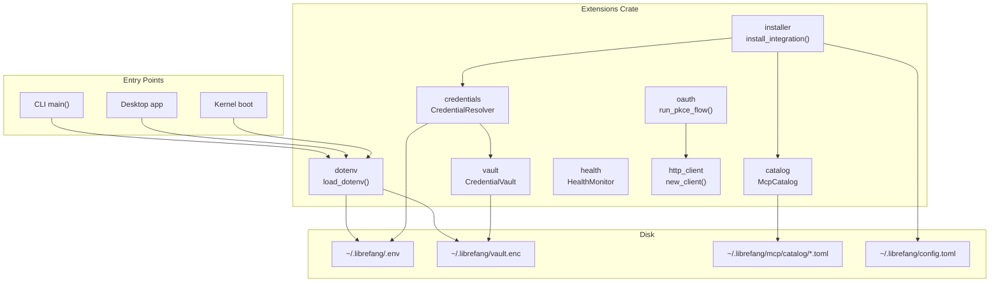

# Extensions

# LibreFang Extensions

The `librefang-extensions` crate owns the runtime infrastructure for discovering, installing, securing, and monitoring MCP (Model Context Protocol) server integrations. It sits between the type definitions in `librefang-types` (which own data schemas) and the application layers (CLI, desktop, kernel) which own lifecycle and I/O.

## Architecture



## Startup Sequence

Every binary entry point (CLI, desktop, kernel) calls `dotenv::load_dotenv()` from synchronous `main()` **before** spawning any tokio runtime. This is required because `std::env::set_var` is UB in Rust 1.80+ once other threads exist.

The loading order matters:

1. **Pre-seed `LIBREFANG_VAULT_KEY`** — scan `.env` and `secrets.env` for just this one key and inject it into the process environment if not already set. This must happen before the vault is opened because `CredentialVault::unlock()` reads the master key directly from `std::env`.
2. **Unlock vault** — load `vault.enc`, decrypt, inject all vault secrets into `std::env`.
3. **Load `.env`** — parse and inject remaining keys.
4. **Load `secrets.env`** — parse and inject remaining keys.

Existing environment variables are never overridden, establishing the priority: **system env > vault > `.env` > `secrets.env`**.

## Module Reference

### `catalog` — MCP Template Registry

`McpCatalog` is an in-memory, read-only view of all MCP server templates cached at `~/.librefang/mcp/catalog/`. Templates are refreshed from the upstream registry by `librefang_runtime::registry_sync`; this module only reads.

**Layout on disk** — two formats are accepted:

| Format | Path Pattern | ID Source |
|--------|-------------|-----------|
| Flat file | `<id>.toml` | Filename minus `.toml` |
| Directory | `<id>/MCP.toml` | Directory name |

**Key methods:**

- `McpCatalog::new(home_dir)` — construct an empty catalog.
- `load(&mut self, home_dir)` — full reload (clears existing entries first). Returns count of entries loaded.
- `get(id)` / `list()` / `list_by_category(category)` / `search(query)` — query methods. Search matches against id, name, description, and tags (case-insensitive).

Each entry deserializes as `McpCatalogEntry` (defined in `librefang_types::mcp`).

### `vault` — Encrypted Credential Storage

`CredentialVault` provides AES-256-GCM encrypted storage at `~/.librefang/vault.enc`. The master key is resolved through:

1. `LIBREFANG_VAULT_KEY` environment variable (headless/CI)
2. OS keyring (Windows Credential Manager / macOS Keychain / Linux Secret Service)
3. File-based fallback at `<data_local_dir>/librefang/.keyring` (AES-256-GCM wrapped with an Argon2id-derived machine-fingerprint key)

On macOS, the OS keyring is **disabled by default** because the Keychain ACL is per-binary signature — every `cargo build` invalidates it and triggers another prompt. Set `LIBREFANG_VAULT_NO_KEYRING=1` on other platforms to force the file fallback.

**Lifecycle:**

```
CredentialVault::new(path)
    → init()           // generates key, persists vault.enc
    → unlock()         // decrypts entries into memory
    → get/set/remove   // normal operations
    → rewrap_with_new_key()  // rotate master key
```

**Sentinel validation (#3651):** Every vault contains a reserved `__sentinel__` key with known plaintext (`librefang-vault-sentinel-v1`). After `unlock()`, the boot path calls `verify_or_install_sentinel()` to confirm the decryption key matches the encryption key. This prevents silent data loss from a mismatched `LIBREFANG_VAULT_KEY`.

**Lazy initialization:** `set()` on an unopened vault with no on-disk file automatically runs `init()`, so a freshly-created `CredentialVault` handle can immediately store credentials.

**Key wrapping internals:** The file-based fallback derives a wrapping key by hashing a machine fingerprint (hostname + OS machine-id where available) through Argon2id. The on-disk format is versioned (`schema_version` field) to support migrations.

### `credentials` — Credential Resolution Chain

`CredentialResolver` is the main API for looking up secrets at runtime. It chains through multiple sources in priority order:

```
1. Encrypted vault (~/.librefang/vault.enc)
2. Dotenv file cache (~/.librefang/.env)
3. Process environment variable
4. Interactive prompt (CLI only, when enabled)
```

**Two constructors for different lifetimes:**

- `CredentialResolver::new(vault, dotenv_path)` — for short-lived callers (CLI subcommands, tests). Takes an owned `CredentialVault`.
- `CredentialResolver::with_vault_handle(handle, dotenv_path)` — for long-lived callers (kernel API handlers). Takes `Arc<RwLock<CredentialVault>>` to share the kernel's already-unlocked vault cache, avoiding repeated Argon2id key derivation.

**Key methods:**

- `resolve(key)` → `Option<Zeroizing<String>>` — tries all sources in order.
- `resolve_all(keys)` → `HashMap<String, Zeroizing<String>>` — bulk resolution.
- `missing_credentials(keys)` → `Vec<String>` — report which required keys are absent (no prompting).
- `store_in_vault(key, value)` — persist a credential through the vault.
- `clear_dotenv_cache(key)` — evict a stale entry from the boot-time dotenv snapshot.

All returned values are wrapped in `Zeroizing<String>` to minimize secret lifetime in memory.

### `dotenv` — Process Environment Loading

This module loads secrets into `std::env` so every entry point (CLI, desktop, kernel) handles them identically. It is the **first thing** called in `main()`.

**Public API for key management:**

- `save_env_key(key, value)` — upsert into `~/.librefang/.env`. Uses atomic write (temp file + rename) with 0600 permissions to prevent TOCTOU leaks and crash-induced truncation.
- `remove_env_key(key)` — delete from `.env` and from the process environment.
- `list_env_keys()` — enumerate keys (no values).

**Escaping:** Values are written double-quoted with `\n`, `\r`, `\\`, and `\"` escaping. Single-quoted values are treated as literal (no escape processing). The `parse_env_line` and `unescape_env_value` functions handle round-tripping, including edge cases like lone quote characters.

### `health` — MCP Server Health Monitor

`HealthMonitor` tracks the status of configured MCP servers using a `DashMap<String, McpHealth>` for lock-free concurrent access from background health-check tasks.

**State machine per server:**

| Method | Transition |
|--------|-----------|
| `register(id)` | Insert with `McpStatus::Available` |
| `report_ok(id, tool_count)` | → `McpStatus::Ready`, reset failure counter |
| `report_error(id, error)` | → `McpStatus::Error`, increment failure counter |
| `mark_reconnecting(id)` | Increment reconnect attempt counter |

**Auto-reconnect:** When enabled, monitors call `should_reconnect(id)` after a failure. Backoff is exponential: 5s, 10s, 20s, 40s, ... up to `max_backoff_secs` (default 300s). After `max_reconnect_attempts` (default 10) the server is abandoned.

The kernel's config reload path calls `register()` / `unregister()` to keep the monitor in sync with `config.toml`.

### `installer` — Catalog-to-Config Transform

`install_integration()` is a **pure function** — no disk I/O, no side effects. It transforms a catalog template into a `McpServerConfigEntry` ready for the caller to persist into `config.toml` under `[[mcp_servers]]`.

**Steps:**

1. Look up the template by id in the catalog.
2. Store any caller-provided credentials in the vault (best effort).
3. Check which required environment variables still lack credentials.
4. Map the template's transport and env requirements into a `McpServerConfigEntry`.
5. Return an `InstallResult` with status `Ready` (all creds present) or `Setup` (creds missing).

The returned entry carries `template_id` so the dashboard can trace it back to its catalog origin.

`InstallResult` implements `From<InstallResult> for IntegrationOutcome` to bridge into the kernel's dependency-free error/outcome types.

**Scaffolding:** `scaffold_integration()` and `scaffold_skill()` generate starter templates for custom MCP servers and skills respectively.

### `oauth` — OAuth2 PKCE Flows

Implements the complete Authorization Code flow with PKCE for Google, GitHub, Microsoft, and Slack:

1. Generate a PKCE code verifier + S256 challenge.
2. Build an HMAC-signed state token binding the flow to `(provider, client_id, redirect_uri, nonce, expiry)`.
3. Bind a localhost TCP listener on a random port.
4. Open the browser to the authorization URL.
5. Serve a one-shot axum callback handler that verifies the signed state and extracts the authorization code.
6. Exchange the code for tokens via the provider's token endpoint.

**State token security (#3791):** State is `base64url(json_payload).base64url(hmac_sha256)`. The HMAC key is per-process (random, `OnceLock`). Verification checks signature, expiry (10-minute TTL), and all bound fields. Only the first valid callback wins; replays are rejected.

**Client IDs:** Default placeholder IDs are provided for each provider. Override them via `OAuthConfig` fields (e.g. `google_client_id`). PKCE means no client secret is required.

### `http_client` — Shared HTTP Client

`client_builder()` returns a pre-configured `reqwest::ClientBuilder` with:

- **CA roots:** Tries native system certs first (`rustls_native_certs`); falls back to Mozilla's `webpki_roots` bundle if none load.
- **TLS:** `rustls` with `aws_lc_rs` crypto provider.
- **Timeouts:** 10s connect, 30s read — prevents hung requests and SSRF amplification.
- **Redirects:** Limited to 5 hops.

`new_client()` builds and returns a ready-to-use `reqwest::Client`.

## Error Handling

All errors flow through `ExtensionError`:

```rust
pub enum ExtensionError {
    NotFound(String),          // → 404 in API
    AlreadyInstalled(String),  // → 409 in API
    NotInstalled(String),
    CredentialNotFound(String),
    Vault(String),
    VaultLocked,
    VaultKeyMismatch { hint: String },  // → boot refusal
    OAuth(String),
    TomlParse(String),
    Io(std::io::Error),
    Http(String),
    HealthCheck(String),
}
```

`From<ExtensionError> for IntegrationError` bridges into the kernel's HTTP-layer types, preserving discriminants (`NotFound` → `NotFound`, vault family → `Vault`, everything else → `Other` with the original message).

## Concurrency Notes

- `HealthMonitor` uses `DashMap` for lock-free concurrent access from background tasks.
- `CredentialResolver` wraps its vault in `VaultSource` — either `Owned` (single-threaded CLI) or `Shared(Arc<RwLock<CredentialVault>>)` (multi-request kernel).
- `dotenv::load_dotenv()` uses `Once` to guarantee single execution, and must be called before any async runtime starts.
- Environment-mutating tests use `#[serial_test::serial]` to avoid data races under `cargo test`'s parallel runner.