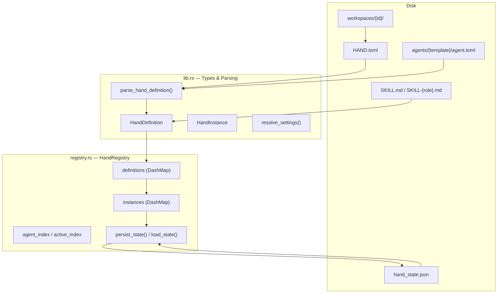
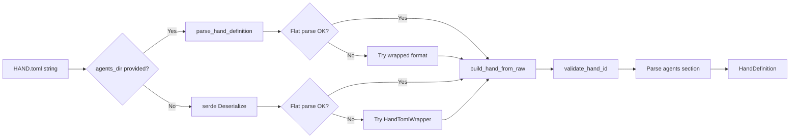

# Hands (App Framework)

# Hands (App Framework)

## Overview

A **Hand** is a pre-built, domain-complete autonomous agent package — similar to an app in a marketplace. Unlike regular agents (which you chat with interactively), Hands work for you in the background. You activate them, configure them, and check in on their progress.

This module provides:

- **Type definitions** for hand definitions, instances, settings, requirements, and localization
- **TOML parsing** for `HAND.toml` configuration files with backward compatibility for legacy flat formats
- **A concurrent registry** (`HandRegistry`) that manages hand definitions and active instances
- **Persistence** across daemon restarts with multi-version state migration
- **Template inheritance** — agents can inherit from shared base templates and override specific fields
- **Settings resolution** — user configuration is compiled into prompt blocks and environment variable sets
- **Requirement checking** — binary, environment variable, and API key prerequisites are validated at activation time

## Architecture



## Hand Lifecycle

1. **Install** — A `HandDefinition` is loaded from `HAND.toml` (from the read-only registry, a local path, or raw content) and registered in `HandRegistry`
2. **Activate** — A `HandInstance` is created, linking the definition to runtime state. The kernel spawns the underlying agents and calls `set_agents()`.
3. **Run** — The hand's agents execute autonomously. The user can pause/resume, update config, or adjust per-agent runtime overrides.
4. **Deactivate** — The instance is removed. The kernel kills the spawned agents.
5. **Uninstall** — The definition is removed from memory and the hand's workspace directory is deleted from disk.

State is persisted to `hand_state.json` so active/paused hands survive daemon restarts.

## HAND.toml Format

Hands are defined in `HAND.toml` files. Two top-level formats are accepted:

**Flat format** (fields at top level):
```toml
id = "clip"
name = "Clip Maker"
description = "Autonomous video clipping"
category = "content"
icon = "🎬"
tools = ["shell_exec"]
version = "1.2.0"

[agent]
name = "clip-agent"
description = "Edits video"
system_prompt = "You are a video editor."
```

**Wrapped format** (fields under `[hand]`):
```toml
[hand]
id = "clip"
name = "Clip Maker"
description = "Autonomous video clipping"
category = "content"
# ... same fields as flat, nested under [hand]
```

### Single-Agent vs Multi-Agent

**Single-agent** uses `[agent]`:
```toml
[agent]
name = "my-agent"
system_prompt = "..."
```
Automatically converted to `agents = {"main": ...}` with `coordinator = true`.

**Multi-agent** uses `[agents.<role>]`:
```toml
[agents.planner]
coordinator = true
invoke_hint = "Route planning tasks here"
name = "planner"
system_prompt = "You plan."

[agents.analyst]
name = "analyst"
system_prompt = "You analyze."
```

Each agent in a multi-agent hand can specify:
- `coordinator = true` — receives user messages (at most one; defaults to first by role name)
- `invoke_hint` — injected into the coordinator's system prompt as a dispatch guide
- `base` — template inheritance (see below)

### Template Inheritance with `base`

Agents can inherit from a shared template in the agents registry:

```toml
[agents.writer]
coordinator = true
base = "my-writer"      # loads agents/my-writer/agent.toml

[agents.writer.model]
system_prompt = "You are a blog post writer."  # overrides base
```

The hand's inline fields are deep-merged on top of the base template — hand wins on conflicts. This requires `agents_dir` to be provided to the parser (filesystem access is needed).

### Settings

Configurable settings appear in the activation modal:

```toml
[[settings]]
key = "stt_provider"
label = "STT Provider"
setting_type = "select"
default = "auto"

[[settings.options]]
value = "groq"
label = "Groq Whisper"
provider_env = "GROQ_API_KEY"    # env var checked for "Ready" badge

[[settings.options]]
value = "local"
label = "Local Whisper"
binary = "whisper"               # binary checked on PATH for "Ready" badge
```

Three setting types: `select`, `toggle`, and `text`. Text settings can specify `env_var` to expose the value as an environment variable to the agent's subprocess.

### Requirements

Prerequisites that must be satisfied before activation:

```toml
[[requires]]
key = "ffmpeg"
label = "FFmpeg"
requirement_type = "binary"
check_value = "ffmpeg"
description = "Core video processing engine."
optional = false

[requires.install]
macos = "brew install ffmpeg"
linux_apt = "sudo apt install ffmpeg"
estimated_time = "2-5 min"
```

Requirement types: `binary` (on PATH), `env_var`, `api_key`, `any_env_var`. Optional requirements don't block activation but cause "degraded" status when unmet.

### Dashboard Metrics

```toml
[[dashboard.metrics]]
label = "Items processed"
memory_key = "items_count"
format = "number"
```

Formats: `number` (default), `duration`, `bytes`, `percentage`, `text`, `date`.

### Routing Keywords

```toml
[routing]
aliases = ["video editor", "clip maker"]     # ×3 score
weak_aliases = ["cut video", "trim"]          # ×1 score
```

Used for deterministic hand selection. Cross-lingual matching is handled by semantic embeddings, not keyword translation.

### Metadata

```toml
[metadata]
frequency = "periodic"
token_consumption = "medium"
default_active = false
activation_warning = "Uses paid API calls"
```

### Internationalization (i18n)

```toml
[i18n.zh]
name = "线索生成"
description = "自主线索生成"

[i18n.zh.agents.main]
name = "主协调器"

[i18n.zh.settings.target_industry]
label = "目标行业"
description = "聚焦的行业领域"
```

All i18n fields are optional — absent translations fall back to the English defaults.

## Key Types

### `HandDefinition`

The parsed, in-memory representation of a `HAND.toml`. Key fields:

| Field | Purpose |
|---|---|
| `id` | Unique identifier, used as filesystem path component (validated against traversal) |
| `agents` | `BTreeMap<String, HandAgentManifest>` — role name to agent config |
| `skill_content` | Bundled skill markdown (from `SKILL.md`), shared across all agents |
| `agent_skill_content` | Per-role skill overrides (from `SKILL-{role}.md` files) |
| `settings` | Schema for user-configurable options |
| `requires` | Prerequisites checked before activation |
| `routing` | Keywords for hand selection |
| `i18n` | Localized strings keyed by language code |

Key methods:
- **`coordinator()`** — returns the agent marked `coordinator`, or the first agent by role name
- **`agent()`** — backward-compatible single-agent accessor
- **`is_multi_agent()`** — `true` when more than one agent role exists

### `HandInstance`

A running instance of a hand definition. Created on activation, tracks:

- `instance_id` (UUID) — unique across all instances
- `agent_ids` — `BTreeMap<String, AgentId>` mapping role names to spawned agent IDs
- `coordinator_role` — which role receives user messages
- `config` — user-provided configuration overrides
- `agent_runtime_overrides` — per-role model/provider/temperature overrides from the dashboard
- `status` — `Active`, `Paused`, `Error(String)`, or `Inactive`
- `activated_at` / `updated_at` — timestamps

### `HandAgentRuntimeOverride`

Per-agent runtime configuration that survives daemon restarts:

```rust
pub struct HandAgentRuntimeOverride {
    pub model: Option<String>,
    pub provider: Option<String>,
    pub api_key_env: Option<Option<String>>,
    pub base_url: Option<Option<String>>,
    pub max_tokens: Option<u32>,
    pub temperature: Option<f32>,
    pub web_search_augmentation: Option<WebSearchAugmentationMode>,
}
```

Applied on top of the hand definition's agent config. `None` means "use the definition's value."

### `ResolvedSettings`

Output of `resolve_settings()`:

- **`prompt_block`** — Markdown appended to the system prompt summarizing user config
- **`env_vars`** — Env var names the agent's subprocess should have access to (e.g., `GROQ_API_KEY` when the user selected Groq)

### Error Handling

All operations return `HandResult<T>` with `HandError` variants:

| Variant | Meaning |
|---|---|
| `NotFound(id)` | Hand definition not in registry |
| `AlreadyActive(id)` | Hand already has an active instance |
| `AlreadyRegistered(id)` | Duplicate definition on install |
| `BuiltinHand(id)` | Cannot uninstall a registry-packaged hand |
| `InstanceNotFound(uuid)` | No such running instance |
| `ActivationFailed(msg)` | Instance UUID collision or other activation error |
| `TomlParse(msg)` | Malformed HAND.toml |
| `Io(err)` | Filesystem error |
| `Config(msg)` | Invalid configuration |

## HandRegistry

The central, thread-safe registry (`Send + Sync`) using lock-free `DashMap` for definitions and instances, with `Mutex` guards for activation serialization and persist writes.

### Concurrency Model

- **Definitions & instances**: `DashMap<String, HandDefinition>` / `DashMap<Uuid, HandInstance>` — concurrent reads and writes without global locking
- **Activation**: `activate_lock: Mutex<()>` — serializes the check-then-insert to prevent two concurrent requests from both passing the "already active" check
- **Persistence**: `persist_lock: Mutex<()>` — serializes writes to `hand_state.json` (but not reads from the registry itself)
- **Reverse indexes**: `agent_index` (agent_id → instance_id) and `active_index` (hand_id → instance_id) provide O(1) lookups

### Install Paths

| Method | Source | Persists to Disk? | Base Templates? |
|---|---|---|---|
| `reload_from_disk(home_dir)` | Scans `registry/hands/` + `workspaces/` | No (read-only) | Yes |
| `install_from_path(path, home_dir)` | Directory with `HAND.tomL` | No (in-memory only) | Yes |
| `install_from_content(toml, skill)` | Raw TOML string | No (in-memory only) | No — rejected if `base` is used |
| `install_from_content_persisted(home_dir, toml, skill)` | Raw TOML string | Yes → `workspaces/{id}/` | Yes |

Registry hands (from `registry/hands/`) take precedence over workspace hands when IDs collide during `scan_hands_dir`.

### Uninstall

`uninstall_hand(home_dir, hand_id)` refuses if:
- The hand is built-in (no `workspaces/{id}/HAND.toml` on disk)
- The hand has any live instance (deactivate first)

Otherwise removes the definition from memory and deletes the workspace directory.

### Activation

```rust
registry.activate("clip", config)?;                    // fresh activation
registry.activate_with_id("clip", config, overrides, Some(uuid), Some((t1, t2)))?;  // restart recovery
```

The kernel calls `set_agents()` after spawning the underlying agents, which populates the `agent_ids` map and reverse indexes.

### State Persistence

`persist_state()` writes all non-Inactive instances to `hand_state.json`. `load_state()` reads them back for daemon restart recovery.

**Version history** (current: v5):

| Version | Changes |
|---|---|
| v1 | Bare JSON array of instance objects, single `agent_id` |
| v2 | `{ version, instances: [...] }` wrapper |
| v3 | Multi-agent: `agent_ids` as `BTreeMap`, added `coordinator_role` |
| v4 | Added `activated_at` / `updated_at` timestamps |
| v5 | Added `agent_runtime_overrides` for per-role runtime config |

Loading is forward-compatible: old state files are automatically migrated. Legacy `config.__model_overrides__` blobs are converted to the typed `agent_runtime_overrides` map. State files written by newer daemons are backward-compatible — unrecognized fields are silently dropped.

### Readiness

`readiness(hand_id)` returns a `HandReadiness` snapshot:

- **`requirements_met`**: all mandatory (non-optional) requirements satisfied
- **`active`**: at least one instance in Active status
- **`degraded`**: active but some requirement (including optional) is unmet

## Parsing Pipeline



Key parsing details:

- **Legacy flat fields** (`provider`, `model`, `system_prompt` at `[agent]` top level) are auto-converted to nested `ModelConfig` format via `LegacyHandAgentConfig`
- **ID validation** (`validate_hand_id`) rejects path traversal (`..`, `/`, `\`) since the ID becomes a filesystem directory name
- **Base template resolution** normalizes flat-format base templates to nested format before merging, so a flat `provider = "groq"` in the base doesn't get orphaned when a nested `[model]` overlay is applied
- **Deep merge** (`deep_merge_toml`) recursively merges tables; overlay scalars and arrays replace base values

## Settings Resolution

`resolve_settings(settings, config)` iterates the schema and produces:

- For **select** settings: finds the matching option, collects its `provider_env`, formats `"Label: Option (value)"`
- For **toggle** settings: formats `"Label: Enabled/Disabled"`
- For **text** settings: includes non-empty values, exposes `env_var` if declared

Output is a `ResolvedSettings` with a markdown prompt block and a list of environment variable names.

## Requirement Checking

`check_requirement` validates each requirement at runtime:

| Type | Check |
|---|---|
| `Binary` | `which` on PATH (special: `python3` must actually run) |
| `EnvVar` | Environment variable is set and non-empty |
| `ApiKey` | Same as `EnvVar` (semantic distinction for UI) |
| `AnyEnvVar` | At least one of comma-separated env vars is set |

## Integration Points

This module is consumed by:

- **Kernel** (`librefang-kernel`) — activates/deactivates hands, spawns agents, manages the lifecycle
- **API layer** (`librefang-api`) — HTTP routes for listing, installing, configuring, and controlling hands
- **TUI** (`librefang-cli`) — terminal UI fetches hand definitions and active instances for display
- **Router** (`librefang-kernel-router`) — loads hand routing candidates for intent-based hand selection
- **Channel/extension HTTP clients** — use `default_provider()` and `default_model()` sentinels (resolved to user's global default at runtime)