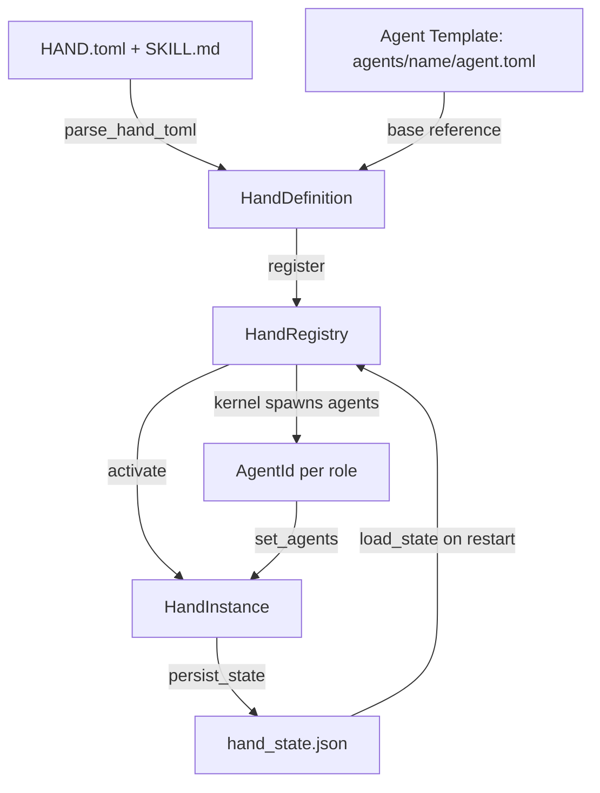
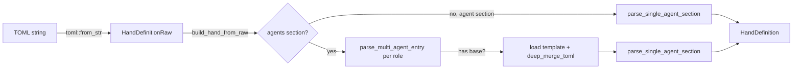

# Hands Framework

# LibreFang Hands Framework

## Overview

A **Hand** is a curated, domain-complete autonomous agent package. Unlike regular agents that users converse with directly, Hands work autonomously in the background — the user checks in on them rather than driving every interaction. Users discover and activate Hands from a marketplace.

The Hands framework provides:

- **Definition types** — the schema for HAND.toml configuration files
- **TOML parsing** — with backward-compatible legacy format support and agent template inheritance
- **Runtime registry** — thread-safe (`Send + Sync`) in-memory store for definitions and active instances, with crash-safe persistence
- **Requirement checking** — pre-activation validation of binaries, environment variables, and API keys
- **Settings resolution** — user-facing configuration with prompt generation for agent system prompts

## Architecture



## Core Concepts

### Hand vs. Agent

| Concept | Role |
|---------|------|
| **HandDefinition** | Static blueprint — parsed from HAND.toml. Describes what the hand does, what it needs, and its agent configuration. |
| **HandInstance** | Runtime record — one active incarnation of a definition. Tracks spawned agent IDs, user config, status, and timestamps. |
| **AgentManifest** | The actual agent specification (model, prompt, tools) — embedded inside a hand definition, one per role. |

### Single-Agent vs. Multi-Agent

Hands support two TOML formats:

**Single-agent** (`[agent]` section) — auto-converted to `{"main": ...}` with `coordinator = true`:

```toml
[agent]
name = "clip-agent"
system_prompt = "You edit video clips."
```

**Multi-agent** (`[agents.<role>]` sections) — each role gets its own agent, one marked as coordinator:

```toml
[agents.planner]
coordinator = true
name = "planner-agent"
system_prompt = "You plan tasks."

[agents.worker]
name = "worker-agent"
system_prompt = "You execute tasks."
```

The coordinator is the agent that receives user messages. If no agent is explicitly marked `coordinator = true`, the first agent by role name (BTreeMap order) is used.

## Hand Definition (HAND.toml)

### Full Schema

```toml
id = "clip"
version = "1.2.0"
name = "Clip Maker"
description = "Autonomous video clipping from transcripts"
category = "content"        # content|security|productivity|development|communication|data|finance|other
icon = "🎬"
tools = ["shell_exec", "fs_read", "fs_write"]
skills = ["video_processing"]
mcp_servers = []
allowed_plugins = []

[routing]
aliases = ["video editor", "clip maker"]
weak_aliases = ["cut video", "trim"]

[metadata]
frequency = "periodic"             # continuous|periodic|on-demand|daily|hourly
token_consumption = "medium"       # low|medium|high
default_active = false
activation_warning = "Uses GPU acceleration"

[[requires]]
key = "ffmpeg"
label = "FFmpeg"
requirement_type = "binary"        # binary|env_var|api_key|any_env_var
check_value = "ffmpeg"
description = "Core video processing engine"
optional = false

[requires.install]
macos = "brew install ffmpeg"
windows = "winget install Gyan.FFmpeg"
linux_apt = "sudo apt install ffmpeg"
manual_url = "https://ffmpeg.org/download.html"
estimated_time = "2-5 min"
steps = ["Download from ffmpeg.org", "Add to PATH"]

[[settings]]
key = "stt_provider"
label = "STT Provider"
description = "Speech-to-text engine"
setting_type = "select"            # select|text|toggle
default = "auto"

[[settings.options]]
value = "groq"
label = "Groq Whisper"
provider_env = "GROQ_API_KEY"

[[settings.options]]
value = "local"
label = "Local Whisper"
binary = "whisper"

[[dashboard.metrics]]
label = "Clips Created"
memory_key = "clips_count"
format = "number"                  # number|duration|bytes|percentage|text|date

# Single-agent format:
[agent]
name = "clip-agent"
system_prompt = "You create video clips."

# --- OR multi-agent format: ---
[agents.planner]
coordinator = true
base = "my-writer"                 # optional template reference
name = "planner-agent"
system_prompt = "You plan clipping tasks."

[agents.encoder]
name = "encoder-agent"
system_prompt = "You encode video."

# Localization:
[i18n.zh]
name = "视频剪辑"
description = "自主视频剪辑"

[i18n.zh.agents.planner]
name = "规划器"

[i18n.zh.settings.stt_provider]
label = "语音转文字引擎"
```

### Agent Template Inheritance (`base` field)

Multi-agent entries can reference a shared agent template via `base = "<template_name>"`. The template is loaded from `{agents_dir}/{template_name}/agent.toml`, and the hand's inline fields are deep-merged on top (hand values win).

This is only available in the `[agents.<role>]` format — the single-agent `[agent]` section does not support `base`. Template resolution requires filesystem access, so it's only available through `parse_hand_definition` or `install_from_path`, not through `install_from_content` (API-only installs without an agents directory).

Path traversal is prevented: template names containing `..`, `/`, or `\` are rejected.

### Legacy Format Compatibility

Older HAND.toml files may use flat model fields at the top level of `[agent]`:

```toml
# Legacy flat format
[agent]
name = "old-agent"
provider = "openai"
model = "gpt-4"
system_prompt = "..."
max_tokens = 4096
temperature = 0.7
```

The parser detects this automatically and converts it to the nested `ModelConfig` structure. The `provider` and `model` fields default to `"default"` — a sentinel resolved by the kernel to the user's global default model, so hands don't pin themselves to a specific provider.

### Wrapped `[hand]` Format

HAND.toml files can also use a wrapper where all fields sit under a `[hand]` section. Both formats are tried during parsing; the one that succeeds is used.

## Core Types Reference

### `HandDefinition`

The parsed, immutable blueprint. Key fields:

| Field | Purpose |
|-------|---------|
| `id` | Unique identifier (e.g. `"clip"`) |
| `agents` | `BTreeMap<String, HandAgentManifest>` — agent configs keyed by role name |
| `requires` | Prerequisites checked before activation |
| `settings` | User-configurable options shown in the activation modal |
| `dashboard` | Metrics schema for the hand's dashboard view |
| `routing` | Keywords for deterministic hand selection |
| `skill_content` | Bundled SKILL.md content (populated at load, not in TOML) |
| `agent_skill_content` | Per-role SKILL content from `SKILL-{role}.md` files |
| `i18n` | Localized strings keyed by language code |

Key methods:

- **`coordinator()`** → returns the coordinator agent (explicitly marked, or first by role name)
- **`agent()`** → backward-compatible single-agent accessor
- **`is_multi_agent()`** → true when more than one agent is defined

### `HandInstance`

Runtime state of an activated hand. Tracks:

- `instance_id` — UUID (random, or restored from persistence)
- `status` — `Active`, `Paused`, `Error(String)`, or `Inactive`
- `agent_ids` — `BTreeMap<String, AgentId>` mapping roles to spawned agents
- `coordinator_role` — which role receives user messages
- `config` — user-provided setting overrides
- `agent_runtime_overrides` — per-role model/provider overrides from the dashboard
- `activated_at` / `updated_at` — timestamps preserved across restarts

### `HandAgentManifest`

Wraps an `AgentManifest` with hand-specific fields:

- `coordinator: bool` — whether this agent receives user messages
- `invoke_hint: Option<String>` — dispatch hint for other agents
- `base: Option<String>` — template reference (if any)

### `HandAgentRuntimeOverride`

Per-role runtime overrides that survive daemon restarts:

```rust
pub struct HandAgentRuntimeOverride {
    pub model: Option<String>,
    pub provider: Option<String>,
    pub api_key_env: Option<Option<String>>,
    pub base_url: Option<Option<String>>,
    pub max_tokens: Option<u32>,
    pub temperature: Option<f32>,
    pub web_search_augmentation: Option<WebSearchAugmentationMode>,
}
```

`None` means "use the definition's default." `Some(None)` for `api_key_env`/`base_url` means "explicitly clear it."

## Parsing Pipeline



### Key Functions

**`parse_hand_definition(toml_content, agents_dir)`** — Filesystem-aware parser. Resolves `base` template references when `agents_dir` is provided. This is the path used by `install_from_path` and `reload_from_disk`.

**`parse_hand_toml_with_agents_dir(toml_content, skill_content, agent_skill_content, agents_dir)`** — Higher-level entry point that attaches skill content after parsing. Tries flat format first, then wrapped `[hand]` format on failure.

**`parse_multi_agent_entry(role, value, agents_dir)`** — Parses a single `[agents.<role>]` entry. Extracts `coordinator`, `invoke_hint`, `base`, then parses the agent manifest with legacy fallback.

**`deep_merge_toml(base, overlay)`** — Recursive table merge. Overlay scalars and arrays replace base values; tables are merged recursively.

**`normalize_flat_to_nested(value)`** — Moves legacy top-level model fields (`provider`, `model`, `system_prompt`, etc.) into a `[model]` sub-table so deep-merge works correctly.

## HandRegistry

Thread-safe registry using `DashMap` for lock-free concurrent reads and `Mutex` for serializing mutations that must be atomic.

### Data Structures

| Field | Type | Purpose |
|-------|------|---------|
| `definitions` | `DashMap<String, HandDefinition>` | All known hand blueprints |
| `instances` | `DashMap<Uuid, HandInstance>` | Active + paused + errored instances |
| `agent_index` | `DashMap<String, Uuid>` | Reverse lookup: agent ID string → instance ID |
| `active_index` | `DashMap<String, Uuid>` | Reverse lookup: hand ID → active instance ID |
| `activate_lock` | `Mutex<()>` | Serializes check-then-insert for activation |
| `persist_lock` | `Mutex<()>` | Serializes disk writes |

### Installation Methods

| Method | Source | Base Templates | Persists to Disk |
|--------|--------|----------------|------------------|
| `install_from_path` | Directory with HAND.toml | ✅ | No |
| `install_from_content` | Raw TOML string | ❌ (rejected) | No |
| `install_from_content_persisted` | Raw TOML string | ✅ | Yes (`workspaces/{id}/`) |
| `reload_from_disk` | Scans `registry/hands/` + `workspaces/` | ✅ | No |

`install_from_content` explicitly rejects hands with `base` references because there's no filesystem to resolve templates from.

### Uninstallation

`uninstall_hand(home_dir, hand_id)`:

1. Refuses if the hand is built-in (lives in `registry/hands/`, not `workspaces/`)
2. Refuses if any instance is still active
3. Removes the in-memory definition
4. Deletes the `workspaces/{id}/` directory

### Activation Flow

1. Verify the definition exists
2. Acquire `activate_lock`
3. Check `active_index` for existing active instance (single-instance enforcement)
4. Create `HandInstance` with UUID (fresh or restored)
5. Insert into `instances` and `active_index`

The kernel then spawns agents and calls `set_agents()` to populate `agent_ids`.

### Deactivation Flow

1. Remove from `instances`
2. Clean up `agent_index` entries
3. Remove from `active_index` (only if it still points to this instance)
4. Re-insert another active instance of the same hand if one exists (multi-instance edge case on restart)

## Persistence & State Management

State is persisted to `hand_state.json` using atomic writes (write to temp file → `fsync` → `rename` → parent directory `fsync`).

### Version History

| Version | Changes |
|---------|---------|
| v1 | Bare JSON array, single `agent_id` |
| v2 | `{ version, instances }` wrapper |
| v3 | Multi-agent: `agent_ids` as `BTreeMap<role, AgentId>`, `coordinator_role` |
| v4 | `activated_at` / `updated_at` timestamps |
| **v5** (current) | `agent_runtime_overrides` per role |

Loading is forward-compatible: v5 code reads v1–v4 files. Legacy `config.__model_overrides__` blobs are migrated to `agent_runtime_overrides` without overwriting existing v5 entries. Backward compatibility: a v4 daemon loading a v5 file silently drops the `agent_runtime_overrides` field (users must re-apply from the dashboard after a downgrade).

Only `Active`, `Paused`, and `Error` instances are persisted. `Inactive` instances are skipped. On reload, `Error` instances are also skipped (logged but not restored).

### `HandStateEntry`

The data structure returned by `load_state()` for the kernel to process during restart recovery:

- `old_agent_ids` — the pre-restart agent UUIDs, used to reassign cron jobs
- `instance_id` — preserved UUID for deterministic agent ID regeneration
- `activated_at` / `updated_at` — original timestamps (None for legacy files)

## Requirements Checking

### Requirement Types

| Type | Check | Example |
|------|-------|---------|
| `Binary` | Binary exists on PATH | `ffmpeg`, `python3`, `chromium` |
| `EnvVar` | Environment variable is set and non-empty | `HOME` |
| `ApiKey` | Same as EnvVar (semantic distinction) | `OPENAI_API_KEY` |
| `AnyEnvVar` | Any of a comma-separated list is set | `OPENAI_API_KEY,GROQ_API_KEY` |

Special cases:
- **`python3`**: Runs the binary and checks for "Python 3" in the output (avoids Windows Store shim false positives). Result cached via `OnceLock`.
- **`chromium`**: Checks multiple binary names (`chromium-browser`, `google-chrome`, etc.), `CHROME_PATH` env var, and macOS `.app` paths.

Optional requirements (`.optional = true`) do not block activation but contribute to the `degraded` status flag when unmet.

## Settings Resolution

`resolve_settings(settings, config)` produces a `ResolvedSettings` with:

- **`prompt_block`** — Markdown appended to the system prompt (e.g. `## User Configuration\n- STT: Groq Whisper (groq)`)
- **`env_vars`** — List of environment variable names the agent subprocess needs access to

Resolution logic per setting type:

| Type | Behavior |
|------|----------|
| `Select` | Finds matching option, uses its `label` for display, collects `provider_env` if present |
| `Toggle` | Displays "Enabled" or "Disabled" |
| `Text` | Displays value if non-empty, collects `env_var` if present |

Falls back to `setting.default` when the user hasn't provided a value.

## Internationalization

`HandI18n` provides optional localized strings per language code:

```toml
[i18n.zh]
name = "线索生成"
description = "自主线索生成"

[i18n.zh.agents.main]
name = "主协调器"

[i18n.zh.settings.target_industry]
label = "目标行业"
```

All fields are optional — omitting a field falls back to the English default. The `check_settings_availability()` method accepts a `lang` parameter and returns translated labels/descriptions when available.

## Readiness

`HandRegistry::readiness(hand_id)` returns a `HandReadiness` snapshot:

| Field | Meaning |
|-------|---------|
| `requirements_met` | All **non-optional** requirements are satisfied |
| `active` | At least one instance is in `Active` status |
| `degraded` | Active but some requirement (optional or not) is unmet |

This is used by the API to show the hand's operational status at a glance.

## Error Handling

All operations return `HandResult<T>` (= `Result<T, HandError>`). Error variants:

| Variant | When |
|---------|------|
| `NotFound` | Hand definition doesn't exist |
| `AlreadyActive` | Hand already has an active instance |
| `AlreadyRegistered` | Duplicate hand ID during installation |
| `BuiltinHand` | Attempted to uninstall a registry hand |
| `InstanceNotFound` | UUID doesn't match any instance |
| `ActivationFailed` | Instance collision or other activation error |
| `TomlParse` | HAND.toml syntax or schema error |
| `Io` | Filesystem error |
| `Config` | Semantic config error (e.g., base template without agents_dir) |

## Integration Points

The Hands framework is consumed by:

- **Kernel** (`src/kernel/`) — activates/deactivates hands, spawns agents, applies runtime overrides, manages persistence lifecycle
- **API layer** (`src/routes/`) — exposes hand listing, activation, deactivation, settings, and runtime override endpoints
- **Route handlers** (`src/routes/skills.rs`) — uses `agent_id()` and `find_by_agent()` to resolve hand context from incoming messages
- **Manifest helpers** (`src/kernel/manifest_helpers.rs`) — calls `resolve_settings()` to build the system prompt and `is_multi_agent()` to configure agent dispatching
- **Registry sync** — populates `registry/hands/` which is scanned on startup by `reload_from_disk()`