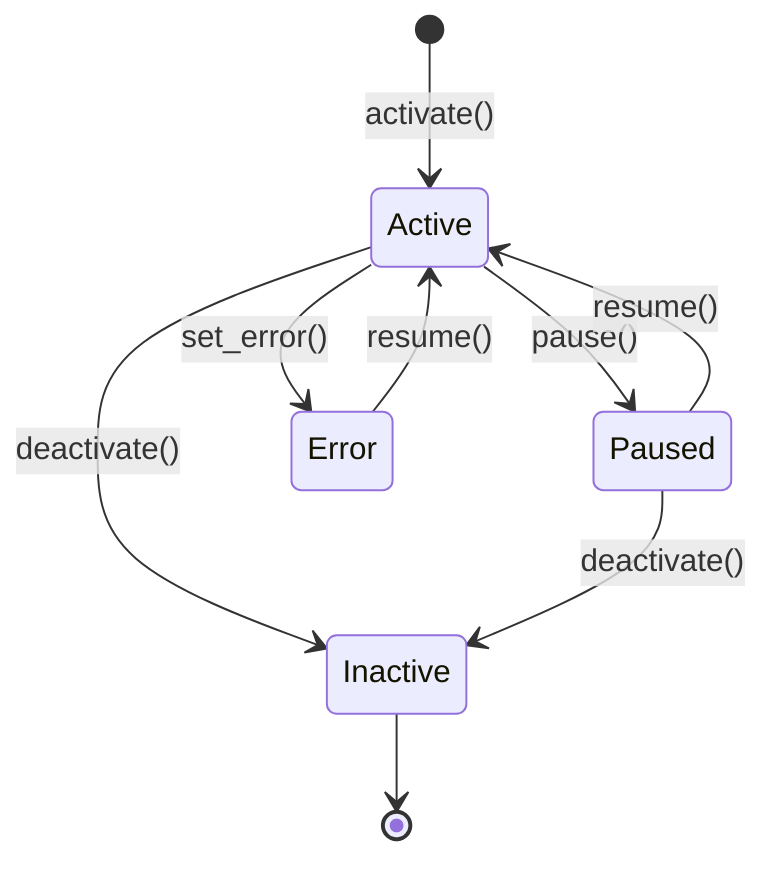

# Hands Framework

# LibreFang Hands Framework

## Overview

A **Hand** is a pre-built, domain-complete autonomous agent configuration that users activate from a marketplace. Unlike regular agents — which users chat with interactively — Hands work autonomously in the background. Users check in on them rather than drive them.

This crate provides:

- The type system for defining, configuring, and instantiating Hands (`lib.rs`)
- A thread-safe registry that manages definitions, tracks active instances, and persists state across daemon restarts (`registry.rs`)

## Architecture

```mermaid
graph TD
    subgraph Disk
        HT[HAND.toml]
        SK[SKILL.md]
        AS[SKILL-role.md]
        AT[agents/template/agent.toml]
        PS[hand_state.json]
    end

    subgraph Registry
        DM[definitions DashMap]
        IM[instances DashMap]
        AI[agent_index DashMap]
        ACI[active_index DashMap]
    end

    HT -->|parse| DM
    SK -->|attach skill_content| DM
    AS -->|attach agent_skill_content| DM
    AT -->|base template resolve| DM
    DM -->|activate| IM
    IM -->|reverse lookup| AI
    IM -->|O(1) active check| ACI
    IM -->|persist_state| PS
    PS -->|load_state| IM
```

## Core Concepts

### Hand vs Agent

| Aspect | Agent | Hand |
|--------|-------|------|
| Interaction | User chats with it | Works for user autonomously |
| Source | User-created | Pre-built marketplace package |
| Configuration | Ad-hoc | Declarative `HAND.toml` + settings schema |
| Agents | Single entity | One or more coordinated agents |
| Lifecycle | Managed directly | Activated / paused / deactivated |

### Categories

Hands are classified into `HandCategory` variants: `Content`, `Security`, `Productivity`, `Development`, `Communication`, `Data`, `Finance`, `Other`. These drive marketplace browsing and filtering.

### Single-Agent vs Multi-Agent

A Hand can contain one agent or many:

- **Single-agent**: defined via `[agent]` in TOML, internally stored as `{"main": ...}` with `coordinator = true`
- **Multi-agent**: defined via `[agents.planner]`, `[agents.analyst]`, etc., each with an explicit `coordinator` flag

The coordinator agent receives user messages. If no agent is marked coordinator, the first agent (sorted by role name in the `BTreeMap`) is used.

## HAND.toml Format

Hands are defined in `HAND.toml` files. Two wrapper formats are accepted:

```toml
# Flat format — fields at top level
id = "clip"
name = "Video Clipper"
description = "Autonomous video clipping"
category = "content"
icon = "🎬"
version = "1.2.0"

[agent]
name = "clip-agent"
system_prompt = "You clip videos."

# Wrapped format — fields under [hand]
[hand]
id = "clip"
name = "Video Clipper"
# ...
```

### Agent Definition Formats

Each agent section supports two formats, auto-detected at parse time:

**Legacy flat** — model fields at the same level as `name`:
```toml
[agents.planner]
coordinator = true
name = "planner-agent"
provider = "anthropic"
model = "claude-sonnet-4-20250514"
system_prompt = "You plan."
```

**Nested** — model fields in a `[model]` sub-table:
```toml
[agents.planner]
coordinator = true
name = "planner-agent"

[agents.planner.model]
provider = "anthropic"
model = "claude-sonnet-4-20250514"
max_tokens = 8192
system_prompt = "You plan."
```

### Base Template Reuse

Multi-agent entries can reference shared agent templates via `base`:

```toml
[agents.writer]
coordinator = true
base = "my-writer"           # loads agents/my-writer/agent.toml

[agents.writer.model]        # overrides merged on top
system_prompt = "Blog-specific instructions."
```

The hand's fields deep-merge onto the base template (hand wins on conflicts). Path traversal is blocked — template names must be simple directory names without `/`, `\`, or `..`.

Base resolution requires a filesystem path to the agents registry, passed via `agents_dir`. The `install_from_content` method (no filesystem) rejects hands that use `base`.

### Full Schema

```toml
id = "research"
version = "2.0.0"
name = "Research Hand"
description = "Multi-agent research pipeline"
category = "content"
icon = "🔬"
tools = ["web_search", "file_write"]
skills = ["research"]
mcp_servers = []
allowed_plugins = []

[routing]
aliases = ["research assistant", "deep research"]
weak_aliases = ["find papers"]

[metadata]
frequency = "periodic"
token_consumption = "high"
default_active = false
activation_warning = "This hand makes paid API calls"

[[requires]]
key = "python3"
label = "Python 3"
requirement_type = "binary"
check_value = "python3"
description = "Required for data analysis"

[[requires]]
key = "GROQ_API_KEY"
label = "Groq API Key"
requirement_type = "api_key"
check_value = "GROQ_API_KEY"
optional = true

[requires.install]
macos = "brew install python3"
linux_apt = "sudo apt install python3"
estimated_time = "2-5 min"

[[settings]]
key = "stt_provider"
label = "STT Provider"
description = "Speech-to-text engine"
setting_type = "select"
default = "auto"

[[settings.options]]
value = "auto"
label = "Auto-detect"

[[settings.options]]
value = "groq"
label = "Groq Whisper"
provider_env = "GROQ_API_KEY"

[[settings.options]]
value = "local"
label = "Local Whisper"
binary = "whisper"

[agents.planner]
coordinator = true
invoke_hint = "Route planning requests here"
name = "planner-agent"
description = "Decomposes research into sub-tasks"

[agents.planner.model]
provider = "anthropic"
model = "claude-sonnet-4-20250514"
max_tokens = 8192
temperature = 0.5
system_prompt = "You plan research."

[agents.analyst]
name = "analyst-agent"
base = "generic-analyst"

[dashboard.metrics]
label = "Papers reviewed"
memory_key = "papers_count"
format = "number"

# Localization
[i18n.zh]
name = "研究 Hand"
description = "多智能体研究流水线"

[i18n.zh.agents.planner]
name = "规划器"
description = "将研究分解为子任务"

[i18n.zh.settings.stt_provider]
label = "语音转文字引擎"
```

## Key Types

### `HandDefinition`

The complete parsed representation of a `HAND.toml`. Key fields:

| Field | Purpose |
|-------|---------|
| `id` | Unique identifier (e.g. `"clip"`) |
| `agents` | `BTreeMap<String, HandAgentManifest>` — role name → agent config |
| `requires` | Prerequisites checked before activation |
| `settings` | Configurable options shown in the activation modal |
| `skill_content` | Shared skill markdown (from `SKILL.md`, populated at load) |
| `agent_skill_content` | Per-role skill markdown (from `SKILL-{role}.md`) |
| `i18n` | Localized strings keyed by language code |

Key methods:
- **`coordinator()`** → returns `(role_name, &HandAgentManifest)` for the coordinator agent
- **`agent()`** → backward-compatible single-agent accessor (returns coordinator's manifest)
- **`is_multi_agent()`** → `true` when more than one agent is defined

### `HandInstance`

A running instance linking a `HandDefinition` to its spawned agents. Key fields:

| Field | Purpose |
|-------|---------|
| `instance_id` | `Uuid` — unique per instance |
| `hand_id` | Which definition this instantiates |
| `status` | `Active`, `Paused`, `Error(String)`, or `Inactive` |
| `agent_ids` | `BTreeMap<role, AgentId>` — populated after kernel spawns agents |
| `coordinator_role` | Explicitly persisted role name for message routing |
| `config` | User's setting choices at activation time |
| `agent_runtime_overrides` | Dashboard-edited model/provider overrides that survive restarts |
| `activated_at` / `updated_at` | Timestamps for dashboard display |

Key methods:
- **`coordinator_agent_id()`** → the `AgentId` for the coordinator role
- **`agent_id()`** → backward-compatible single-agent accessor

### `HandAgentManifest`

Wraps an `AgentManifest` with hand-specific metadata:

| Field | Purpose |
|-------|---------|
| `coordinator` | Whether this agent receives user messages |
| `invoke_hint` | Hint for other agents on when to invoke this one |
| `base` | Name of the agent template this was derived from |
| `manifest` | The underlying `AgentManifest` |

### `HandAgentRuntimeOverride`

Per-role runtime overrides edited from the dashboard. Fields are all `Option`, defaulting to `None` (meaning "use the definition's value"):

- `model`, `provider`, `api_key_env`, `base_url`, `max_tokens`, `temperature`, `web_search_augmentation`

Merge semantics: when `merge_agent_runtime_override` is called, `None` fields in the new override fall back to the previous value. This allows partial updates.

### `HandRequirement`

A prerequisite the user must satisfy. Types:

| `requirement_type` | `check_value` meaning |
|--------------------|-----------------------|
| `Binary` | Executable name on PATH |
| `EnvVar` | Environment variable name |
| `ApiKey` | Environment variable holding an API key |
| `AnyEnvVar` | Comma-separated env var names (any one suffices) |

The `optional` field marks non-blocking requirements. When an active hand has unmet optional requirements, it reports as "degraded" rather than "requirements not met".

### `HandSetting` and `resolve_settings`

Settings are declared in `HAND.toml` with a schema (`select`, `toggle`, `text`). At activation, the user provides a `config` map. The `resolve_settings` function:

1. Looks up each setting's value in `config`, falling back to `setting.default`
2. For `Select` settings, finds the matching option and collects its `provider_env`
3. For `Text` settings, collects the setting's `env_var` if non-empty
4. Builds a markdown `## User Configuration` block for the system prompt
5. Returns `ResolvedSettings { prompt_block, env_vars }` — the env vars are what the agent's subprocess needs access to

### Error Handling

`HandError` covers all failure modes:

| Variant | When |
|---------|------|
| `NotFound(id)` | Hand definition not in registry |
| `AlreadyActive(id)` | Duplicate activation attempted |
| `AlreadyRegistered(id)` | Duplicate definition install |
| `BuiltinHand(id)` | Attempted to uninstall a registry hand |
| `InstanceNotFound(uuid)` | Instance doesn't exist |
| `ActivationFailed(msg)` | Instance UUID collision on restart recovery |
| `TomlParse(msg)` | Malformed HAND.toml |
| `Io(err)` | Filesystem errors |
| `Config(msg)` | State serialization / invalid config |

All registry methods return `HandResult<T>` (= `Result<T, HandError>`).

## Registry Operations

### `HandRegistry`

Thread-safe registry using `DashMap` for lock-free concurrent reads. Five internal maps:

| Map | Key | Value | Purpose |
|-----|-----|-------|---------|
| `definitions` | `hand_id` | `HandDefinition` | All known hands |
| `instances` | `instance_id` (Uuid) | `HandInstance` | Active/paused/error instances |
| `agent_index` | `agent_id` string | `instance_id` | O(1) agent→instance lookup |
| `active_index` | `hand_id` | `instance_id` | O(1) "is this hand active?" check |
| `activate_lock` | — | `Mutex` | Serializes check-then-insert |

### Installation

Three installation paths, each writing to `definitions`:

| Method | Source | Persists to disk? | Base templates? |
|--------|--------|-------------------|-----------------|
| `install_from_path` | Directory with `HAND.tomL` | No (in-memory only) | ✅ |
| `install_from_content` | Raw TOML + skill strings | No | ❌ rejected |
| `install_from_content_persisted` | Raw TOML + skill strings | Yes (`workspaces/{id}/`) | ✅ |

`reload_from_disk` scans both `{home}/registry/hands/` (built-in) and `{home}/workspaces/` (user-installed), with registry taking precedence on ID collisions.

### Uninstallation

`uninstall_hand` removes a user-installed hand (must live under `workspaces/`). Refuses if:
- The hand is built-in (lives under `registry/`)
- Any instance is still active

### Activation Lifecycle



`activate` creates a `HandInstance` with status `Active`. Agent spawning is done by the kernel (via `set_agents`), not by the registry. The `activate_lock` mutex prevents races where two concurrent requests both pass the "already active" check.

For daemon restart recovery, `activate_with_id` accepts a pre-existing UUID and preserved timestamps so that deterministic agent IDs remain stable.

### Requirement Checking

`check_requirements` evaluates each `HandRequirement`:

- **Binary**: checks PATH via `which_binary`, with special handling for `python3` (actually runs `python3 --version` / `python --version` and checks for "Python 3" in output, cached via `OnceLock`) and `chromium` (tries multiple binary names and common install paths)
- **EnvVar / ApiKey**: checks `std::env::var` is set and non-empty
- **AnyEnvVar**: comma-separated list; any one being set passes

`readiness` cross-references requirements with activation state: `requirements_met` considers only mandatory requirements; `degraded` is true when active but any requirement (including optional) is unmet.

### Settings Availability

`check_settings_availability` enriches each setting option with an `available` boolean by checking `provider_env` and `binary` fields. Returns localized labels/descriptions when a `lang` parameter is provided and the hand has `[i18n.{lang}.settings.*]` entries.

## State Persistence

Hand state is persisted to `hand_state.json` so instances survive daemon restarts.

### Format Version History

| Version | Changes |
|---------|---------|
| **v1** | Bare JSON array, single `agent_id` |
| **v2** | `{ version, instances }` wrapper, still single-agent |
| **v3** | Multi-agent: `agent_ids` as `BTreeMap<role, AgentId>`, `coordinator_role` added |
| **v4** | `activated_at` / `updated_at` timestamps |
| **v5** *(current)* | `agent_runtime_overrides` per-role map |

All fields added after v1 use `#[serde(default)]` + `skip_serializing_if`, so:
- A v5 daemon can load v1–v4 state files (forward-compatible)
- A v4 daemon loading a v5 file silently drops `agent_runtime_overrides` (backward-compatible — users must re-apply from the dashboard)

Legacy `config.__model_overrides__` blobs from pre-v5 are automatically migrated into `agent_runtime_overrides` during `load_state` without clobbering existing v5 entries.

### Atomic Writes

`persist_state` uses `atomic_write_json` which writes to a temp file, syncs, then renames — ensuring the state file is never partial. On Unix, the parent directory is also fsynced so the rename is durable across power loss.

## Localization (i18n)

Hands can declare localized strings under `[i18n.{lang}]`:

- `name`, `description`, `category` — top-level hand metadata
- `agents.{role}.name` / `description` — per-agent translations
- `settings.{key}.label` / `description` — per-setting translations

All fields are optional. When a translation is missing, the English default from the main `HAND.toml` fields is used. This allows incremental localization without translating every string.

## Default Provider/Model Sentinel

Legacy flat-format agent fields default `provider` and `model` to `"default"` — a sentinel that the kernel resolves to the user's global `config.default_model.provider` at driver-build time. This prevents hand authors from accidentally pinning every hand that omits these fields to a hardcoded provider.