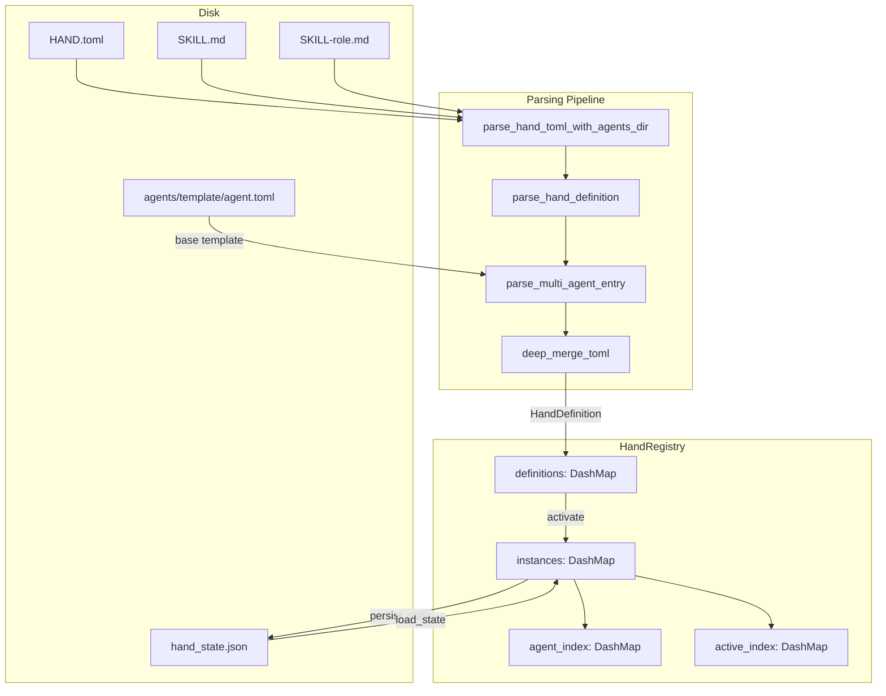

# Hands & Multi-Agent

# Hands & Multi-Agent Module

## Overview

A **Hand** is a pre-built, domain-complete autonomous agent package that users activate from a marketplace. The key distinction: regular agents are conversational (you chat with them), while Hands are autonomous workers (you activate them and check in on their progress). A Hand bundles everything an agent needs — model configuration, system prompts, tool access, skill content, requirements, user-configurable settings, and dashboard metrics — into a single `HAND.toml` definition.

This module provides the type definitions for hand manifests (`HandDefinition`, `HandInstance`), the TOML parsing pipeline that supports both single-agent and multi-agent configurations, and the `HandRegistry` that manages the lifecycle of definitions and active instances at runtime.

## Architecture



## Core Types

### HandDefinition

The central data structure, parsed from `HAND.toml`. Represents everything about a hand: its identity, category, requirements, settings, agent manifests, dashboard schema, routing keywords, and optional internationalization.

Key fields:
- **`agents`**: A `BTreeMap<String, HandAgentManifest>` mapping role names to agent configurations. Single-agent hands store their agent under the key `"main"` with `coordinator = true`.
- **`skill_content`** / **`agent_skill_content`**: Bundled skill instructions loaded from `SKILL.md` (shared) and `SKILL-{role}.md` (per-agent) files at load time. Not serialized in TOML — populated by the registry loader.
- **`i18n`**: Localized strings keyed by language code (e.g. `"zh"`, `"ja"`), supporting translated names, descriptions, setting labels, and agent names.

The `coordinator()` method returns the agent that receives user messages — either the one explicitly marked `coordinator = true`, or the first agent by role name as fallback.

### HandInstance

A runtime record of an activated hand. Links a `HandDefinition` to its spawned agents:

- **`agent_ids`**: Maps role names to `AgentId` values. Populated by the kernel after agent spawning via `set_agents()`.
- **`coordinator_role`**: Explicitly persisted so message routing doesn't depend on inference.
- **`config`**: User-provided setting overrides from the activation request.
- **`status`**: One of `Active`, `Paused`, `Error(String)`, or `Inactive`.

The `coordinator_agent_id()` method resolves the routing target through `normalize_coordinator_role()`, which checks: explicit coordinator_role → single-agent fallback → "main" key fallback → first agent by sort order.

### HandAgentManifest

Wraps an `AgentManifest` with multi-agent metadata:

| Field | Purpose |
|-------|---------|
| `coordinator` | Marks the agent that receives user messages |
| `invoke_hint` | Instruction injected into the coordinator's system prompt for dispatching to this agent |
| `base` | Optional reference to an agent template from the `agents/` registry |
| `manifest` | The resolved `AgentManifest` (fields from base template + hand overrides) |

## TOML Formats

### Single-Agent vs Multi-Agent

A hand defines its agents in one of two formats:

**Single-agent** — a single `[agent]` section, auto-converted to `{"main": ...}`:

```toml
[agent]
name = "clip-agent"
description = "Video clipping agent"
system_prompt = "You clip videos."

[agent.model]
provider = "anthropic"
model = "claude-sonnet-4-20250514"
max_tokens = 4096
```

**Multi-agent** — an `[agents.*]` map with one section per role:

```toml
[agents.planner]
coordinator = true
invoke_hint = "Use planner for task decomposition"
name = "planner-agent"
system_prompt = "You plan research."

[agents.planner.model]
provider = "anthropic"
model = "claude-sonnet-4-20250514"

[agents.analyst]
name = "analyst-agent"
system_prompt = "You analyze data."

[agents.analyst.model]
provider = "groq"
model = "llama-3.3-70b-versatile"
```

### Legacy Flat Format

Older `HAND.toml` files may place model fields (`provider`, `model`, `system_prompt`, `max_tokens`, `temperature`, `api_key_env`, `base_url`) as top-level scalars inside `[agent]` or `[agents.*]` instead of nesting them under `[agent.model]`. The parser detects this heuristically (absence of a `model` sub-table) and deserializes via `LegacyHandAgentConfig`, which converts to the standard `AgentManifest`.

When base template resolution is active, `normalize_flat_to_nested()` restructures the base template's flat fields into a `[model]` sub-table *before* merging, preventing orphaned fields.

### Base Template Resolution

Agents can reference a shared template via `base = "template-name"`, which loads `{agents_dir}/{template-name}/agent.toml` and deep-merges the hand's inline overrides on top:

```toml
[agents.writer]
coordinator = true
base = "my-writer"        # loads agents/my-writer/agent.toml

[agents.writer.model]
system_prompt = "Override: you are a blog writer."  # overrides base prompt
```

The merge is recursive through `deep_merge_toml()`: tables merge recursively, scalars and arrays in the overlay replace the base. Template names are validated to prevent path traversal (no `..`, `/`, or `\`).

This requires filesystem access, so it only works through `parse_hand_definition()` (which takes an `agents_dir` parameter), not through the serde `Deserialize` impl.

### Wrapped Format

Some `HAND.toml` files wrap all fields under a `[hand]` section. The parser tries the flat format first, then falls back to extracting and re-serializing the `[hand]` sub-table.

## Settings System

Hands declare configurable settings that appear in the activation UI:

```toml
[[settings]]
key = "stt_provider"
label = "STT Provider"
setting_type = "select"
default = "auto"

[[settings.options]]
value = "groq"
label = "Groq Whisper"
provider_env = "GROQ_API_KEY"   # checked for "Ready" badge

[[settings.options]]
value = "local"
label = "Local Whisper"
binary = "whisper"              # checked on PATH for "Ready" badge
```

Three setting types are supported:

| Type | Behavior |
|------|----------|
| `Select` | User picks one option. The matched option's `provider_env` is collected into the resolved env vars list. |
| `Toggle` | Boolean switch (`"true"`/`"false"`). Displays as "Enabled"/"Disabled". |
| `Text` | Free-form input. If the setting declares an `env_var`, it's collected when non-empty. |

### resolve_settings()

Takes the hand's settings schema and a user config map, produces:

- **`prompt_block`**: A Markdown summary (`## User Configuration\n- Key: Value`) appended to the system prompt.
- **`env_vars`**: A list of environment variable names that should be available to the agent's subprocess.

Unset values fall back to `setting.default`. Only the selected option's `provider_env` is collected (not all options').

## Requirements Checking

Hands declare prerequisites that gate activation:

```toml
[[requires]]
key = "ffmpeg"
label = "FFmpeg must be installed"
requirement_type = "binary"
check_value = "ffmpeg"

[requires.install]
macos = "brew install ffmpeg"
linux_apt = "sudo apt install ffmpeg"
estimated_time = "2-5 min"
```

Four requirement types:

| Type | Check performed |
|------|----------------|
| `Binary` | Binary exists on PATH and is executable. Special handling for `python3` (runs `--version` and checks output for "Python 3") and `chromium` (tries multiple binary names and `CHROME_PATH` env). |
| `EnvVar` / `ApiKey` | Environment variable is set and non-empty. |
| `AnyEnvVar` | Comma-separated list in `check_value`; any one being set passes. |

Optional requirements (`optional = true`) do not block activation. When an active hand has unmet optional requirements, `readiness()` reports it as `degraded`.

## HandRegistry

The registry is the runtime manager for all hand definitions and instances. It is `Send + Sync`, using `DashMap` for concurrent access and `Mutex` for serializing activation/deactivation sequences.

### Data Structures

| Field | Type | Purpose |
|-------|------|---------|
| `definitions` | `DashMap<String, HandDefinition>` | All known hand definitions, keyed by hand id |
| `instances` | `DashMap<Uuid, HandInstance>` | Active/paused instances, keyed by instance UUID |
| `agent_index` | `DashMap<String, Uuid>` | Reverse lookup: agent ID string → instance UUID |
| `active_index` | `DashMap<String, Uuid>` | Reverse lookup: hand id → active instance UUID |
| `activate_lock` | `Mutex<()>` | Serializes check-then-insert in `activate()` |
| `persist_lock` | `Mutex<()>` | Serializes writes to `hand_state.json` |

### Key Operations

**Loading definitions from disk** — `reload_from_disk(home_dir)`:
Scans two directories:
1. `{home_dir}/registry/hands/` — read-only registry (from synced tarball)
2. `{home_dir}/workspaces/` — user-installed hands (survives restarts)

Registry entries take precedence on id collisions. Each subdirectory containing a `HAND.toml` is parsed. Per-agent skill files (`SKILL-{role}.md`) are scanned alongside the shared `SKILL.md`.

**Activation** — `activate(hand_id, config)`:
Validates the definition exists, checks no instance is already active (single-instance mode), creates a `HandInstance`, and inserts it plus reverse index entries. Agent spawning is performed by the kernel after this call succeeds; the registry is updated via `set_agents()`.

**Deactivation** — `deactivate(instance_id)`:
Removes the instance and cleans up both reverse indexes. If another active instance of the same hand exists (multi-instance edge case), it takes over the `active_index` slot.

**Uninstallation** — `uninstall_hand(home_dir, hand_id)`:
Refuses if: definition not found (`NotFound`), definition is built-in / from registry (`BuiltinHand`), or a live instance exists (`AlreadyActive`). Otherwise removes the in-memory definition and deletes `{home_dir}/workspaces/{id}/` from disk.

### State Persistence

`persist_state()` writes all non-Inactive instances to `hand_state.json` (version 4 format). On daemon restart, `load_state()` reads this file and returns `HandStateEntry` structs containing the preserved instance UUIDs, agent IDs, configs, coordinator roles, and timestamps. The kernel uses these to re-spawn agents with deterministic IDs.

Legacy formats (v1 bare array, v2 single agent_id, v3 typed array) are handled through fallback parsing paths.

## Error Handling

All operations return `HandResult<T>` which is `Result<T, HandError>`. Error variants:

| Variant | When |
|---------|------|
| `NotFound(id)` | Definition or instance not found |
| `AlreadyActive(id)` | Attempt to activate an already-active hand |
| `AlreadyRegistered(id)` | Duplicate definition registration |
| `BuiltinHand(id)` | Attempt to uninstall a registry hand |
| `InstanceNotFound(uuid)` | Instance UUID not in registry |
| `ActivationFailed(msg)` | Generic activation failure |
| `TomlParse(msg)` | HAND.toml parse error |
| `Io(err)` | Filesystem I/O error |
| `Config(msg)` | Configuration error |

## Default Provider Sentinel

The default values for `provider` and `model` in hand configurations are the string `"default"`, not a concrete provider name. This is a sentinel that the kernel resolves to the user's configured `default_model.provider` and `default_model.model` at agent-build time. This design ensures that hands omitting these fields automatically follow the user's global default rather than being pinned to whatever the hand author specified.

## Internationalization

Hands support optional `[i18n.{lang}]` sections for localized strings:

```toml
[i18n.zh]
name = "线索生成 Hand"
description = "自主线索生成"

[i18n.zh.agents.main]
name = "主协调器"

[i18n.zh.settings.target_industry]
label = "目标行业"
```

All fields within `HandI18n` are optional — missing translations fall back to English defaults. The `check_settings_availability()` method accepts a `lang` parameter and returns translated labels/descriptions when available.

## Integration Points

The kernel consumes this module through several paths:

- **Activation**: Kernel calls `activate()`, spawns agents per the `HandDefinition.agents` manifests, then calls `set_agents()` with the resulting agent IDs.
- **Message routing**: Incoming messages are routed to the coordinator agent via `HandInstance::coordinator_agent_id()`, resolved through `normalize_coordinator_role()`.
- **Agent lookup**: The kernel uses `find_by_agent()` to map an agent ID back to its hand instance (e.g., for triggering cron jobs or handling tool results).
- **Requirement checking**: The HTTP layer calls `check_requirements()` and `readiness()` to populate API responses about hand availability.
- **State recovery**: On startup, the kernel calls `load_state()` to discover previously-active hands that need re-spawning.
- **Router candidates**: The kernel router loads hand definitions via `parse_hand_toml()` to build routing keyword indexes from `HandRouting::aliases` and `weak_aliases`.