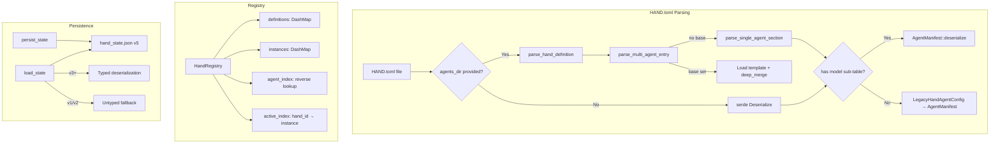
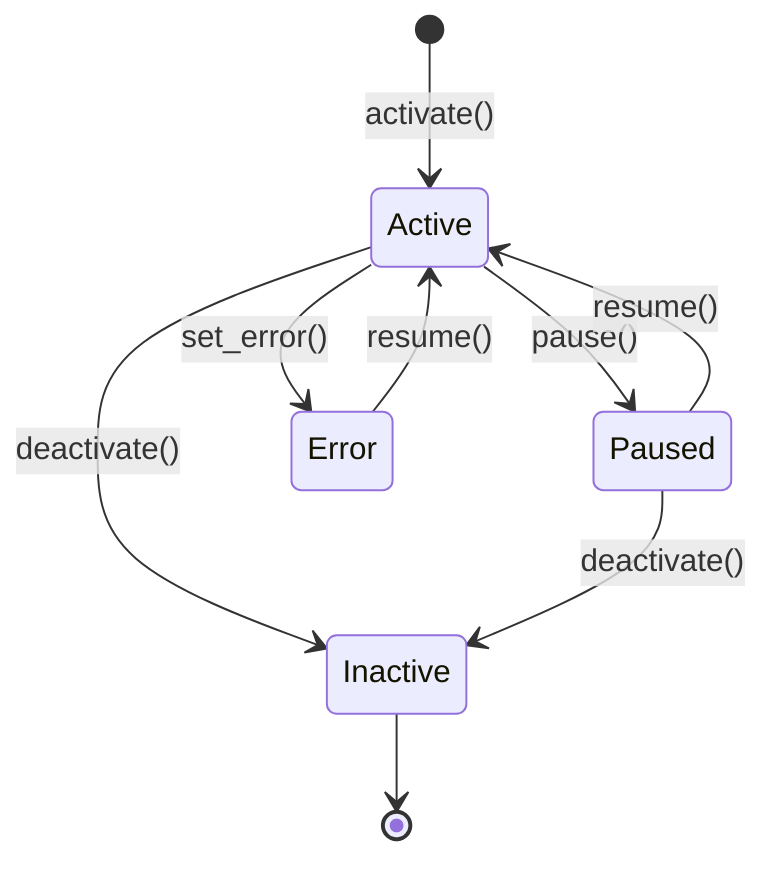

# Hands Orchestration

# Hands Orchestration (`librefang-hands`)

## Purpose

A **Hand** is a pre-built, domain-complete autonomous agent package that users activate from a marketplace. Unlike regular agents (which you chat with interactively), Hands work for you in the background — you check in on them rather than driving them turn-by-turn.

This crate provides:

- **Type definitions** for hand definitions, instances, settings, requirements, dashboards, and localization
- **TOML parsing** for `HAND.toml` configuration files, including legacy format migration and agent template inheritance
- **`HandRegistry`** — a concurrent-safe registry that manages hand definitions and tracks active instances across daemon restarts

## Architecture Overview



## Core Types

### `HandDefinition`

The static configuration parsed from `HAND.toml`. Key fields:

| Field | Purpose |
|-------|---------|
| `id` | Unique identifier (e.g. `"clip"`) |
| `version` | Semantic version, defaults to `"0.0.0"` |
| `agents` | `BTreeMap<String, HandAgentManifest>` — agent manifests keyed by role name |
| `requires` | Prerequisites (binaries, env vars, API keys) that must be met before activation |
| `settings` | Configurable options shown in the activation modal |
| `dashboard` | Metrics schema for the hand's dashboard |
| `routing` | Keywords for deterministic hand selection |
| `i18n` | Localized strings keyed by language code |
| `skill_content` | Bundled `SKILL.md` content (populated at load time, not in TOML) |
| `agent_skill_content` | Per-role `SKILL-{role}.md` overrides (populated at load time) |

Single-agent hands store their agent as `agents["main"]`. Use `coordinator()` to find the agent that receives user messages — it returns the explicitly-marked coordinator, or falls back to the first agent by role name.

### `HandInstance`

A runtime instance linking a `HandDefinition` to its spawned agents. Created by `HandRegistry::activate()`, populated with agent IDs by the kernel after spawning. Key fields:

- `instance_id: Uuid` — unique instance identifier
- `hand_id: String` — which definition this is an instance of
- `status: HandStatus` — `Active`, `Paused`, `Error(String)`, or `Inactive`
- `agent_ids: BTreeMap<String, AgentId>` — role → spawned agent mapping
- `coordinator_role: Option<String>` — persisted coordinator routing
- `config: HashMap<String, Value>` — user-provided configuration overrides
- `agent_runtime_overrides: BTreeMap<String, HandAgentRuntimeOverride>` — dashboard-edited model/provider overrides that survive restarts
- `activated_at`, `updated_at` — timestamps preserved across daemon restarts

### `HandAgentRuntimeOverride`

Per-role runtime overrides for model, provider, API key, base URL, max tokens, temperature, and web search augmentation. These are merged with `Option` semantics — the override field wins if present, otherwise the definition's value is used. See `merge_agent_runtime_override()` for the merge logic.

### `HandReadiness`

Computed by `HandRegistry::readiness()`, combines requirement checks with runtime state:

- `requirements_met` — all **non-optional** requirements are satisfied
- `active` — at least one instance is in `Active` status
- `degraded` — active but some requirement (optional or not) is unmet

## HAND.toml Format

Hands support two agent configuration formats:

### Single-Agent (legacy)

```toml
id = "clip"
name = "Clip Maker"
description = "Autonomous video clipping"
category = "content"
icon = "🎬"
tools = ["shell_exec"]

[agent]
name = "clip-agent"
description = "Creates video clips"
system_prompt = "You are a video editing assistant."

[dashboard]
metrics = []
```

Automatically converted to `agents = {"main": ...}` with `coordinator = true`.

### Multi-Agent

```toml
id = "research"
name = "Research Team"
description = "Multi-agent research pipeline"
category = "data"
tools = []

[agents.planner]
coordinator = true
invoke_hint = "Use planner for task decomposition"
name = "planner-agent"
description = "Plans research tasks"

[agents.planner.model]
provider = "anthropic"
model = "claude-sonnet-4-20250514"
max_tokens = 8192
system_prompt = "You plan research."

[agents.analyst]
name = "analyst-agent"
description = "Analyzes data"

[agents.analyst.model]
provider = "groq"
model = "llama-3.3-70b-versatile"
system_prompt = "You analyze data."

[dashboard]
metrics = []
```

### Model Configuration: Flat vs Nested

Legacy `HAND.toml` files may use flat top-level fields (`provider`, `model`, `system_prompt`, etc.) inside `[agent]`. The parser auto-detects this via the presence of a `[agent.model]` sub-table:

- **Nested** (`model` is a table) → parsed as `AgentManifest` directly
- **Flat** (no `model` table) → parsed as `LegacyHandAgentConfig`, then converted to `AgentManifest`

The sentinel values `"default"` for provider and model defer to the user's global configuration at resolution time, so hands don't hardcode specific providers.

### Agent Template Inheritance (`base`)

Multi-agent entries can reference a shared agent template via `base`:

```toml
[agents.writer]
coordinator = true
base = "my-writer"

[agents.writer.model]
system_prompt = "You are a blog post writer."
```

This loads `{agents_dir}/my-writer/agent.toml` and deep-merges the hand's overrides on top (hand wins). Template names are validated against path traversal — they must be simple directory names without separators or `..`.

The merge is handled by `deep_merge_toml()` which recursively merges tables and replaces scalars/arrays. `normalize_flat_to_nested()` ensures legacy flat-format templates are converted before merging so fields don't get orphaned.

**Restriction:** `base` is only supported in `[agents.*]` format. `[agent]` (single-agent) does not support it — use `[agents.main]` instead.

## Settings System

Hands declare configurable settings in `[[settings]]` arrays. Three types are supported:

| Type | Behavior |
|------|----------|
| `select` | Dropdown with predefined options. Each option can declare `provider_env` and `binary` for availability badges. |
| `toggle` | Boolean switch. Value is `"true"` or `"false"`. |
| `text` | Free-text input. Can declare `env_var` to expose the value as an environment variable. |

### `resolve_settings()`

Takes a hand's settings schema and user config map, produces:

- `prompt_block` — Markdown appended to the system prompt summarizing user choices
- `env_vars` — List of environment variable names the agent's subprocess should have access to

For `select` settings, only the chosen option's `provider_env` is collected (not all options).

## Requirements Checking

Each `HandRequirement` has a `requirement_type` that determines the check:

| Type | Check |
|------|-------|
| `Binary` | Binary exists on PATH (special handling for `python3` and `chromium`) |
| `EnvVar` / `ApiKey` | Environment variable is set and non-empty |
| `AnyEnvVar` | Any one of comma-separated env vars is set |

Requirements can be marked `optional: true` — these don't block activation but cause the hand to be reported as "degraded" when unmet.

Each requirement can carry a `HandInstallInfo` with platform-specific install commands (macOS, Windows, Linux via apt/dnf/pacman), signup URLs, docs, and step-by-step guides.

## HandRegistry

The central runtime store. Thread-safe via `DashMap` for concurrent reads and `Mutex` for serialized mutations.

### Indexes

| Index | Key | Value | Purpose |
|-------|-----|-------|---------|
| `definitions` | `hand_id` | `HandDefinition` | All known hand configurations |
| `instances` | `instance_id` (Uuid) | `HandInstance` | Active and paused instances |
| `agent_index` | `agent_id` (string) | `instance_id` (Uuid) | Reverse lookup: which instance owns an agent |
| `active_index` | `hand_id` | `instance_id` (Uuid) | O(1) check: is a hand currently active? |

### Lifecycle



Key methods:

- **`activate()`** / **`activate_with_id()`** — creates an instance. Uses a mutex to prevent races where concurrent requests both pass the "already active" check. Accepts an optional `instance_id` for daemon restart recovery.
- **`deactivate()`** — removes instance, cleans up all reverse indexes. If multiple instances of the same hand exist, re-inserts another active instance into `active_index`.
- **`set_agents()`** — called by the kernel after spawning agents. Updates `agent_index` atomically.
- **`merge_agent_runtime_override()`** — partial update with `Option` merge semantics (new value wins if present, old preserved otherwise).

### Hand Discovery

Hands are loaded from two directories:

1. **`{home}/registry/hands/`** — read-only, comes from the shared registry tarball
2. **`{home}/workspaces/`** — user-writable, populated by `install_from_content_persisted()`

Registry entries take precedence on ID collisions. Both are scanned by `reload_from_disk()`.

Per-agent skill files follow the pattern `SKILL-{role}.md` (e.g. `SKILL-pm.md`) and are loaded into `agent_skill_content`. When present for a role, they take precedence over the shared `SKILL.md`.

### Install Methods

| Method | Use Case | Base Templates | Persisted to Disk |
|--------|----------|----------------|-------------------|
| `install_from_path()` | Load from a directory | ✅ resolved | No |
| `install_from_content()` | API-based install, no filesystem | ❌ rejected | No |
| `install_from_content_persisted()` | Dashboard "install from content" | ✅ resolved | Yes (`workspaces/{id}/`) |

`install_from_content()` explicitly rejects hands that use `base` template references because it has no access to the agents registry directory.

### Uninstall

`uninstall_hand()` removes the in-memory definition and deletes the `workspaces/{id}/` directory. Refuses to:
- Uninstall built-in hands (those only in `registry/hands/`)
- Uninstall hands with live instances (deactivate first)

## State Persistence

Hand state is persisted to `hand_state.json` using atomic writes (write to temp file, `sync_all`, `rename`, parent directory fsync on Unix).

### Version History

| Version | Changes |
|---------|---------|
| v1 | Bare JSON array, single `agent_id` |
| v2 | `{ version, instances }` wrapper |
| v3 | Multi-agent: `agent_ids` map + `coordinator_role` |
| v4 | `activated_at` / `updated_at` timestamps |
| v5 | `agent_runtime_overrides` for dashboard-edited model settings |

Loading is forward-compatible: v5 can load v1–v4 files. Legacy `config.__model_overrides__` blobs are migrated into `agent_runtime_overrides` during load. Errored and inactive instances are skipped during restoration.

The `PersistedInstance` struct uses `#[serde(default)]` + `skip_serializing_if` on version-bumped fields, so a downgrade from v5 to v4 silently drops the overrides field without corrupting the file.

## Localization (i18n)

Hands can declare `[i18n.{lang}]` sections with localized names, descriptions, category names, per-agent strings, and per-setting labels/descriptions. All fields are optional — untranslated items fall back to English. The registry's `check_settings_availability()` accepts an optional `lang` parameter and applies translations to the response.

## Routing

`HandRouting` provides deterministic keyword matching for hand selection:

- `aliases` — strong signals, score ×3 each
- `weak_aliases` — supporting signals, score ×1 each

Keywords are English-only; cross-lingual matching is handled by semantic embedding fallback in the routing layer.

## Error Handling

All operations return `HandResult<T>` with `HandError` variants:

- `NotFound` — hand definition or instance not found
- `AlreadyActive` — duplicate activation blocked
- `AlreadyRegistered` — duplicate definition insertion blocked
- `BuiltinHand` — attempted uninstall of a registry hand
- `InstanceNotFound` — operation on non-existent instance UUID
- `ActivationFailed` — instance collision during recovery
- `TomlParse` — HAND.toml parsing errors
- `Io` — filesystem errors
- `Config` — configuration/validation errors

## Consumers

This module is used by:

- **Kernel** (`src/kernel/`) — spawns agents from hand definitions, applies settings/team blocks, manages lifecycle
- **API routes** (`src/routes/skills.rs`) — lists hands, checks requirements and readiness
- **TUI** (`src/tui/event.rs`) — displays available and active hands
- **ACP server** (`librefang-acp/`) — resumes paused hands via RPC