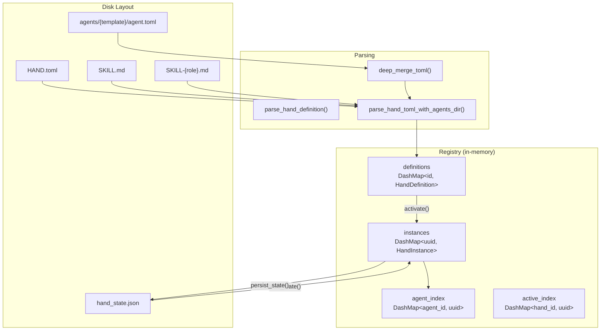
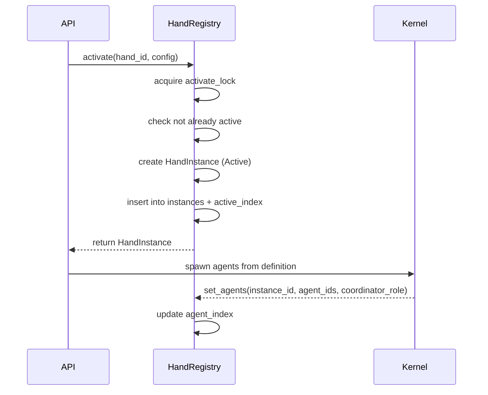

# Hands & Orchestration

# Hands & Orchestration

A **Hand** is a pre-built, domain-complete autonomous agent configuration that users activate from a marketplace. Unlike regular agents (which you chat with interactively), Hands work autonomously in the background — you check in on them.

This module (`librefang-hands`) defines the type system for Hand definitions, parses `HAND.toml` configuration files, and provides the `HandRegistry` that manages definitions and runtime instances.

## Architecture Overview



## Core Concepts

### Hand vs Agent

| Aspect | Agent | Hand |
|--------|-------|------|
| Interaction | You chat with it | It works for you |
| Lifecycle | Manual creation | Marketplace activation |
| Configuration | Per-session | Declared in `HAND.toml` |
| Autonomy | User-driven loops | Pre-configured iterations |
| Multi-agent | Single entity | Can coordinate multiple agents |

### Single-Agent vs Multi-Agent

A Hand supports two agent declaration formats in `HAND.tomL`:

**Single-agent** (`[agent]` section) — auto-wrapped as `{"main": ...}` with `coordinator = true`:

```toml
[agent]
name = "clip-agent"
system_prompt = "You edit video clips."

[agent.model]
provider = "anthropic"
model = "some-anthropic-model"
```

**Multi-agent** (`[agents.{role}]` sections) — each role gets its own agent manifest:

```toml
[agents.planner]
coordinator = true
name = "planner-agent"
system_prompt = "You plan research tasks."

[agents.analyst]
name = "analyst-agent"
system_prompt = "You analyze data."
```

The **coordinator** is the agent that receives user messages. It's either the agent with `coordinator = true`, or the first agent by role name (BTreeMap order).

### Base Template Inheritance

Multi-agent entries can reference a shared agent template via `base`, then override specific fields:

```toml
[agents.writer]
base = "generic-chat"      # loads agents/generic-chat/agent.toml
name = "custom-writer"     # overrides the base name

[agents.writer.model]
system_prompt = "You write blog posts."  # overrides base prompt
# provider, model, max_tokens inherited from base
```

Resolution happens in `parse_multi_agent_entry()`: the base template is loaded, normalized from flat to nested format if needed, then the hand's overrides are deep-merged on top. Path traversal is prevented by rejecting template names containing `..`, `/`, or `\`.

## Key Types

### `HandDefinition`

The complete parsed representation of a `HAND.toml`. Key fields:

- **`id`** / **`version`** / **`name`** / **`description`** — identity
- **`category`** (`HandCategory`) — Content, Security, Productivity, Development, Communication, Data, Finance, Other
- **`agents`** (`BTreeMap<String, HandAgentManifest>`) — agent manifests keyed by role
- **`requires`** (`Vec<HandRequirement>`) — prerequisites checked before activation
- **`settings`** (`Vec<HandSetting>`) — user-configurable options shown in the activation modal
- **`tools`** / **`skills`** / **`mcp_servers`** / **`allowed_plugins`** — capability allowlists
- **`dashboard`** (`HandDashboard`) — metrics schema for the monitoring UI
- **`routing`** (`HandRouting`) — keywords for deterministic hand selection
- **`metadata`** (`HandMetadata`) — frequency, token consumption, activation warnings
- **`i18n`** (`HashMap<String, HandI18n>`) — localized strings keyed by language code
- **`skill_content`** / **`agent_skill_content`** — bundled markdown populated at load time, not from TOML

### `HandInstance`

A running instance linking a `HandDefinition` to its spawned agents:

- **`instance_id`** (`Uuid`) — unique instance identifier
- **`hand_id`** — which definition this is an instance of
- **`status`** (`HandStatus`) — Active, Paused, Error(String), Inactive
- **`agent_ids`** (`BTreeMap<String, AgentId>`) — role → spawned agent mapping
- **`coordinator_role`** — explicitly persisted role name for routing
- **`config`** — user-provided configuration overrides
- **`agent_runtime_overrides`** — per-role model/provider overrides from the dashboard
- **`activated_at`** / **`updated_at`** — timestamps

### `HandRequirement`

Declares a prerequisite the user must satisfy:

| `requirement_type` | `check_value` | Check logic |
|--------------------|---------------|-------------|
| `Binary` | Binary name on PATH | `which_binary()` lookup; special handling for `python3` (runs `--version`) and `chromium` (tries multiple binary names) |
| `EnvVar` | Environment variable name | Must be set and non-empty |
| `ApiKey` | Environment variable name | Same as EnvVar (semantic distinction) |
| `AnyEnvVar` | Comma-separated env var names | At least one must be set |

Each requirement can be **optional** (`optional: true`) — optional unmet requirements don't block activation but report the hand as "degraded."

### `HandSetting` and `resolve_settings()`

Settings are configurable options presented during activation. Three types:

- **Select** — dropdown with options; each option can declare a `provider_env` (API key env var) or `binary` for availability badges
- **Toggle** — boolean switch
- **Text** — free text; can declare an `env_var` to expose to the agent's subprocess

`resolve_settings()` takes the schema and user config, producing:
- `prompt_block` — markdown appended to the system prompt summarizing the user's choices
- `env_vars` — env var names the agent subprocess should have access to

## HAND.tomL Format

### Full Schema

```toml
id = "clip"
version = "1.2.0"
name = "Clip Editor"
description = "Autonomous video clip creation"
category = "content"
icon = "🎬"
tools = ["shell_exec", "file_read"]
skills = ["video_processing"]
mcp_servers = []
allowed_plugins = []

[routing]
aliases = ["video editor", "clip maker"]
weak_aliases = ["cut video", "trim"]

[metadata]
frequency = "periodic"
token_consumption = "medium"
default_active = false
activation_warning = "Uses GPU-accelerated encoding"

[[requires]]
key = "ffmpeg"
label = "FFmpeg"
requirement_type = "binary"
check_value = "ffmpeg"
description = "Core video processing engine"

[requires.install]
macos = "brew install ffmpeg"
linux_apt = "sudo apt install ffmpeg"
manual_url = "https://ffmpeg.org/download.html"
estimated_time = "2-5 min"

[[settings]]
key = "output_format"
label = "Output Format"
setting_type = "select"
default = "mp4"

[[settings.options]]
value = "mp4"
label = "MP4"

[[settings.options]]
value = "webm"
label = "WebM"

[[dashboard.metrics]]
label = "Clips created"
memory_key = "clips_count"
format = "number"

[agents.planner]
coordinator = true
base = "generic-chat"
invoke_hint = "Use for task decomposition"
name = "clip-planner"

[agents.planner.model]
system_prompt = "You plan clip editing tasks."

[agents.encoder]
name = "clip-encoder"

[agents.encoder.model]
provider = "groq"
model = "llama-3.3-70b-versatile"
system_prompt = "You handle encoding."

# Localization
[i18n.zh]
name = "视频剪辑"
description = "自主视频剪辑"

[i18n.zh.agents.planner]
name = "剪辑规划器"

[i18n.zh.settings.output_format]
label = "输出格式"
```

### Legacy Format Compatibility

Older `HAND.toml` files may use flat model fields directly under `[agent]` instead of a nested `[agent.model]` table:

```toml
[agent]
name = "legacy-agent"
provider = "anthropic"      # flat
model = "some-model"        # flat
system_prompt = "..."       # flat
```

`parse_single_agent_section()` detects the format by checking for a `model` sub-table. If absent, it parses via `LegacyHandAgentConfig` and converts to `AgentManifest`. The same fallback applies to each entry in `[agents.*]` via `parse_multi_agent_entry()`.

When `base` template resolution is involved, `normalize_flat_to_nested()` converts the base template's flat fields into a `[model]` sub-table before merging, so the deep-merge overlay works correctly.

### Wrapped `[hand]` Format

`HAND.toml` can optionally wrap everything under a `[hand]` section. `parse_hand_toml_with_agents_dir()` tries flat parsing first, then falls back to extracting and re-serializing the `[hand]` sub-table.

## HandRegistry

The central in-memory store, thread-safe via `DashMap` for lock-free concurrent reads and `Mutex` for serialized activation/persistence.

### Internal Indexes

| Index | Key | Value | Purpose |
|-------|-----|-------|---------|
| `definitions` | `hand_id` | `HandDefinition` | All known hand blueprints |
| `instances` | `instance_id` (Uuid) | `HandInstance` | Active/paused/error instances |
| `agent_index` | `agent_id` (string) | `instance_id` (Uuid) | O(1) reverse lookup: which hand does this agent belong to? |
| `active_index` | `hand_id` | `instance_id` (Uuid) | O(1) check: is this hand currently active? |

### Disk Scanning

`scan_hands_dir()` searches two locations under `home_dir`:

1. **`registry/hands/`** — read-only, from the shared librefang-registry tarball
2. **`workspaces/`** — user-writable, where `install_from_content_persisted()` writes

Registry entries take precedence on id collision. Subdirectories without `HAND.toml` are silently skipped (filtering out non-hand workspace directories).

Per-agent skill files follow the pattern `SKILL-{role}.md` (e.g. `SKILL-pm.md`). Role names are lowercased during scan. When present for a role, `agent_skill_content` takes precedence over the shared `skill_content` from `SKILL.md`.

### Installation Methods

| Method | Use case | Base templates | Persisted to disk |
|--------|----------|---------------|-------------------|
| `install_from_path()` | Loading from scanned directories | ✅ Resolved | Already on disk |
| `install_from_content()` | API-based install, no persistence | ❌ Rejected | No |
| `install_from_content_persisted()` | API install with persistence | ✅ Resolved | Yes, to `workspaces/{id}/` |
| `reload_from_disk()` | Bulk loading on startup | ✅ Resolved | Already on disk |

`install_from_content()` explicitly rejects hands using `base` template references since it has no access to the agents registry directory.

### Activation Lifecycle



Key points:
- The `activate_lock` mutex prevents race conditions where two concurrent requests both pass the "already active" check
- When `instance_id` is provided (restart recovery), the duplicate-active check is bypassed
- Agent spawning is done by the kernel, not the registry — `set_agents()` is called after spawn completes

### Deactivation

`deactivate()` removes the instance and cleans up both reverse indexes. When multiple instances of the same `hand_id` exist (restart recovery edge case), `active_index` is re-pointed to another active instance if one exists.

### Persistence

State is persisted to `hand_state.json` using atomic writes (write to `.tmp`, `rename`, `fsync` parent directory on Unix).

**Format version history:**

| Version | Changes |
|---------|---------|
| v1 | Bare JSON array, single `agent_id` |
| v2 | `{version, instances}` wrapper, still single-agent |
| v3 | Multi-agent: `agent_ids` as `BTreeMap<role, AgentId>`, added `coordinator_role` |
| v4 | Added `activated_at` / `updated_at` timestamps |
| v5 | Added `agent_runtime_overrides` — per-role model/provider/temp overrides from dashboard |

`load_state_detailed()` tries typed deserialization first, then falls back to untyped legacy parsing (v1/v2). Legacy `config.__model_overrides__` blobs are migrated into `agent_runtime_overrides` via `legacy_agent_runtime_overrides()` without overwriting existing v5 entries.

Errored and inactive instances are skipped during load. Only Active and Paused instances are restored.

### Readiness Computation

`readiness()` cross-references requirement checks with activation state:

- **`requirements_met`** — all non-optional requirements satisfied
- **`active`** — at least one instance in Active status (O(1) via `active_index`)
- **`degraded`** — active but some requirement (optional or not) is unmet

## Settings Availability

`check_settings_availability()` enriches each Select option with an `available` boolean by checking its declared `provider_env` and/or `binary`. When a `lang` parameter is provided, labels and descriptions are pulled from the hand's `i18n` translations, falling back to the English originals.

## Internationalization

`HandI18n` provides optional localized overrides per language code:

- `name` / `description` — hand-level
- `agents.{role}.name` / `agents.{role}.description` — per-agent
- `settings.{key}.label` / `settings.{key}.description` — per-setting

All fields are optional; missing translations fall back to English defaults.

## Agent Runtime Overrides

`HandAgentRuntimeOverride` captures dashboard-edited model parameters per role:

```rust
pub struct HandAgentRuntimeOverride {
    pub model: Option<String>,
    pub provider: Option<String>,
    pub api_key_env: Option<Option<String>>,
    pub base_url: Option<Option<String>>,
    pub max_tokens: Option<u32>,
    pub temperature: Option<f32>,
    pub web_search_augmentation: Option<WebSearchAugmentationMode>,
}
```

The registry provides three mutation patterns:
- **`update_agent_runtime_override()`** — replaces the entire override for a role
- **`merge_agent_runtime_override()`** — layer-merges new fields over existing (new wins, `None` preserves old)
- **`clear_agent_runtime_override()`** — removes the override for a role (idempotent, returns the previous value)

These overrides are persisted in v5 state and survive daemon restarts.

## Error Handling

`HandError` covers all failure modes:

| Variant | Meaning |
|---------|---------|
| `NotFound(id)` | Hand definition not in registry |
| `AlreadyActive(id)` | Hand already has an active instance |
| `AlreadyRegistered(id)` | Duplicate definition during install |
| `BuiltinHand(id)` | Cannot uninstall a registry-managed hand |
| `InstanceNotFound(uuid)` | No instance with that UUID |
| `ActivationFailed(msg)` | Generic activation error |
| `TomlParse(msg)` | HAND.toml parsing failure |
| `Io(err)` | Filesystem error |
| `Config(msg)` | Configuration error |

## Integration Points

**Kernel** — calls `reload_from_disk()` on boot, `activate()`/`deactivate()` on user action, `set_agents()` after spawning, and `persist_state()` after mutations. Uses `find_by_agent()` to route incoming messages to the correct hand's coordinator agent.

**API layer** — exposes install/activate/deactivate/pause/resume endpoints, calls `check_requirements()` and `check_settings_availability()` for the activation modal, and `readiness()` for the marketplace listing.

**Router** (`librefang-kernel-router`) — calls `parse_hand_toml_with_agents_dir()` directly when loading hand route candidates, using routing aliases for deterministic hand selection.