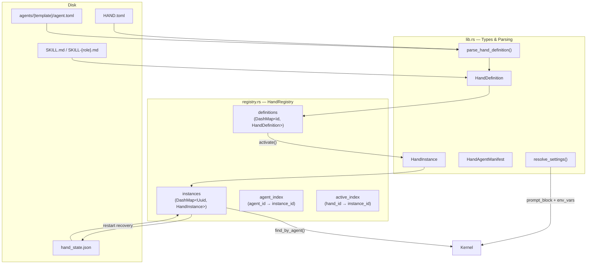
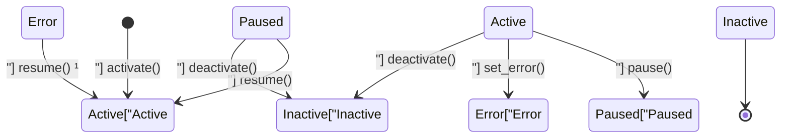

# Hands Orchestration

# Hands Orchestration

A Hand is a pre-built, domain-complete autonomous agent package that users activate from a marketplace. Unlike regular agents (which users chat with interactively), Hands run autonomously in the background — the user checks in on them rather than driving them turn-by-turn.

The module is split into two files:

- **`lib.rs`** — Core types (`HandDefinition`, `HandInstance`, `HandAgentManifest`, etc.), TOML parsing with legacy-format fallback, base template resolution, and settings resolution logic.
- **`registry.rs`** — `HandRegistry`, a concurrent-safe store for definitions and live instances, with disk persistence, requirement checking, and lifecycle management.

## Architecture


```mermaid
graph TD
    subgraph "Disk"
        HT["HAND.toml"]
        SK["SKILL.md / SKILL-{role}.md"]
        AT["agents/{template}/agent.toml"]
        PS["hand_state.json"]
    end

    subgraph "lib.rs — Types & Parsing"
        HD["HandDefinition"]
        HI["HandInstance"]
        HA["HandAgentManifest"]
        RS["resolve_settings()"]
        PHD["parse_hand_definition()"]
    end

    subgraph "registry.rs — HandRegistry"
        DEF["definitions<br/>(DashMap&lt;id, HandDefinition&gt;)"]
        INST["instances<br/>(DashMap&lt;Uuid, HandInstance&gt;)"]
        AIDX["agent_index<br/>(agent_id → instance_id)"]
        RIDX["active_index<br/>(hand_id → instance_id)"]
    end

    HT --> PHD --> HD
    AT --> PHD
    SK --> HD
    HD --> DEF
    INST --> PS
    PS -->|"restart recovery"| INST
    HI --> INST
    RS -->|"prompt_block + env_vars"| Kernel
    DEF -->|"activate()"| HI
    INST -->|"find_by_agent()"| Kernel
```

## Core Types

### `HandDefinition`

The static blueprint for a Hand, parsed from `HAND.toml`. Key fields:

| Field | Purpose |
|---|---|
| `id` | Unique identifier (e.g. `"clip"`) |
| `version` | Semantic version, defaults to `"0.0.0"` |
| `agents` | `BTreeMap<String, HandAgentManifest>` — agent manifests keyed by role name |
| `requires` | Prerequisites (binaries, env vars, API keys) |
| `settings` | Configurable options shown in the activation modal |
| `tools` / `skills` / `mcp_servers` | Allowlists for spawned agents |
| `dashboard` | Metrics schema for the dashboard view |
| `routing` | Keywords for deterministic hand selection |
| `i18n` | Localized strings keyed by language code |
| `skill_content` | Bundled skill markdown (loaded at runtime, not in TOML) |
| `agent_skill_content` | Per-role skill overrides from `SKILL-{role}.md` files |

The `coordinator()` method returns the agent marked as coordinator (or the first agent by role name as fallback). The `agent()` method is a backward-compatible accessor that returns the coordinator's `AgentManifest`.

### `HandInstance`

A runtime instance of a Hand — links a `HandDefinition` to its spawned agents.

| Field | Purpose |
|---|---|
| `instance_id` | Unique UUID for this instance |
| `hand_id` | Which definition this is an instance of |
| `status` | `Active`, `Paused`, `Error(String)`, or `Inactive` |
| `agent_ids` | `BTreeMap<String, AgentId>` — spawned agents keyed by role |
| `coordinator_role` | Which role receives user messages |
| `config` | User-provided setting overrides |
| `agent_runtime_overrides` | Per-role model/provider overrides from the dashboard |

### `HandAgentManifest`

Wraps an `AgentManifest` with hand-specific fields:

- `coordinator: bool` — whether this agent receives user messages
- `invoke_hint: Option<String>` — hint for other agents on when to invoke it
- `base: Option<String>` — reference to an agent template from the `agents/` registry

### `HandStatus`

```rust
pub enum HandStatus {
    Active,
    Paused,
    Error(String),
    Inactive,
}
```

### `HandAgentRuntimeOverride`

Captures dashboard-edited model, provider, max_tokens, temperature, and web_search_augmentation values on a per-role basis. These survive daemon restarts via the v5 persistence format.

## HAND.toml Format

Hands support two agent configuration formats:

### Single-Agent (`[agent]`)

```toml
id = "clip"
name = "Clip Maker"
description = "Autonomous video clipping"
category = "content"
icon = "🎬"
tools = ["shell_exec"]

[agent]
name = "clip-agent"
description = "Creates video clips"
system_prompt = "You create viral video clips."

[agent.model]
provider = "anthropic"
model = "claude-sonnet-4-20250514"
max_tokens = 4096
temperature = 0.7
```

Single-agent hands are internally stored as `{"main": HandAgentManifest { coordinator: true, ... }}`.

### Multi-Agent (`[agents.role]`)

```toml
id = "research"
name = "Research Hand"
description = "Multi-agent research pipeline"
category = "content"

[agents.planner]
coordinator = true
invoke_hint = "Use planner for task decomposition"
name = "planner-agent"
description = "Plans research tasks"
system_prompt = "You plan research."

[agents.planner.model]
provider = "anthropic"
model = "some-anthropic-model"

[agents.analyst]
name = "analyst-agent"
description = "Analyzes data"
system_prompt = "You analyze data."

[agents.analyst.model]
provider = "groq"
model = "llama-3.3-70b-versatile"
temperature = 0.3
```

The `is_multi_agent()` method returns `true` when `agents.len() > 1`.

### Wrapped Format

HAND.toml files may also use a `[hand]` wrapper section:

```toml
[hand]
id = "clip"
name = "Clip Maker"
# ... all fields under [hand]
```

The parser tries flat format first, then falls back to wrapped format.

## Legacy Format Compatibility

Older HAND.toml files use flat agent fields at the top level of `[agent]` instead of a nested `[agent.model]` table:

```toml
[agent]
name = "old-style"
provider = "anthropic"      # ← flat: should be under [agent.model]
model = "claude-3"
system_prompt = "..."
max_tokens = 4096
temperature = 0.7
```

`parse_single_agent_section()` detects whether a `model` sub-table exists and routes to either `AgentManifest::deserialize()` (nested) or `LegacyHandAgentConfig::deserialize()` (flat). The `normalize_flat_to_nested()` function performs the same conversion for base templates before deep-merging.

## Base Template Resolution

Agents in multi-agent hands can reference a shared template via `base`, then override only what differs:

```toml
[agents.writer]
coordinator = true
base = "my-writer"          # loads agents/my-writer/agent.toml

[agents.writer.model]
system_prompt = "You are a blog post writer."  # overrides base
```

The resolution flow:

1. `parse_multi_agent_entry()` reads the `base` field and validates it contains no path separators (preventing traversal attacks).
2. Loads `{agents_dir}/{base}/agent.toml` and parses it as a `toml::Value`.
3. Calls `normalize_flat_to_nested()` to ensure the base is in nested format.
4. Strips hand-only fields (`coordinator`, `invoke_hint`, `base`) from the overlay.
5. Calls `deep_merge_toml()` — overlay fields win over base fields; tables merge recursively; scalars and arrays in overlay replace base.
6. Parses the merged result via `parse_single_agent_section()`.

Template resolution requires filesystem access, so it goes through `parse_hand_definition()` (which accepts `agents_dir: Option<&Path>`) rather than the `Deserialize` impl.

## The Registry (`HandRegistry`)

A concurrent-safe store using `DashMap` for lock-free reads:

| Field | Type | Purpose |
|---|---|---|
| `definitions` | `DashMap<String, HandDefinition>` | All known hand blueprints |
| `instances` | `DashMap<Uuid, HandInstance>` | Active/paused/error instances |
| `agent_index` | `DashMap<String, Uuid>` | Reverse lookup: `agent_id → instance_id` |
| `active_index` | `DashMap<String, Uuid>` | Reverse lookup: `hand_id → instance_id` |
| `activate_lock` | `Mutex<()>` | Serializes check-then-insert to prevent duplicate activations |
| `persist_lock` | `Mutex<()>` | Serializes writes to `hand_state.json` |

### Hand Discovery

`reload_from_disk()` scans two directories for subdirectories containing `HAND.toml`:

1. `{home_dir}/registry/hands/` — read-only, synced from the shared registry tarball
2. `{home_dir}/workspaces/` — user-writable, where `install_from_content_persisted()` writes

Registry entries take precedence on id collisions (scanned first). Per-agent skill files matching `SKILL-{role}.md` are loaded alongside the shared `SKILL.md`.

### Install Methods

| Method | Use Case | Base Templates |
|---|---|---|
| `install_from_path()` | Load from a local directory | ✅ Resolved via `home_dir/registry/agents/` |
| `install_from_content()` | API-based install from raw TOML | ❌ Rejected — no filesystem access |
| `install_from_content_persisted()` | API install + persist to `workspaces/` | ✅ Resolved via `home_dir/registry/agents/` |

### Uninstall

`uninstall_hand()` removes a user-installed hand (living under `workspaces/`). Built-in hands (under `registry/hands/`) are refused — they'd be recreated on the next registry sync. Active instances must be deactivated first.

## Lifecycle


```mermaid
stateDiagram-v2
    [*] --> Active["Active:"] activate()
    Active --> Paused["Paused:"] pause()
    Paused --> Active["Active:"] resume()
    Active --> Error["Error:"] set_error()
    Error --> Active["Active:"] resume() ¹
    Active --> Inactive["Inactive:"] deactivate()
    Paused --> Inactive["Inactive:"] deactivate()
    Inactive --> [*]
```

¹ Error-to-Active requires kernel-level reactivation; `resume()` sets status to Active.

Key methods:

- **`activate(hand_id, config)`** — Creates a `HandInstance`, rejects if the hand is already active. The kernel then spawns agents and calls `set_agents()`.
- **`activate_with_id(...)`** — Restores a persisted instance with a specific UUID and optional preserved timestamps.
- **`deactivate(instance_id)`** — Removes the instance and cleans up reverse indexes.
- **`pause(instance_id)` / `resume(instance_id)`** — Status transitions that update `active_index`.
- **`set_agents(instance_id, agent_ids, coordinator_role)`** — Called by the kernel after spawning. Populates `agent_ids`, updates `agent_index`.
- **`set_error(instance_id, message)`** — Marks an instance as errored.

### Coordinator Role Resolution

`HandInstance::normalize_coordinator_role()` determines which agent receives user messages:

1. If `coordinator_role` is explicitly set and the role exists in `agent_ids`, use it.
2. If only one agent, use it.
3. If `"main"` exists, use it.
4. Fall back to the first entry by BTreeMap order.

## State Persistence

Hand state is persisted to `hand_state.json` so it survives daemon restarts. The current format is **v5**.

### Version History

| Version | Changes |
|---|---|
| v1 | Bare JSON array of instances, single `agent_id` |
| v2 | `{ version, instances }` wrapper, still single-agent |
| v3 | Multi-agent: `agent_ids: BTreeMap<role, AgentId>`, `coordinator_role` |
| v4 | Adds `activated_at` / `updated_at` timestamps |
| v5 | Adds `agent_runtime_overrides` for dashboard-edited model config |

### Backward Compatibility

- All new fields use `#[serde(default)]` and `skip_serializing_if`, so a v5 daemon can load v1–v4 state files.
- A v4 daemon loading a v5 file silently drops `agent_runtime_overrides` (it serializes with `skip_serializing_if = "BTreeMap::is_empty"`).
- Legacy `config.__model_overrides__` blobs are migrated into `agent_runtime_overrides` via `legacy_agent_runtime_overrides()`.

### Atomic Writes

`atomic_write_json()` writes to a temp file, syncs to disk, renames over the target, then fsyncs the parent directory (unix-only) for crash safety.

### Load Behavior

`load_state()` restores Active and Paused instances. Error and Inactive instances are skipped with an info log. The returned `HandStateEntry` objects include `old_agent_ids` and `instance_id` so the kernel can reassign cron jobs and regenerate deterministic agent IDs.

## Requirements Checking

`check_requirements()` evaluates each `HandRequirement` against the runtime environment:

| `RequirementType` | Check logic |
|---|---|
| `Binary` | `which_binary()` on PATH. Special cases: `python3` runs the binary and checks version output; `chromium` tries multiple binary names and platform paths. |
| `EnvVar` / `ApiKey` | `std::env::var()` is set and non-empty |
| `AnyEnvVar` | Comma-separated list; any one being set passes |

Optional requirements (`optional: true`) don't block activation but contribute to the `degraded` flag in `readiness()`.

### `HandReadiness`

Combines requirement checks with activation state:

- `requirements_met` — all non-optional requirements satisfied
- `active` — at least one Active instance exists
- `degraded` — active but some requirements (optional or not) are unmet

## Settings Resolution

`resolve_settings()` takes a hand's settings schema and user config, producing:

- **`prompt_block`** — Markdown summary appended to the system prompt (e.g. `## User Configuration\n- STT: Groq (groq)`)
- **`env_vars`** — Env var names the agent's subprocess should have access to (e.g. `["GROQ_API_KEY"]`)

For Select-type settings, the matched option's `provider_env` is collected. For Text-type settings with an `env_var` field, that env var is collected. Toggles produce human-readable Enabled/Disabled labels.

### Settings Availability

`check_settings_availability()` returns per-option availability status (checking `provider_env` and `binary` fields) and applies i18n label/description overrides based on the requested language.

## Internationalization

Hands declare localized strings under `[i18n.{lang}]`:

```toml
[i18n.zh]
name = "线索生成"
description = "自主线索生成"

[i18n.zh.agents.main]
name = "主协调器"

[i18n.zh.settings.target_industry]
label = "目标行业"
```

All i18n fields are optional — hands work without any `[i18n.*]` section. Missing translations fall back to English defaults.

## Error Handling

```rust
pub enum HandError {
    NotFound(String),           // Hand definition not found
    AlreadyActive(String),      // Hand already has an active instance
    AlreadyRegistered(String),  // Duplicate hand ID on install
    BuiltinHand(String),        // Cannot uninstall built-in hand
    InstanceNotFound(Uuid),     // Instance ID doesn't exist
    ActivationFailed(String),   // Instance creation failed
    TomlParse(String),          // HAND.toml parse error
    Io(std::io::Error),         // Filesystem error
    Config(String),             // Configuration error
}
```

## Kernel Integration Points

The kernel interacts with this module through several pathways:

1. **Startup** — `reload_from_disk()` discovers hands; `load_state()` restores persisted instances; the kernel re-spawns agents using `HandStateEntry.old_agent_ids`.
2. **Activation** — Kernel calls `activate()`, spawns agents per the `HandDefinition.agents` manifests, then calls `set_agents()` with the resulting `AgentId`s.
3. **Settings** — `apply_settings_block_to_manifest()` (kernel) calls `resolve_settings()` to build the prompt block and env vars for agent configuration.
4. **Multi-agent dispatch** — `apply_team_block_to_manifest()` (kernel) checks `is_multi_agent()` to configure inter-agent routing.
5. **Agent lookup** — `resolve_hand_agent()` and `hand_instance_status()` (HTTP routes) use `HandInstance::agent_id()` and `find_by_agent()` for request routing.
6. **Runtime overrides** — The dashboard edits model/provider per agent role via `update_agent_runtime_override()` / `merge_agent_runtime_override()` / `clear_agent_runtime_override()`. These are persisted in v5 state and applied when the kernel rebuilds agent manifests on restart.