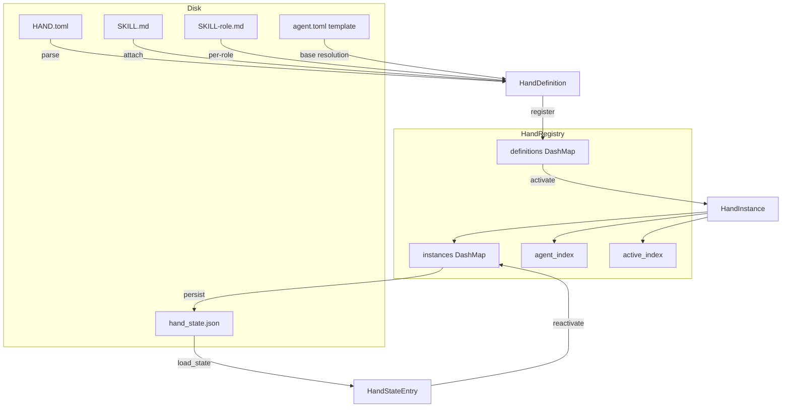

# Hands System

# Hands System

## Overview

A **Hand** is a pre-built, domain-complete autonomous agent package. Unlike regular agents where users converse directly, Hands work independently — users activate them and check in on progress. Each Hand is defined by a `HAND.toml` file and optionally a `SKILL.md` that provides domain knowledge to the spawned agents.

The module provides:
- Type definitions for Hand manifests, settings, requirements, and runtime state
- A `HandRegistry` that manages definitions and tracks active instances
- TOML parsing with support for legacy formats, multi-agent configurations, and template inheritance
- Requirement checking (binaries on PATH, environment variables, API keys)
- Settings resolution that translates user choices into system prompt blocks and env var lists

## Architecture



## Core Types

### HandDefinition

The parsed representation of a `HAND.toml` file. Contains everything needed to describe a Hand to the marketplace and configure its agents at activation time.

Key fields:
- `id`, `version`, `name`, `description`, `category`, `icon` — marketplace metadata
- `agents: BTreeMap<String, HandAgentManifest>` — agent manifests keyed by role name. Single-agent hands use `"main"` as the key
- `tools`, `skills`, `mcp_servers`, `allowed_plugins` — capability allowlists for spawned agents
- `requires: Vec<HandRequirement>` — prerequisites checked before activation
- `settings: Vec<HandSetting>` — user-configurable options shown in the activation modal
- `dashboard: HandDashboard` — metrics schema for the Hand's status view
- `routing: HandRouting` — keyword aliases for deterministic hand selection
- `skill_content: Option<String>` — shared skill markdown (from `SKILL.md`)
- `agent_skill_content: HashMap<String, String>` — per-role skill overrides (from `SKILL-{role}.md`)
- `i18n: HashMap<String, HandI18n>` — localized strings keyed by language code

The `coordinator()` method returns the agent that receives user messages — either the one explicitly marked `coordinator = true`, or the first agent sorted by role name.

### HandInstance

A running Hand — links a `HandDefinition` to its spawned agents. Created by `HandRegistry::activate()` and populated with agent IDs by the kernel after spawning.

Key fields:
- `instance_id: Uuid` — unique instance identifier
- `hand_id: String` — which definition this is an instance of
- `status: HandStatus` — `Active`, `Paused`, `Error(String)`, or `Inactive`
- `agent_ids: BTreeMap<String, AgentId>` — role name to agent ID mapping
- `coordinator_role: Option<String>` — which role receives user messages
- `config: HashMap<String, serde_json::Value>` — user's configuration choices
- `activated_at`, `updated_at` — timestamps

The `coordinator_agent_id()` method resolves the agent ID for the coordinator role, using `normalize_coordinator_role()` which falls back through: explicit role → single agent → role named "main" → first agent alphabetically.

### HandAgentManifest

Wraps an `AgentManifest` with hand-specific fields for multi-agent configurations:

- `coordinator: bool` — whether this agent receives user messages
- `invoke_hint: Option<String>` — hint for other agents on when to dispatch to this one
- `base: Option<String>` — reference to an agent template from the agents registry

### HandStatus

```rust
pub enum HandStatus {
    Active,
    Paused,
    Error(String),
    Inactive,
}
```

### HandCategory

```rust
pub enum HandCategory {
    Content, Security, Productivity, Development,
    Communication, Data, Finance, Other,
}
```

Deserialized from lowercase strings; unknown values map to `Other`.

## HAND.toml Format

Hands support two agent configuration formats:

### Single-Agent Format

```toml
id = "clip"
name = "Clip Hand"
description = "Autonomous video clipping"
category = "content"
icon = "🎬"
tools = ["shell_exec"]

[[requires]]
key = "ffmpeg"
label = "FFmpeg"
requirement_type = "binary"
check_value = "ffmpeg"

[requires.install]
macos = "brew install ffmpeg"
linux_apt = "sudo apt install ffmpeg"

[agent]
name = "clip-agent"
description = "Creates video clips"
system_prompt = "You are a video clipping assistant."

[dashboard]
metrics = []
```

Single-agent `[agent]` sections are auto-converted to `{"main": HandAgentManifest { coordinator: true, ... }}`.

### Multi-Agent Format

```toml
id = "research"
name = "Research Hand"
description = "Multi-agent research pipeline"
category = "content"
tools = []

[agents.planner]
coordinator = true
invoke_hint = "Use for task decomposition"
name = "planner-agent"
description = "Plans research tasks"
system_prompt = "You plan research."

[agents.analyst]
name = "analyst-agent"
description = "Analyzes data"
provider = "groq"
model = "llama-3.3-70b-versatile"
system_prompt = "You analyze data."
```

Each entry under `[agents.*]` becomes a separate role in the `agents` BTreeMap. The coordinator role is explicitly marked; otherwise the first role alphabetically is used.

### Agent Model Configuration

Agent sections support two formats:

**Nested** (new format, with `[agents.role.model]` sub-table):
```toml
[agents.planner]
name = "planner-agent"

[agents.planner.model]
provider = "anthropic"
model = "claude-sonnet-4-20250514"
max_tokens = 8192
temperature = 0.5
system_prompt = "You plan research."
```

**Flat** (legacy format, model fields at agent top level):
```toml
[agents.planner]
name = "planner-agent"
provider = "anthropic"
model = "claude-sonnet-4-20250514"
max_tokens = 8192
system_prompt = "You plan research."
```

Flat format is auto-detected and converted via `normalize_flat_to_nested()` before parsing. The heuristic: if `[agent]` contains a `model` sub-table, parse as nested; otherwise parse as flat.

### Base Template Inheritance

Agents can reference shared templates from the agents registry to avoid duplicating configuration:

```toml
[agents.writer]
coordinator = true
base = "my-writer"       # loads agents/my-writer/agent.toml as base

[agents.writer.model]
system_prompt = "You are a blog post writer."  # overrides base
```

Resolution uses deep merge via `deep_merge_toml()` — tables are merged recursively, scalars and arrays from the overlay (hand) replace the base. The hand's fields always win.

**Constraints:**
- Base templates require `agents_dir` to be provided (filesystem access)
- Single-agent `[agent]` sections cannot use `base` — must use `[agents.main]` format instead
- Template names are validated against path traversal (no `..`, `/`, or `\`)
- `install_from_content()` rejects hands that use `base` references since it has no filesystem access

### Wrapped Format

Hands can also use a `[hand]` wrapper section:

```toml
[hand]
id = "clip"
name = "Clip Hand"
# ... all fields under [hand] instead of top level
```

`parse_hand_toml()` tries flat format first, then falls back to wrapped format.

### Provider Defaults

When `provider` or `model` is omitted, the sentinel value `"default"` is used. This is resolved at kernel driver-build time to the user's configured `default_model.provider`, allowing hands to respect global defaults rather than being pinned to whatever the hand author specified.

## Settings System

Hands declare configurable settings that appear in the activation modal:

```toml
[[settings]]
key = "stt_provider"
label = "STT Provider"
description = "Speech-to-text engine"
setting_type = "select"
default = "auto"

[[settings.options]]
value = "auto"
label = "Auto-detect"

[[settings.options]]
value = "groq"
label = "Groq Whisper"
provider_env = "GROQ_API_KEY"   # env var to check for "Ready" badge

[[settings.options]]
value = "local"
label = "Local Whisper"
binary = "whisper"              # binary to check on PATH for "Ready" badge
```

Three setting types are supported: `select`, `toggle`, and `text`.

### resolve_settings()

Resolves user choices against the settings schema. For each setting:

1. Looks up the user's value in the config map, falling back to `setting.default`
2. For **Select**: finds the matching option, collects its `provider_env` if present, formats as `"Label: Display (value)"`
3. For **Toggle**: formats as `"Label: Enabled"` or `"Label: Disabled"`
4. For **Text**: formats as `"Label: value"`, collects `setting.env_var` if non-empty

Returns a `ResolvedSettings` with:
- `prompt_block: String` — markdown block to append to the system prompt (`## User Configuration\n...`)
- `env_vars: Vec<String>` — env var names the agent's subprocess should have access to

### check_settings_availability()

For each option in a select-type setting, checks whether its prerequisites are met:
- `provider_env` → checks if the env var (or any alias, e.g. `GEMINI_API_KEY` also accepts `GOOGLE_API_KEY`) is set and non-empty
- `binary` → checks if the binary exists on PATH

Returns `SettingStatus` structs with per-option availability, suitable for API responses. Supports i18n by looking up translated labels/descriptions from the definition's `i18n` map.

## Requirements System

Hands declare prerequisites that must be satisfied before activation:

```toml
[[requires]]
key = "ffmpeg"
label = "FFmpeg must be installed"
requirement_type = "binary"
check_value = "ffmpeg"
description = "Core video processing engine."
optional = false

[requires.install]
macos = "brew install ffmpeg"
windows = "winget install Gyan.FFmpeg"
linux_apt = "sudo apt install ffmpeg"
linux_dnf = "sudo dnf install ffmpeg-free"
linux_pacman = "sudo pacman -S ffmpeg"
manual_url = "https://ffmpeg.org/download.html"
estimated_time = "2-5 min"
steps = ["Download from ffmpeg.org", "Add to PATH"]
```

### Requirement Types

| Type | Checks | Example |
|------|--------|---------|
| `Binary` | Binary exists on PATH and is executable | `ffmpeg`, `chromium` |
| `EnvVar` | Environment variable is set and non-empty | `DISPLAY` |
| `ApiKey` | Same as EnvVar (semantic distinction) | `OPENAI_API_KEY` |
| `AnyEnvVar` | Any of comma-separated env vars is set | `GEMINI_API_KEY,GOOGLE_API_KEY` |

### Special Cases

**python3**: Runs `python3 --version` (or `python --version`) and checks for "Python 3" in the output. This avoids false positives from Windows Store shims and Python 2 installations. Result is cached via `OnceLock` for the process lifetime.

**chromium**: Checks multiple binary names across platforms: `chromium`, `chromium-browser`, `google-chrome`, `google-chrome-stable`, `chrome`. Also accepts `CHROME_PATH` env var.

### Optional Requirements

Requirements with `optional = true` do not block activation. When an active hand has unmet optional requirements, it is reported as **degraded** via the `readiness()` method rather than having `requirements_met = false`.

### Readiness

`HandRegistry::readiness()` returns a `HandReadiness` snapshot:

```rust
pub struct HandReadiness {
    pub requirements_met: bool,  // all non-optional requirements satisfied
    pub active: bool,            // has an Active-status instance
    pub degraded: bool,          // active but some requirements (incl. optional) unmet
}
```

## HandRegistry

The central runtime store for Hand definitions and instances. Uses lock-free `DashMap` collections with `Mutex` guards for compound operations.

### Internal Structure

- `definitions: DashMap<String, HandDefinition>` — all known hand definitions keyed by ID
- `instances: DashMap<Uuid, HandInstance>` — active/paused/error instances keyed by instance UUID
- `agent_index: DashMap<String, Uuid>` — reverse index: `AgentId.to_string()` → instance UUID for O(1) agent-to-hand lookup
- `active_index: DashMap<String, Uuid>` — reverse index: hand ID → instance UUID for O(1) "is hand active?" checks
- `activate_lock: Mutex<()>` — serializes check-then-insert to prevent concurrent activation races
- `persist_lock: Mutex<()>` — serializes state file writes

### Loading Hands

**`reload_from_disk(home_dir)`** — scans two directories:
1. `{home_dir}/registry/hands/` — read-only registry cache (reset on sync)
2. `{home_dir}/workspaces/` — user-installed hands (persists across restarts)

Registry entries take precedence on ID collision. For each directory containing a `HAND.toml`, parses the definition and attaches skill content from `SKILL.md` and `SKILL-{role}.md` files. Returns `(added, updated)` counts.

**`install_from_path(path, home_dir)`** — install from a specific directory, resolves base templates using `{home_dir}/registry/agents/`.

**`install_from_content(toml, skill)`** — install from raw strings (API-based). Rejects hands with `base` template references.

**`install_from_content_persisted(home_dir, toml, skill)`** — install and persist under `{home_dir}/workspaces/{id}/` so it survives restarts.

### Lifecycle Operations

**`activate(hand_id, config)`** — creates a `HandInstance` in `Active` status. The kernel later calls `set_agents()` after spawning. Uses `activate_lock` to serialize the duplicate check. Returns `HandError::AlreadyActive` if the hand already has a running instance (single-instance enforcement).

**`activate_with_id(hand_id, config, instance_id, timestamps)`** — variant for daemon restart recovery. Reuses the persisted UUID so deterministic agent IDs remain stable.

**`deactivate(instance_id)`** — removes the instance and cleans up reverse indexes. If other active instances of the same hand exist, re-points `active_index` to one of them.

**`pause(instance_id)` / `resume(instance_id)`** — transitions status via `set_status()`, which updates timestamps and the `active_index`.

**`set_error(instance_id, message)`** — marks an instance as errored.

**`set_agents(instance_id, agent_ids, coordinator_role)`** — called by the kernel after spawning agents. Populates `agent_ids`, normalizes the coordinator role, and updates `agent_index`. The backward-compatible `set_agent()` wraps this for single-agent hands.

**`uninstall_hand(home_dir, hand_id)`** — removes a user-installed hand. Refuses with:
- `NotFound` if not registered
- `BuiltinHand` if the hand lives under `registry/hands/` (would be recreated on next sync)
- `AlreadyActive` if any instance is still alive

### Lookups

- **`find_by_agent(agent_id)`** — O(1) via `agent_index`. Used by the kernel to route messages to the correct hand instance.
- **`get_definition(hand_id)`** / **`get_instance(instance_id)`** — direct lookups.
- **`list_definitions()`** — sorted by name.
- **`list_instances()`** — all instances regardless of status.

### Concurrency Safety

The registry is `Send + Sync`. DashMaps provide lock-free concurrent reads. The `activate_lock` mutex serializes the compound "check if already active → insert" sequence. The `persist_lock` mutex serializes state file writes. Both mutexes recover from poisoning (a panicked thread's lock is seized rather than panicking all subsequent users).

## Persistence

### State Format

Version 4 (`PERSIST_VERSION = 4`). Persisted as JSON with typed `PersistedState`:

```rust
struct PersistedState {
    version: u32,
    instances: Vec<PersistedInstance>,
}

struct PersistedInstance {
    hand_id: String,
    instance_id: Uuid,
    config: HashMap<String, serde_json::Value>,
    agent_ids: BTreeMap<String, AgentId>,
    coordinator_role: Option<String>,
    status: HandStatus,
    activated_at: Option<DateTime<Utc>>,
    updated_at: Option<DateTime<Utc>>,
}
```

**`persist_state(path)`** — writes Active, Paused, and Error instances (excludes Inactive). Called by the kernel after activation/deactivation/state changes.

**`load_state(path)`** — reads the state file and returns `Vec<HandStateEntry>`. Handles v4 (typed), v2/v1 (legacy untyped JSON), and v1 (bare array) formats. Skips Error and Inactive instances (they are informational only). The `old_agent_ids` field preserves pre-restart agent UUIDs for cron job reassignment.

## Localization (i18n)

Hands can declare translations under `[i18n.{lang}]`:

```toml
[i18n.zh]
name = "线索生成 Hand"
description = "自主线索生成"

[i18n.zh.agents.main]
name = "主协调器"

[i18n.zh.settings.target_industry]
label = "目标行业"
description = "聚焦的行业领域"
```

All fields are optional — untranslated elements fall back to English. The `check_settings_availability()` method accepts a `lang` parameter and returns translated labels when available.

## Routing

`HandRouting` provides keyword aliases for deterministic hand selection:

```toml
[routing]
aliases = ["video editor", "clip maker"]       # strong signals (score ×3)
weak_aliases = ["cut video", "trim"]            # supporting signals (score ×1)
```

Keywords are English-only. Cross-lingual matching is handled by semantic embedding fallback at the router level, not by translating keywords.

## Error Handling

```rust
pub enum HandError {
    NotFound(String),
    AlreadyActive(String),
    AlreadyRegistered(String),
    BuiltinHand(String),
    InstanceNotFound(Uuid),
    ActivationFailed(String),
    TomlParse(String),
    Io(std::io::Error),
    Config(String),
}
```

All registry operations return `HandResult<T>` (= `Result<T, HandError>`).

## Integration Points

| Consumer | Usage |
|----------|-------|
| **Kernel** (`librefang-kernel`) | Calls `activate`, `deactivate`, `set_agents`, `find_by_agent`. Spawns agents from `HandAgentManifest`. |
| **HTTP routes** (`src/routes/skills.rs`) | Calls `readiness`, `check_requirements` for `/api/hands/{id}` endpoints. |
| **Router** (`librefang-kernel-router`) | Calls `parse_hand_toml` to load routing candidates from hand definitions. |
| **TUI** (`src/tui/`) | Calls `list_definitions`, `list_instances`, `check_requirements` to render the hands dashboard. |
| **CLI** (`librefang-cli`) | References `default_provider` sentinel for model resolution. |