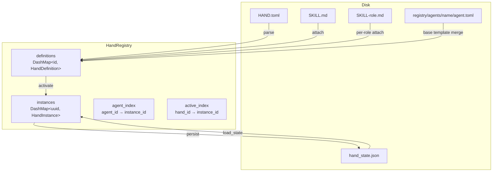
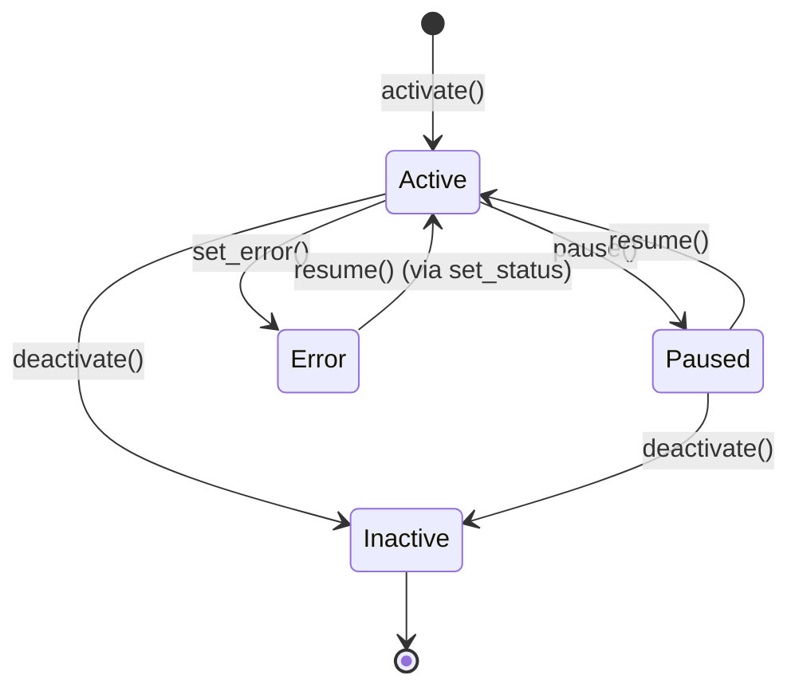

# Hands System

# LibreFang Hands — Autonomous Capability Packages

## Overview

A **Hand** is a curated, domain-complete agent configuration that users activate from a marketplace. Unlike regular agents (which users chat with interactively), Hands work autonomously — users check in on them rather than driving the conversation.

The Hands module provides:

- **Type definitions** for hand definitions, instances, requirements, settings, and localization (`lib.rs`)
- **A concurrent-safe registry** for managing definitions and tracking active instances (`registry.rs`)
- **TOML parsing** with support for both legacy flat format and modern nested format
- **Agent template resolution** so hands can inherit and override reusable agent configurations
- **Persistence** so active/paused hands survive daemon restarts

## Architecture



## Core Types

### HandDefinition

The parsed representation of a `HAND.toml` file. Contains everything needed to describe a hand to the marketplace and spawn its agents:

| Field | Purpose |
|---|---|
| `id` | Unique identifier (e.g. `"clip"`) |
| `version` | Semantic version, defaults to `"0.0.0"` |
| `name`, `description` | Human-readable metadata |
| `category` | Marketplace category (`Content`, `Security`, `Data`, etc.) |
| `agents` | `BTreeMap<String, HandAgentManifest>` — one or more agent configurations keyed by role name |
| `requires` | Prerequisites that must be met before activation |
| `settings` | Configurable options shown in the activation UI |
| `dashboard` | Metrics schema for the hand's dashboard |
| `routing` | Keywords for deterministic hand selection |
| `i18n` | Localized strings keyed by language code |
| `skill_content` | Bundled skill markdown (loaded at runtime, not from TOML) |

### HandInstance

A runtime record linking a `HandDefinition` to its spawned agents. Tracks:

- `instance_id` (`Uuid`) — unique per activation
- `hand_id` — which definition this is an instance of
- `status` — `Active`, `Paused`, `Error(String)`, or `Inactive`
- `agent_ids` — `BTreeMap<String, AgentId>` mapping role names to spawned agent IDs
- `coordinator_role` — which agent receives user messages
- `config` — user-provided setting overrides
- `activated_at`, `updated_at` — timestamps

### HandAgentManifest

Wraps an `AgentManifest` with hand-specific fields:

- `coordinator: bool` — whether this agent receives user messages
- `invoke_hint: Option<String>` — routing hint injected into the coordinator's system prompt
- `base: Option<String>` — optional template reference for inheritance
- `manifest: AgentManifest` — the flattened agent configuration (`#[serde(flatten)]`)

## HAND.toml Format

Hands are defined in `HAND.toml` files. Two agent declaration formats are supported:

### Single-Agent (Legacy)

```toml
id = "clip"
name = "Clip Hand"
description = "Autonomous video clipping"
category = "content"
icon = "🎬"
tools = ["shell_exec"]

[agent]
name = "clip-agent"
description = "Clips videos"
system_prompt = "You are a video clipping assistant."

[dashboard]
metrics = []
```

The `[agent]` section is automatically converted to `agents: { "main": {...} }` with `coordinator = true`.

### Multi-Agent

```toml
id = "research"
name = "Research Hand"
description = "Multi-agent research pipeline"
category = "content"

[agents.planner]
coordinator = true
invoke_hint = "Use planner for task decomposition"
name = "planner-agent"
description = "Plans research tasks"

[agents.planner.model]
provider = "anthropic"
model = "claude-sonnet-4-20250514"
system_prompt = "You plan research."

[agents.analyst]
name = "analyst-agent"
description = "Analyzes data"

[agents.analyst.model]
provider = "groq"
model = "llama-3.3-70b-versatile"
system_prompt = "You analyze data."
```

### Agent Model Formats

Agent sections accept two formats:

**Nested** (preferred) — model fields under `[agents.role.model]`:
```toml
[agents.writer.model]
provider = "anthropic"
model = "claude-sonnet-4-20250514"
max_tokens = 8192
temperature = 0.5
system_prompt = "..."
```

**Flat** (legacy) — model fields inline:
```toml
[agents.writer]
name = "writer"
provider = "groq"
model = "llama-3.3-70b-versatile"
system_prompt = "..."
```

Flat format is auto-detected and converted via `LegacyHandAgentConfig`. The heuristic checks whether the section contains a `model` sub-table.

### Default Provider Sentinel

When `provider` or `model` is omitted, the value defaults to `"default"` — a sentinel resolved at kernel driver-build time to the user's configured global default. This prevents hands from pinning users to a specific provider.

## Agent Template Inheritance

Hands can reference reusable agent templates from the agents registry via the `base` field:

```toml
[agents.writer]
coordinator = true
base = "my-writer"              # loads registry/agents/my-writer/agent.toml

[agents.writer.model]
system_prompt = "Custom prompt" # overrides just this field
```

### Resolution Flow

1. `parse_multi_agent_entry` extracts `base`, `coordinator`, `invoke_hint` from the TOML entry
2. The base template is loaded from `{agents_dir}/{template_name}/agent.toml`
3. `normalize_flat_to_nested` ensures the base template is in nested format
4. `deep_merge_toml` recursively merges the hand's overlay onto the base (overlay wins)
5. The merged result is parsed into `AgentManifest`

Template names are validated to prevent path traversal — they must not contain `..`, `/`, or `\`.

**Only `[agents.*]` format supports `base`**. Using `base` in a single `[agent]` section returns an error.

## HandRegistry

The central store for definitions and instances. Thread-safe via `DashMap` for concurrent reads and `Mutex` for serialized activation/deactivation.

### Construction

```rust
let registry = HandRegistry::new();
```

### Loading Definitions

Three install paths exist, each with different capabilities:

| Method | Disk Persistence | Base Templates | Use Case |
|---|---|---|---|
| `reload_from_disk` | Scans `registry/hands/` + `workspaces/` | ✅ | Daemon startup |
| `install_from_path` | No (in-memory only) | ✅ | Development/testing |
| `install_from_content` | No (in-memory only) | ❌ | API install without agents_dir |
| `install_from_content_persisted` | Writes to `workspaces/{id}/` | ✅ | Dashboard "install from content" |

`reload_from_disk` scans both `registry/hands/` (read-only, reset on sync) and `workspaces/` (user-writable, survives sync). Registry entries take precedence on id collision.

### Activation Lifecycle



**Activation** (`activate` / `activate_with_id`):
- Validates the definition exists
- Checks not already active (via `active_index`, serialized by `activate_lock` mutex)
- Creates `HandInstance` with `Active` status
- Agent spawning is done by the kernel after activation

**Deactivation** (`deactivate`):
- Removes the instance from `instances` map
- Cleans up `agent_index` and `active_index`
- If multiple instances of the same hand exist (restart recovery), re-inserts another active instance into `active_index`

### Reverse Indexes

Two `DashMap` indexes enable O(1) lookups:

- `agent_index`: `agent_id (String)` → `instance_id (Uuid)` — used by `find_by_agent` when routing messages
- `active_index`: `hand_id (String)` → `instance_id (Uuid)` — used to check if a hand is currently active

### Coordinator Resolution

`HandInstance::coordinator_role()` resolves which agent receives user messages:

1. If `coordinator_role` is set and the role exists in `agent_ids` → use it
2. If only one agent → use it
3. If `agent_ids` contains `"main"` → use it
4. Fallback: first entry by `BTreeMap` sort order

## Settings System

Hands declare configurable settings in `[[settings]]` arrays. Three setting types are supported:

### Select

```toml
[[settings]]
key = "stt_provider"
label = "STT Provider"
setting_type = "select"
default = "auto"

[[settings.options]]
value = "groq"
label = "Groq Whisper"
provider_env = "GROQ_API_KEY"    # env var checked for "Ready" badge
```

### Toggle

```toml
[[settings]]
key = "tts_enabled"
label = "TTS"
setting_type = "toggle"
default = "false"
```

### Text

```toml
[[settings]]
key = "api_key"
label = "API Key"
setting_type = "text"
env_var = "CUSTOM_API_KEY"       # exposed to agent subprocess
```

### Resolution

`resolve_settings` maps user config against the schema:

1. For each setting, looks up the user's choice (falls back to `default`)
2. `Select` — finds the matching option, collects its `provider_env`, builds a label line
3. `Toggle` — renders "Enabled" / "Disabled"
4. `Text` — includes value if non-empty, collects `env_var` if set

Returns `ResolvedSettings` with:
- `prompt_block: String` — markdown appended to the system prompt
- `env_vars: Vec<String>` — env var names the agent subprocess needs

### Availability Checking

`check_settings_availability` cross-references each option's `provider_env` and `binary` against the runtime environment. Supports aliases (e.g., `GEMINI_API_KEY` also accepts `GOOGLE_API_KEY` via `env_aliases`).

## Requirement Checking

Hands declare prerequisites in `[[requires]]` arrays:

```toml
[[requires]]
key = "ffmpeg"
label = "FFmpeg must be installed"
requirement_type = "binary"
check_value = "ffmpeg"
description = "Core video processing engine."
optional = false

[requires.install]
macos = "brew install ffmpeg"
windows = "winget install Gyan.FFmpeg"
linux_apt = "sudo apt install ffmpeg"
estimated_time = "2-5 min"
```

### Requirement Types

| Type | Check |
|---|---|
| `Binary` | Binary exists on PATH and is executable |
| `EnvVar` | Environment variable is set and non-empty |
| `ApiKey` | Same as EnvVar (semantic distinction) |
| `AnyEnvVar` | Any one of comma-separated env vars is set |

### Special Cases

- **`python3`**: Runs `{cmd} --version` and checks for "Python 3" in output. Caches result via `OnceLock`. Tries `python3`, `python`, and well-known absolute paths. Avoids false positives from Windows Store shims.
- **`chromium`**: Falls back to `chromium-browser`, `google-chrome`, `google-chrome-stable`, `chrome`, `CHROME_PATH` env var, and macOS app paths.

### Readiness

`HandRegistry::readiness` combines requirement checks with activation state:

- `requirements_met` — all **non-optional** requirements are satisfied
- `active` — at least one instance is `Active`
- `degraded` — active but some requirement (including optional) is unmet

## Persistence

Active and paused instances are persisted to `hand_state.json` so they survive daemon restarts.

### Format

Current format version is **4**. Structure:

```json
{
  "version": 4,
  "instances": [
    {
      "hand_id": "clip",
      "instance_id": "uuid...",
      "config": {},
      "agent_ids": { "main": "agent-uuid..." },
      "coordinator_role": "main",
      "status": "Active",
      "activated_at": "2025-01-01T00:00:00Z",
      "updated_at": "2025-01-01T00:00:00Z"
    }
  ]
}
```

### Backward Compatibility

`load_state` handles legacy formats:

- **v1**: Bare JSON array of instance objects with single `agent_id`
- **v2**: Wrapped object with `version` field and `instances` array, single `agent_id`
- **v3/v4**: Typed `PersistedState` with multi-agent `agent_ids` map

Legacy single `agent_id` values are converted to `{ "main": agent_id }`.

Error and Inactive instances from persisted state are skipped during restoration (logged but not re-activated).

### Instance ID Stability

When restoring from persisted state, `activate_with_id` is called with the original UUID so that deterministic agent IDs remain stable across restarts.

## Internationalization

Hands can include localized strings under `[i18n.{lang}]`:

```toml
[i18n.zh]
name = "线索生成 Hand"
description = "自主线索生成"

[i18n.zh.agents.main]
name = "主协调器"

[i18n.zh.settings.target_industry]
label = "目标行业"
```

All i18n fields are optional — omitting them falls back to English defaults. The `check_settings_availability` method accepts a `lang` parameter and returns translated labels when available.

## Skill Content

Hands bundle skill instructions in markdown files:

- `SKILL.md` — shared across all agents in the hand
- `SKILL-{role}.md` — per-agent override (e.g. `SKILL-pm.md`, `SKILL-qa.md`)

Per-role files take precedence over the shared file. Content is loaded at scan time by `scan_agent_skill_files` and attached to `HandDefinition::agent_skill_content`.

## Uninstall Semantics

`uninstall_hand` enforces three rules:

1. **Unknown hand** → `HandError::NotFound`
2. **Built-in hand** (lives under `registry/hands/`, not `workspaces/`) → `HandError::BuiltinHand` — the next registry sync would recreate it
3. **Active hand** → `HandError::AlreadyActive` — deactivate first
4. **Custom, inactive hand** → Removes from memory, deletes `workspaces/{id}/` directory

## Error Types

| Error | Meaning |
|---|---|
| `NotFound(String)` | Hand definition not in registry |
| `AlreadyActive(String)` | Hand already has an active instance |
| `AlreadyRegistered(String)` | Duplicate hand id during install |
| `BuiltinHand(String)` | Cannot uninstall a registry hand |
| `InstanceNotFound(Uuid)` | No instance with that UUID |
| `ActivationFailed(String)` | Instance collision or other activation error |
| `TomlParse(String)` | Invalid HAND.toml |
| `Io(Error)` | Filesystem error |
| `Config(String)` | Invalid configuration |

## Integration Points

The Hands module connects to the rest of LibreFang through these call paths:

- **Kernel** calls `activate` / `deactivate`, then `set_agents` after spawning. Uses `find_by_agent` for message routing and `agent_id` / `coordinator_agent_id` for the coordinator.
- **HTTP routes** call `readiness`, `check_requirements`, `check_settings_availability`, `list_definitions`, `list_instances`, and `install_from_content_persisted`.
- **TUI** calls `list_definitions`, `check_requirements`, and `list_instances` for display.
- **Router** calls `parse_hand_toml` to load hand routing candidates for intent matching.
- **Config defaults**: `default_provider` and `default_model` return `"default"` as sentinels, resolved by the kernel to the user's global model configuration at driver-build time.