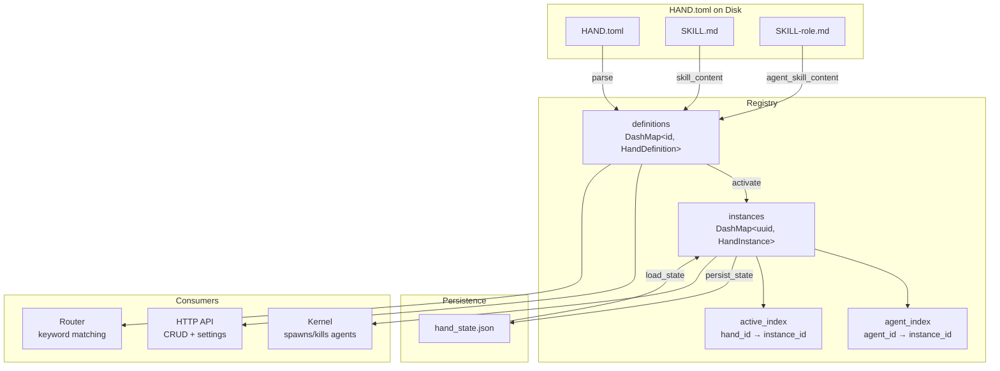

# Hands System

# LibreFang Hands — Autonomous Capability Packages

A **Hand** is a pre-built, domain-complete agent configuration that users activate from a marketplace. Unlike regular agents (where you chat with them), Hands work for you — you check in on them periodically. A video-clip Hand autonomously watches a folder and produces clips; a security Hand monitors logs and alerts you.

The Hands system is split across two files:

| File | Responsibility |
|---|---|
| `lib.rs` | Core types — `HandDefinition`, `HandInstance`, parsing, settings resolution |
| `registry.rs` | `HandRegistry` — install, activate, persist, reload, requirements checking |

## Architecture Overview



## Core Types

### `HandDefinition`

The parsed representation of a `HAND.toml` file. Contains everything the system needs to know about a hand *before* it's activated:

- **Identity**: `id`, `version`, `name`, `description`, `category`, `icon`
- **Agent manifests**: `agents` — a `BTreeMap<String, HandAgentManifest>` keyed by role name. Single-agent hands are stored as `{"main": ...}`.
- **Requirements**: `requires` — binaries, env vars, API keys that must be present
- **Settings**: `settings` — user-configurable options shown in the activation modal
- **Dashboard**: `dashboard` — metric definitions read from agent memory at runtime
- **Routing**: `routing` — keywords for deterministic hand selection
- **Localization**: `i18n` — translated strings keyed by language code

#### Agent Configuration Formats

A `HAND.toml` supports two formats for defining agents:

**Single-agent** (`[agent]`):
```toml
[agent]
name = "clip-agent"
system_prompt = "You produce video clips."

[agent.model]
provider = "anthropic"
model = "some-model"
```

**Multi-agent** (`[agents.<role>]`):
```toml
[agents.planner]
coordinator = true
invoke_hint = "Use planner for task decomposition"
name = "planner-agent"

[agents.planner.model]
provider = "anthropic"
system_prompt = "You plan research tasks."

[agents.analyst]
name = "analyst-agent"

[agents.analyst.model]
provider = "groq"
model = "llama-3.3-70b-versatile"
system_prompt = "You analyze data."
```

The coordinator is the agent that receives user messages. If no agent is explicitly marked `coordinator = true`, the first agent by role name (BTreeMap order) becomes the coordinator. Access it via `HandDefinition::coordinator()`.

#### Template Reuse with `base`

Multi-agent entries can reference a shared agent template from the agents registry:

```toml
[agents.writer]
base = "my-writer"           # loads agents/my-writer/agent.toml
name = "blog-writer"          # overrides base name

[agents.writer.model]
system_prompt = "You write blog posts."  # overrides base prompt
```

The `base` field triggers filesystem I/O — the template is loaded and the hand's inline fields are deep-merged on top (hand wins on conflicts). This requires `agents_dir` to be provided during parsing (done automatically by `parse_hand_toml_with_agents_dir`). Path traversal is blocked: template names must be simple directory names without `..`, `/`, or `\`.

#### Legacy Flat Format

Older `HAND.toml` files use flat fields at the `[agent]` level (`provider`, `model`, `system_prompt`, etc. as siblings). The parser auto-detects this format via `normalize_flat_to_nested` and converts it to the nested `[model]` structure before merging or deserializing.

### `HandInstance`

A running instance of a hand — the bridge between a definition and its spawned agents:

| Field | Purpose |
|---|---|
| `instance_id` | Unique `Uuid` — regenerated on fresh activate, preserved on restart recovery |
| `hand_id` | Links back to the `HandDefinition` |
| `status` | `Active`, `Paused`, `Error(String)`, or `Inactive` |
| `agent_ids` | `BTreeMap<role, AgentId>` — populated by the kernel after spawning |
| `coordinator_role` | Which role receives user messages (persisted explicitly) |
| `config` | User-provided configuration overrides |
| `agent_runtime_overrides` | Per-role model/provider overrides from dashboard editing |
| `activated_at` / `updated_at` | Timestamps preserved across restarts |

**Coordinator resolution** follows this priority:
1. Explicit `coordinator_role` that matches an existing `agent_ids` key
2. The sole entry if there's exactly one agent
3. The role named `"main"`
4. The first entry by BTreeMap order

### Settings System

Hands declare configurable settings that are shown in the activation modal. Three setting types are supported:

| Type | Behavior |
|---|---|
| `Select` | User picks from predefined options. Selected option's `provider_env` is collected for the agent's environment. |
| `Toggle` | Boolean switch (`"true"`/`"false"`). |
| `Text` | Freeform input. When `env_var` is set, the value is exposed as an environment variable. |

**`resolve_settings`** converts a user's config choices into:
- A `prompt_block` (markdown appended to the system prompt)
- A list of `env_vars` the agent subprocess needs

### Requirements System

Each requirement declares what must be satisfied before a hand can work:

| `requirement_type` | `check_value` | Check logic |
|---|---|---|
| `Binary` | Binary name (e.g. `"ffmpeg"`) | `which` lookup on PATH. Special cases: `python3` runs the binary and checks version output; `chromium` tries multiple binary names and known paths. |
| `EnvVar` / `ApiKey` | Env var name | Non-empty value check |
| `AnyEnvVar` | Comma-separated env var names | At least one must be set |

Requirements can be marked `optional = true` — these don't block activation but cause a "degraded" status when unmet. Each requirement can carry platform-specific `HandInstallInfo` with install commands for macOS, Windows, and Linux.

### Routing

`HandRouting` provides keywords for deterministic hand selection:
- `aliases` — strong signals (score ×3)
- `weak_aliases` — supporting signals (score ×1)

Keywords are English-only; cross-lingual matching uses semantic embedding fallback.

### Localization (i18n)

Hands can include `[i18n.<lang>]` sections that override display strings:

```toml
[i18n.zh]
name = "线索生成"
description = "自主线索生成"

[i18n.zh.agents.main]
name = "主协调器"

[i18n.zh.settings.target_industry]
label = "目标行业"
```

All i18n fields are optional — missing translations fall back to English defaults.

## HandRegistry

The registry is the central store, built with lock-free `DashMap` collections for concurrent access from the HTTP API, kernel, and router threads:

| Collection | Key | Value | Purpose |
|---|---|---|---|
| `definitions` | `hand_id` | `HandDefinition` | All known hands |
| `instances` | `instance_id` (Uuid) | `HandInstance` | Active/paused instances |
| `agent_index` | `agent_id` (string) | `instance_id` | O(1) reverse lookup |
| `active_index` | `hand_id` | `instance_id` | O(1) "is this hand active?" |

A `Mutex` serializes the check-then-insert in `activate` to prevent race conditions where two concurrent requests both pass the "already active" check.

### Install Paths

Hands enter the registry through several routes:

| Method | Source | Base Templates | Persists to Disk |
|---|---|---|---|
| `reload_from_disk` | Scans `registry/hands/` + `workspaces/` | ✅ (via `agents_dir`) | No (reads only) |
| `install_from_path` | Arbitrary directory | ✅ | No |
| `install_from_content` | Raw TOML string | ❌ (rejected) | No |
| `install_from_content_persisted` | Raw TOML string | ✅ | Yes → `workspaces/{id}/` |

`install_from_content` explicitly rejects hands with `base` references since it has no filesystem access. Use `install_from_content_persisted` or `install_from_path` when templates are needed.

### Uninstall

`uninstall_hand` removes a hand definition from memory and deletes its `workspaces/{id}/` directory. It refuses to:
- Uninstall built-in hands (those under `registry/hands/`, regenerated on every sync)
- Uninstall a hand with any active instance (deactivate first)

### State Persistence

Hand state survives daemon restarts via `hand_state.json`. The format is versioned (currently v5):

| Version | Key additions |
|---|---|
| v1 | Bare JSON array, single `agent_id` |
| v2 | `{ version, instances }` wrapper |
| v3 | `agent_ids` as `BTreeMap`, `coordinator_role` |
| v4 | `activated_at`, `updated_at` timestamps |
| v5 | `agent_runtime_overrides` |

**Forward compatibility**: Newer daemons load older formats via `#[serde(default)]` fields and a legacy untyped fallback path.

**Backward compatibility**: Fields added in newer versions use `skip_serializing_if` so older daemons silently ignore them on load. A downgrade strips runtime overrides — users must re-apply from the dashboard.

`legacy_agent_runtime_overrides` migrates the old `config.__model_overrides__` blob into the v5 `agent_runtime_overrides` map without clobbering existing entries.

**Atomic writes**: `persist_state` writes to a temp file, syncs to disk, then renames over the target. On Unix, the parent directory is also fsynced so the rename is durable across power loss.

### Requirements Checking

`check_requirements` evaluates each `HandRequirement` against the current environment. `check_settings_availability` goes further — for each `Select`-type setting option, it checks whether the option's `provider_env` or `binary` is available, producing per-option `available` flags for the UI.

### Readiness

`readiness` combines requirement checks with runtime state into a single snapshot:

```rust
pub struct HandReadiness {
    pub requirements_met: bool,  // all non-optional requirements satisfied
    pub active: bool,            // has an Active-status instance
    pub degraded: bool,          // active but some requirements unmet
}
```

## Parsing Pipeline

The TOML parsing pipeline handles format variations through a try/fallback dispatch:

1. **Flat format**: Fields at top level of `HAND.toml`
2. **Wrapped format**: Fields under a `[hand]` section (extracted and re-serialized)

For each format, the parser tries:
- `parse_hand_definition` (filesystem-aware, resolves `base` templates)
- Standard `serde::Deserialize` (no filesystem access)

When `agents_dir` is available (from `reload_from_disk` or `install_from_path`), the filesystem-aware path is used so `base` template references are resolved with deep merging.

### Skill Content

Hands can include skill instructions:
- `SKILL.md` — shared across all agents (stored in `skill_content`)
- `SKILL-{role}.md` — per-agent override (stored in `agent_skill_content`)

Per-role content takes precedence over shared content. These are populated at load time, not serialized to JSON.

## Error Handling

All operations return `HandResult<T>` with these error variants:

| Error | When |
|---|---|
| `NotFound` | Hand definition or instance doesn't exist |
| `AlreadyActive` | Attempt to activate an already-active hand |
| `AlreadyRegistered` | Attempt to install a duplicate definition |
| `BuiltinHand` | Attempt to uninstall a registry-synced hand |
| `InstanceNotFound` | Operation on a non-existent instance UUID |
| `ActivationFailed` | Instance UUID collision during restart recovery |
| `TomlParse` | Malformed HAND.toml |
| `Io` | Filesystem errors |
| `Config` | Invalid configuration |

## Default Provider/Model Sentinel

Hands that omit `provider` or `model` get the string `"default"`. This is a sentinel resolved by the kernel to the user's global `default_model.provider`/`default_model.model` at driver-build time. This ensures hands don't pin themselves to whatever the author hardcoded — they respect the user's global configuration.