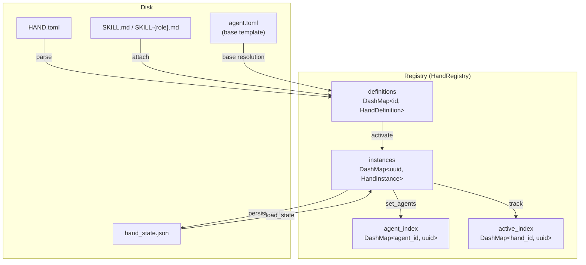

# Hands System

# Hands System

Autonomous capability packages that work for you in the background. A Hand bundles one or more agent configurations with requirements, settings, and dashboard metrics into a deployable unit activated from a marketplace.

Unlike regular agents (which you chat with interactively), Hands run autonomously — you check in on their progress rather than driving them turn-by-turn.

## Architecture



## Core Types

### `HandDefinition`

The static blueprint parsed from a `HAND.toml` file. Stored in the registry keyed by `id`. Contains:

| Field | Purpose |
|-------|---------|
| `id` / `version` / `name` / `description` | Identity and display |
| `category` | Marketplace grouping (`Content`, `Security`, `Development`, etc.) |
| `agents` | `BTreeMap<role, HandAgentManifest>` — one or more agent configs |
| `tools` / `skills` / `mcp_servers` / `allowed_plugins` | Capability allowlists |
| `requires` | Prerequisites checked before activation |
| `settings` | User-configurable options shown in the activation modal |
| `dashboard` | Metrics schema for the hand's dashboard view |
| `routing` | Keywords for deterministic hand selection |
| `i18n` | Localized strings keyed by language code |
| `skill_content` / `agent_skill_content` | Bundled skill markdown (populated at load, not in TOML) |

Access the coordinator agent (the one that receives user messages) via `coordinator()`, which returns the agent explicitly marked `coordinator = true`, falling back to the first entry sorted by role name.

### `HandInstance`

A running realization of a `HandDefinition`. Tracks runtime state:

- `instance_id` (`Uuid`) — unique per activation
- `status` — `Active`, `Paused`, `Error(String)`, or `Inactive`
- `agent_ids` — `BTreeMap<role, AgentId>` populated after the kernel spawns agents
- `coordinator_role` — which role receives user messages
- `config` — user-provided setting overrides
- `agent_runtime_overrides` — per-role model/provider overrides from the dashboard
- `activated_at` / `updated_at` — timestamps preserved across restarts

Backward-compatible accessors `agent_id()` and `agent_name()` delegate to the coordinator role.

### `HandAgentManifest`

Wraps an `AgentManifest` with hand-specific fields:

- `coordinator: bool` — marks the entry point agent
- `invoke_hint: Option<String>` — injected into the coordinator's system prompt for dispatch
- `base: Option<String>` — references a shared agent template for reuse

## HAND.toml Format

Two agent layout formats are supported. The parser auto-detects which one is in use.

### Single-Agent (Legacy)

```toml
id = "clip"
name = "Clip Hand"
description = "Autonomous video clipping"
category = "content"
icon = "🎬"
tools = ["shell_exec"]

[agent]
name = "clip-agent"
description = "Finds and clips video segments"
system_prompt = "You are a video clipping assistant."

[dashboard]
metrics = []
```

Parsed into `agents: { "main": HandAgentManifest { coordinator: true, ... } }`.

### Multi-Agent

```toml
id = "research"
version = "2.0.0"
name = "Research Hand"
description = "Multi-agent research pipeline"
category = "content"
tools = []

[agents.planner]
coordinator = true
invoke_hint = "Use planner for task decomposition"
name = "planner-agent"
description = "Plans research tasks"
system_prompt = "You plan research."

[agents.analyst]
name = "analyst-agent"
description = "Analyzes data"
provider = "groq"
model = "llama-3.3-70b-versatile"
system_prompt = "You analyze data."

[dashboard]
metrics = []
```

### Agent Configuration Formats

Each agent entry supports two TOML shapes:

**Flat format** (legacy, top-level model fields):
```toml
[agents.worker]
name = "worker"
provider = "anthropic"
model = "some-model"
system_prompt = "..."
max_tokens = 4096
temperature = 0.7
```

**Nested format** (new, explicit `[model]` sub-table):
```toml
[agents.worker]
name = "worker"

[agents.worker.model]
provider = "anthropic"
model = "some-model"
system_prompt = "..."
max_tokens = 4096
temperature = 0.7
```

The parser tries nested first, then falls back to flat. Both produce the same `AgentManifest`.

### Base Template References

Agents in multi-agent format can reference a shared template from the agents registry:

```toml
[agents.writer]
coordinator = true
base = "my-writer"           # loads from {agents_dir}/my-writer/agent.toml

[agents.writer.model]
system_prompt = "You are a blog post writer."  # overrides the template's prompt
```

Resolution uses `deep_merge_toml` — hand fields override base template fields recursively. Scalars and arrays in the overlay replace base values; tables merge recursively. Template names are validated against path traversal (no `..`, `/`, or `\`).

The sentinel values `"default"` for `provider` and `model` defer resolution to the user's global configuration at driver-build time, so a hand that omits these fields respects the system default rather than pinning to whatever the author baked in.

### Wrapped Format

Hands can also be authored with all fields nested under a `[hand]` section. The parser tries the flat format first and falls back to the wrapped format transparently.

## HandRegistry

Thread-safe registry using lock-free `DashMap` collections with two `Mutex` guards for serializing activation and persistence.

### Storage Layout

```
home_dir/
├── registry/
│   ├── hands/           # read-only, from shared tarball (reset on sync)
│   │   ├── clip/
│   │   │   ├── HAND.toml
│   │   │   ├── SKILL.md
│   │   │   └── SKILL-pm.md
│   │   └── research/
│   │       └── HAND.toml
│   └── agents/          # base templates for `base = "..."` references
│       └── my-writer/
│           └── agent.toml
├── workspaces/          # user-installed hands (survive sync)
│   └── custom-hand/
│       ├── HAND.toml
│       └── SKILL.md
└── hand_state.json      # persisted active instances
```

`reload_from_disk` scans both `registry/hands/` and `workspaces/`, with registry entries taking precedence on ID collisions.

### Install Methods

| Method | Base Templates | Persisted to Disk | Use Case |
|--------|---------------|-------------------|----------|
| `install_from_path` | ✅ | No | Loading from registry scan |
| `install_from_content` | ❌ | No | API install without persistence |
| `install_from_content_persisted` | ✅ | Yes (`workspaces/{id}/`) | Dashboard "install from content" |

`install_from_content` explicitly rejects hands that use `base` references because it has no filesystem access for template resolution.

### Uninstall

`uninstall_hand` removes a hand from memory and deletes its `workspaces/{id}/` directory. It refuses to:
- Remove built-in hands (those only in `registry/hands/`) — they'd reappear on next sync
- Remove hands with active instances — deactivate first

### Activation Flow

1. Kernel calls `activate(hand_id, config)` → creates a `HandInstance` with `Active` status
2. Kernel spawns agents, then calls `set_agents(instance_id, agent_ids, coordinator_role)`
3. Instance is tracked in `active_index` for O(1) "is this hand active?" lookups

The `activate_lock` mutex serializes the check-then-insert to prevent concurrent requests from both passing the "already active" guard.

For daemon restart recovery, `activate_with_id` accepts a preserved `instance_id` and original timestamps so deterministic agent IDs remain stable.

### Agent Lookup

`find_by_agent(agent_id)` uses the `agent_index` reverse map (`agent_id → instance_id`) for O(1) resolution, avoiding linear scans across all instances.

## State Persistence

Active and paused instances survive daemon restarts via `hand_state.json`.

### Version History

| Version | Changes |
|---------|---------|
| v1 | Bare JSON array, single `agent_id` |
| v2 | `{ version, instances }` wrapper |
| v3 | Multi-agent: `agent_ids` map + `coordinator_role` |
| v4 | `activated_at` / `updated_at` timestamps |
| v5 (current) | `agent_runtime_overrides` per-role map |

### Forward/Backward Compatibility

- **Loading older state**: v5 daemon reads v1–v4 files. Legacy `config.__model_overrides__` blobs are migrated into `agent_runtime_overrides` without clobbering existing v5 overrides.
- **Downgrading**: a v4 daemon loading a v5 file silently drops `agent_runtime_overrides` (serialized with `skip_serializing_if = "is_empty"`). Users must re-apply dashboard overrides after a downgrade.

### Atomic Writes

`atomic_write_json` writes to a temp file, `sync_all`s, then `rename`s into place. On Unix, the parent directory is also fsynced so the directory entry update is durable across power loss. This prevents the orphan-GC path from treating a post-crash missing state file as "first boot".

Errored and inactive instances are skipped during load; only `Active` and `Paused` are restored.

## Requirements

Each hand declares prerequisites in `[[requires]]` that must be satisfied before activation.

### Requirement Types

| Type | Check | Example |
|------|-------|---------|
| `Binary` | Binary exists on PATH and is executable | `ffmpeg`, `chromium` |
| `EnvVar` | Environment variable is set and non-empty | `HOME` |
| `ApiKey` | Same as EnvVar (semantic distinction) | `OPENAI_API_KEY` |
| `AnyEnvVar` | Comma-separated list; any one set suffices | `GROQ_API_KEY,OPENAI_API_KEY` |

Requirements can be marked `optional = true` — these don't block activation. A hand with unmet optional requirements is reported as "degraded" in readiness checks.

### Special Cases

- **`python3`**: Actually runs `python3 --version` / `python --version` and checks for "Python 3" in output, to avoid false positives from Windows Store shims. Result is cached for the process lifetime via `OnceLock`.
- **`chromium`**: Checks multiple binary names (`chromium-browser`, `google-chrome`, etc.), `CHROME_PATH` env var, and macOS `.app` bundle paths.

### Install Info

Each requirement can carry platform-specific install instructions (`HandInstallInfo`):

```toml
[[requires]]
key = "ffmpeg"
label = "FFmpeg must be installed"
requirement_type = "binary"
check_value = "ffmpeg"
description = "FFmpeg is the core video processing engine."

[requires.install]
macos = "brew install ffmpeg"
windows = "winget install Gyan.FFmpeg"
linux_apt = "sudo apt install ffmpeg"
manual_url = "https://ffmpeg.org/download.html"
estimated_time = "2-5 min"
steps = [
    "Install via your package manager",
    "Verify with: ffmpeg -version",
]
```

## Settings

Hands declare configurable options shown in the activation modal. Three control types are supported:

- **`Select`** — dropdown with predefined options. Each option can declare `provider_env` or `binary` for availability badges.
- **`Toggle`** — on/off switch.
- **`Text`** — freeform text input. Can declare `env_var` to expose the value as an environment variable.

### Resolution

`resolve_settings(settings, config)` produces:

- `prompt_block` — markdown appended to the system prompt (e.g. `## User Configuration\n- STT: Groq (groq)`)
- `env_vars` — list of env var names the agent's subprocess should receive

Only the selected option's `provider_env` is collected, so switching providers doesn't leak unrelated API keys.

### Availability Checking

`check_settings_availability` tests each option's `provider_env` and `binary` at runtime, returning per-option `available: bool` so the UI can show "Ready" badges. Labels and descriptions are localized when a `lang` parameter is provided.

## Runtime Overrides

`HandAgentRuntimeOverride` captures per-role model configuration changes made from the dashboard after activation:

```rust
pub struct HandAgentRuntimeOverride {
    pub model: Option<String>,
    pub provider: Option<String>,
    pub api_key_env: Option<Option<String>>,
    pub base_url: Option<Option<String>>,
    pub max_tokens: Option<u32>,
    pub temperature: Option<f32>,
    pub web_search_augmentation: Option<WebSearchAugmentationMode>,
}
```

Three mutation patterns:
- `update_agent_runtime_override` — replaces the entire override
- `merge_agent_runtime_override` — merges new fields onto existing (new wins, `Option::or` fallback)
- `restore_agent_runtime_override` — set or clear a specific role's override

These survive daemon restarts via the v5 persistence format.

## Localization (i18n)

Hands can declare translations under `[i18n.{lang}]`:

```toml
[i18n.zh]
name = "线索生成 Hand"
description = "自主线索生成"

[i18n.zh.agents.main]
name = "主协调器"

[i18n.zh.settings.target_industry]
label = "目标行业"
description = "聚焦的行业领域"
```

All fields are optional — untranslated strings fall back to English defaults. The `i18n` map is keyed by language code (e.g., `"zh"`, `"ja"`).

## Routing

`HandRouting` provides deterministic keyword-based hand selection:

```toml
[routing]
aliases = ["video editor", "clip maker"]      # score ×3
weak_aliases = ["cut video", "trim"]          # score ×1
```

Keywords are English-only; cross-lingual matching relies on semantic embedding fallback at the router layer, not keyword translation.

## Error Handling

`HandError` covers all failure modes:

| Variant | Meaning |
|---------|---------|
| `NotFound(id)` | Hand definition doesn't exist |
| `AlreadyActive(id)` | Hand already has an active instance |
| `AlreadyRegistered(id)` | Duplicate definition during install |
| `BuiltinHand(id)` | Cannot uninstall a registry-synced hand |
| `InstanceNotFound(uuid)` | Instance ID doesn't map to a live instance |
| `ActivationFailed(reason)` | Generic activation error |
| `TomlParse(reason)` | HAND.toml parsing failure |
| `Io(error)` | Filesystem I/O failure |
| `Config(reason)` | Configuration or serialization error |

All results use `HandResult<T> = Result<T, HandError>`.