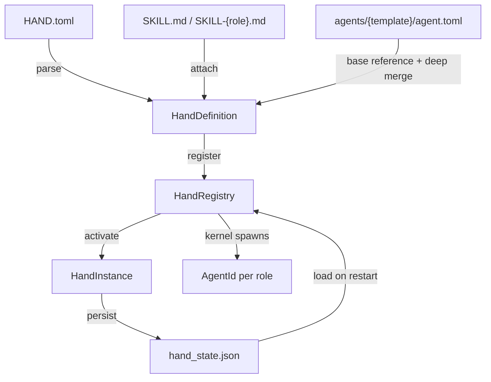
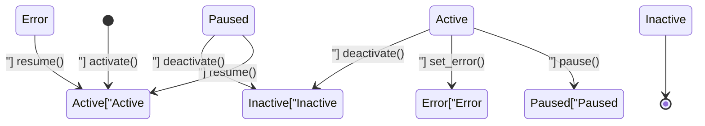

# Hands System

# Hands System

## Overview

A **Hand** is a pre-built, domain-complete autonomous agent package. Unlike regular agents that users chat with interactively, Hands work autonomously — users activate them and check in on progress. Hands are defined by `HAND.toml` files and managed through a registry that tracks definitions, active instances, and persisted state across daemon restarts.

The `librefang-hands` crate provides:

- **Type definitions** for hand definitions, instances, requirements, settings, dashboards, routing, and i18n
- **TOML parsing** with backward-compatible legacy format support and agent template inheritance via `base`
- **`HandRegistry`** — a thread-safe (`Send + Sync`) registry that manages definitions and active instances with crash-safe persistence

## Architecture


```mermaid
graph TD
    HAND_TOML["HAND.toml"] -->|parse| HD[HandDefinition]
    SKILL_MD["SKILL.md / SKILL-{role}.md"] -->|attach| HD
    BASE["agents/{template}/agent.toml"] -->|base reference + deep merge| HD
    HD -->|register| REG[HandRegistry]
    REG -->|activate| HI[HandInstance]
    HI -->|persist| STATE["hand_state.json"]
    STATE -->|load on restart| REG
    REG -->|kernel spawns| AGENTS[AgentId per role]
```

## Core Types

### `HandDefinition`

The complete parsed representation of a `HAND.toml`. Key fields:

| Field | Purpose |
|---|---|
| `id` | Unique identifier (e.g. `"clip"`) |
| `version` | Semantic version, defaults to `"0.0.0"` |
| `agents` | `BTreeMap<String, HandAgentManifest>` — agent manifests keyed by role name |
| `requires` | Prerequisites that must be satisfied before activation |
| `settings` | Configurable options shown in the activation modal |
| `dashboard` | Metrics schema for the hand's dashboard |
| `routing` | Keywords for deterministic hand selection |
| `i18n` | Localized strings keyed by language code |
| `skill_content` | Bundled skill content from `SKILL.md` (populated at load time) |
| `agent_skill_content` | Per-role skill overrides from `SKILL-{role}.md` |

Key accessors:

- **`coordinator()`** — returns the agent marked `coordinator = true`, falling back to the first agent by role name
- **`agent()`** — backward-compatible single-agent accessor (returns the coordinator's manifest)
- **`is_multi_agent()`** — `true` when more than one agent is defined

### `HandAgentManifest`

Wraps an `AgentManifest` with multi-agent metadata:

- **`coordinator: bool`** — whether this agent receives user messages
- **`invoke_hint: Option<String>`** — hint for other agents on when to invoke this one
- **`base: Option<String>`** — reference to an agent template from `agents/` registry for inheritance

### `HandInstance`

A running hand instance that links a `HandDefinition` to its spawned agents:

- `instance_id: Uuid` — unique instance identifier
- `hand_id: String` — which definition this is an instance of
- `status: HandStatus` — `Active`, `Paused`, `Error(String)`, or `Inactive`
- `agent_ids: BTreeMap<String, AgentId>` — spawned agents keyed by role
- `coordinator_role: Option<String>` — which role receives user messages
- `config: HashMap<String, serde_json::Value>` — user-provided configuration overrides
- `agent_runtime_overrides: BTreeMap<String, HandAgentRuntimeOverride>` — per-role model/provider overrides from the dashboard
- `activated_at` / `updated_at` — timestamps preserved across restarts

### `HandStatus`

```rust
pub enum HandStatus {
    Active,
    Paused,
    Error(String),
    Inactive,
}
```

### `HandCategory`

Marketplace categories: `Content`, `Security`, `Productivity`, `Development`, `Communication`, `Data`, `Finance`, `Other`.

## HAND.toml Format

Hands support two agent layout formats, auto-detected during parsing.

### Single-agent (`[agent]`)

```toml
id = "clip"
name = "Clip Master"
description = "Autonomous video clipping"
category = "content"
icon = "🎬"
tools = ["shell_exec"]

[agent]
name = "clip-agent"
description = "Finds and clips video segments"
system_prompt = "You are a video editing assistant."

[agent.model]
provider = "default"
model = "default"
max_tokens = 4096
temperature = 0.7
```

Parsed into `agents: {"main": HandAgentManifest { coordinator: true, ... }}`.

### Multi-agent (`[agents.{role}]`)

```toml
id = "research"
name = "Research Hand"
description = "Multi-agent research pipeline"
category = "content"

[agents.planner]
coordinator = true
invoke_hint = "Use planner for task decomposition"
name = "planner-agent"
system_prompt = "You plan research."

[agents.analyst]
name = "analyst-agent"
system_prompt = "You analyze data."
```

### Legacy flat format

Older `HAND.toml` files place `provider`, `model`, `system_prompt`, `max_tokens`, `temperature`, `api_key_env`, and `base_url` as top-level fields under `[agent]` instead of nesting them under `[agent.model]`. The parser auto-detects this via `parse_single_agent_section` and converts to the nested `AgentManifest` format using `LegacyHandAgentConfig`.

### Base template inheritance

Multi-agent entries can reference a shared agent template via `base`, avoiding duplication:

```toml
[agents.writer]
coordinator = true
base = "my-writer"        # loads agents/my-writer/agent.toml as base

[agents.writer.model]
system_prompt = "You are a blog post writer."  # overrides base
```

Resolution flow in `parse_multi_agent_entry`:

1. Validate the template name (no path traversal — rejects `..`, `/`, `\`)
2. Load `{agents_dir}/{template}/agent.toml`
3. Normalize any flat-format fields to nested via `normalize_flat_to_nested`
4. Deep-merge hand overrides on top via `deep_merge_toml` (hand wins over base)
5. Parse the merged result into `AgentManifest`

**`base` is only supported in `[agents.*]` format.** Using it in single-agent `[agent]` produces an error.

### Requirements

```toml
[[requires]]
key = "ffmpeg"
label = "FFmpeg must be installed"
requirement_type = "binary"      # Binary | EnvVar | ApiKey | AnyEnvVar
check_value = "ffmpeg"
description = "Core video processing engine."
optional = false                  # optional requirements don't block activation

[requires.install]
macos = "brew install ffmpeg"
windows = "winget install Gyan.FFmpeg"
linux_apt = "sudo apt install ffmpeg"
manual_url = "https://ffmpeg.org/download.html"
estimated_time = "2-5 min"
steps = ["Download from ffmpeg.org", "Add to PATH"]
```

### Settings

Settings appear in the activation modal and are resolved into a prompt block and env var list at spawn time:

```toml
[[settings]]
key = "stt_provider"
label = "STT Provider"
description = "Speech-to-text engine"
setting_type = "select"           # Select | Text | Toggle
default = "auto"

[[settings.options]]
value = "groq"
label = "Groq Whisper"
provider_env = "GROQ_API_KEY"    # env var checked for availability badge

[[settings.options]]
value = "local"
label = "Local Whisper"
binary = "whisper"               # binary checked on PATH for availability badge
```

Text-type settings can expose an env var via `env_var = "ELEVENLABS_API_KEY"`.

### Dashboard metrics

```toml
[[dashboard.metrics]]
label = "Items processed"
memory_key = "items_count"       # reads from agent's structured memory
format = "number"                # Number | Duration | Bytes | Percentage | Text | Date
```

### Routing

```toml
[routing]
aliases = ["video editor", "clip maker"]     # ×3 score
weak_aliases = ["cut video", "trim"]          # ×1 score
```

### Metadata

```toml
[metadata]
frequency = "periodic"                  # Continuous | Periodic | OnDemand | Daily | Hourly
token_consumption = "medium"            # Low | Medium | High
default_active = false
activation_warning = "This hand uses paid API calls"
```

### Internationalization

```toml
[i18n.zh]
name = "线索生成 Hand"
description = "自主线索生成"

[i18n.zh.agents.main]
name = "主协调器"

[i18n.zh.settings.target_industry]
label = "目标行业"
description = "聚焦的行业领域"
```

All i18n fields are optional — untranslated fields fall back to English.

### Wrapped format

HAND.toml files can optionally wrap everything under a `[hand]` section. The parser tries flat format first, then wrapped format as fallback.

## Settings Resolution

`resolve_settings` maps user config values against a hand's settings schema:

```rust
pub fn resolve_settings(
    settings: &[HandSetting],
    config: &HashMap<String, serde_json::Value>,
) -> ResolvedSettings
```

Returns `ResolvedSettings` containing:
- **`prompt_block`** — markdown appended to the system prompt (e.g. `## User Configuration\n- STT: Groq (groq)`)
- **`env_vars`** — env var names the agent's subprocess needs access to

For **Select** settings, the matched option's `provider_env` is collected. For **Text** settings, the setting's `env_var` is collected when the value is non-empty. For **Toggle** settings, the value is displayed as Enabled/Disabled.

## HandRegistry

Thread-safe registry using `DashMap` for concurrent access with `Mutex`-guarded activate/persist operations.

### Installation

| Method | Use case |
|---|---|
| `install_from_path` | Install from a directory containing `HAND.toml` + optional `SKILL.md` |
| `install_from_content` | Install from raw TOML + skill strings (API installs, no `base` support) |
| `install_from_content_persisted` | Install from content and persist to `workspaces/{id}/` (survives restarts) |
| `reload_from_disk` | Scan `registry/hands/` and `workspaces/` directories for all hands |

All install methods call `register_definition` which rejects duplicate IDs with `HandError::AlreadyRegistered`.

### Activation lifecycle


```mermaid
stateDiagram-v2
    [*] --> Active["Active:"] activate()
    Active --> Paused["Paused:"] pause()
    Paused --> Active["Active:"] resume()
    Active --> Error["Error:"] set_error()
    Error --> Active["Active:"] resume()
    Active --> Inactive["Inactive:"] deactivate()
    Paused --> Inactive["Inactive:"] deactivate()
    Inactive --> [*]
```

**`activate`** creates a `HandInstance` with `Active` status. It holds `activate_lock` to prevent race conditions where concurrent requests both pass the "already active" check. Agent spawning is done by the kernel after activation — the registry just tracks the mapping via `set_agents`.

**`deactivate`** removes the instance and cleans up the reverse indexes (`agent_index`, `active_index`).

**`activate_with_id`** accepts an existing UUID and optional timestamps for daemon restart recovery, ensuring deterministic agent IDs remain stable.

### Reverse indexes

- **`agent_index`** — `DashMap<String(agent_id), Uuid(instance_id)>` — O(1) lookup of which hand instance owns an agent
- **`active_index`** — `DashMap<String(hand_id), Uuid(instance_id)>` — O(1) check for whether a hand is currently active

### Requirement checking

`check_requirements` evaluates each `HandRequirement` against the current environment:

- **`Binary`** — checks PATH via `which_binary` (with special handling for `python3` and `chromium`)
- **`EnvVar` / `ApiKey`** — checks env var is set and non-empty
- **`AnyEnvVar`** — comma-separated list; any one being set suffices

`check_settings_availability` returns per-option availability status (checking `provider_env` and `binary` fields on each option).

### Readiness

`readiness` combines requirement checks with runtime state:

- **`requirements_met`** — all *non-optional* requirements satisfied
- **`active`** — has a running instance (checked via `active_index`)
- **`degraded`** — active but any requirement (including optional) is unmet

### Persistence

State is persisted to `hand_state.json` via `persist_state` using atomic writes (write to `.tmp`, `fsync`, `rename`, parent-dir `fsync` on Unix).

**Version history** (current: v5):

| Version | Changes |
|---|---|
| v1 | Bare JSON array, single `agent_id` |
| v2 | `{ version, instances }` wrapper |
| v3 | Multi-agent: `agent_ids` map + `coordinator_role` |
| v4 | `activated_at` / `updated_at` timestamps |
| v5 | `agent_runtime_overrides` per-role map |

`load_state` handles all legacy formats:
- v3+ → typed `PersistedState` deserialization
- v1/v2 → untyped JSON fallback, migrating single `agent_id` to `{"main": id}`
- Legacy `config.__model_overrides__` blobs are migrated into `agent_runtime_overrides` without overwriting existing v5 entries

Errored and inactive instances are skipped during load. Only `Active` and `Paused` instances are restored.

### Uninstall

`uninstall_hand` refuses to remove:
- Hands not in the registry (`NotFound`)
- Built-in hands living under `registry/hands/` (`BuiltinHand` — they'd reappear on next sync)
- Hands with live instances (`AlreadyActive` — deactivate first)

For user-installed hands under `workspaces/`, it removes the in-memory definition and deletes the directory.

### Runtime overrides

Per-agent model settings can be overridden at runtime without modifying the hand definition:

- **`update_agent_runtime_override`** — replaces the override for a role
- **`merge_agent_runtime_override`** — merges new values with existing (new values win, `None` fields preserved from previous)
- **`clear_agent_runtime_override`** — removes the override for a role (idempotent — returns `Ok(None)` if no override existed)
- **`restore_agent_runtime_override`** — sets or clears an override (used for state restoration)

## Error Handling

```rust
pub enum HandError {
    NotFound(String),
    AlreadyActive(String),
    AlreadyRegistered(String),
    BuiltinHand(String),
    InstanceNotFound(Uuid),
    ActivationFailed(String),
    TomlParse(String),
    Io(std::io::Error),
    Config(String),
}
```

## Integration Points

The hands system connects to the rest of LibreFang through these call paths:

- **Kernel** calls `activate`/`deactivate`, `set_agents`, `load_state`/`persist_state`, and uses `resolve_settings` to build agent manifests
- **Kernel manifest helpers** use `parse_hand_toml` and `is_multi_agent` when constructing agent configurations
- **Kernel router** calls `parse_hand_toml_with_agents_dir` to load hand routing candidates
- **TUI** calls `list_definitions`, `list_instances`, and `check_requirements` for display
- **API layer** calls `install_from_content`/`install_from_content_persisted`, `uninstall_hand`, runtime override methods, and settings availability checks
- **HTTP client / TLS init** references `default_provider` for the `"default"` sentinel value used in model configs