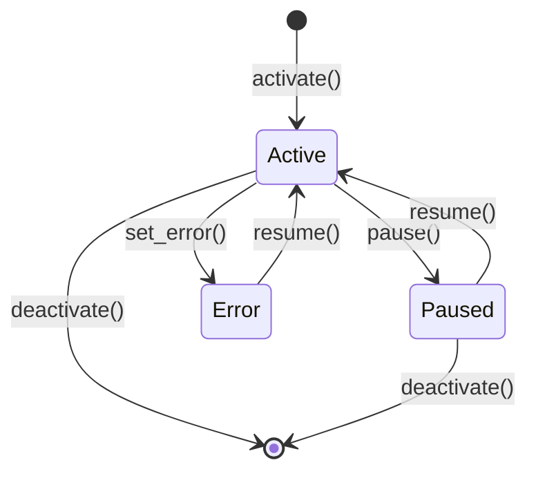

# Hands

# Hands Module

## Overview

A **Hand** is a pre-built, domain-complete autonomous agent configuration that users activate from a marketplace. The distinction from regular agents is intentional: you chat with agents, but Hands work *for* you — you check in on them rather than drive them interactively.

Each Hand is defined by a `HAND.toml` file (optionally with a `SKILL.md` and per-agent `SKILL-{role}.md` files) and managed at runtime by the `HandRegistry`. The kernel spawns the underlying agents, but all definition parsing, instance tracking, state persistence, and requirement checking live here.

## Architecture

```mermaid
graph TD
    A[HAND.toml + SKILL.md] -->|parsed by| B[HandDefinition]
    B -->|registered in| C[HandRegistry]
    C -->|activate| D[HandInstance]
    C -->|persist_state| E[hand_state.json]
    E -->|load_state| C
    D -->|agent_ids set by kernel| F[agent_index]
    F -->|find_by_agent| G[reverse lookup O(1)]
    H[agents_dir / base templates] -->|deep merged| B
```

## Core Types

### `HandDefinition`

The parsed representation of a `HAND.toml`. Holds everything the registry and kernel need:

- **Identity**: `id`, `version`, `name`, `description`, `category`, `icon`
- **Agent manifests**: `agents` — a `BTreeMap<String, HandAgentManifest>` keyed by role name
- **Capabilities**: `tools`, `skills`, `mcp_servers`, `allowed_plugins`
- **User-facing config**: `settings` (shown in activation modal), `requires` (prerequisites)
- **Dashboard**: `dashboard.metrics` — declares what structured-memory keys to surface
- **Routing**: `routing.aliases` and `routing.weak_aliases` for deterministic hand selection
- **Metadata**: `metadata.frequency`, `metadata.token_consumption`, `metadata.activation_warning`
- **Localization**: `i18n` — a map of language codes to translated strings

Supports two agent formats that are normalized to the same internal representation:

| Format | TOML structure | Internal storage |
|--------|---------------|-----------------|
| **Single-agent** | `[agent]` | `{"main": HandAgentManifest { coordinator: true, ... }}` |
| **Multi-agent** | `[agents.planner]`, `[agents.analyst]`, ... | One entry per role |

The `coordinator()` method returns whichever agent has `coordinator = true`, falling back to the first entry by role name. The backward-compatible `agent()` accessor returns the coordinator's underlying `AgentManifest`.

### `HandAgentManifest`

Wraps an `AgentManifest` with hand-specific fields:

- `coordinator: bool` — marks the agent that receives user messages
- `invoke_hint: Option<String>` — injected into the coordinator's system prompt as a dispatch guide for multi-agent setups
- `base: Option<String>` — references a shared agent template for DRY configuration

### `HandInstance`

A runtime record linking a `HandDefinition` to its spawned agents. Created by `HandRegistry::activate`, populated with agent IDs by the kernel via `set_agents`.

Key fields:
- `instance_id: Uuid` — unique per activation
- `hand_id: String` — which definition this is an instance of
- `status: HandStatus` — `Active`, `Paused`, `Error(String)`, or `Inactive`
- `agent_ids: BTreeMap<String, AgentId>` — role name → spawned agent ID
- `coordinator_role: Option<String>` — explicitly tracked so routing doesn't have to guess
- `config: HashMap<String, serde_json::Value>` — user's setting choices at activation time

The `coordinator_agent_id()` method resolves the coordinator role and returns its `AgentId`, used by the kernel and HTTP routes to direct user messages.

### `HandStatus`

```rust
pub enum HandStatus {
    Active,
    Paused,
    Error(String),
    Inactive,
}
```

Active and Paused instances are persisted across daemon restarts. Error and Inactive instances are skipped during state recovery.

## HAND.toml Format

Hands support both a flat format (all fields at the top level) and a wrapped format (fields under a `[hand]` section). The parser tries flat first, then falls back to wrapped.

### Single-agent example

```toml
id = "clip"
version = "1.2.0"
name = "Clip Hand"
description = "Autonomous video clipping"
category = "content"
icon = "🎬"
tools = ["shell_exec"]
skills = []
mcp_servers = []

[[requires]]
key = "ffmpeg"
label = "FFmpeg must be installed"
requirement_type = "binary"
check_value = "ffmpeg"
description = "Core video processing engine."

[requires.install]
macos = "brew install ffmpeg"
linux_apt = "sudo apt install ffmpeg"
manual_url = "https://ffmpeg.org/download.html"
estimated_time = "2-5 min"

[[settings]]
key = "stt_provider"
label = "STT Provider"
setting_type = "select"
default = "auto"

[[settings.options]]
value = "groq"
label = "Groq Whisper"
provider_env = "GROQ_API_KEY"

[agent]
name = "clip-agent"
description = "Clips videos"
system_prompt = "You are a video clipping assistant."

[dashboard]
metrics = []

[routing]
aliases = ["video editor", "clip maker"]
weak_aliases = ["cut video"]

[metadata]
frequency = "on-demand"
token_consumption = "medium"
```

### Multi-agent example

```toml
id = "research"
name = "Research Hand"
category = "content"
tools = []

[agents.planner]
coordinator = true
invoke_hint = "Use planner for task decomposition"
name = "planner-agent"

[agents.planner.model]
provider = "anthropic"
model = "claude-sonnet-4-20250514"
system_prompt = "You plan research tasks."

[agents.analyst]
name = "analyst-agent"

[agents.analyst.model]
provider = "groq"
model = "llama-3.3-70b-versatile"
system_prompt = "You analyze data."
```

## Hand Registry (`HandRegistry`)

The central runtime store, built on `DashMap` for lock-free concurrent reads. Thread-safe (`Send + Sync`).

### Internal structure

| Field | Type | Purpose |
|-------|------|---------|
| `definitions` | `DashMap<String, HandDefinition>` | All known hand definitions by ID |
| `instances` | `DashMap<Uuid, HandInstance>` | Active instances by instance UUID |
| `agent_index` | `DashMap<String, Uuid>` | Agent ID string → instance UUID (O(1) reverse lookup) |
| `active_index` | `DashMap<String, Uuid>` | Hand ID → active instance UUID |
| `activate_lock` | `Mutex<()>` | Serializes check-then-insert to prevent duplicate activations |
| `persist_lock` | `Mutex<()>` | Guards concurrent writes to `hand_state.json` |

### Definition management

**`reload_from_disk(home_dir)`** — Scans two directories:
1. `{home_dir}/registry/hands/` — read-only, reset on every registry sync
2. `{home_dir}/workspaces/` — user-writable, survives syncs

Subdirectories containing `HAND.toml` are parsed. Registry entries take precedence on ID collision. Returns `(added, updated)` counts.

**`install_from_path(path, home_dir)`** — Install from a local directory. Reads `HAND.toml`, `SKILL.md`, and any `SKILL-{role}.md` files. Resolves `base` templates from `{home_dir}/registry/agents/`.

**`install_from_content(toml_content, skill_content)`** — API-based install from raw strings. Rejects hands that use `base` template references (no filesystem access). Does not persist to disk.

**`install_from_content_persisted(home_dir, toml_content, skill_content)`** — Same as above but writes to `{home_dir}/workspaces/{id}/` so the hand survives restarts.

**`uninstall_hand(home_dir, hand_id)`** — Three guard clauses:
1. `NotFound` — hand ID not in registry
2. `BuiltinHand` — no `workspaces/{id}/HAND.toml` exists (lives in registry, would be recreated on next sync)
3. `AlreadyActive` — a live instance exists; caller must deactivate first

On success, removes the definition from memory and deletes the workspace directory.

### Instance lifecycle



**`activate(hand_id, config)`** — Creates a `HandInstance` with a fresh UUID. The mutex-locked check prevents two concurrent requests from both passing the "already active" guard. Agent spawning is done by the kernel after this returns.

**`activate_with_id(...)`** — Variant that accepts an explicit `instance_id` and optional timestamps, used during daemon restart recovery to keep deterministic agent IDs stable.

**`set_agents(instance_id, agent_ids, coordinator_role)`** — Called by the kernel after spawning agents. Updates the instance's `agent_ids` map and rebuilds the `agent_index` reverse mapping. The coordinator role is normalized: explicit declaration → single-agent fallback → "main" key fallback → first key.

**`deactivate(instance_id)`** — Removes the instance and cleans up both reverse indexes. If another active instance of the same hand exists, it takes over the `active_index` entry.

### State persistence

**`persist_state(path)`** — Serializes all non-Inactive instances to `hand_state.json` (format version 4). Each entry includes `hand_id`, `instance_id`, `config`, `agent_ids`, `coordinator_role`, `status`, and timestamps.

**`load_state(path)`** — Static method. Handles four format versions:
- **v4**: Typed `PersistedState` with explicit `version` field
- **v3**: Same structure, `instances` array
- **v2/v1**: `agent_id` as a single value (converted to `{"main": id}`)

Skips `Error` and `Inactive` instances during recovery. Returns `Vec<HandStateEntry>` for the kernel to re-activate.

### Readiness and requirements

**`readiness(hand_id)`** — Returns a `HandReadiness` snapshot combining requirement checks with activation state:

```rust
pub struct HandReadiness {
    pub requirements_met: bool,  // all mandatory requirements satisfied
    pub active: bool,            // at least one Active instance
    pub degraded: bool,          // active but some requirement (optional or not) unmet
}
```

Optional requirements (`req.optional = true`) don't block activation but contribute to the `degraded` flag.

**`check_requirements(hand_id)`** — Evaluates each `HandRequirement`:

| `RequirementType` | Check |
|---|---|
| `Binary` | `which_binary()` — scans PATH for the executable; special handling for `python3` (runs `--version` and checks output) and `chromium` (tries multiple binary names + `CHROME_PATH` env) |
| `EnvVar` / `ApiKey` | `std::env::var` is set and non-empty |
| `AnyEnvVar` | Comma-separated list in `check_value`; any one being set passes |

**`check_settings_availability(hand_id, lang)`** — For each setting option, checks whether its `provider_env` is set and/or its `binary` is on PATH. Returns `SettingStatus` with per-option `available` flags. Applies i18n label/description overrides when a language is requested.

## Settings Resolution

The `resolve_settings()` function takes a hand's settings schema and a user's config choices, producing:

1. **`prompt_block`** — Markdown appended to the system prompt (e.g. `## User Configuration\n- STT Provider: Groq Whisper (groq)`)
2. **`env_vars`** — Environment variable names the agent subprocess should have access to

For `Select` settings, only the chosen option's `provider_env` is collected. For `Text` settings with an `env_var` field, that env var is included when the value is non-empty. `Toggle` settings render as "Enabled"/"Disabled".

## Base Template System

Agents in multi-agent hands can reference a shared template via `base = "template-name"`:

```toml
[agents.writer]
coordinator = true
base = "my-writer"

[agents.writer.model]
system_prompt = "You are a blog post writer."
```

The resolution flow in `parse_multi_agent_entry()`:

1. Validates the template name (no path separators or `..` to prevent traversal)
2. Loads `{agents_dir}/{template}/agent.toml`
3. Normalizes flat-format templates to nested format via `normalize_flat_to_nested()`
4. Deep-merges hand overrides on top via `deep_merge_toml()` — tables merge recursively, scalars and arrays in the overlay replace base values
5. Parses the merged result into an `AgentManifest`

This is only available through `parse_hand_definition()` (which receives `agents_dir`), not through the `Deserialize` impl (which has no filesystem access). The `install_from_content()` path explicitly rejects `base` references.

## Internationalization

The `i18n` field on `HandDefinition` maps language codes to `HandI18n` structs:

```toml
[i18n.zh]
name = "线索生成"
description = "自主线索生成"

[i18n.zh.agents.main]
name = "主协调器"

[i18n.zh.settings.target_industry]
label = "目标行业"
description = "聚焦的行业领域"
```

All fields are optional — missing translations fall back to English. Applied at API response time by `check_settings_availability()` and similar methods, not baked into the definition.

## Skill Content

Hands can bundle skill instructions in markdown files:

- **`SKILL.md`** — Shared skill content applied to all agents (`def.skill_content`)
- **`SKILL-{role}.md`** — Per-agent overrides (`def.agent_skill_content["{role}"]`)

Per-agent content takes precedence over shared content. Both are populated at load time by `scan_agent_skill_files()` and `parse_hand_toml_with_agents_dir()`.

## Error Handling

```rust
pub enum HandError {
    NotFound(String),           // hand ID not in registry
    AlreadyActive(String),      // hand already has an active instance
    AlreadyRegistered(String),  // duplicate hand ID on install
    BuiltinHand(String),        // cannot uninstall registry hands
    InstanceNotFound(Uuid),     // instance UUID not found
    ActivationFailed(String),   // e.g. instance UUID collision
    TomlParse(String),          // HAND.toml parse errors
    Io(std::io::Error),         // filesystem errors
    Config(String),             // invalid configuration
}
```

## Legacy Compatibility

The parser handles two legacy agent formats automatically:

**Flat model fields** — Older `agent.toml` files put `provider`, `model`, `system_prompt`, etc. as top-level scalars. `LegacyHandAgentConfig` deserializes these and converts to a nested `AgentManifest` with a `ModelConfig` sub-struct. The heuristic in `parse_single_agent_section()` checks for a `[model]` sub-table: if present, parse as modern format; otherwise try legacy first.

**Single `agent_id`** — v1/v2 state files store a single `agent_id` instead of a role-keyed map. `load_state()` converts these to `{"main": agent_id}` during recovery.

The `provider` and `model` fields default to `"default"` — a sentinel the kernel resolves to the user's configured default model at agent spawn time, rather than pinning every hand to whatever the author hardcoded.