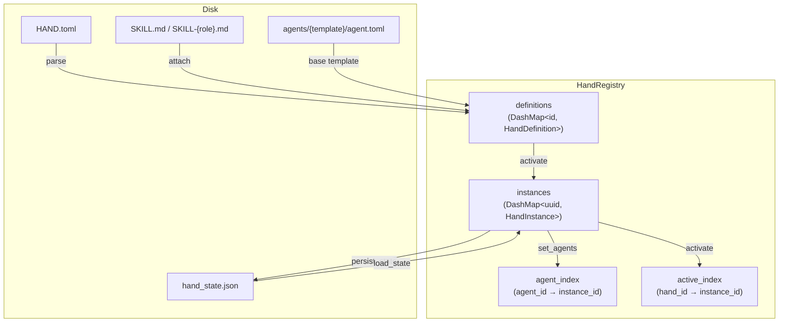
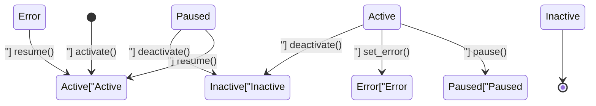

# Hands

# LibreFang Hands

Autonomous capability packages — pre-built, domain-complete agent configurations that users activate from a marketplace and check in on, rather than chat with directly.

## Architecture


```mermaid
graph TD
    subgraph "Disk"
        HT["HAND.toml"]
        SK["SKILL.md / SKILL-{role}.md"]
        HS["hand_state.json"]
        AT["agents/{template}/agent.toml"]
    end

    subgraph "HandRegistry"
        DEF["definitions<br/>(DashMap&lt;id, HandDefinition&gt;)"]
        INST["instances<br/>(DashMap&lt;uuid, HandInstance&gt;)"]
        AIDX["agent_index<br/>(agent_id → instance_id)"]
        RIDX["active_index<br/>(hand_id → instance_id)"]
    end

    HT --> |parse| DEF
    SK --> |attach| DEF
    AT --> |base template| DEF
    DEF --> |activate| INST
    INST --> |set_agents| AIDX
    INST --> |activate| RIDX
    INST --> |persist_state| HS
    HS --> |load_state| INST
```

## Core Concepts

**Hand** — A self-contained agent package defined by a `HAND.toml` file. Each hand declares its agents, requirements, configurable settings, dashboard metrics, and routing keywords.

**HandInstance** — A running realization of a `HandDefinition`. Created on activation, tracked in the registry with a unique UUID, and linked to one or more spawned `AgentId`s managed by the kernel.

**Single-agent vs Multi-agent** — Hands support two formats:
- `[agent]` — single agent, auto-converted to role `"main"` with `coordinator = true`
- `[agents.role1]`, `[agents.role2]`, ... — multiple agents, one optionally marked `coordinator = true`

The coordinator agent receives user messages. If none is explicitly marked, the first agent by role name is used.

## HAND.toml Format

Hands are defined in TOML with two accepted structural formats:

### Flat format (top-level fields)

```toml
id = "clip"
version = "1.2.0"
name = "Video Clipper"
description = "Autonomous video clipping"
category = "content"
icon = "🎬"
tools = ["shell_exec"]
skills = []
mcp_servers = []

[agent]
name = "clip-agent"
description = "Clips videos"
system_prompt = "You clip videos."
provider = "default"   # or "anthropic", "groq", etc.
model = "default"
max_tokens = 4096
temperature = 0.7
```

### Wrapped format (`[hand]` section)

```toml
[hand]
id = "clip"
name = "Video Clipper"
# ... same fields as above, nested under [hand]
```

Both formats are tried during parsing — flat first, then wrapped as fallback.

### Nested model config

Instead of flat `provider`/`model`/`system_prompt` fields inside `[agent]`, you can use a `[model]` sub-table:

```toml
[agent]
name = "clip-agent"
description = "Clips videos"

[agent.model]
provider = "anthropic"
model = "some-anthropic-model"
max_tokens = 8192
temperature = 0.5
system_prompt = "You clip videos."
```

The parser detects which format is in use and applies the correct deserialization path.

## Key Types

### `HandDefinition`

The complete parsed representation of a HAND.toml. Key fields:

| Field | Purpose |
|---|---|
| `id` | Unique identifier (validated as safe filesystem component) |
| `version` | Semantic version string, defaults to `"0.0.0"` |
| `category` | `HandCategory` enum for marketplace browsing |
| `agents` | `BTreeMap<role, HandAgentManifest>` — always present |
| `requires` | Prerequisites checked before activation |
| `settings` | Configurable options shown in the activation modal |
| `dashboard` | Metrics schema for the hand dashboard |
| `routing` | Keywords for deterministic hand selection |
| `i18n` | Localized strings keyed by language code |
| `skill_content` | Bundled skill markdown (populated at load, not in TOML) |
| `agent_skill_content` | Per-role skill overrides from `SKILL-{role}.md` files |

Key methods:
- **`coordinator()`** — returns the coordinator agent (explicitly marked or first by role)
- **`agent()`** — backward-compatible single-agent accessor
- **`is_multi_agent()`** — `true` when more than one agent is defined

### `HandInstance`

A running hand instance linking a definition to spawned agents:

| Field | Purpose |
|---|---|
| `instance_id` | Unique `Uuid` |
| `hand_id` | Which `HandDefinition` this instantiates |
| `status` | `Active`, `Paused`, `Error(msg)`, or `Inactive` |
| `agent_ids` | `BTreeMap<role, AgentId>` — populated after kernel spawns agents |
| `coordinator_role` | Explicitly persisted coordinator role name |
| `config` | User-provided setting overrides |
| `agent_runtime_overrides` | Per-role model/provider overrides from dashboard edits |
| `activated_at` / `updated_at` | Timestamps preserved across restarts |

### `HandAgentManifest`

Wraps an `AgentManifest` with hand-specific metadata:

| Field | Purpose |
|---|---|
| `coordinator` | Whether this agent receives user messages |
| `invoke_hint` | Dispatch guidance for multi-agent routing |
| `base` | Optional reference to an agent template from the registry |
| `manifest` | The underlying `AgentManifest` (flattened via `#[serde(flatten)]`) |

### `HandAgentRuntimeOverride`

Per-agent runtime overrides that survive daemon restarts. Fields are all `Option`-wrapped — `None` means "use the definition's value":

- `model`, `provider` — switch LLM at runtime
- `api_key_env`, `base_url` — redirect API calls
- `max_tokens`, `temperature` — adjust generation params
- `web_search_augmentation` — toggle search augmentation mode

## Base Template Resolution

Agents in `[agents.*]` sections can reference a shared template via `base = "template-name"`:

```toml
[agents.writer]
coordinator = true
base = "my-writer"             # loads agents/my-writer/agent.toml

[agents.writer.model]
system_prompt = "Blog-specific override"  # overrides base, everything else inherited
```

Resolution flow in `parse_multi_agent_entry`:

1. Validate `base` value — must be a simple name without path separators or `..` (prevents traversal)
2. Load `{agents_dir}/{base}/agent.toml` from disk
3. Normalize flat-format base templates to nested format via `normalize_flat_to_nested`
4. Deep-merge hand's inline fields on top of the base via `deep_merge_toml`
5. Parse the merged result as an `AgentManifest`

Base references are **not** supported in single-agent `[agent]` format — use `[agents.main]` instead.

## Settings System

### Declaration

Settings are declared in `[[settings]]` arrays in HAND.toml with three types:

```toml
[[settings]]
key = "stt_provider"
label = "STT Provider"
setting_type = "select"
default = "auto"

[[settings.options]]
value = "groq"
label = "Groq Whisper"
provider_env = "GROQ_API_KEY"    # checked for "Ready" badge
binary = "whisper"               # also checked for "Ready" badge
```

- **`Select`** — dropdown with explicit options; each option can declare `provider_env` and/or `binary` for availability checks
- **`Toggle`** — boolean switch, values `"true"`/`"false"`
- **`Text`** — freeform input; can declare `env_var` to expose the value as an environment variable

### Resolution

`resolve_settings()` maps user choices into runtime artifacts:

```rust
pub fn resolve_settings(
    settings: &[HandSetting],
    config: &HashMap<String, serde_json::Value>,
) -> ResolvedSettings
```

Returns:
- **`prompt_block`** — Markdown summary appended to the system prompt (e.g. `## User Configuration\n- STT: Groq Whisper (groq)`)
- **`env_vars`** — List of environment variable names the agent's subprocess should receive (collected from selected options' `provider_env` and text settings' `env_var`)

### Availability Checking

`HandRegistry::check_settings_availability()` evaluates each option's `provider_env` and `binary` at query time, returning `SettingOptionStatus` with an `available: bool` flag. Supports i18n label/description overrides via the `lang` parameter.

## Requirements

Each hand declares prerequisites via `[[requires]]`:

```toml
[[requires]]
key = "ffmpeg"
label = "FFmpeg must be installed"
requirement_type = "binary"
check_value = "ffmpeg"
description = "Core video processing engine"
optional = false

[requires.install]
macos = "brew install ffmpeg"
windows = "winget install Gyan.FFmpeg"
linux_apt = "sudo apt install ffmpeg"
manual_url = "https://ffmpeg.org/download.html"
estimated_time = "2-5 min"
steps = ["Download from ffmpeg.org", "Add to PATH"]
```

Four requirement types:

| Type | Checks |
|---|---|
| `Binary` | Whether `check_value` exists on PATH and is executable |
| `EnvVar` | Whether the named environment variable is set |
| `ApiKey` | Same as `EnvVar` but semantically distinct |
| `AnyEnvVar` | Comma-separated list in `check_value`; passes if any one is set |

**Optional** requirements (`optional = true`) do not block activation. A hand with unmet optional requirements is reported as **degraded** in `HandRegistry::readiness()`.

## Routing

`HandRouting` provides deterministic keyword matching for hand selection:

- **`aliases`** — strong signals, score ×3 each
- **`weak_aliases`** — supporting signals, score ×1 each

Keywords are English-only. Cross-lingual matching uses semantic embedding fallback, not translated keywords.

## Internationalization

Hands can declare localized strings under `[i18n.{lang}]`:

```toml
[i18n.zh]
name = "视频剪辑"
description = "自主视频剪辑"

[i18n.zh.agents.main]
name = "剪辑代理"

[i18n.zh.settings.target_format]
label = "目标格式"
description = "输出视频格式"
```

The `HandI18n` struct is entirely optional — all fields are `Option`, and agents/settings without translations fall back to English defaults.

## HandRegistry

The central registry managing definitions and instances. Thread-safe via `DashMap` for lock-free concurrent reads and `Mutex` for serialized activate/deactivate operations.

### Definition Loading

Three install paths:

| Method | Source | Base Templates |
|---|---|---|
| `install_from_path` | Directory on disk | ✅ Resolved |
| `install_from_content_persisted` | Raw TOML/string, saved to `workspaces/` | ✅ Resolved |
| `install_from_content` | Raw TOML/string, in-memory only | ❌ Rejected if used |

`reload_from_disk()` scans both `home_dir/registry/hands/` (read-only, from registry sync) and `home_dir/workspaces/` (user-installed). Registry entries take precedence on ID collision.

### Instance Lifecycle


```mermaid
stateDiagram-v2
    [*] --> Active["Active:"] activate()
    Active --> Paused["Paused:"] pause()
    Paused --> Active["Active:"] resume()
    Active --> Error["Error:"] set_error()
    Error --> Active["Active:"] resume()
    Active --> Inactive["Inactive:"] deactivate()
    Paused --> Inactive["Inactive:"] deactivate()
    Inactive --> [*]
```

- **`activate`** / **`activate_with_id`** — creates an instance. A mutex serializes the check-then-insert to prevent races. Only one active instance per `hand_id` by default; `activate_with_id` with an explicit UUID allows recovery scenarios.
- **`deactivate`** — removes the instance, cleans up `agent_index` and `active_index`. If another active instance of the same hand exists, it takes over the `active_index` slot.
- **`pause`** / **`resume`** — status transitions via `set_status`, which updates timestamps and index membership.
- **`set_agents`** — called by the kernel after spawning agents. Updates `agent_index` for O(1) reverse lookup.
- **`set_error`** — marks an instance as errored with a message.

### Agent Reverse Lookup

`find_by_agent(agent_id)` uses the `agent_index` DashMap for O(1) lookup from any spawned agent back to its hand instance — used by the kernel's message routing layer.

### Runtime Overrides

Per-agent model/provider overrides are managed at the instance level:

- **`update_agent_runtime_override`** — replaces the override for a role entirely
- **`merge_agent_runtime_override`** — merges partial updates (non-None fields win over previous values)
- **`restore_agent_runtime_override`** — sets or clears the override for a role
- **`clear_agent_runtime_override`** — idempotent removal; returns `Ok(None)` if no override existed

### Readiness

`readiness(hand_id)` computes a `HandReadiness` snapshot combining requirement checks with activation state:

| Field | Meaning |
|---|---|
| `requirements_met` | All **non-optional** requirements satisfied |
| `active` | At least one instance in `Active` status (O(1) via `active_index`) |
| `degraded` | Active but any requirement (optional or not) is unmet |

### Uninstall

`uninstall_hand(home_dir, hand_id)`:
1. Refuses if no such hand is registered (`NotFound`)
2. Refuses if the hand is built-in — lives under `registry/hands/`, not `workspaces/` (`BuiltinHand`)
3. Refuses if any instance is still active (`AlreadyActive`)
4. Removes from in-memory `definitions`, then deletes the `workspaces/{id}/` directory

## State Persistence

Hand state is persisted to `hand_state.json` via atomic write (write-to-temp → fsync → rename → parent-dir fsync). The format is versioned; current version is **v5**.

### Version History

| Version | Changes |
|---|---|
| v1 | Bare JSON array of instance objects, single `agent_id` |
| v2 | `{ version, instances }` wrapper |
| v3 | Multi-agent: `agent_ids: BTreeMap<role, AgentId>`, `coordinator_role` |
| v4 | `activated_at` / `updated_at` timestamps |
| v5 | `agent_runtime_overrides: BTreeMap<role, HandAgentRuntimeOverride>` |

### Forward/Backward Compatibility

- **Loading old state**: v5 code reads v1–v4 transparently. `#[serde(default)]` and `skip_serializing_if` fill in missing fields. Legacy `config.__model_overrides__` blobs are migrated into `agent_runtime_overrides`.
- **Loading by older daemon**: v5 fields serialize with `skip_serializing_if = "BTreeMap::is_empty"`, so a v4 daemon simply ignores them. Runtime overrides are lost on downgrade and must be re-applied.

### Restore on Restart

`load_state(path)` returns `Vec<HandStateEntry>` containing each persisted instance's `hand_id`, `config`, `old_agent_ids`, `coordinator_role`, `instance_id`, and timestamps. The kernel uses these to regenerate deterministic agent IDs matching the pre-restart values.

Error and Inactive instances are skipped during load (logged but not restored).

## Error Handling

All operations return `HandResult<T>` (`Result<T, HandError>`). Error variants:

| Variant | When |
|---|---|
| `NotFound(id)` | Hand definition not in registry |
| `AlreadyActive(id)` | Attempt to activate an already-active hand |
| `AlreadyRegistered(id)` | Duplicate definition on install |
| `BuiltinHand(id)` | Attempt to uninstall a registry hand |
| `InstanceNotFound(uuid)` | Instance doesn't exist |
| `ActivationFailed(msg)` | Instance UUID collision during recovery |
| `TomlParse(msg)` | Invalid HAND.toml content |
| `Io(err)` | Filesystem operations |
| `Config(msg)` | State serialization or invalid config |

## ID Validation

Hand IDs flow into filesystem paths (`home/workspaces/{id}/`), so `validate_hand_id()` enforces:
- 1–128 characters
- Starts with an ASCII alphanumeric
- Contains only `[A-Za-z0-9_-]`

This rejects path separators (`/`, `\`), traversal sequences (`..`), hidden files (`.`), spaces, and control characters.