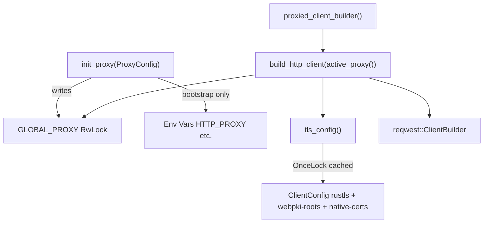

# HTTP Client

# HTTP Client (`librefang-http`)

Centralized HTTP client construction with proxy support, TLS fallback to bundled CA roots, and timeouts. All outbound HTTP traffic in the codebase routes through this module to ensure consistent proxy handling and TLS configuration.

## Architecture



## Initialization Sequence

At daemon startup, before the Tokio runtime spawns worker threads:

1. **Call `init_proxy(cfg)`** once with the `[proxy]` section from `config.toml`. This:
   - Stores the config in a global `RwLock<Option<ProxyConfig>>`.
   - Exports proxy values as environment variables (`HTTP_PROXY`, `HTTPS_PROXY`, `NO_PROXY`) during the initial bootstrap call only, because `std::env::set_var` is unsound in a multi-threaded context. Subsequent hot-reload calls update `GLOBAL_PROXY` without touching env vars.
   - Validates proxy URL schemes, logging a warning for invalid URLs (valid: `http://`, `https://`, `socks5://`, `socks5h://`).

2. **TLS is lazily initialized** on first client build via `tls_config()`, which returns a cached `rustls::ClientConfig`.

No further setup is required. All downstream code calls `proxied_client()` or `proxied_client_builder()` to get a ready-to-use client.

## TLS Configuration

The TLS stack solves a specific problem: on minimal environments (musl builds on Termux/Android, minimal Docker images), system CA certificates may be absent or incomplete, causing `reqwest`'s default TLS initialization to panic.

`init_tls_config()` builds the root certificate store in two steps:

1. **Bundled Mozilla CA roots** via `webpki_roots::TLS_SERVER_ROOTS` — always present, covering all major public CAs.
2. **System CA certificates** via `rustls_native_certs::load_native_certs()` — adds organization-internal and self-signed CAs without requiring a librefang release.

The result is cached in a `OnceLock<rustls::ClientConfig>` and cloned for each client. The AWS LC RS crypto provider is used via `rustls::crypto::aws_lc_rs::default_provider()`.

Use `tls_config()` directly if you need the `rustls::ClientConfig` for a custom client (as `librefang-cli` does).

## Public API

### Proxy Configuration

| Function | Description |
|---|---|
| `init_proxy(cfg: ProxyConfig)` | Set or hot-reload the global proxy config. Safe to call multiple times. |
| `active_proxy() -> ProxyConfig` | Read the current global proxy config. Returns `Default::default()` if uninitialized. |

### Client Constructors

| Function | Returns | Use When |
|---|---|---|
| `proxied_client()` | `reqwest::Client` | You need a ready client and are fine with defaults. |
| `proxied_client_builder()` | `reqwest::ClientBuilder` | You need to customize timeouts, headers, etc. before building. |
| `proxied_client_fallback()` | `reqwest::Client` | A per-provider proxy override failed; adds a 300s total timeout as a safety net. |
| `proxied_client_with_override(url)` | `reqwest::Result<reqwest::Client>` | A specific provider has its own proxy URL. Returns `Err` on invalid URLs — never silently falls back. |
| `build_http_client(proxy)` | `reqwest::ClientBuilder` | You have a `ProxyConfig` already and want to bypass the global state. |
| `client_builder()` | `reqwest::ClientBuilder` | Backward-compatible alias for `proxied_client_builder()`. |
| `new_client()` | `reqwest::Client` | Backward-compatible alias for `proxied_client()`. |

### TLS

| Function | Returns | Description |
|---|---|---|
| `tls_config()` | `rustls::ClientConfig` | Cached TLS config with bundled + system CA roots. |

## Proxy Resolution Order

When building a client via `build_http_client`:

1. **Explicit `ProxyConfig` fields** — if `http_proxy` or `https_proxy` is `Some(url)` in the config, it's applied directly to the builder via `reqwest::Proxy::http(url)` / `reqwest::Proxy::https(url)`.
2. **Environment variable fallback** — when a config field is `None`, reqwest's built-in env var detection reads `HTTP_PROXY` / `HTTPS_PROXY` / `NO_PROXY` automatically. Since `init_proxy` exports config values to env vars at bootstrap, this covers crates that build their own clients independently.
3. **NoProxy filter** — only set from explicit `ProxyConfig.no_proxy`. Not applied when the field is `None`, avoiding conflicts with reqwest's env var detection.

This design avoids double-applying proxy settings while ensuring all code paths pick up the configured proxy.

## Timeouts

Default timeouts are baked into every client builder to prevent stalled upstreams from wedging the agent loop:

| Timeout | Duration | Scope |
|---|---|---|
| `connect_timeout` | 30s | TCP + TLS handshake per request |
| `read_timeout` | 300s | Per-read inactivity (not total request time). Streaming LLM responses stay alive as long as tokens arrive. |
| `timeout` (fallback client only) | 300s | Total per-request budget, applied only by `proxied_client_fallback()`. |

Callers can override these on the `ClientBuilder` returned by `proxied_client_builder()`.

## User Agent

All clients set `User-Agent: librefang/<version>` via `concat!("librefang/", env!("CARGO_PKG_VERSION"))`.

## Thread Safety

- **`GLOBAL_PROXY`** — protected by `RwLock`. `init_proxy` takes a write lock; `active_proxy` takes a read lock. Hot-reload calls overwrite the value safely.
- **`TLS_CONFIG`** — `OnceLock` ensures single initialization. Cloning the `ClientConfig` is cheap.
- **Environment variables** — only mutated during the synchronous bootstrap phase (before Tokio runtime starts). Hot-reload skips `set_var` entirely.

## Usage Examples

### Basic: get a client for an HTTP request

```rust
let client = librefang_http::proxied_client();
let resp = client.get("https://api.example.com/health").send().await?;
```

### Custom: adjust timeouts before building

```rust
let client = librefang_http::proxied_client_builder()
    .timeout(std::time::Duration::from_secs(60))
    .build()?;
```

### Per-provider proxy override with fallback

```rust
match librefang_http::proxied_client_with_override(&provider.proxy_url) {
    Ok(client) => client,
    Err(e) => {
        tracing::warn!("invalid proxy for provider {}: {e}", provider.id);
        librefang_http::proxied_client_fallback()
    }
}
```

### Direct TLS config for a custom client

```rust
let tls = librefang_http::tls_config();
let client = reqwest::Client::builder()
    .use_preconfigured_tls(tls)
    .build()?;
```

## Consumers Across the Codebase

This module is a leaf dependency used pervasively:

- **Provider health probing** — `probe_client` in `librefang-runtime/src/provider_health.rs`
- **OAuth flows** — Copilot device flow, ChatGPT device auth, MCP OAuth discovery
- **Media transcription** — Whisper, Gemini, ElevenLabs integrations in `librefang-runtime-media`
- **Plugin management** — installation, updates, registry search
- **Tool execution** — web fetch, web search, location lookups
- **Image generation** — `librefang-runtime/src/image_gen.rs`
- **Webhook testing** — `src/routes/webhooks.rs`
- **Cron bridge** — response delivery, fan-out HTTP clients
- **CLI** — `librefang-cli` uses `tls_config()` directly for its own client construction