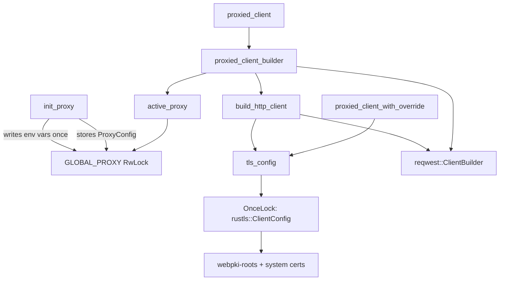

# HTTP Infrastructure

# HTTP Infrastructure (`librefang-http`)

Centralized HTTP client construction with proxy support and resilient TLS configuration. Every outbound HTTP connection in the application should flow through this module so that proxy settings, CA trust anchors, timeouts, and user-agent headers are applied uniformly.

## Why This Module Exists

Two problems arise when using `reqwest` with its defaults:

1. **Missing system CA certificates.** On musl builds (Termux/Android), minimal Docker images, or corporate Linux with partial CA bundles, `reqwest`'s default TLS initialization panics because there are no system roots to trust. This module seeds the trust store with bundled Mozilla CA roots (`webpki-roots`) first, then supplements with whatever system certs exist.

2. **Scattered proxy configuration.** Without a central builder, each crate would need to independently read proxy settings from config or environment variables, leading to inconsistencies. This module owns proxy configuration globally and bakes it into every client it produces.

## Architecture



## Initialization Sequence

At daemon startup, call `init_proxy` once with the `[proxy]` section from `config.toml`. This must happen **before** the Tokio runtime spawns worker threads.

```rust
let proxy_config: ProxyConfig = config.proxy;
librefang_http::init_proxy(proxy_config);
```

`init_proxy` does two things:

1. **Exports environment variables** (`HTTP_PROXY`, `HTTPS_PROXY`, `NO_PROXY` and their lowercase variants) during the initial call only — when `GLOBAL_PROXY` is still `None`. This ensures that crates building their own `reqwest::Client` without using this module still pick up proxy settings via reqwest's built-in env-var detection.

2. **Stores the `ProxyConfig`** in a global `RwLock<Option<ProxyConfig>>` for subsequent reads by `proxied_client_builder`. This value can be updated on hot-reload without touching environment variables (since `std::env::set_var` is unsound in a multi-threaded context).

### Thread Safety Constraint

Environment variables are set only during the initial bootstrap call, which occurs while the process is still single-threaded. Hot-reload calls update `GLOBAL_PROXY` only, avoiding the race condition inherent in `std::env::set_var` from a multi-threaded Tokio runtime.

## TLS Configuration

The TLS stack uses `rustls` with the `aws_lc_rs` cryptographic provider. The root certificate store is assembled in two layers:

| Layer | Source | Purpose |
|-------|--------|---------|
| 1 | `webpki_roots::TLS_SERVER_ROOTS` (bundled Mozilla CA roots) | Always present — guarantees common public CAs are trusted |
| 2 | `rustls_native_certs::load_native_certs()` (system cert store) | Adds org-internal/self-signed CAs and keeps trust anchors current |

Layer 2 is best-effort. If no system certificates are found, a debug log is emitted and the bundled roots are used exclusively.

The resulting `rustls::ClientConfig` is computed once, cached in a `OnceLock`, and cloned for every client. This avoids repeated certificate parsing on each request.

Access it directly via `tls_config()` if you need a preconfigured TLS config for a custom client outside the standard builders.

## Public API

### Startup / Configuration

| Function | Description |
|----------|-------------|
| `init_proxy(cfg: ProxyConfig)` | Set the global proxy configuration. Call once at startup; may be called again for hot-reload. |
| `tls_config() -> rustls::ClientConfig` | Return the cached TLS config (bundled + system CA roots). |

### Client Builders

| Function | Returns | Description |
|----------|---------|-------------|
| `proxied_client_builder()` | `reqwest::ClientBuilder` | Builder with global proxy settings and resilient TLS applied. Caller can add `.timeout()`, custom headers, etc., then call `.build()`. |
| `proxied_client()` | `reqwest::Client` | Ready-to-use client. Panics if construction fails (it shouldn't). |
| `proxied_client_with_override(proxy_url)` | `reqwest::Client` | Routes all traffic through the given proxy URL, ignoring the global config. Falls back to `proxied_client()` if the URL is invalid. Used for per-provider proxy overrides. |
| `build_http_client(proxy: &ProxyConfig)` | `reqwest::ClientBuilder` | Lower-level builder that accepts an explicit `ProxyConfig` instead of reading global state. |

### Backward-Compatible Aliases

| Alias | Delegates to |
|-------|-------------|
| `client_builder()` | `proxied_client_builder()` |
| `new_client()` | `proxied_client()` |

Prefer the `proxied_*` names in new code.

## Proxy Resolution Order

When a client is built via `proxied_client_builder()`, proxy settings are resolved as follows:

1. **Explicit `ProxyConfig` fields** (from `config.toml`'s `[proxy]` section) are applied directly to the builder as `Proxy::http()` and `Proxy::https()` entries with the configured `NoProxy` filter.
2. **When a `ProxyConfig` field is `None`**, no proxy is explicitly set on the builder, so reqwest falls back to reading `HTTP_PROXY` / `HTTPS_PROXY` / `NO_PROXY` environment variables — which `init_proxy` already populated during bootstrap.
3. **URL validation** rejects proxy URLs that don't use `http://`, `https://`, `socks5://`, or `socks5h://` schemes, logging a warning with the redacted URL.

This avoids double-applying proxy settings while ensuring consistency across all consumers.

## Default Timeouts

`build_http_client` applies per-request defaults:

- **Connect timeout:** 30 seconds — caps TCP/TLS handshake, generous for slow international links to LLM providers.
- **Read timeout:** 300 seconds — per-read inactivity timeout, **not** total request time. Streaming LLM responses keep this alive as long as tokens arrive; a true upstream stall triggers it.

Callers can override both by calling `.timeout()` or `.connect_timeout()` on the returned `ClientBuilder`.

## Usage Across the Codebase

This module is the sole HTTP client factory for the application. Callers span nearly every subsystem:

- **LLM provider communication:** `probe_model`, `probe_provider`, `probe_api_key` in the runtime
- **OAuth flows:** `start_device_auth_flow`, `poll_device_auth_flow`, `exchange_code_for_tokens_with_redirect_uri`, `refresh_access_token`
- **MCP servers:** `connect_http_compat`, `connect_sse`
- **Media processing:** `generate_image`, `whisper_transcribe`, `gemini_transcribe`, `elevenlabs_transcribe`
- **TTS:** `synthesize_openai`, `synthesize_elevenlabs`
- **Web tools:** `tool_web_fetch_legacy`, `tool_web_search_legacy`, `tool_location_get`, `host_net_fetch`
- **Device pairing:** `notify_devices`
- **CLI:** `client_builder` in `librefang-cli`

Most consumers call `proxied_client()` for a ready-to-use client. Consumers that need to customize timeouts, headers, or other settings use `proxied_client_builder()` instead.

## ProxyConfig Fields

The `ProxyConfig` struct (from `librefang-types`) contains:

```rust
struct ProxyConfig {
    http_proxy: Option<String>,   // e.g. "http://proxy.corp:8080"
    https_proxy: Option<String>,  // e.g. "socks5h://proxy.corp:1080"
    no_proxy: Option<String>,     // e.g. "localhost,127.0.0.1,.corp.internal"
}
```

All fields are optional. When every field is `None` (the default), no proxy is configured and connections are made directly. URLs are validated at initialization time; invalid schemes produce a warning and are ignored.