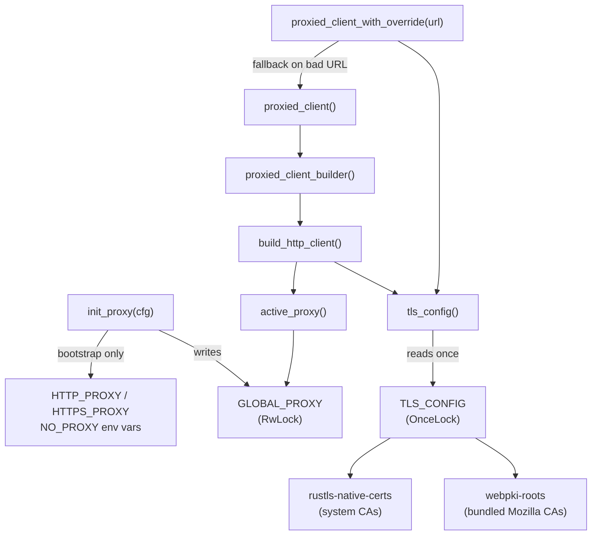

# HTTP Infrastructure

# `librefang-http` — Centralized HTTP Client with Proxy & TLS Fallback

## Purpose

Every outbound HTTP connection in the application passes through this module. It guarantees two things that vanilla `reqwest` clients don't provide out of the box:

1. **TLS works everywhere** — even on systems without system CA certificates (musl builds, Termux, minimal Docker images) by bundling Mozilla CA roots as a fallback.
2. **Proxy settings are uniform** — a single `init_proxy()` call at daemon startup configures proxy routing for the entire process, and hot-reload updates it without restarting.

All downstream crates (`librefang-runtime`, `librefang-runtime-mcp`, `librefang-runtime-oauth`, `librefang-cli`, `librefang-kernel`, etc.) call `proxied_client()` or `proxied_client_builder()` instead of constructing their own `reqwest::Client`.

---

## Architecture



---

## Initialization Sequence

At daemon startup, call `init_proxy` with the `[proxy]` section from `config.toml`:

```rust
let proxy_cfg: ProxyConfig = config.proxy.clone();
librefang_http::init_proxy(proxy_cfg);
```

This does two things:

1. **Sets environment variables** (`HTTP_PROXY`, `HTTPS_PROXY`, `NO_PROXY` and their lowercase equivalents) — but **only on the first call**, when `GLOBAL_PROXY` is still `None`. This happens before the Tokio runtime spawns worker threads, so `std::env::set_var` is safe.

2. **Stores the config** in `GLOBAL_PROXY` (a `RwLock<Option<ProxyConfig>>`). Subsequent calls (hot-reload) update only this in-memory value, avoiding the racy `set_var` in a multi-threaded context.

The TLS config (`tls_config()`) initializes itself lazily on first use — no explicit setup required.

---

## TLS Configuration

`tls_config()` returns a `rustls::ClientConfig` that combines two certificate sources:

| Source | Purpose |
|---|---|
| `webpki_roots::TLS_SERVER_ROOTS` | Bundled Mozilla CA roots. Always present, ensures public CAs are trusted everywhere. |
| `rustls_native_certs::load_native_certs()` | System CA certificates. Adds org-internal/self-signed CAs and keeps trust anchors current. |

Loading happens once via a `OnceLock`. All client builders clone the cached config, so there's no repeated certificate parsing.

---

## Public API

### Proxy Setup

| Function | Description |
|---|---|
| `init_proxy(cfg: ProxyConfig)` | Set or update the global proxy configuration. Idempotent; safe for hot-reload. |
| `active_proxy() -> ProxyConfig` | Returns the current global config (private). Falls back to `ProxyConfig::default()` if uninitialized. |

### Client Construction

| Function | Returns | When to use |
|---|---|---|
| `proxied_client()` | `reqwest::Client` | Most common. Ready-to-use client with global proxy + TLS. |
| `proxied_client_builder()` | `reqwest::ClientBuilder` | When you need to customize timeouts, headers, or other options before building. |
| `proxied_client_with_override(proxy_url: &str)` | `reqwest::Client` | When a specific provider needs its own proxy. Falls back to the global client if the URL is invalid. |
| `build_http_client(proxy: &ProxyConfig)` | `reqwest::ClientBuilder` | Lower-level. Applies an explicit `ProxyConfig` rather than reading global state. |
| `client_builder()` / `new_client()` | — | Backward-compatible aliases for `proxied_client_builder()` / `proxied_client()`. |

### TLS

| Function | Description |
|---|---|
| `tls_config() -> rustls::ClientConfig` | Returns the cached TLS config. Called internally by all builders; also available for crates that need it directly (e.g. `librefang-cli`). |

---

## Default Timeouts

`build_http_client` applies sensible per-request defaults to prevent the agent loop from hanging indefinitely:

- **Connect timeout**: 30 seconds — caps TCP + TLS handshake, generous for slow international links.
- **Read timeout**: 300 seconds — per-read inactivity timeout (not total request time). Streaming LLM responses stay alive as long as tokens arrive; a true upstream stall triggers it.

Callers can override both on the returned `ClientBuilder` via `.timeout()` and `.connect_timeout()`.

---

## Proxy Resolution Logic

The proxy applied to any given request is determined in this order:

1. **Explicit `ProxyConfig` values** from `config.toml` — set directly on the `reqwest::ClientBuilder` as `Proxy::http()` / `Proxy::https()` with a `NoProxy` filter.
2. **Environment variables** — when `ProxyConfig` fields are `None`, `reqwest` reads `HTTP_PROXY` / `HTTPS_PROXY` / `NO_PROXY` automatically. Since `init_proxy` exports config values as env vars during bootstrap, this keeps third-party crates that build their own clients consistent.
3. **No proxy** — if nothing is configured, requests go direct.

Supported proxy URL schemes: `http://`, `https://`, `socks5://`, `socks5h://`. Invalid schemes are logged (with the URL redacted) and ignored.

---

## Usage Patterns

### Basic — get a client and make a request

```rust
let client = librefang_http::proxied_client();
let resp = client.get("https://api.example.com/v1/models").send().await?;
```

### Custom timeout for a slow endpoint

```rust
let client = librefang_http::proxied_client_builder()
    .timeout(std::time::Duration::from_secs(600))
    .build()?;
```

### Per-provider proxy override

```rust
// Used by e.g. librefang-channels OpenAI driver when a provider
// specifies its own proxy in the config.
let client = librefang_http::proxied_client_with_override("socks5://corp-proxy:1080");
```

### During daemon startup

```rust
// Called once, before spawning the Tokio runtime
librefang_http::init_proxy(config.proxy);

// Later, during hot-reload (multi-threaded context is safe)
librefang_http::init_proxy(new_proxy_config);
```

---

## Thread Safety

| State | Guard | Notes |
|---|---|---|
| `TLS_CONFIG` | `OnceLock` | Write-once, lock-free reads afterward. |
| `GLOBAL_PROXY` | `RwLock` | Reads on every client construction; writes during `init_proxy` (startup + hot-reload). |
| Environment variables | N/A | Only written during initial bootstrap (single-threaded). Never mutated after the Tokio runtime starts. |

---

## Downstream Consumers

The call graph shows this module is used pervasively across the codebase:

- **`librefang-runtime`** — LLM provider drivers, web search/fetch, embedding, image generation, TTS, media transcription, model probing, health checks.
- **`librefang-runtime-mcp`** — MCP server connections (HTTP compat, SSE).
- **`librefang-runtime-oauth`** — OAuth device flows (ChatGPT, Copilot), token refresh.
- **`librefang-runtime-wasm`** — Host network fetch from WASM plugins.
- **`librefang-cli`** — CLI HTTP client with TLS config.
- **`librefang-kernel`** — Device pairing notifications.

All of these go through `proxied_client()` or `proxied_client_builder()`, ensuring consistent proxy routing and TLS behavior.