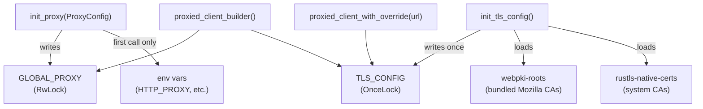

# HTTP Infrastructure

# HTTP Infrastructure (`librefang-http`)

## Purpose

All outbound HTTP connections in librefang flow through this module. It provides a single source of truth for:

- **TLS roots** that work on any system, including minimal Docker images and Termux/Android where system CA certificates may be absent.
- **Proxy settings** loaded from `config.toml` and shared across every crate, including those that build their own `reqwest::Client`.

By centralizing these concerns, the module ensures that a proxy configuration change in one place propagates to every HTTP call — LLM provider requests, OAuth flows, webhook deliveries, plugin lookups, and media transcription.

## Architecture


```mermaid
graph TD
    A["init_proxy(ProxyConfig)"] -->|writes| G["GLOBAL_PROXY<br/>(RwLock)"]
    A -->|first call only| E["env vars<br/>(HTTP_PROXY, etc.)"]
    B["init_tls_config()"] -->|writes once| T["TLS_CONFIG<br/>(OnceLock)"]
    B -->|loads| W["webpki-roots<br/>(bundled Mozilla CAs)"]
    B -->|loads| N["rustls-native-certs<br/>(system CAs)"]
    C["proxied_client_builder()"] --> G
    C --> T
    D["proxied_client_with_override(url)"] --> T
```

The two global singletons — `TLS_CONFIG` and `GLOBAL_PROXY` — are lazily initialized and thread-safe. Every public builder reads from them.

---

## TLS Configuration

### Problem

On systems without a populated system certificate store (musl builds, Termux, minimal Docker images), `reqwest`'s default TLS backend panics during initialization because it cannot find any root certificates to trust.

### Solution

`tls_config()` returns a `rustls::ClientConfig` built in two layers:

1. **Bundled Mozilla CA roots** (`webpki-roots`) — always loaded first. This guarantees that common public CAs (Let's Encrypt, DigiCert, etc.) are trusted regardless of the host system.
2. **System CA certificates** (`rustls-native-certs`) — loaded as a supplement. This adds organization-internal or self-signed CAs, and keeps trust anchors up-to-date without requiring a librefang release.

The combined root store is cached in a `OnceLock` after the first call. Subsequent calls receive a cheap clone of the `ClientConfig`.

```rust
// Internally called by every client builder
pub fn tls_config() -> rustls::ClientConfig
```

You generally don't call this directly — the builder functions use it automatically. The one external consumer is `librefang-cli`, which uses `tls_config()` to build a CLI-specific client with the same TLS guarantees.

### Crypto provider

TLS uses `rustls::crypto::aws_lc_rs::default_provider()` (AWS LC RSA). This is a FIPS-capable backend selected for broad platform compatibility.

---

## Proxy Configuration

### Initialization

At daemon startup, before the Tokio runtime spawns worker threads, call `init_proxy` once with the `[proxy]` section from `config.toml`:

```rust
let proxy_cfg: ProxyConfig = config.proxy.clone();
init_proxy(proxy_cfg);
```

This function does two things:

1. **Writes `GLOBAL_PROXY`** — an `RwLock<Option<ProxyConfig>>` that `proxied_client_builder()` reads on every call.
2. **Exports environment variables** (`HTTP_PROXY`, `HTTPS_PROXY`, `NO_PROXY` and their lowercase equivalents) — but **only on the initial call**, when `GLOBAL_PROXY` is still `None`. This ensures `set_var` runs in a single-threaded context before the async runtime starts, avoiding the inherent data race of `set_var` in multi-threaded programs.

### Hot-reload

`init_proxy` can be called again (e.g., on SIGHUP or config file change). On subsequent calls, only `GLOBAL_PROXY` is updated. Environment variables are left untouched because `set_var` is unsound once worker threads exist.

### Proxy URL validation

`init_proxy` validates proxy URLs before exporting them. Only schemes `http://`, `https://`, `socks5://`, and `socks5h://` are accepted. Invalid URLs trigger a `tracing::warn!` with the redacted URL and are silently skipped.

### Resolution order within client builders

When `build_http_client` constructs a `reqwest::ClientBuilder`:

- If `ProxyConfig.http_proxy` / `https_proxy` are `Some(url)`, the URL is applied directly as an explicit `reqwest::Proxy`.
- If those fields are `None`, **no proxy is set on the builder** — reqwest's built-in env-var detection reads `HTTP_PROXY` / `HTTPS_PROXY` and applies them automatically. This avoids double-application since `init_proxy` already exported the env vars.
- `no_proxy` from config is parsed into a `reqwest::NoProxy` filter and attached to each proxy that is explicitly set.

---

## Client Builder Functions

### Primary API

| Function | Returns | Purpose |
|---|---|---|
| `proxied_client_builder()` | `reqwest::ClientBuilder` | Builder with global proxy + TLS. Call `.build()` yourself if you need to set additional options. |
| `proxied_client()` | `reqwest::Client` | Ready-to-use client. Most code should use this. |
| `proxied_client_fallback()` | `reqwest::Client` | Like `proxied_client()` but enforces a **300-second total timeout** per request. Used when a per-provider proxy override is invalid and you need a safe fallback (see #3756). |

### Per-provider proxy override

```rust
pub fn proxied_client_with_override(proxy_url: &str) -> reqwest::Result<reqwest::Client>
```

Routes **all** traffic (HTTP and HTTPS) through a single proxy URL, ignoring the global config. Returns `Err` if the URL is invalid or the client fails to build. Callers are responsible for falling back to `proxied_client()` on error — this function never silently falls back.

### Backward-compatible aliases

- `client_builder()` → `proxied_client_builder()`
- `new_client()` → `proxied_client()`

### Low-level builder

```rust
pub fn build_http_client(proxy: &ProxyConfig) -> reqwest::ClientBuilder
```

Accepts an explicit `ProxyConfig` rather than reading `GLOBAL_PROXY`. Useful in tests or when you need a client with a specific proxy configuration that differs from the global one.

### Default timeouts

All clients built through this module set sensible defaults:

| Timeout | Duration | Rationale |
|---|---|---|
| `connect_timeout` | 30s | Caps TCP + TLS handshake. Generous for slow international links. |
| `read_timeout` | 300s | Per-read inactivity timeout. Streaming LLM responses stay alive as long as tokens arrive; a true upstream stall fires this. |
| `timeout` (fallback only) | 300s | Total per-request budget on `proxied_client_fallback()`. |

Callers can override any of these on the `ClientBuilder` before calling `.build()`.

### User-Agent

Every client sends `librefang/<version>` as the `User-Agent` header, where `<version>` is the crate version at compile time.

---

## Usage Patterns

### Typical daemon usage

```rust
// 1. During startup, before tokio runtime:
init_proxy(config.proxy);

// 2. Anywhere in async code:
let client = proxied_client();
let resp = client.get("https://api.example.com/health").send().await?;
```

### Custom client options

```rust
let client = proxied_client_builder()
    .timeout(Duration::from_secs(10))
    .pool_max_idle_per_host(2)
    .build()?;
```

### Per-provider proxy with fallback

```rust
match proxied_client_with_override(&provider.proxy_url) {
    Ok(client) => client,
    Err(e) => {
        tracing::warn!("invalid proxy for provider {}: {e}", provider.name);
        proxied_client_fallback()
    }
}
```

---

## Thread Safety

| State | Type | Access pattern |
|---|---|---|
| `TLS_CONFIG` | `OnceLock<ClientConfig>` | Write once (lazy init), read many. No locks on reads after init. |
| `GLOBAL_PROXY` | `RwLock<Option<ProxyConfig>>` | Written by `init_proxy` (startup + hot-reload). Read by `active_proxy()` on every client build. |

The `unsafe` `set_var` calls in `init_proxy` are guarded by an `is_initial` check that confirms `GLOBAL_PROXY` is still `None`. This check runs before the Tokio runtime spawns worker threads, guaranteeing no concurrent readers exist at that point. Hot-reload calls skip `set_var` entirely.

---

## Consumers

The call graph shows this module is used pervasively across the codebase:

- **LLM provider drivers** (`chatgpt`, `copilot`) — OAuth flows and token refresh
- **Runtime media** (`media_understanding`) — Whisper, Gemini, ElevenLabs, OpenAI image description
- **MCP runtime** — OAuth metadata discovery, tool registration
- **API routes** — plugin search, webhook testing, URL attachment resolution, dashboard sync
- **RL export** — WandB, Atropos, Tinker integrations
- **Cron bridge** — fan-out HTTP clients and response delivery
- **Provider health** — probing endpoints via `probe_client`