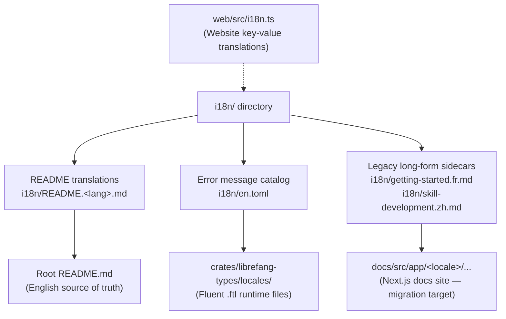

# i18n

# i18n — Internationalization

## Purpose

The `i18n/` directory manages all non-English content for the LibreFang project. It is not a compiled module — it contains translated documentation, a human-readable error message catalog, and legacy long-form guides. The directory serves as the coordination point for contributors adding or maintaining translations across the project.

## Translation Surfaces

LibreFang has **three distinct surfaces** that require internationalization. Each has a different source of truth and a different workflow.



### 1. Project README

| Aspect | Detail |
|---|---|
| **Source of truth** | Root `README.md` (English) |
| **Translated copies** | `i18n/README.<lang>.md` |
| **Current languages** | `de`, `es`, `fr`, `ja`, `ko`, `pl`, `uk`, `zh` |

Each `README.<lang>.md` is a full-document translation of the root README. The language switcher bar at the top of every README file — English and translated alike — is the only discovery mechanism for readers, so it must be updated in **every** file whenever a language is added.

### 2. Runtime Error Messages

The file `i18n/en.toml` is a TOML key-value catalog of all translatable error messages, organized by domain (`agent`, `message`, `template`, `manifest`, `auth`, `session`, `workflow`, `trigger`, `budget`, `config`, `profile`, `cron`, `general`).

```toml
[agent]
not-found      = "Agent not found"
spawn-failed   = "Agent spawn failed"

[message]
delivery-failed = "Message delivery failed: {reason}"
```

**Important:** `en.toml` is *not* loaded at runtime. The actual translation lookup uses Fluent (`.ftl`) files located at `crates/librefang-types/locales/`. The TOML file exists as a human-readable reference catalog and for use by external tooling. When adding new error messages, update both `en.toml` and the corresponding `.ftl` files.

Placeholders like `{reason}`, `{name}`, `{error}`, `{step}` are interpolation variables filled in by the Rust runtime — preserve them exactly when translating.

### 3. Website Translations

The marketing website (`web/`) has its own key-value translation system in `web/src/i18n.ts`. Translator-authored locale objects live in `rawTranslations`, and the runtime lookup via `getTranslation(lang)` allows partial locale objects — missing keys fall back to English automatically.

This is separate from the `i18n/` directory but follows the same contributor workflow.

## Adding a New Language

1. **Copy** the root `README.md` into `i18n/README.<lang>.md`, where `<lang>` is the [ISO 639-1 code](https://en.wikipedia.org/wiki/List_of_ISO_639-1_codes) (e.g., `pt` for Portuguese, `it` for Italian).

2. **Translate** all content into the target language.

3. **Update the language switcher** in your new file *and in every existing README* — the root `README.md` plus all `i18n/README.*.md` files. The switcher looks like:
   ```html
   <a href="../README.md">English</a> | <a href="README.zh.md">中文</a> | ...
   ```
   Add your language's link to this bar in every file.

4. **Keep relative links intact** — `../CONTRIBUTING.md`, `../GOVERNANCE.md`, `../SECURITY.md`, image paths, and badge URLs must remain pointing to the English originals. Do not duplicate those files.

5. **Submit a PR.**

## Keeping Translations in Sync

This project uses full-document translations, not key-value extraction. When the English `README.md` changes:

1. Review the diff to identify new or modified sections.
2. Update each language file in the same structural position.
3. If you cannot translate to all languages, update the ones you can and open issues for the remaining languages.

## Legacy Long-Form Sidecars

Two legacy translated guides currently live in `i18n/`:

- `getting-started.fr.md` — linked from `README.fr.md`
- `skill-development.zh.md` — linked from `README.zh.md`

These are being phased out. **New translated long-form content should go under `docs/src/app/<locale>/<slug>/`** in the Next.js docs site, not as sidecar files in `i18n/`. Existing sidecars remain reachable via links from their corresponding README translations until migrated.

The French README explicitly notes this transitional state:

> *Ce README en français est un squelette de navigation... Une traduction complète est prévue en suivi (voir issue #3399).*

## Website Locale Audit

Before opening a PR for a website locale intended to be complete, run the raw-key audit:

```bash
cd web
pnpm i18n:audit uk          # audit a single locale
pnpm i18n:audit --all       # list every incomplete website locale
```

The audit reports keys present in `rawTranslations.en` but missing from the target raw locale. This is a translator tool — CI independently verifies the runtime fallback contract.

## Style Guidelines

| Guideline | Detail |
|---|---|
| **Conciseness** | Match the tone and length of the English original. Avoid adding extra commentary. |
| **Markup preservation** | HTML tags, badge URLs, image paths, and link targets remain unchanged. |
| **Formatting** | Preserve heading levels, table structure, and code blocks exactly. |
| **Natural phrasing** | Prefer idiomatic expressions over literal word-for-word translation. |
| **Technical terms** | Keep well-known terms in English: "Rust", "crate", "CLI", "API", "WebAssembly", "WASM", "MCP", "daemon". Translate descriptive text around them. |
| **Terminology consistency** | Use the same translated term for a concept throughout the entire document. |
| **Brand names** | Never translate: "LibreFang", "Hands", "Hand" (as product names), "FangHub", "OFP". |

## Testing Translations

Before submitting a PR:

1. **Visual review** — open the markdown in a GitHub preview or markdown viewer.
2. **Link check** — verify all relative links (`../README.md`, `../CONTRIBUTING.md`, etc.) resolve from the `i18n/` directory.
3. **Badge check** — confirm shield.io badges and image URLs render.
4. **Navigation check** — click through the language switcher to verify all cross-links work.
5. **Diff comparison** — compare your translation section-by-section against the English original to ensure nothing is missing.

## Directory Structure

```
i18n/
├── README.md                  # This guide (i18n contributor documentation)
├── en.toml                    # English error message catalog (reference for .ftl files)
│
├── README.de.md               # German
├── README.es.md               # Spanish
├── README.fr.md               # French
├── README.ja.md               # Japanese
├── README.ko.md               # Korean
├── README.pl.md               # Polish
├── README.uk.md               # Ukrainian
├── README.zh.md               # Chinese
│
├── getting-started.fr.md      # Legacy sidecar (migrating to docs site)
└── skill-development.zh.md    # Legacy sidecar (migrating to docs site)
```

## Related Files Outside This Directory

| Path | Role |
|---|---|
| `crates/librefang-types/locales/` | Fluent `.ftl` files for runtime error message translation |
| `web/src/i18n.ts` | Website key-value translations with runtime fallback |
| `docs/src/app/<locale>/...` | Next.js docs site localized routes (target for long-form translations) |
| `README.md` | English source of truth for all README translations |