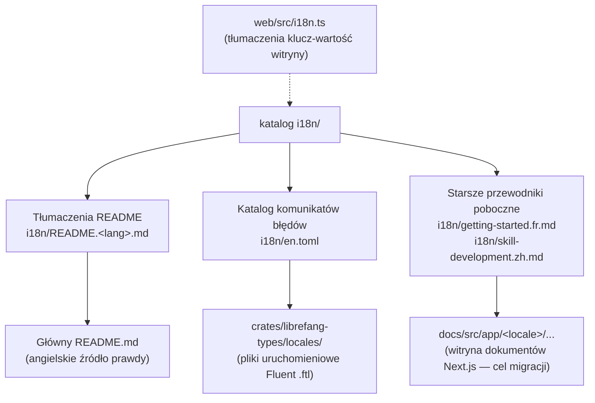

# i18n

# i18n — Internacjonalizacja

## Cel

Katalog `i18n/` zarządza całością treści nieanglojęzycznych w projekcie LibreFang. Nie jest to kompilowany moduł — zawiera przetłumaczoną dokumentację, czytelny dla człowieka katalog komunikatów błędów oraz starsze przewodniki w długiej formie. Katalog stanowi punkt koordynacji dla współtwórców dodających lub utrzymujących tłumaczenia w całym projekcie.

## Powierzchnie tłumaczeń

LibreFang ma **trzy odrębne powierzchnie**, które wymagają internacjonalizacji. Każda z nich ma inne źródło prawdy i inny przepływ pracy.



### 1. README projektu

| Aspekt | Szczegół |
|---|---|
| **Źródło prawdy** | Główny `README.md` (angielski) |
| **Przetłumaczone kopie** | `i18n/README.<lang>.md` |
| **Bieżące języki** | `de`, `es`, `fr`, `ja`, `ko`, `pl`, `uk`, `zh` |

Każdy `README.<lang>.md` jest pełnym tłumaczeniem dokumentu z głównego README. Pasek przełączania języków na górze każdego pliku README — zarówno angielskiego, jak i przetłumaczonych — to jedyny mechanizm odkrywania dla czytelników, dlatego należy go aktualizować w **każdym** pliku przy dodawaniu nowego języka.

### 2. Komunikaty błędów uruchomieniowe

Plik `i18n/en.toml` to katalog klucz-wartość w formacie TOML zawierający wszystkie tłumaczone komunikaty błędów, zorganizowany według domeny (`agent`, `message`, `template`, `manifest`, `auth`, `session`, `workflow`, `trigger`, `budget`, `config`, `profile`, `cron`, `general`).

```toml
[agent]
not-found      = "Agent not found"
spawn-failed   = "Agent spawn failed"

[message]
delivery-failed = "Message delivery failed: {reason}"
```

**Ważne:** `en.toml` *nie jest* ładowany w czasie uruchomienia. Rzeczywiste wyszukiwanie tłumaczeń korzysta z plików Fluent (`.ftl`) znajdujących się w `crates/librefang-types/locales/`. Plik TOML istnieje jako czytelny dla człowieka katalog referencyjny oraz do wykorzystania przez zewnętrzne narzędzia. Przy dodawaniu nowych komunikatów błędów należy zaktualizować zarówno `en.toml`, jak i odpowiednie pliki `.ftl`.

Miejsca zastępcze takie jak `{reason}`, `{name}`, `{error}`, `{step}` to zmienne interpolacji wypełniane przez środowisko uruchomieniowe Rust — należy je zachować dokładnie w tłumaczeniu.

### 3. Tłumaczenia witryny

Witryna marketingowa (`web/`) ma własny system tłumaczeń klucz-wartość w `web/src/i18n.ts`. Obiekty lokalne tworzone przez tłumaczy znajdują się w `rawTranslations`, a wyszukiwanie uruchomieniowe za pomocą `getTranslation(lang)` pozwala na częściowe obiekty lokalne — brakujące klucze automatycznie wracają do angielskich.

System ten jest oddzielony od katalogu `i18n/`, ale podąża za tym samym przepływem pracy współtwórców.

## Dodawanie nowego języka

1. **Skopiuj** główny `README.md` do `i18n/README.<lang>.md`, gdzie `<lang>` to [kod ISO 639-1](https://en.wikipedia.org/wiki/List_of_ISO_639-1_codes) (np. `pt` dla portugalskiego, `it` dla włoskiego).

2. **Przetłumacz** całą treść na język docelowy.

3. **Zaktualizuj pasek przełączania języków** w nowym pliku *oraz we wszystkich istniejących README* — w głównym `README.md` oraz we wszystkich plikach `i18n/README.*.md`. Pasek przełączania wygląda tak:
   ```html
   <a href="../README.md">English</a> | <a href="README.zh.md">中文</a> | ...
   ```
   Dodaj link do swojego języka w tym pasku w każdym pliku.

4. **Zachowaj integralność linków względnych** — `../CONTRIBUTING.md`, `../GOVERNANCE.md`, `../SECURITY.md`, ścieżki obrazów i adresy URL odznak muszą nadal wskazywać na angielskie oryginały. Nie duplikuj tych plików.

5. **Złóż pull request.**

## Utrzymywanie spójności tłumaczeń

Ten projekt używa pełnych tłumaczeń dokumentów, a nie ekstrakcji klucz-wartość. Gdy angielski `README.md` ulegnie zmianie:

1. Przejrzyj diff, aby zidentyfikować nowe lub zmodyfikowane sekcje.
2. Zaktualizuj każdy plik językowy w tej samej pozycji strukturalnej.
3. Jeśli nie możesz przetłumaczyć na wszystkie języki, zaktualizuj te, które możesz, i otwórz zgłoszenia dla pozostałych języków.

## Starsze przewodniki poboczne w długiej formie

Dwa starsze przetłumaczone przewodniki znajdują się obecnie w katalogu `i18n/`:

- `getting-started.fr.md` — linkowany z `README.fr.md`
- `skill-development.zh.md` — linkowany z `README.zh.md`

Są one wycofywane. **Nowe przetłumaczone treści w długiej formie powinny trafiać do `docs/src/app/<locale>/<slug>/`** w witrynie dokumentów Next.js, a nie jako pliki poboczne w `i18n/`. Istniejące pliki poboczne pozostają dostępne za pomocą linków z odpowiadających im tłumaczeń README do czasu migracji.

Francuskie README wyraźnie odnotowuje ten stan przejściowy:

> *Ce README en français est un squelette de navigation... Une traduction complète est prévue en suivi (voir issue #3399).*

## Audyt lokalizacji witryny

Przed otwarciem pull requesta dla lokalizacji witryny mającej być kompletną, uruchom audyt surowych kluczy:

```bash
cd web
pnpm i18n:audit uk          # audyt pojedynczej lokalizacji
pnpm i18n:audit --all       # lista każdej niekompletnej lokalizacji witryny
```

Audyt raportuje klucze obecne w `rawTranslations.en`, ale brakujące w docelowej lokalizacji surowej. Jest to narzędzie dla tłumaczy — CI niezależnie weryfikuje kontrakt powrotu uruchomieniowego.

## Wytyczne dotyczące stylu

| Wytyczna | Szczegół |
|---|---|
| **Zwięzłość** | Dopasuj ton i długość angielskiego oryginału. Unikaj dodawania dodatkowych komentarzy. |
| **Zachowanie znaczników** | Tagi HTML, adresy URL odznak, ścieżki obrazów i cele linków pozostają bez zmian. |
| **Formatowanie** | Zachowaj dokładnie poziomy nagłówków, strukturę tabel i bloki kodu. |
| **Naturalne sformułowania** | Preferuj idiomatyczne wyrażenia zamiast dosłownego tłumaczenia słowo w słowo. |
| **Terminy techniczne** | Zachowaj znane terminy po angielsku: „Rust", „crate", „CLI", „API", „WebAssembly", „WASM", „MCP", „daemon". Tłumacz opisowy tekst wokół nich. |
| **Spójność terminologii** | Używaj tego samego przetłumaczonego terminu dla danego pojęcia w całym dokumencie. |
| **Nazwy marek** | Nigdy nie tłumacz: „LibreFang", „Hands", „Hand" (jako nazwy produktów), „FangHub", „OFP". |

## Testowanie tłumaczeń

Przed złożeniem pull requesta:

1. **Przegląd wizualny** — otwórz markdown w podglądzie GitHub lub przeglądarce markdown.
2. **Sprawdzenie linków** — zweryfikuj, że wszystkie linki względne (`../README.md`, `../CONTRIBUTING.md` itd.) prowadzą poprawnie z katalogu `i18n/`.
3. **Sprawdzenie odznak** — upewnij się, że odznaki shield.io i adresy URL obrazów renderują się poprawnie.
4. **Sprawdzenie nawigacji** — kliknij przez pasek przełączania języków, aby zweryfikować, że wszystkie linki wzajemne działają.
5. **Porównanie z diffem** — porównaj swoje tłumaczenie sekcja po sekcji z angielskim oryginałem, aby upewnić się, że niczego nie brakuje.

## Struktura katalogu

```
i18n/
├── README.md                  # Ten przewodnik (dokumentacja współtwórcy i18n)
├── en.toml                    # Angielski katalog komunikatów błędów (referencja dla plików .ftl)
│
├── README.de.md               # Niemiecki
├── README.es.md               # Hiszpański
├── README.fr.md               # Francuski
├── README.ja.md               # Japoński
├── README.ko.md               # Koreański
├── README.pl.md               # Polski
├── README.uk.md               # Ukraiński
├── README.zh.md               # Chiński
│
├── getting-started.fr.md      # Starszy plik poboczny (migracja do witryny dokumentów)
└── skill-development.zh.md    # Starszy plik poboczny (migracja do witryny dokumentów)
```

## Powiązane pliki poza tym katalogiem

| Ścieżka | Rola |
|---|---|
| `crates/librefang-types/locales/` | Pliki Fluent `.ftl` do tłumaczenia komunikatów błędów uruchomieniowych |
| `web/src/i18n.ts` | Tłumaczenia klucz-wartość witryny z powrotem uruchomieniowym |
| `docs/src/app/<locale>/...` | Zlokalizowane trasy witryny dokumentów Next.js (cel tłumaczeń w długiej formie) |
| `README.md` | Angielskie źródło prawdy dla wszystkich tłumaczeń README |
