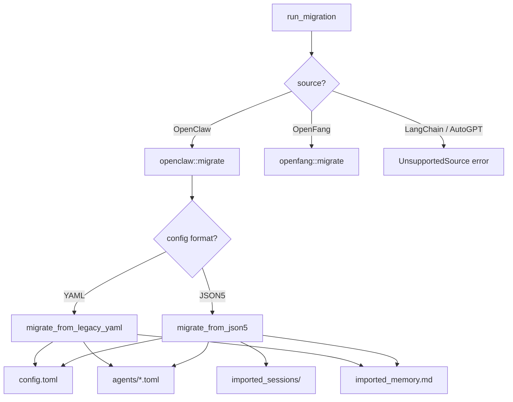

# Import & Migration

# Import & Migration Module (`librefang-import`)

## Overview

This crate migrates agent workspaces from other frameworks—primarily OpenClaw—into LibreFang's native format. It converts configuration files, agent manifests, memory stores, session logs, and workspace directories, producing a complete LibreFang home directory at `~/.librefang/`.

The module is invoked from two entry points in the host application:
- The TUI init wizard (`tui/screens/init_wizard.rs`) for interactive setup
- The HTTP config API (`src/routes/config.rs`) for programmatic migration

## Architecture



## Public API

### `run_migration(options: &MigrateOptions) -> Result<MigrationReport, MigrateError>`

The top-level entry point. Dispatches to the appropriate backend based on `MigrateOptions::source`.

Returns a `MigrationReport` listing everything imported, skipped, and any warnings. On error, returns `MigrateError` with a specific variant.

### `MigrateOptions`

| Field | Type | Purpose |
|-------|------|---------|
| `source` | `MigrateSource` | Which framework to import from |
| `source_dir` | `PathBuf` | Path to the source workspace (e.g. `~/.openclaw`) |
| `target_dir` | `PathBuf` | Path to the LibreFang home directory (e.g. `~/.librefang`) |
| `dry_run` | `bool` | If `true`, report what would happen without writing to disk |

### `MigrateSource`

Supported values:
- **`OpenClaw`** — fully implemented
- **`OpenFang`** — fully implemented (delegated to `openfang` module)
- **`LangChain`**, **`AutoGpt`** — return `MigrateError::UnsupportedSource` (planned)

### Scanning (pre-migration preview)

Before committing to a migration, callers can inspect what will be imported:

- **`detect_openclaw_home()`** — searches standard locations (`~/.openclaw`, `~/.clawdbot`, `~/.moldbot`, `~/.moltbot`, `%APPDATA%\openclaw`, etc.) and returns the first directory that contains a recognizable config file or session/memory subdirectories.
- **`scan_openclaw_workspace(path)`** — parses the config without writing anything and returns a `ScanResult` with lists of agents, channels, skills, and memory status.

These are called from `init_wizard.rs` and the `/config/migrate/detect` / `/config/migrate/scan` HTTP routes.

## OpenClaw Migration

The OpenClaw migrator handles two config formats:

### Modern JSON5 format

A single `openclaw.json` (or `clawdbot.json`, `moldbot.json`, `moltbot.json`) at the workspace root containing everything. Schema versions 1 and 2 are supported. Detection happens in `find_config_file()`.

### Legacy YAML format

Separate files: `config.yaml` for global settings, `agents/<name>/agent.yaml` for per-agent config, and `messaging/<channel>.yaml` for channel blocks. Very old installations only.

The migrator auto-detects which format is present and dispatches accordingly.

### What gets migrated

| Source | Destination | Notes |
|--------|-------------|-------|
| `openclaw.json` → global config | `config.toml` | Provider/model mapping, API key env vars, memory decay rate |
| `openclaw.json` → agents list | `agents/<id>/agent.toml` | One TOML manifest per agent with model, tools, capabilities, system prompt |
| `memory/<agent>/MEMORY.md` | `agents/<agent>/imported_memory.md` | Also checks legacy `agents/<agent>/MEMORY.md` |
| `workspaces/<agent>/` | `agents/<agent>/workspace/` | Recursive directory copy |
| `sessions/*.jsonl` | `imported_sessions/` | Flat copy of all JSONL files |
| Channel tokens (Telegram, Discord, Slack) | `secrets.env` | Written with `0600` permissions on Unix |

### What gets reported as skipped

| Item | Reason |
|------|--------|
| All channel configs | Every messaging channel has migrated to an out-of-process sidecar adapter. The migrator emits `SkippedItem` entries explaining which `[[sidecar_channels]]` block to add manually. |
| Cron jobs | Use `ScheduleMode::Periodic` instead |
| Webhook hooks | Use LibreFang's event system |
| Auth profiles / `auth-profiles.json` | Security — set env vars manually |
| Skills entries | Reinstall via `librefang skill install` |
| `memory-search/index.db` | SQLite vector index is rebuilt automatically |
| Session/memory backend config | LibreFang uses different defaults |

## Atomicity and Safety

### Staging directory (#3798)

All writes go to a sibling staging directory (e.g. `~/.librefang.migrate-staging/`) first. Only after the entire migration succeeds is the staging tree promoted into the real target via per-entry same-filesystem renames.

If migration fails partway:
- The staging directory is left in place for inspection
- The real `~/.librefang` is untouched
- Re-running fails with `MigrateError::StagingExists` until the stale staging is removed

The `promote_staging()` function never overwrites existing files (#3795 semantics): if a destination file already exists, the staged copy is dropped and a warning is emitted.

### Idempotency marker

After a successful migration, a `.openclaw_migrated` marker file is written into the target. Subsequent runs detect this marker and skip the migration to preserve any user edits made since the first import. Delete the marker to force a re-import.

### File-level atomicity

`atomic_write()` writes to a `.tmp` sibling first, then renames into place. This prevents torn writes from corrupting config files if the process is interrupted.

### Backup before overwrite

`write_with_backup()` renames any existing destination file to `<name>.bak.<timestamp>` before writing the new content. If a backup already exists at that timestamp, nanosecond precision is used to avoid collisions.

## Security

### Path traversal protection (#3794)

`validate_migration_id()` rejects agent IDs that contain `..`, absolute paths, NUL bytes, or any non-normal path component. Only single-component names are accepted. This is applied to every agent ID from JSON5 config and every agent directory name from legacy YAML.

### Secrets handling

`write_secret_env()` writes key-value pairs to `secrets.env` with:
- Newline rejection in both keys and values (prevents injection)
- `0600` permissions on Unix (`#[cfg(unix)]`)
- Upsert semantics — existing keys are overwritten, unknown keys are appended

### Schema version gating (#3797)

`openclaw.json` declares a `version` (or `schemaVersion`) field. The migrator rejects configs with versions outside the supported set (`[1, 2]`) via `MigrateError::UnsupportedVersion`.

## Agent Conversion

`convert_agent_from_json()` and `convert_legacy_agent()` produce identical TOML manifests with this structure:

```toml
name = "..."
version = "..."
description = "..."
author = "librefang"
module = "builtin:chat"
profile = "coding"            # mapped from OpenClaw tool profile
skills = ["skill_a"]          # per-agent skill allowlist
tool_blocklist = ["tool_x"]   # from OpenClaw tools.deny
workspace = "/path/to/ws"     # custom workspace path

[model]
provider = "anthropic"
model = "claude-sonnet-4-20250514"
system_prompt = """
...
"""
api_key_env = "ANTHROPIC_API_KEY"

[[fallback_models]]
provider = "openai"
model = "gpt-4o"

[capabilities]
tools = ["file_read", "file_list", "web_fetch"]
memory_read = ["*"]
memory_write = ["self.*"]
network = ["*"]
shell = ["*"]
agent_spawn = true
```

### Tool mapping

Tools are mapped through `librefang_types::tool_compat`:
- Known LibreFang tools pass through unchanged
- OpenClaw-specific tool names are mapped via `map_tool_name()`
- Unknown tools are collected as `unmapped_tools` and reported as warnings

### Tool profiles

OpenClaw tool profiles (`minimal`, `coding`, `research`, `messaging`, `automation`) are mapped to `librefang_types::agent::ToolProfile` variants. The resulting tool list is derived from `ToolProfile::tools()`, ensuring the migration and kernel use identical definitions.

### Capabilities derivation

`derive_capabilities()` infers `[capabilities]` grants from the resolved tool list:
- `shell_exec` → `shell = ["*"]`
- `web_fetch` / `web_search` / `browser_navigate` → `network = ["*"]`
- `agent_send` / `agent_list` → `agent_message = ["*"]`, `agent_spawn = true`
- `*` (wildcard) → all capabilities granted

### Identity / system prompt extraction

`extract_identity_prompt()` handles both raw string and structured object forms of OpenClaw's `identity` field. For structured objects, it searches a prioritized list of keys (`systemPrompt`, `system_prompt`, `prompt`, `instructions`, `content`, etc.) and recurses into nested objects and arrays.

### Model reference splitting

`split_model_ref()` handles OpenClaw's `"provider/model"` format (e.g. `"anthropic/claude-sonnet-4-20250514"`). If no slash is present, defaults to provider `"anthropic"`. Provider names are normalized through `map_provider()` (e.g. `"claude"` → `"anthropic"`, `"grok"` → `"xai"`).

## Provider and API Key Defaults

`default_api_key_env()` maps each provider to its conventional environment variable name:

| Provider | Env Var |
|----------|---------|
| anthropic | `ANTHROPIC_API_KEY` |
| openai | `OPENAI_API_KEY` |
| groq | `GROQ_API_KEY` |
| openrouter | `OPENROUTER_API_KEY` |
| deepseek | `DEEPSEEK_API_KEY` |
| ollama | *(empty — no key needed)* |
| (unknown) | `<PROVIDER>_API_KEY` |

## Error Types (`MigrateError`)

All errors are tagged with tracking issue numbers where applicable:

| Variant | Trigger |
|---------|---------|
| `SourceNotFound` | Source directory does not exist |
| `ConfigParse` | Malformed config file |
| `AgentParse` | Malformed agent definition |
| `Io` | Filesystem I/O failure |
| `Yaml` | YAML deserialization failure |
| `Json5Parse` | JSON5 parse failure |
| `TomlSerialize` | TOML serialization failure |
| `UnsupportedSource` | LangChain / AutoGPT (not yet implemented) |
| `InvalidId` (#3794) | Agent ID contains path traversal |
| `UnsupportedVersion` (#3797) | Schema version outside supported set |
| `StagingExists` (#3798) | Stale staging directory from previous failed run |

## Testing Patterns

The crate includes integration tests covering:
- Full JSON5 migration round-trip (including verification that output parses into real `KernelConfig` structs via `detect_unknown_fields`)
- Legacy YAML fallback
- Dry-run mode (no disk writes)
- Idempotency (marker file prevents re-run)
- User edit preservation (existing files not overwritten on re-import)
- Tool profile resolution
- Fallback model handling
- Error cases (missing source, unsupported version, path traversal IDs)