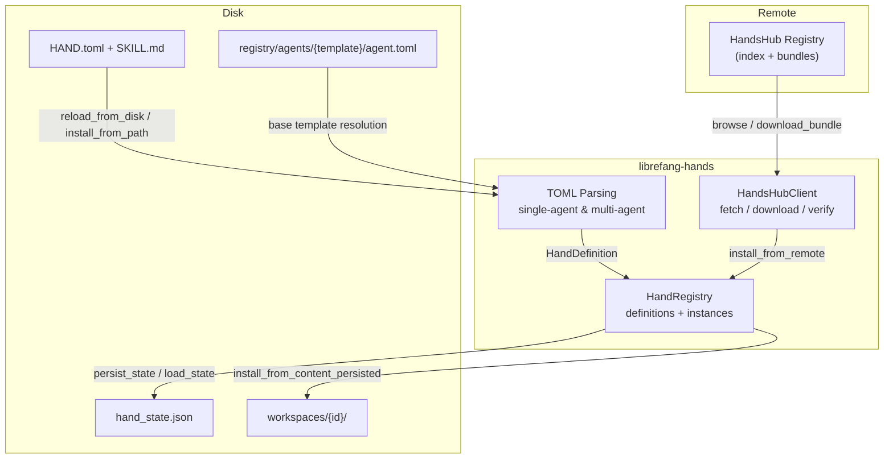

# Infrastructure Libraries — librefang-hands-src

# librefang-hands — Hand Capability Packages

## Overview

A **Hand** is a pre-built, domain-complete autonomous agent configuration. Users discover and activate hands from a marketplace or local files; unlike regular agents that users chat with interactively, hands run autonomously in the background — users check in on progress rather than drive every step.

This crate provides three layers:

| Layer | File | Purpose |
|-------|------|---------|
| **Core types & parsing** | `lib.rs` | `HandDefinition`, `HandInstance`, TOML parsing, settings resolution |
| **Remote marketplace** | `hands_hub.rs` | `HandsHubClient` — discover, download, and verify hands from a registry |
| **Local registry** | `registry.rs` | `HandRegistry` — manage installed definitions and active instances, persist state |

## Architecture



## Core Types

### HandDefinition

The complete specification of a hand, parsed from `HAND.toml`. Key fields:

- **`id`** — unique identifier, used as a filesystem path component (validated against traversal attacks)
- **`agents`** — `BTreeMap<String, HandAgentManifest>`, supports both single-agent (`[agent]` → `"main"`) and multi-agent (`[agents.planner]`, `[agents.analyst]`) formats
- **`requires`** — prerequisites checked before activation (binaries on PATH, env vars, API keys)
- **`settings`** — user-configurable options exposed during activation
- **`dashboard`** — metrics schema read from agent structured memory
- **`routing`** — keyword aliases for deterministic hand selection
- **`i18n`** — localized strings keyed by language code

The coordinator agent (the one receiving user messages) is resolved by `HandDefinition::coordinator()`: it picks the agent with `coordinator = true`, falling back to the first agent by role name.

### HandInstance

A running hand — links a `HandDefinition` to its spawned agents. Tracks:

- `instance_id` — unique UUID, stable across daemon restarts
- `agent_ids` — `BTreeMap<role, AgentId>` mapping roles to spawned kernel agents
- `coordinator_role` — which role receives user messages
- `config` — user-provided settings overrides from activation
- `agent_runtime_overrides` — per-role model/provider overrides applied from the dashboard

### HandError

Error variants covering not-found, already-active, TOML parse failures, I/O errors, security blocks, and configuration issues. All marketplace and registry errors flow through this type.

## HAND.toml Format

Hands support two authoring formats, both producing the same `HandDefinition`:

### Single-agent (`[agent]`)

```toml
id = "clip"
name = "Clip Hand"
description = "Autonomous video clipping"
category = "content"
version = "1.2.0"

[agent]
name = "clip-agent"
description = "Clips video segments"
system_prompt = "You are a video clipping assistant."

[agent.model]
provider = "anthropic"
model = "some-anthropic-model"
max_tokens = 4096
```

### Multi-agent (`[agents.*]`)

```toml
id = "research"
name = "Research Hand"

[agents.planner]
coordinator = true
invoke_hint = "Use planner for task decomposition"
name = "planner-agent"
description = "Plans research tasks"
system_prompt = "You plan research."

[agents.analyst]
name = "analyst-agent"
description = "Analyzes data"
system_prompt = "You analyze data."
```

### Legacy flat model fields

Older HAND.toml files place `provider`, `model`, `system_prompt`, `max_tokens`, `temperature` as top-level fields under `[agent]`. The parser detects this via `normalize_flat_to_nested` and auto-converts them into a `[model]` sub-table before merging with base templates.

### Base template references

Multi-agent entries can reference a shared agent template via `base`, deep-merging hand-specific overrides on top:

```toml
[agents.writer]
coordinator = true
base = "my-writer"          # loads registry/agents/my-writer/agent.toml

[agents.writer.model]
system_prompt = "Override: you are a blog writer."  # hand wins over base
```

Template names are validated to prevent path traversal (no `/`, `\`, or `..`). Resolution requires an `agents_dir` parameter — the `parse_hand_definition` function accepts this; the serde `Deserialize` path (no filesystem access) does not support `base`.

## Hand Registry

`HandRegistry` is the central in-memory store, using lock-free `DashMap` collections for concurrent access:

| Collection | Key | Value | Purpose |
|------------|-----|-------|---------|
| `definitions` | hand id | `HandDefinition` | All installed hand specs |
| `instances` | instance UUID | `HandInstance` | Active/paused hand instances |
| `agent_index` | agent id (string) | instance UUID | Reverse lookup: which instance owns an agent |
| `active_index` | hand id | instance UUID | O(1) "is this hand active?" check |

A `Mutex<()>` (`activate_lock`) serializes activate/deactivate operations to prevent races where two concurrent requests both pass the "already active" check.

### Definition loading

`reload_from_disk(home_dir)` scans two directories:

1. **`{home_dir}/registry/hands/`** — read-only, shared registry tarball (reset on sync)
2. **`{home_dir}/workspaces/`** — user-writable, survives daemon restarts

Registry entries take precedence on id collisions. Each subdirectory containing a `HAND.toml` is parsed and inserted.

### Skill content

Each hand directory may contain:

- **`SKILL.md`** — shared skill prompt for all agents
- **`SKILL-{role}.md`** — per-agent skill override (e.g. `SKILL-pm.md`)

Per-agent files take precedence over the shared file for that role. These are populated at load time into `HandDefinition::skill_content` and `HandDefinition::agent_skill_content`.

## Marketplace Client (HandsHub)

`HandsHubClient` fetches from a remote registry at `{base_url}/index` and `{base_url}/hands/{id}/bundle`.

### Constructors

| Method | DNS Pinning | Use Case |
|--------|-------------|----------|
| `new()` | No | Default registry (`hands.librefang.ai`) |
| `with_url(url)` | No | Testing with mock servers |
| `with_pinned_url(url, hostname, resolved)` | Yes | Caller-supplied URLs (production) |

Always use `with_pinned_url` for user-provided registry URLs — it pins DNS to the addresses validated by the SSRF check at the API boundary.

### Operations

- **`fetch_index()`** — `GET /index`, returns `HandsHubIndex`
- **`browse(limit)`** — sorted entries, truncated to `limit`
- **`search(query, limit)`** — case-insensitive substring match on id, name, description
- **`get_entry(hand_id)`** — single entry lookup
- **`download_bundle(hand_id, expected_sha256)`** — streamed download with SHA-256 verification

### Retry behavior

`get_with_retry` attempts up to 5 requests with exponential backoff (base 1.5s, max 30s) plus jitter. Retries on HTTP 429 and 5xx; respects `Retry-After` headers. All other errors surface immediately.

### Bundle format

A bundle is a JSON envelope:

```json
{ "toml": "<HAND.toml contents>", "skill": "<SKILL.md contents>" }
```

The `skill` field is optional (prompt-less hands omit it). This shape is consumed by `install_from_content_persisted`.

## Security Model

### SSRF / DNS-rebind hardening

Three layers protect against SSRF when fetching from a caller-supplied registry URL:

1. **Boundary check** — `routes::skills::install_hand_from_marketplace` validates the URL before constructing a client
2. **Redirect refusal** — `reqwest::redirect::Policy::none()` ensures a 302 from the registry is surfaced as an error, not followed to an internal address
3. **DNS pinning** — `with_pinned_url` resolves the hostname only to the SSRF-validated IPs, closing the TOCTOU window between validation and fetch

### Path traversal prevention

Hand IDs are validated by `validate_hand_id` (in both `lib.rs` and `hands_hub.rs`): must start with an ASCII alphanumeric, contain only `[A-Za-z0-9_-]`, and be 1–128 characters. This rejects `../`, `/`, `\`, and `.` — preventing the id from escaping `home/workspaces/{id}/`.

### Bundle integrity

- **SHA-256 verification** — when `expected_sha256` is present in the index entry, the downloaded bundle's hash is computed during streaming and checked before parsing or writing to disk
- **Size cap** — downloads are capped at 8 MB (`MAX_BUNDLE_BYTES`), enforced per-chunk during streaming (not just via `Content-Length`, which can be spoofed)

### TLS

TLS verification is enabled by default. Set `LIBREFANG_DANGEROUSLY_SKIP_TLS_VERIFICATION=true` or `1` to disable (testing only — emits a warning).

## Settings System

Hands declare configurable settings in `[[settings]]` arrays. Three types are supported:

| Type | Behavior |
|------|----------|
| `select` | User picks one option; matched option's `provider_env` is collected |
| `toggle` | Boolean on/off |
| `text` | Free-form text; optional `env_var` is exposed when non-empty |

`resolve_settings(settings, config)` processes user choices against the schema, producing:

- **`prompt_block`** — Markdown summary appended to the system prompt (e.g. `## User Configuration\n- STT: Groq (groq)`)
- **`env_vars`** — Env var names the agent's subprocess should have access to

Settings without a user choice fall back to `setting.default`.

## Requirements

Each `[[requires]]` entry declares a prerequisite with a `requirement_type`:

| Type | Check |
|------|-------|
| `binary` | Binary exists on PATH |
| `env_var` | Environment variable is set |
| `api_key` | API key env var is set |
| `any_env_var` | Any of several comma-separated env vars is set |

Requirements carry optional `install` instructions with platform-specific commands (`macos`, `windows`, `linux_apt`, etc.), URLs, and step-by-step guides. The `optional` flag marks non-blocking requirements — unmet optional requirements report the hand as "degraded" rather than blocking activation.

## State Persistence

Hand state is persisted to `hand_state.json` using an atomic write (write-to-temp, rename). The format is versioned (currently **v5**):

```
{ "version": 5, "instances": [ ... ] }
```

### Version history

| Version | Changes |
|---------|---------|
| v1 | Bare JSON array of instance objects, single `agent_id` |
| v2 | `{ version, instances }` wrapper |
| v3 | Multi-agent: `agent_ids` map + `coordinator_role` |
| v4 | `activated_at` / `updated_at` timestamps |
| v5 | `agent_runtime_overrides` per-role map |

### Forward/backward compatibility

- **Loading old state**: v1–v4 files are loaded transparently. Legacy `config.__model_overrides__` blobs are migrated into `agent_runtime_overrides` via `legacy_agent_runtime_overrides`.
- **Downgrade**: A v4 daemon loading a v5 file silently drops the overrides field (it serializes with `skip_serializing_if`). Users must re-apply dashboard overrides after a downgrade.

`load_state` filters out `Error` and `Inactive` instances — only `Active` and `Paused` hands are restored after a daemon restart.

## Integration Points

### Kernel

- **`src/kernel/hands_lifecycle.rs`** — calls `persist_state`, `activate_hand_with_id`
- **`src/kernel/background_lifecycle.rs`** — calls `load_state_detailed` on boot to restore hands
- **`src/kernel/manifest_helpers.rs`** — calls `parse_hand_toml`, `resolve_settings`

### Router

- **`librefang-kernel-router`** — calls `parse_hand_toml_with_agents_dir` when loading hand route candidates, checks `is_multi_agent` for team dispatch

### API routes

- **`routes/skills/hands.rs`** — calls `HandsHubClient::with_pinned_url` for marketplace installs, passing SSRF-validated addresses
- **`routes/agents/config.rs`** — uses `HandAgentRuntimeOverride` for dashboard model/provider overrides

### Type dependencies

- **`librefang-types::agent`** — `AgentManifest`, `ModelConfig`, `AutonomousConfig`, `AgentId`, `WebSearchAugmentationMode`
- **`librefang-skills::supply_chain`** — security scanning during `install_from_remote`