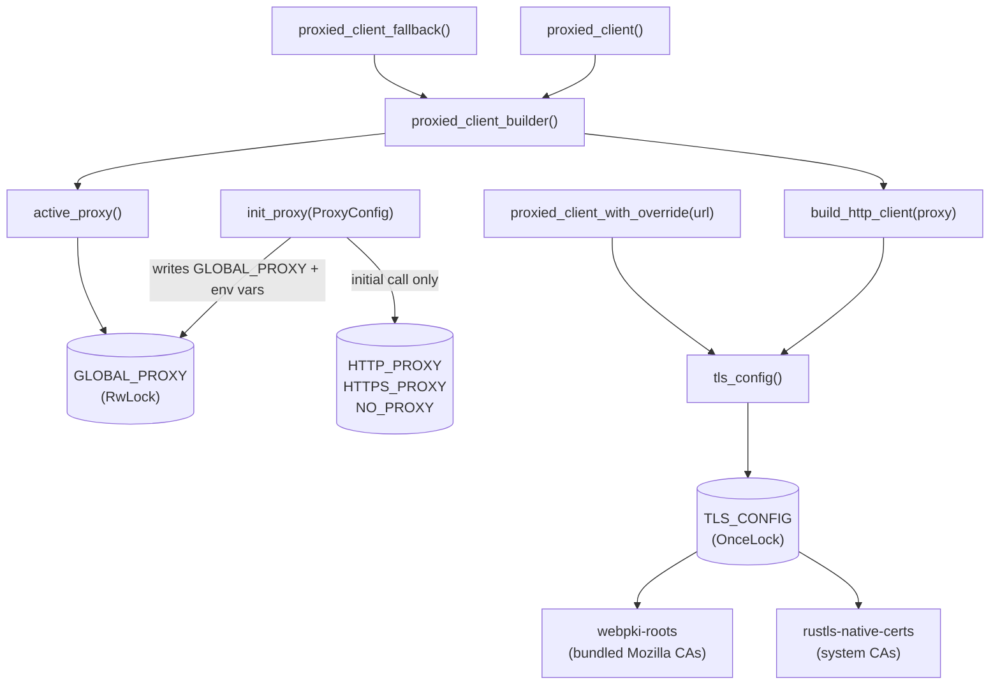

# Infrastructure Libraries — librefang-http-src

# librefang-http — Centralized HTTP Client with Proxy and TLS Fallback

## Purpose

Every outbound HTTP connection in the application should go through this module. It guarantees two things that vanilla `reqwest::Client` does not:

1. **Proxy settings are applied uniformly** — from `config.toml`, environment variables, or both.
2. **TLS works on systems without system CA certificates** — minimal Docker images, musl builds on Termux/Android, etc. — by falling back to bundled Mozilla CA roots.

All other crates (`librefang-runtime`, `librefang-runtime-mcp`, `librefang-api`, route handlers, tool runners, etc.) import client builders from here rather than constructing `reqwest::Client` instances directly.

## Architecture



## Initialization Sequence

At daemon startup, call `init_proxy` once with the `[proxy]` section from `config.toml`:

```rust
let proxy_cfg: ProxyConfig = config.proxy; // deserialized from config.toml
init_proxy(proxy_cfg);
```

This does two things:

- Stores the config in the global `GLOBAL_PROXY` (`RwLock<Option<ProxyConfig>>`).
- On the **initial** call only (when `GLOBAL_PROXY` is still `None`), exports the proxy values as environment variables (`HTTP_PROXY`, `HTTPS_PROXY`, `NO_PROXY`). This ensures crates that build their own `reqwest::Client` without using this module (e.g., `librefang-channels`) still pick up the proxy settings via reqwest's built-in env-var detection.

**Thread safety note:** `std::env::set_var` is racy in multi-threaded contexts. The module only calls it during the synchronous bootstrap phase before the Tokio runtime spawns worker threads. Hot-reload calls update `GLOBAL_PROXY` only — never the environment variables.

## TLS Configuration

### How it works

`tls_config()` returns a cached `rustls::ClientConfig` built once and reused for every client:

1. Seeds the root store with **bundled Mozilla CA roots** (`webpki_roots::TLS_SERVER_ROOTS`). This guarantees common public CAs are trusted regardless of the host system.
2. Supplements with **system CA certificates** (`rustls_native_certs::load_native_certs()`). This adds org-internal or self-signed CAs and keeps trust anchors current without a release.
3. If no system certs are found, logs at debug level and continues with bundled roots only.

This ordering means the bundled roots are always present, and system certs act as additive supplements — never replacements.

### When to use

You don't call `tls_config()` directly unless you're building a `reqwest::Client` with custom options. The standard builder functions (`proxied_client_builder`, `proxied_client`, etc.) already call it internally.

## Public API

### `init_proxy(cfg: ProxyConfig)`

Sets the global proxy configuration. Call once at startup; can be called again for hot-reload. Validates proxy URL schemes (`http://`, `https://`, `socks5://`, `socks5h://`) and logs warnings for invalid URLs without crashing.

### `proxied_client_builder() -> reqwest::ClientBuilder`

Returns a pre-configured `ClientBuilder` with:
- TLS from `tls_config()` (bundled + system CA roots)
- Proxy settings from `GLOBAL_PROXY` (explicit values take precedence; `None` fields fall through to reqwest's env-var detection)
- `User-Agent: librefang/<version>`
- Connect timeout: 30s
- Read timeout: 300s (per-read inactivity, not total request time — safe for streaming LLM responses)

Callers can chain additional options (e.g., `.timeout()`, custom headers) before `.build()`.

### `proxied_client() -> reqwest::Client`

Convenience wrapper: calls `proxied_client_builder()` and builds immediately. Panics if construction fails (it shouldn't with this configuration).

Use this when you need a ready-to-use client with no further customization. Widely used across the codebase:

- OAuth flows (`start_device_auth_flow`, `exchange_code_for_tokens_with_redirect_uri`, `refresh_access_token`)
- Provider health checks and API key probing
- Image generation, media transcription, webhook testing
- Plugin and channel operations

### `proxied_client_fallback() -> reqwest::Client`

Identical to `proxied_client()` but adds a **total per-request timeout of 300 seconds**. Used when a per-provider proxy override is invalid, ensuring a stuck upstream cannot block the agent loop indefinitely. Callers should log a warning before using this fallback.

### `proxied_client_with_override(proxy_url: &str) -> reqwest::Result<reqwest::Client>`

Builds a client that routes **all** traffic through the given proxy URL, ignoring `GLOBAL_PROXY` entirely. Used for per-provider proxy overrides. Returns an error if the URL is invalid — callers that want best-effort behavior should call `proxied_client()` on error and log a warning.

### `build_http_client(proxy: &ProxyConfig) -> reqwest::ClientBuilder`

Lower-level function that accepts an explicit `ProxyConfig` instead of reading from the global state. Prefer `proxied_client_builder()` unless you need to pass a specific config.

### `tls_config() -> rustls::ClientConfig`

Returns the cached TLS configuration. Useful when constructing a `reqwest::Client` outside the standard builder path.

### Backward-compatible aliases

| Alias | Delegates to |
|---|---|
| `client_builder()` | `proxied_client_builder()` |
| `new_client()` | `proxied_client()` |

## Proxy Resolution Order

When a request is made through a client built by this module:

1. **Explicit config values** from `ProxyConfig` (`http_proxy`, `https_proxy`, `no_proxy`) are applied directly as `reqwest::Proxy` objects on the builder.
2. **When config fields are `None`**, reqwest's built-in environment variable detection provides the fallback (`HTTP_PROXY`, `HTTPS_PROXY`, `NO_PROXY`).
3. **`init_proxy()`** exports config values to env vars on first call, so both paths converge.

This avoids double-application: if the config has an explicit value, it's set on the builder; if not, reqwest reads the env var that `init_proxy()` already set.

## Default Timeouts

All clients built through this module include sensible defaults:

| Timeout | Value | Rationale |
|---|---|---|
| Connect | 30s | Caps TCP + TLS handshake; generous for slow international links to LLM providers |
| Read | 300s | Per-read inactivity timeout, not total request time. Streaming LLM responses keep it alive; a true stall fires it |

The fallback client (`proxied_client_fallback`) adds a **total** timeout of 300s on top.

## Usage Patterns

### Standard client (most common)

```rust
use librefang_http::proxied_client;

let client = proxied_client();
let resp = client.get("https://api.example.com/health").send().await?;
```

### Customized builder

```rust
use librefang_http::proxied_client_builder;

let client = proxied_client_builder()
    .timeout(std::time::Duration::from_secs(60))
    .build()?;
```

### Per-provider proxy override

```rust
use librefang_http::{proxied_client_with_override, proxied_client_fallback};

match proxied_client_with_override(&provider.proxy_url) {
    Ok(client) => client,
    Err(e) => {
        tracing::warn!("Invalid proxy for provider {}: {e}", provider.name);
        proxied_client_fallback()
    }
}
```

### Direct TLS config (for non-reqwest consumers)

```rust
use librefang_http::tls_config;

let tls = tls_config();
// use with a custom hyper client, etc.
```

## Valid Proxy URL Schemes

The module accepts these schemes in proxy URLs:

- `http://`
- `https://`
- `socks5://`
- `socks5h://` (DNS resolution through the proxy)

Invalid schemes are logged with a redacted URL and skipped; the client is still built successfully without that proxy.