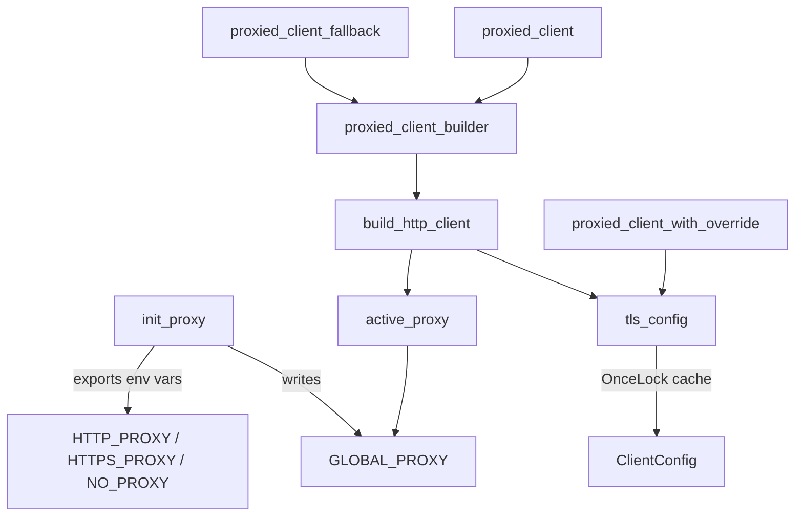

# Infrastructure Libraries — librefang-http-src

# librefang-http

Centralized HTTP client construction with proxy support and portable TLS roots.

Every outbound HTTP connection in the project should go through this crate so that proxy settings and CA trust anchors are applied uniformly. The two problems it solves:

1. **Missing system CA certificates** — On musl builds (Termux, minimal Docker images), `reqwest`'s default TLS initialization panics because there are no system roots. This crate always seeds `rustls` with bundled Mozilla CA roots via `webpki-roots`, then supplements with whatever system certs exist.

2. **Scattered proxy configuration** — Rather than each crate reading env vars or config independently, proxy state is held here in a single global and baked into every client at build time.

## Architecture


```mermaid
graph TD
    A[init_proxy] -->|writes| B[GLOBAL_PROXY]
    A -->|exports env vars| C[HTTP_PROXY / HTTPS_PROXY / NO_PROXY]
    D[tls_config] -->|OnceLock cache| E[ClientConfig]
    F[proxied_client_builder] --> G[build_http_client]
    G --> D
    G --> H[active_proxy]
    H --> B
    I[proxied_client] --> F
    J[proxied_client_fallback] --> F
    K[proxied_client_with_override] --> D
```

## Initialization Sequence

At daemon startup, before the Tokio runtime spawns worker threads, call [`init_proxy`] once with the `[proxy]` section from `config.toml`:

```rust
let proxy_cfg: ProxyConfig = config.proxy;
librefang_http::init_proxy(proxy_cfg);
```

[`init_proxy`] does two things:

1. **Exports config values as environment variables** (`HTTP_PROXY`, `HTTPS_PROXY`, `NO_PROXY`) — but only on the initial call, when `GLOBAL_PROXY` is still `None`. This happens in a single-threaded context, so `std::env::set_var` is safe. Crates that build their own `reqwest::Client` without using this crate's builders (e.g. `librefang-channels`) automatically pick up proxy settings through reqwest's built-in env-var detection.

2. **Stores the config in `GLOBAL_PROXY`** — a `RwLock<Option<ProxyConfig>>` that subsequent calls to [`proxied_client_builder`] read. Hot-reload calls overwrite this value but skip the env-var export, avoiding unsound `set_var` in a multi-threaded context.

## TLS Configuration

[`tls_config`] returns a `rustls::ClientConfig` that trusts both bundled Mozilla roots and (if available) system certificates:

- **Bundled roots** (`webpki_roots::TLS_SERVER_ROOTS`) are always loaded first, ensuring public CAs work everywhere.
- **System roots** (`rustls_native_certs::load_native_certs`) are added on top, picking up org-internal or self-signed CAs without requiring a librefang release.

The resulting `ClientConfig` is computed once and cached in a `OnceLock`. All client builders clone from this cache, so repeated client creation is cheap.

### Why not just use system certs?

On some platforms the system cert store is empty or incomplete. The bundled roots guarantee that common public endpoints (LLM provider APIs, OAuth servers, etc.) work out of the box. System certs supplement this with private CAs.

## Proxy Configuration

[`ProxyConfig`] (from `librefang-types`) has three fields:

| Field | Purpose |
|---|---|
| `http_proxy` | URL for plain-HTTP requests |
| `https_proxy` | URL for HTTPS requests |
| `no_proxy` | Comma-separated list of hosts to bypass |

### Validation

[`init_proxy`] validates proxy URLs against a allowlist of schemes (`http://`, `https://`, `socks5://`, `socks5h://`) via the internal [`is_valid_proxy_url`] function. Invalid URLs are logged with a warning (redacted) and the env var is not set, but the daemon does not abort.

### Resolution order in `build_http_client`

When a `ProxyConfig` field is `Some(non_empty_string)`, that value is applied directly as a `reqwest::Proxy`. When the field is `None`, reqwest's built-in env-var detection provides the fallback. This avoids double-applying proxy settings that [`init_proxy`] already exported.

The `no_proxy` filter is only constructed from explicit config values — if `no_proxy` is `None`, the `NO_PROXY` env var (if set) serves as the fallback.

## Client Builder Functions

### Primary APIs

| Function | Returns | Use when |
|---|---|---|
| [`proxied_client_builder`] | `reqwest::ClientBuilder` | You need to customize the client further (add headers, cookies, etc.) before building |
| [`proxied_client`] | `reqwest::Client` | You just need a ready-to-use client with global proxy/TLS settings |

Both read the current `GLOBAL_PROXY` via [`active_proxy`] and delegate to [`build_http_client`].

### Special-purpose APIs

**[`proxied_client_fallback`]** — Identical to `proxied_client` but enforces a 300-second total per-request timeout. Used when a per-provider proxy override (`proxied_client_with_override`) fails and the caller needs a safe fallback that won't wedge the agent loop indefinitely. Callers should log a warning before using this.

**[`proxied_client_with_override`]** — Builds a client that routes *all* traffic through a single explicit proxy URL, ignoring `GLOBAL_PROXY` entirely. Used for per-provider proxy overrides. Returns `Err` if the URL is invalid or the client cannot be built. Does **not** silently fall back — callers must handle the error explicitly:

```rust
match librefang_http::proxied_client_with_override(&provider.proxy_url) {
    Ok(client) => client,
    Err(e) => {
        tracing::warn!("invalid proxy for provider {}: {e}", provider.name);
        librefang_http::proxied_client_fallback()
    }
}
```

### Lower-level / internal

**[`build_http_client`]** — The core builder function that accepts an explicit `&ProxyConfig`. Prefer [`proxied_client_builder`] which reads the global config automatically. Only use this directly if you need to construct a client with a proxy config that differs from the global one.

### Backward-compatible aliases

[`client_builder`] and [`new_client`] are thin wrappers around [`proxied_client_builder`] and [`proxied_client`] respectively. They exist for backward compatibility and should not be used in new code.

## Default Timeouts

All clients built through this module have default timeouts applied:

| Timeout | Duration | Rationale |
|---|---|---|
| `connect_timeout` | 30s | Caps TCP + TLS handshake. Generous for slow international links. |
| `read_timeout` | 300s | Per-read inactivity timeout, not total request time. Streaming LLM responses keep this alive as tokens arrive; a true stall fires it. |

Callers can override these on the `ClientBuilder` before calling `.build()`. The fallback client additionally sets a 300-second total `.timeout()` as a hard upper bound.

## Thread Safety

| State | Protection | Notes |
|---|---|---|
| `TLS_CONFIG` | `OnceLock` | Write-once, then read-only. No contention. |
| `GLOBAL_PROXY` | `RwLock` | Read-heavy (every client construction). Write on init and hot-reload. |

The `unsafe` `std::env::set_var` calls are confined to the initial bootstrap path, which executes before the Tokio runtime and its worker threads exist. The `is_initial` guard in [`init_proxy`] ensures subsequent hot-reload calls never touch env vars.

## Usage by Other Crates

The call graph shows widespread usage across the codebase:

- **Runtime / provider drivers** — `librefang-runtime`, `librefang-runtime-mcp`, `librefang-runtime-media` use [`proxied_client`] and [`proxied_client_builder`] for LLM API calls, OAuth flows, image generation, transcription, and health probes.
- **API layer** — `librefang-api`, route handlers in `src/routes/` use [`proxied_client_builder`] for webhook testing, plugin lookups, URL attachment resolution, and dashboard sync.
- **CLI** — `librefang-cli` accesses [`tls_config`] directly to reuse the same TLS roots.
- **RL export** — `librefang-rl-export` uses [`proxied_client`] for WandB, Atropos, and Tinker integrations.