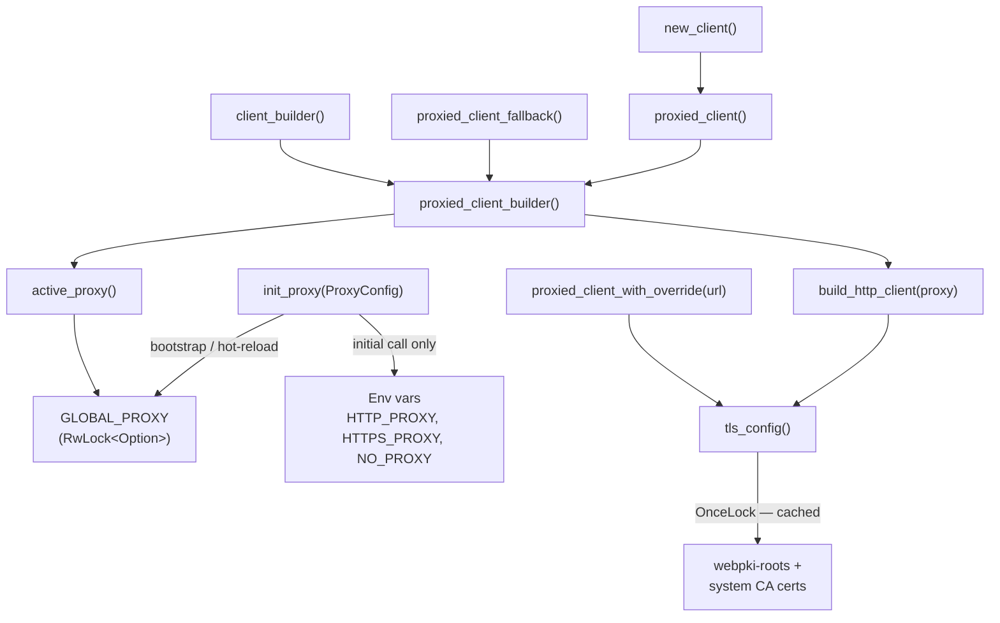

# Infrastructure Libraries — librefang-http-src

# librefang-http — Centralized HTTP Client with Proxy & TLS Fallback

## Purpose

Every outbound HTTP connection in the application should go through this module. It solves two problems that would otherwise cause silent failures:

1. **Missing CA certificates** — On musl builds (Termux/Android), minimal Docker images, or corporate Linux with partial CA bundles, `reqwest`'s default TLS initialization panics. This module seeds `rustls` with bundled Mozilla CA roots first, then supplements with system certs.

2. **Proxy consistency** — Proxy settings from `config.toml` and environment variables are applied uniformly so that crates building their own `reqwest::Client` (e.g., `librefang-channels`) pick up the same proxy settings automatically.

## Architecture


```mermaid
graph TD
    A["init_proxy(ProxyConfig)"] -->|"bootstrap / hot-reload"| B["GLOBAL_PROXY<br/>(RwLock&lt;Option&gt;)"]
    A -->|"initial call only"| C["Env vars<br/>HTTP_PROXY, HTTPS_PROXY, NO_PROXY"]

    D["proxied_client_builder()"] --> E["active_proxy()"]
    E --> B
    D --> F["build_http_client(proxy)"]
    F --> G["tls_config()"]
    G -->|"OnceLock — cached"| H["webpki-roots +<br/>system CA certs"]

    I["proxied_client()"] --> D
    J["proxied_client_fallback()"] --> D
    K["proxied_client_with_override(url)"] --> G
    L["client_builder()"] --> D
    M["new_client()"] --> I
```

## Initialization

### TLS — `tls_config()`

Returns a cached `rustls::ClientConfig`. On first call it:

1. Seeds the root store with **bundled Mozilla CA roots** (`webpki_roots::TLS_SERVER_ROOTS`) — ensures common public CAs are always trusted.
2. Supplements with **system CA certificates** via `rustls_native_certs::load_native_certs()` — adds org-internal / self-signed CAs and keeps trust anchors current without a release.
3. Logs a debug message if no system certs were found.

The result is stored in a `OnceLock` and cloned on subsequent calls. No caller needs to worry about TLS setup.

### Proxy — `init_proxy(cfg: ProxyConfig)`

Call once at daemon startup with the `[proxy]` section from `config.toml`. Can be called again during hot-reload (via `apply_hot_actions_inner`).

**Thread safety model:**

- On the **initial bootstrap call** (before the Tokio runtime spawns worker threads), config values are exported as environment variables (`HTTP_PROXY`, `HTTPS_PROXY`, `NO_PROXY`, and lowercase variants). This happens in a single-threaded context, so `std::env::set_var` is safe.
- On **subsequent calls** (hot-reload), only `GLOBAL_PROXY` is updated — the environment variables are left untouched, avoiding unsound `set_var` in a multi-threaded context.

Proxy URLs are validated against allowed schemes (`http://`, `https://`, `socks5://`, `socks5h://`) before being applied. Invalid URLs trigger a `tracing::warn!` and are silently skipped.

## Client Builder Functions

All builders apply the same TLS config and set a `User-Agent` header of `librefang/<version>`.

| Function | Returns | Use Case |
|---|---|---|
| `proxied_client_builder()` | `reqwest::ClientBuilder` | Default entry point. Reads global proxy config. Customize timeouts or headers on the builder before calling `.build()`. |
| `proxied_client()` | `reqwest::Client` | Convenience — builds a ready-to-use client from `proxied_client_builder()`. |
| `proxied_client_fallback()` | `reqwest::Client` | Like `proxied_client()` but enforces a **300s total timeout** per request. Used when a per-provider proxy override is invalid (issue #3756). Callers should log a warning before using. |
| `proxied_client_with_override(url)` | `Result<reqwest::Client>` | Routes **all** traffic through the given proxy URL, ignoring global config. Returns `Err` on invalid URL — callers decide whether to fall back to `proxied_client()`. |
| `build_http_client(proxy)` | `reqwest::ClientBuilder` | Lower-level: build a client with an explicit `ProxyConfig` rather than reading global state. Used internally by `proxied_client_builder()`. |
| `client_builder()` / `new_client()` | — | Backward-compatible aliases for `proxied_client_builder()` / `proxied_client()` respectively. |

### Default Timeouts

All clients built through `build_http_client` get these defaults (issue #2340):

| Timeout | Duration | Rationale |
|---|---|---|
| `connect_timeout` | 30s | Caps TCP + TLS handshake. Generous for slow international links to LLM providers. |
| `read_timeout` | 300s | Per-read inactivity timeout, not total request time. Streaming LLM responses stay alive as long as tokens trickle in; a true stall fires the timeout. |

Callers can override both via `.timeout()`, `.connect_timeout()`, or `.read_timeout()` on the returned builder.

## Proxy Resolution

When building a client through `proxied_client_builder`, proxy resolution works in layers:

1. **Explicit `ProxyConfig` values** are applied directly as `reqwest::Proxy` objects with a `NoProxy` filter from the `no_proxy` field.
2. **When config fields are `None`**, reqwest's built-in env-var detection (`HTTP_PROXY` / `HTTPS_PROXY` / `NO_PROXY`) provides automatic fallback — the env vars were set during `init_proxy` bootstrap.
3. **Invalid proxy URLs** in config are logged and skipped; the client is still built without that proxy.

This layered approach ensures crates that build their own `reqwest::Client` independently still get proxy settings via environment variables.

## Usage Patterns

### Standard — at module level

```rust
// During bootstrap (src/kernel/boot.rs):
librefang_http::init_proxy(config.proxy.clone());

// Anywhere in the codebase:
let client = librefang_http::proxied_client();
let resp = client.get("https://api.example.com/health").send().await?;
```

### Custom builder — when you need to adjust timeouts or headers

```rust
let client = librefang_http::proxied_client_builder()
    .timeout(std::time::Duration::from_secs(60))
    .build()?;
```

### Per-provider proxy override

```rust
match librefang_http::proxied_client_with_override(&provider.proxy_url) {
    Ok(client) => client,
    Err(e) => {
        tracing::warn!("Invalid proxy for provider: {e}");
        librefang_http::proxied_client_fallback()
    }
}
```

## Integration Points

This module is consumed across the entire codebase. Key callers include:

- **Bootstrap** — `boot_with_config` calls `init_proxy` once at startup; `apply_hot_actions_inner` calls it again on config hot-reload.
- **LLM providers** — `probe_model`, `probe_client`, `probe_api_key`, `exchange_copilot_token` all use `proxied_client_builder`.
- **Tool runners** — `tool_web_fetch_legacy`, `tool_web_search_legacy`, `tool_location_get`.
- **MCP runtime** — `connect_http_compat`, `connect_sse`, `discover_oauth_metadata`.
- **Plugins** — `install_plugin_with_deps`, `plugin_registry_search`, `plugin_update_check`.
- **TTS** — `synthesize_elevenlabs`, `synthesize_openai`, `synthesize_custom` use `proxied_client`.
- **A2A / Web Fetch / OAuth / Cron** — `build_client_for_url`, `pinned_client`, `poll_device_flow`, `start_device_flow`, `build_fan_out_http_client`, `cron_deliver_response`.

The CLI also consumes `tls_config` directly via `librefang-cli/src/http_client.rs`.