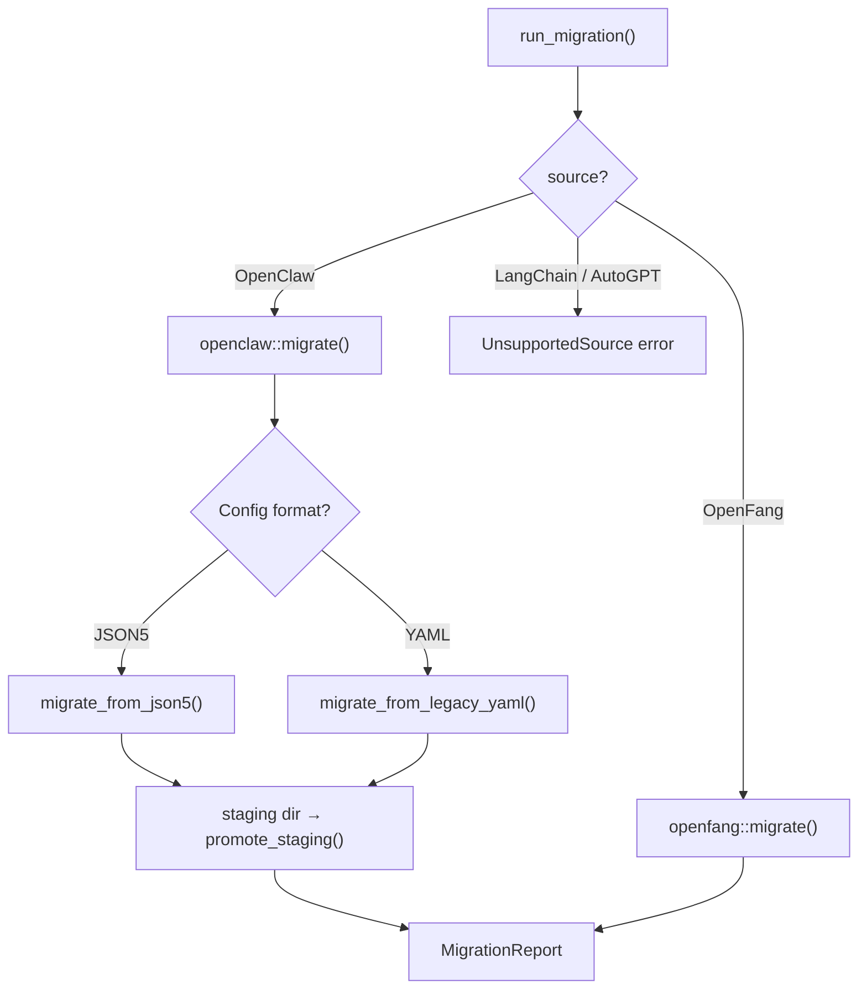
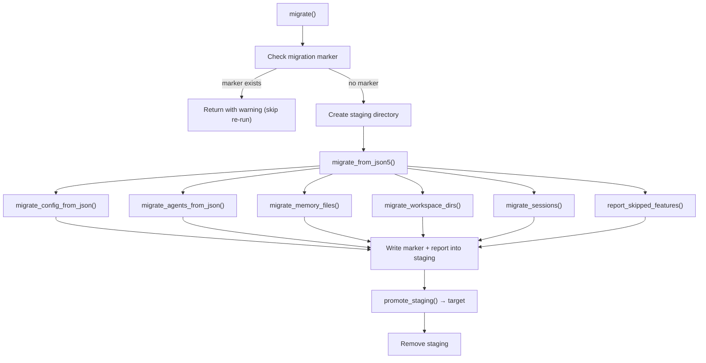

# Infrastructure Libraries — librefang-import-src

# librefang-import-src — Migration Engine

## Purpose

This crate migrates agent configurations, memory, sessions, workspaces, and channel credentials from other agent frameworks into LibreFang's format. It is the backend for the `librefang migrate` CLI command, the `/api/config/migrate` HTTP endpoint, and the TUI init wizard.

Currently supported sources:

| Source | Status |
|---|---|
| **OpenClaw** | Full support (JSON5 and legacy YAML layouts) |
| **OpenFang** | Supported (same-format community fork) |
| LangChain | Planned |
| AutoGPT | Planned |

## Architecture



## Top-Level API

### `MigrateSource`

```rust
pub enum MigrateSource { OpenClaw, LangChain, AutoGpt, OpenFang }
```

Enum identifying the source framework. `LangChain` and `AutoGpt` return `MigrateError::UnsupportedSource` at runtime.

### `MigrateOptions`

```rust
pub struct MigrateOptions {
    pub source: MigrateSource,
    pub source_dir: PathBuf,   // e.g. ~/.openclaw
    pub target_dir: PathBuf,   // e.g. ~/.librefang
    pub dry_run: bool,         // report only, no disk writes
}
```

Passed by callers — the CLI (`cmd_migrate`), HTTP API (`run_migrate`), and TUI init wizard (`handle_migration_key`) all construct this struct and pass it to `run_migration`.

### `run_migration(options: &MigrateOptions) -> Result<MigrationReport, MigrateError>`

The main entry point. Dispatches to `openclaw::migrate()` or `openfang::migrate()` based on `options.source`. Returns a `MigrationReport` listing every imported item, skipped item, and warning.

### `MigrateError`

All error variants this module can produce:

| Variant | Meaning |
|---|---|
| `SourceNotFound(PathBuf)` | Source directory does not exist |
| `ConfigParse(String)` | Config file could not be parsed |
| `AgentParse(String)` | Agent definition malformed |
| `Io(std::io::Error)` | Filesystem I/O failure |
| `Yaml(serde_yaml::Error)` | Legacy YAML parse failure |
| `Json5Parse(String)` | JSON5 parse failure |
| `TomlSerialize(toml::ser::Error)` | TOML output serialization failure |
| `UnsupportedSource(String)` | Source framework not yet implemented |
| `InvalidId(String)` | Agent ID contains path traversal (#3794) |
| `UnsupportedVersion(u32)` | openclaw.json declares unknown schema version (#3797) |
| `StagingExists(PathBuf)` | Stale staging directory from a previous failed run (#3798) |

## OpenClaw Migration (`openclaw` module)

### Detection and Scanning

Two public functions support pre-migration inspection:

- **`detect_openclaw_home() -> Option<PathBuf>`** — Checks `$OPENCLAW_STATE_DIR`, then standard locations (`~/.openclaw`, `~/.clawdbot`, `~/.moldbot`, `~/.moltbot`, `~/.config/openclaw`, Windows `%APPDATA%/openclaw`, etc.). Returns `Some` only if a config file or `sessions/`/`memory/` directory is present.

- **`scan_openclaw_workspace(path: &Path) -> ScanResult`** — Inspects a workspace directory and returns structured data about discovered agents, channels, skills, and memory without running a migration. Used by the TUI wizard and the `/api/config/migrate/detect` endpoint.

### Two Config Formats

OpenClaw has two generations of config layout:

**Modern (JSON5):** A single `openclaw.json` (or `clawdbot.json`, `moldbot.json`, `moltbot.json`) containing everything — agents, channels, models, tools, cron, hooks, skills. Schema versions 1 and 2 are supported. The version field is checked against `SUPPORTED_OPENCLAW_VERSIONS`; unknown versions produce `MigrateError::UnsupportedVersion`.

**Legacy (YAML):** Separate `config.yaml` + per-agent `agents/<name>/agent.yaml` + per-channel `messaging/<channel>.yaml`. Supported for backward compatibility with very old installations.

The migrator auto-detects which format is present via `find_config_file()`.

### Migration Flow (JSON5)



Each step appends to the `MigrationReport` rather than failing fast — the goal is maximum data recovery.

### Atomicity and Safety

The migration is designed to never corrupt an existing LibreFang installation:

1. **Staging directory (#3798):** All writes go to a sibling `.migrate-staging` directory first. The staging path is deterministic (`<target>.migrate-staging`), so a stale staging directory from a previous failed run is detected and reported via `MigrateError::StagingExists`. The user must explicitly remove it before retrying.

2. **Promotion:** `promote_staging()` recursively moves files from staging into the real target using same-filesystem renames. Existing files in the target are **never overwritten** (#3795) — if a file already exists, the staged copy is dropped and a warning is logged.

3. **Atomic writes:** Individual files are written via `atomic_write()`, which writes to a `.tmp` sibling then renames into place.

4. **Backups:** Before overwriting any file during the staging phase, `write_with_backup()` renames the existing file to `<name>.bak.<timestamp>`.

5. **Migration marker:** After successful promotion, a `.openclaw_migrated` marker file is written into the target. Re-running migration with the marker present produces a warning and exits without modifying files, protecting user edits made since the first import.

6. **Dry run:** When `MigrateOptions::dry_run` is `true`, no files are created. The report still lists everything that *would* be migrated.

### Security

- **Path traversal prevention (#3794):** `validate_migration_id()` rejects agent IDs containing `..`, absolute path components, or NUL bytes. Only single normal path components are accepted. Applied to both agent IDs from JSON5 configs and directory names from legacy YAML layouts.

- **Secret file permissions:** `write_secret_env()` writes to `secrets.env` and on Unix restricts permissions to `0o600` (owner read/write only).

- **Input validation:** Keys and values in `secrets.env` must not contain newline characters.

### What Gets Migrated

| Component | Source | Target |
|---|---|---|
| Global config | `openclaw.json` or `config.yaml` | `config.toml` |
| Agents | `agents.list[]` or `agents/<name>/agent.yaml` | `agents/<id>/agent.toml` |
| Memory | `memory/<id>/MEMORY.md` or `agents/<id>/MEMORY.md` | `agents/<id>/imported_memory.md` |
| Workspaces | `workspaces/<id>/` or `agents/<id>/workspace/` | `agents/<id>/workspace/` |
| Sessions | `sessions/*.jsonl` | `imported_sessions/` |
| Channel secrets | `telegram.bot_token`, `discord.token`, `slack.bot_token`, etc. | `secrets.env` |

### Channel Migration

All messaging channels have migrated from in-process LibreFang adapters to out-of-process sidecar adapters. The migrator handles this by:

- Extracting tokens/secrets from the OpenClaw config and writing them to `secrets.env`
- Adding `SkippedItem` entries to the report explaining how to configure the corresponding sidecar

Each skipped channel entry includes the specific sidecar command and documentation reference. For example, Telegram produces:

> "Telegram is now an out-of-process sidecar adapter. The bot token was migrated to secrets.env; add a `[[sidecar_channels]]` block running `python3 -m librefang.sidecar.adapters.telegram` with `channel_type = \"telegram\"` to enable it."

### Agent Conversion

`convert_agent_from_json()` (and its legacy counterpart `convert_legacy_agent()`) map OpenClaw agent definitions to LibreFang `agent.toml` manifests:

- **Model resolution:** `split_model_ref()` parses `"provider/model"` strings. Falls back through agent-level model → defaults-level model → `"anthropic/claude-sonnet-4-20250514"`.
- **Tool mapping:** Tool names are checked via `librefang_types::tool_compat::is_known_librefang_tool()` and `map_tool_name()`. Unrecognized tools are collected and reported as warnings. Tool profiles (`"minimal"`, `"coding"`, etc.) are resolved through `librefang_types::agent::ToolProfile::tools()`.
- **Capability derivation:** `derive_capabilities()` inspects the mapped tool list to set `shell`, `network`, `agent_message`, and `agent_spawn` capabilities.
- **Identity extraction:** `extract_identity_prompt()` handles both plain-text and structured identity objects, searching common key names (`systemPrompt`, `instructions`, `persona`, etc.) recursively.
- **Tool blocklist:** OpenClaw's `tools.deny` list is preserved as `tool_blocklist` in the output TOML.
- **Fallback models:** Agent-level fallback model chains are emitted as `[[fallback_models]]` TOML arrays.
- **Skills:** Per-agent skill allowlists from OpenClaw are written as `skills = [...]`.

### Provider Mapping

`map_provider()` normalizes provider names from OpenClaw's conventions:

| OpenClaw names | LibreFang provider |
|---|---|
| `anthropic`, `claude` | `anthropic` |
| `openai`, `gpt` | `openai` |
| `google`, `gemini` | `google` |
| `xai`, `grok` | `xai` |
| (others) | passed through lowercase |

`default_api_key_env()` returns the conventional environment variable name for each provider (`ANTHROPIC_API_KEY`, `OPENAI_API_KEY`, etc.).

### Skipped Features

`report_skipped_features()` documents OpenClaw features that have no automatic migration path:

- **Cron jobs** → use LibreFang `ScheduleMode::Periodic`
- **Hooks** → use LibreFang's event system
- **Auth profiles** → set environment variables manually
- **Skills** → reinstall via `librefang skill install`
- **Vector index** (`memory-search/index.db`) → rebuilt by LibreFang
- **Memory backend config** → LibreFang uses its own SQLite + embeddings backend
- **Session scope config** → LibreFang uses per-agent sessions

## OpenFang Migration (`openfang` module)

OpenFang uses the same config format as LibreFang (it's a same-format community fork). The migration is a simpler transformation — config files are adjusted in-place with field mapping where needed. The module shares the same `MigrateOptions`/`MigrateError`/`MigrationReport` types.

## Report Types (`report` module)

`MigrationReport` is the return value from all migration paths:

- **`imported: Vec<MigrateItem>`** — Items successfully migrated (kind, name, destination path)
- **`skipped: Vec<SkippedItem>`** — Items intentionally not migrated (kind, name, reason)
- **`warnings: Vec<String>`** — Non-fatal issues encountered
- **`source: String`** — Human-readable source framework name
- **`dry_run: bool`** — Whether this was a dry run

The report implements `to_markdown()` for CLI output and `print_summary()` for terminal display.

## Integration Points

Callers of this module:

| Caller | Function | Context |
|---|---|---|
| `librefang-cli/src/main.rs` | `run_migration()`, `report.to_markdown()`, `report.print_summary()` | `librefang migrate` CLI command |
| `src/routes/config.rs` | `run_migration()`, `scan_openclaw_workspace()`, `detect_openclaw_home()` | HTTP API `/api/config/migrate` endpoints |
| `tui/screens/init_wizard.rs` | `detect_openclaw_home()`, `scan_openclaw_workspace()`, `run_migration()` | Interactive TUI setup wizard |

Dependencies on other crates:

- **`librefang_types`** — `config::CONFIG_VERSION`, `config::DEFAULT_API_LISTEN`, `agent::ToolProfile`, `tool_compat::{is_known_librefang_tool, map_tool_name}`, `VERSION`
- **External crates** — `serde`/`serde_json`/`serde_yaml` for deserialization, `json5` for OpenClaw config parsing, `toml` for output serialization, `walkdir` for recursive directory copy, `chrono` for timestamps, `dirs` for home directory detection