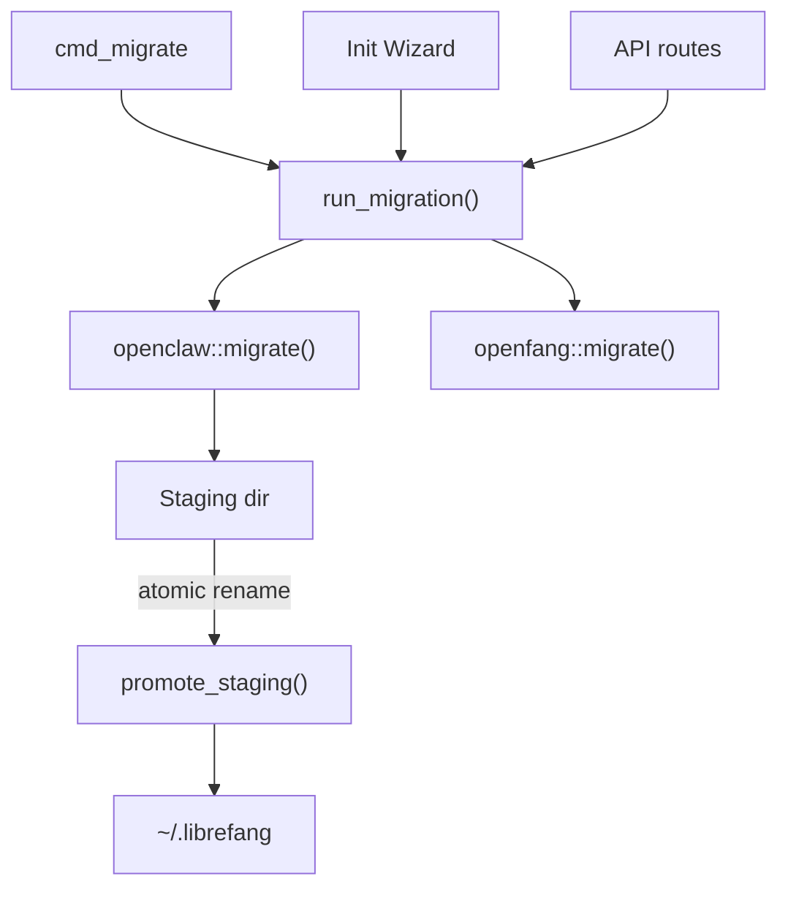

# Infrastructure Libraries — librefang-import-src

# librefang-import — Framework Migration Engine

Imports agents, memory, sessions, skills, and configuration from other agent frameworks into LibreFang's native format.

## Overview

The migration engine converts workspace layouts and config formats from external agent frameworks (OpenClaw, OpenFang) into LibreFang's TOML-based directory structure. It is invoked from three entry points in the host application:

- **CLI** — `cmd_migrate` in `src/commands/system.rs`
- **TUI** — the init wizard screen (`tui/screens/init_wizard.rs`)
- **API** — `/config/migration` routes (`routes/config/migration.rs`)



## Module Structure

| File | Responsibility |
|------|---------------|
| `lib.rs` | Public API: `MigrateSource`, `MigrateOptions`, `run_migration()`, `MigrateError` |
| `openclaw.rs` | OpenClaw workspace parser, scanner, and full migration pipeline |
| `openfang.rs` | OpenFang migration (same config format, community fork) |
| `report.rs` | `MigrationReport`, `MigrateItem`, `SkippedItem` types |

## Public API

### `run_migration(options: &MigrateOptions) -> Result<MigrationReport, MigrateError>`

The sole entry point. Dispatches to `openclaw::migrate()` or `openfang::migrate()` based on `options.source`. Returns `MigrateError::UnsupportedSource` for `LangChain` and `AutoGpt` (not yet implemented).

### `MigrateOptions`

| Field | Type | Purpose |
|-------|------|---------|
| `source` | `MigrateSource` | Which framework to import from |
| `source_dir` | `PathBuf` | Path to the source workspace root |
| `target_dir` | `PathBuf` | Path to `~/.librefang` (or equivalent) |
| `dry_run` | `bool` | Report only — no filesystem changes |

### `MigrateSource` Variants

- `OpenClaw` — fully supported
- `OpenFang` — supported (same-format fork)
- `LangChain` — future, returns `UnsupportedSource`
- `AutoGpt` — future, returns `UnsupportedSource`

## OpenClaw Migration Pipeline

The OpenClaw migrator handles two workspace layouts:

**Modern (JSON5)** — a single `openclaw.json` (or `clawdbot.json` / `moldbot.json` / `moltbot.json`) containing all config, agents, channels, models, tools, cron, hooks, and skills.

**Legacy (YAML)** — separate `config.yaml` + `agents/<name>/agent.yaml` files. Very old installations.

Detection is automatic via `find_config_file()`.

### Migration Steps

1. **Config** — `migrate_config_from_json()` or `migrate_legacy_config()` converts the top-level config into LibreFang's `config.toml`. Default model is extracted from `agents.defaults.model`, split by `/` into `(provider, model)` via `split_model_ref()`.
2. **Agents** — Each entry in `agents.list` becomes `agents/<id>/agent.toml`. Tool lists are mapped through `librefang_types::tool_compat::map_tool_name()`. Capabilities (`shell`, `network`, `agent_message`, `agent_spawn`) are derived from the mapped tool set.
3. **Memory** — `MEMORY.md` files from `memory/<agent>/` or `agents/<agent>/` are copied to `agents/<agent>/imported_memory.md`.
4. **Workspaces** — `workspaces/<agent>/` directories are recursively copied to `agents/<agent>/workspace/`.
5. **Sessions** — `.jsonl` files from `sessions/` are copied to `imported_sessions/`.
6. **Skipped features** — Cron, hooks, auth profiles, skills, vector indexes, and all messaging channels are reported as `SkippedItem` entries with instructions for manual migration.

### Channel Handling

All 13 messaging channels (Telegram, Discord, Slack, WhatsApp, Signal, Matrix, Google Chat, Teams, IRC, Mattermost, Feishu, iMessage, BlueBubbles) have been migrated to out-of-process sidecar adapters. The migrator:

- Extracts bot tokens / API keys into `secrets.env` (for Telegram, Discord, Slack, Mattermost)
- Emits a `SkippedItem` explaining how to declare the corresponding `[[sidecar_channels]]` block
- Never writes `[channels.*]` TOML blocks that the kernel would reject

### Atomicity and Idempotency

**Staging directory (#3798):** All writes go to a sibling `<target>.migrate-staging` directory first. On success, `promote_staging()` moves entries into the real target with same-filesystem renames. If migration fails mid-way, the staging directory is left in place for inspection and the target is untouched. A stale staging directory from a previous failed run causes `MigrateError::StagingExists`.

**Migration marker:** After a successful migration, a `.openclaw_migrated` marker file is written into the target. Re-running migration with the marker present produces a warning and skips without overwriting user edits. Delete the marker to force a re-import.

**Backup before overwrite:** `write_with_backup()` renames any existing destination file to `<name>.bak.<timestamp>` before writing the new content. Collision fallback uses nanosecond-precision timestamps.

**Promotion semantics (#3795):** During `promote_staging()`, if a file already exists in the target, the staged copy is silently dropped (never clobbers). A warning is added to the report.

### Security Hardening

- **Path traversal (#3794):** `validate_migration_id()` rejects agent IDs containing `..`, absolute paths, NUL bytes, control characters, `"`, or `\`. Only single normal path components are accepted.
- **TOML injection:** `toml_escape()` escapes `\`, `"`, newlines, and control characters per the TOML spec for all values interpolated into agent manifests. `toml_comment_safe()` collapses control characters in `#` comment lines.
- **Secret file permissions:** On Unix, `write_secret_env()` sets `0o600` on `secrets.env`.
- **Atomic writes:** `atomic_write()` writes to a `.tmp` sibling then renames, preventing torn writes on interruption.

### Schema Version Validation (#3797)

OpenClaw's `openclaw.json` may declare a `version` (or `schemaVersion`) field. Only versions 1 and 2 are accepted. An unknown version produces `MigrateError::UnsupportedVersion`. A missing version field is allowed with a warning.

## Workspace Scanning

Two public functions support pre-migration inspection:

- **`detect_openclaw_home() -> Option<PathBuf>`** — Searches `$OPENCLAW_STATE_DIR`, `~/.openclaw`, `~/.clawdbot`, `~/.moldbot`, `~/.moltbot`, `~/openclaw`, `~/.config/openclaw`, and Windows `%APPDATA%/openclaw` / `%LOCALAPPDATA%/openclaw`. Returns the first directory that contains a recognized config file or `sessions/` / `memory/` subdirectories.

- **`scan_openclaw_workspace(path: &Path) -> ScanResult`** — Reads the workspace config and enumerates agents (with provider, model, tool count, memory/workspace/session availability), channels, and skills without performing any migration.

## Provider and Tool Mapping

### `map_provider()`

Maps OpenClaw provider names to LibreFang equivalents:

| OpenClaw | LibreFang |
|----------|-----------|
| `anthropic`, `claude` | `anthropic` |
| `openai`, `gpt` | `openai` |
| `groq` | `groq` |
| `ollama` | `ollama` |
| `openrouter` | `openrouter` |
| `deepseek` | `deepseek` |
| `together` | `together` |
| `mistral` | `mistral` |
| `fireworks` | `fireworks` |
| `google`, `gemini` | `google` |
| `xai`, `grok` | `xai` |
| `cerebras` | `cerebras` |
| `sambanova` | `sambanova` |

Unknown names pass through unchanged.

### Tool Mapping

Tool names are resolved through `librefang_types::tool_compat`:
- `is_known_librefang_tool()` checks if a name is already valid
- `map_tool_name()` converts OpenClaw tool names to LibreFang equivalents
- Unknown tools are collected into `unmapped_tools` and reported as warnings

### Tool Profiles

`tools_for_profile()` delegates to `librefang_types::agent::ToolProfile` for consistent tool sets:

| Profile | Enum Variant |
|---------|-------------|
| `minimal` | `ToolProfile::Minimal` |
| `coding`, `coder`, `developer`, `dev` | `ToolProfile::Coding` |
| `research`, `researcher` | `ToolProfile::Research` |
| `messaging`, `chat`, `messenger` | `ToolProfile::Messaging` |
| `automation`, `automator` | `ToolProfile::Automation` |
| `custom` | `ToolProfile::Custom` |
| any other | `ToolProfile::Full` |

### `default_api_key_env()`

Returns the conventional environment variable name for a provider's API key (e.g., `ANTHROPIC_API_KEY`, `OPENAI_API_KEY`). Returns empty string for `ollama` (no key needed).

## Error Handling

`MigrateError` covers all failure modes:

| Variant | Trigger |
|---------|---------|
| `SourceNotFound` | Source directory does not exist |
| `ConfigParse` | Config file is malformed |
| `AgentParse` | Agent definition is malformed |
| `Io` | Filesystem I/O error |
| `Yaml` | `serde_yaml` parse error (legacy YAML configs) |
| `Json5Parse` | JSON5 parse error (modern configs) |
| `TomlSerialize` | `toml` serialization error |
| `UnsupportedSource` | Framework not yet supported |
| `InvalidId` | Agent ID fails `validate_migration_id()` |
| `UnsupportedVersion` | openclaw.json schema version not in `[1, 2]` |
| `StagingExists` | Stale staging directory from a previous failed run |

## Agent Manifest Output

Each migrated agent produces a `agents/<id>/agent.toml` with this structure:

```toml
# LibreFang agent manifest
# Migrated from OpenClaw agent '<id>'

name = "<display_name>"
version = "<librefang_types::VERSION>"
description = "Migrated from OpenClaw agent '<id>'"
author = "librefang"
module = "builtin:chat"
profile = "<profile>"              # optional, from tool profile
skills = ["<skill>", ...]          # optional, from agent.skills
tool_blocklist = ["<tool>", ...]   # optional, from tools.deny
workspace = "<path>"               # optional, from agent.workspace

[model]
provider = "<provider>"
model = "<model>"
system_prompt = "<prompt>"
api_key_env = "<ENV_VAR>"          # optional

[[fallback_models]]                # optional, repeated
provider = "<provider>"
model = "<model>"

[capabilities]
tools = ["<tool>", ...]
memory_read = ["*"]
memory_write = ["self.*"]
network = ["*"]                    # conditional
shell = ["*"]                      # conditional
agent_message = ["*"]              # conditional
agent_spawn = true                 # conditional
```

Fields carried over from OpenClaw that were previously silently dropped (now preserved): `tool_blocklist` (from `tools.deny`), `workspace` (from `agent.workspace`), `skills` (from `agent.skills`).

## Integration Points

- **`librefang_types::config`** — `CONFIG_VERSION` and `DEFAULT_API_LISTEN` constants for the output `config.toml`
- **`librefang_types::tool_compat`** — `is_known_librefang_tool()` and `map_tool_name()` for tool name resolution
- **`librefang_types::agent::ToolProfile`** — tool profile definitions shared with the kernel
- **`librefang_types::VERSION`** — stamped into every migrated agent manifest
- **`librefang-import/src/report.rs`** — `MigrationReport`, `MigrateItem`, `SkippedItem` types returned to callers