# Infrastructure Libraries — librefang-kernel-handle-src

# librefang-kernel-handle

Role traits that define the seam between the LibreFang agent runtime and the kernel implementation.

## Purpose

Every tool invocation, agent lifecycle event, and cross-agent message in LibreFang crosses a trait boundary. This crate defines that boundary. Rather than coupling the runtime to a concrete kernel type, the runtime accepts trait objects (`Arc<dyn SomeRoleTrait>`) so it can run against the real kernel, a test stub, or a minimal embedded harness without knowing the difference.

Historically this was a single `KernelHandle` trait with 50+ methods spanning 14 unrelated domains (issue #3746). That design forced every caller to depend on the entire kernel surface and made mocking painful. The crate now exposes **19 focused role traits**, each covering one capability domain. `KernelHandle` survives as a supertrait alias with a blanket impl, so the ~117 existing `Arc<dyn KernelHandle>` call sites keep compiling unchanged.

## Architecture

```mermaid
graph BT
    AC[AgentControl]
    MA[MemoryAccess]
    WA[WikiAccess]
    TQ[TaskQueue]
    EB[EventBus]
    KG[KnowledgeGraph]
    CC[CronControl]
    AG[ApprovalGate]
    HC[HandsControl]
    AR[A2ARegistry]
    CS[ChannelSender]
    PS[PromptStore]
    WR[WorkflowRunner]
    GC[GoalControl]
    TP[ToolPolicy]
    AA[ApiAuth]
    SW[SessionWriter]
    AF[AcpFsBridge]
    AT[AcpTerminalBridge]
    CQ[CatalogQuery]

    KH["KernelHandle<br/>(supertrait alias)"]

    AC & MA & WA & TQ & EB & KG & CC & AG & HC & AR & CS & PS & WR & GC & TP & AA & SW & AF & AT & CQ --> KH

    style KH fill:#2d6,stroke:#000,color:#000
```



Any type that implements all 19 role traits automatically satisfies `KernelHandle` via the blanket `impl<T> KernelHandle for T`. New code should narrow to only the role bounds it needs.

## Error Handling

All trait methods return results through two re-exports:

| Type | Definition |
|---|---|
| `KernelOpError` | Alias for `librefang_types::error::LibreFangError` — the workspace-wide structured error enum |
| `KernelResult<T>` | Alias for `Result<T, KernelOpError>` |

This avoids a parallel "kernel handle error" type. Callers can match directly on variants (`AgentNotFound`, `CapabilityDenied`, `Unavailable`) instead of substring-matching error strings. Every layer — runtime, kernel, API — shares the same vocabulary, so cross-layer conversion is a no-op.

## Role Trait Reference

### Agent Lifecycle

**`AgentControl`** *(async)* — Spawning, messaging, listing, killing agents. Covers:

- `spawn_agent` / `spawn_agent_checked` — create from TOML manifest, with optional capability-inheritance enforcement
- `send_to_agent` / `send_to_agent_as` — inter-agent RPC; the `_as` variant supports cancel cascading from a parent agent (issue #3044)
- `run_forked_agent_oneshot` — forked agent turn that collapses to a single text response, used by proactive memory extractors to share the parent's prompt-cache prefix with Anthropic
- `list_agents`, `find_agents`, `kill_agent` — discovery and lifecycle
- `touch_heartbeat`, `fire_agent_step` — runtime bookkeeping
- `max_agent_call_depth` — config read (default: 5)

**`HandsControl`** *(async)* — Specialized autonomous agents ("Hands"). Install from TOML, activate with config, check status, deactivate. All methods default to `Unavailable`.

**`A2ARegistry`** *(sync)* — Read-only directory of discovered external A2A agents. Returns `(name, url)` pairs.

### Memory & Knowledge

**`MemoryAccess`** *(sync)* — Shared cross-agent key-value store with per-peer namespace isolation. The `memory_acl_for_sender` method resolves per-user RBAC ACLs (issue #3054 Phase 2), returning `None` when RBAC is disabled.

**`WikiAccess`** *(sync)* — Durable markdown knowledge vault (issue #3329). Mirrors `MemoryAccess` but targets the wiki substrate. Methods return `serde_json::Value` to avoid a dependency on `librefang-memory-wiki` types:

- `wiki_get` — fetch a page (returns `unavailable` when the vault is disabled, `not_found` when the topic doesn't exist)
- `wiki_search` — case-insensitive substring search, topic-name hits outrank body hits
- `wiki_write` — write with provenance tracking and optimistic-concurrency protection (`force` flag)

**`KnowledgeGraph`** *(async)* — Entity/relation insert and pattern query. Methods take entities and relations by reference so callers retain ownership for retries without extra clones (issue #3553).

### Task & Workflow

**`TaskQueue`** *(async)* — Shared task queue: post, claim, complete, list, delete, retry, get-by-id, update-status. Tasks are represented as `serde_json::Value` to avoid coupling to the kernel's internal task model.

**`WorkflowRunner`** *(async)* — Declarative workflow execution with structured metadata. Key methods:

- `run_workflow` — synchronous execute, returns `(run_id, output)`
- `start_workflow_async` / `start_workflow_async_tracked` — fire-and-forget with optional agent/session tracking for completion events (issue #4983)
- `list_workflows` → `WorkflowSummary` — includes `has_input_schema` flag
- `describe_workflow` → `WorkflowDescription` — surfaces step names and input parameters so the agent can discover *how to call* a workflow before invoking it (issue #4982)
- `get_workflow_run` → `WorkflowRunSummary` — includes per-step outputs in execution order
- `cancel_workflow_run` — cancel a running or paused workflow

All workflow-related structs (`WorkflowSummary`, `WorkflowInputParam`, `WorkflowDescription`, `StepOutputSummary`, `WorkflowRunSummary`) are `#[non_exhaustive]` and constructed via `new()` methods to allow future field additions without breaking downstream crates.

### Events & Goals

**`EventBus`** *(async)* — Fire-and-forget custom events for proactive agent triggers. Single method: `publish_event`.

**`GoalControl`** *(sync)* — List active goals (optionally filtered by agent) and update goal status/progress.

### Approval & Policy

**`ApprovalGate`** *(async + sync)* — Tool approval lifecycle and RBAC gate resolution:

- `requires_approval` / `requires_approval_with_context` — check if a tool needs human approval
- `is_tool_denied_with_context` — hard-deny check per sender/channel
- `resolve_user_tool_decision` — combines user tool policy, channel rules, and role-based escalation into a single `UserToolGate` verdict (`Allow` / `Deny` / `NeedsApproval`). Defaults to `Allow` so installations without `AuthManager` keep pre-M3 behavior
- `request_approval` — blocking wait for approval decision
- `submit_tool_approval` / `resolve_tool_approval` — non-blocking submit + resolve with deferred execution payloads
- `get_approval_status` — poll current status

**`ToolPolicy`** *(sync)* — Read-side config queries that parameterize tool execution:

- `tool_timeout_secs` / `tool_timeout_secs_for` — global and per-tool timeouts with glob matching
- `skill_env_passthrough_policy` — operator gate over skill environment variable access
- `readonly_workspace_prefixes` / `named_workspace_prefixes` — workspace access mode enforcement
- `channel_file_download_dir` — attachment download directory for channel bridges
- `deduplicate_file_reads` — session-scoped file-read deduplication toggle
- `effective_upload_dir` — runtime-generated upload storage location

### Channels & Communication

**`ChannelSender`** *(async + sync)* — Outbound channel adapters:

- `send_channel_message` / `send_channel_media` / `send_channel_file_data` / `send_channel_poll` — send text, media, raw file bytes, and polls to users on named channel adapters (email, telegram, etc.). File data uses `bytes::Bytes` for zero-cost cloning in wrapping layers (issue #3553).
- `roster_upsert` / `roster_members` / `roster_remove_member` — group chat roster management
- `resolve_channel_owner` — find which agent owns a `(channel, chat_id)` pair

### Prompts & Experiments

**`PromptStore`** *(sync)* — Prompt version management and A/B experiments. Create, list, get, delete, set-active for versions; create, list, get, update-status for experiments; auto-track prompt changes. Methods that accept complex types (`create_prompt_version`, `create_experiment`) take them by reference (issue #3553).

### Scheduling

**`CronControl`** *(async)* — Agent-owned scheduled jobs: create, list, cancel. All default to `Unavailable`.

### API Server Support

**`ApiAuth`** *(sync)* — Single method `auth_snapshot()` returning an `ApiAuthSnapshot` that captures every auth-relevant config field in one atomic read. This prevents middleware from mixing pre-reload and post-reload config during hot-reload races.

Returns raw (unresolved) config strings so the API server can apply its own credential-resolution logic (env-var overrides, `vault:` prefix expansion) without importing `KernelConfig`.

**`SessionWriter`** *(sync, blocking I/O)* — Pre-inject content blocks into an agent session before an LLM turn. Used by the HTTP attachment upload path (issue #3744) and by `tool_channel_send` to mirror outbound messages.

> **Blocking I/O caveat:** The production implementation calls `MemorySubstrate::save_session` synchronously (SQLite write). Async callers must wrap in `tokio::task::spawn_blocking` to avoid stalling worker threads. This will be resolved when issue #3579 migrates the substrate to async I/O.

### ACP Editor Bridges

**`AcpFsBridge`** *(async)* — Routes `fs/read_text_file` and `fs/write_text_file` through an attached ACP editor instead of the local filesystem (issue #3313). The kernel maps a `SessionId` to a registered `Arc<dyn AcpFsClient>`. Sessions without an editor return `Unavailable` — tools should fall back to local I/O.

**`AcpTerminalBridge`** *(async)* — Routes `terminal/*` commands through the editor's PTY so output appears in the editor's terminal panel. Same registration/lookup pattern as `AcpFsBridge`. Returns `AcpTerminalRunResult` with output, truncation flag, exit code, and signal information.

**`AcpFsClient`** and **`AcpTerminalClient`** are the object-safe client halves, implemented by `librefang-acp` adapter types and stored per-session by the kernel.

### Model Catalog

**`CatalogQuery`** *(sync)* — Read-side projection of model-catalog metadata. Currently surfaces `reasoning_echo_policy_for(model)` so the OpenAI-compat driver can dispatch the correct wire shape for `reasoning_content` per model (issue #4842). Returns `ReasoningEchoPolicy::None` by default, which triggers the legacy substring-based fallback.

## Using the Traits

### Import everything

```rust
use librefang_kernel_handle::prelude::*;
```

This brings in `KernelHandle` and every role trait, so method calls like `kernel.send_channel_message(...)` resolve regardless of which role trait owns them.

### Narrow bounds in new code

Instead of requiring the full kernel surface:

```rust
// Legacy — pulls in everything
fn process_approval(kernel: &Arc<dyn KernelHandle>) { ... }
```

Express only what you need:

```rust
// Narrow — only the approval capability
fn process_approval(kernel: &(dyn ApprovalGate + Send + Sync)) { ... }
```

This makes dependencies explicit, enables smaller mocks, and turns a missing capability into a compile error rather than a runtime `Err("not available")`.

### Building a mock

Each role trait has default impls for every method. A stub that doesn't need a particular capability can simply leave the defaults (they return `Unavailable` errors or empty data). The crate's own tests demonstrate this pattern — `StubKernel` implements the required methods for `AgentControl` and `TaskQueue` explicitly, then uses empty `impl CronControl for StubKernel {}` blocks for traits where the defaults are sufficient.

## Default Implementations and Migration Strategy

Defaults that return `Err("X not available")` are preserved from the pre-split god-trait to keep the structural refactor a zero-behavior-change operation. They are gathered onto their owning role trait so future PRs can tighten each contract independently — removing defaults one role at a time rather than needing to land 30+ removals atomically.

The practical impact: a stub that forgets to override, say, `wiki_get` gets a runtime error, not a panic. As roles mature, defaults should be removed so missing overrides become compile errors.

## Object Safety

Every role trait is individually object-safe. The test suite verifies this by constructing `Arc<dyn EachRoleTrait>` from the `StubKernel` type. If a role trait gains a non-object-safe method (generic parameter, `Self` by value, etc.), the corresponding test stops compiling and flags the regression immediately.

## Key Data Types

| Type | Purpose |
|---|---|
| `AgentInfo` | Agent metadata returned by list/discovery: id, name, state, model info, tags, tools |
| `WorkflowSummary` | Registered workflow definition with step count and schema flag |
| `WorkflowInputParam` | One parameter in a workflow's input schema (name, type, required, description) |
| `WorkflowDescription` | Full workflow metadata + input schema for agent discovery |
| `WorkflowRunSummary` | Running or completed workflow instance with per-step outputs |
| `StepOutputSummary` | Single step's name and final output |
| `ApiAuthSnapshot` | Atomic snapshot of all auth config fields |
| `ApiUserConfigSnapshot` | Per-user config values for API-key table construction |
| `DashboardRawConfig` | Raw dashboard credential strings before env-var/vault resolution |
| `AcpTerminalRunResult` | Terminal command result: output, truncation flag, exit code/signal |

All workflow types are `#[non_exhaustive]` with `new()` constructors. Future field additions use `with_<field>(self, …)` setters on the constructors, keeping downstream code compiling.