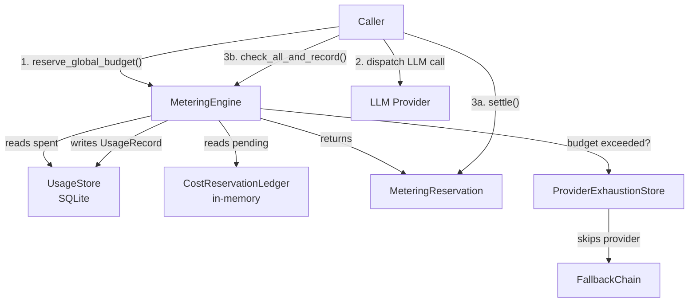

# Infrastructure Libraries — librefang-kernel-metering-src

# librefang-kernel-metering

LLM cost tracking and spending quota enforcement engine. Records every LLM call's token usage and cost into a SQLite-backed store, gates new calls against configurable budgets, and prevents concurrent requests from collectively overshooting caps.

## Architecture



The typical call lifecycle for a gated LLM dispatch:

1. **Reserve** — call `reserve_global_budget` with an estimated cost. The engine checks settled spend (SQLite) + pending reservations (in-memory) against the hourly/daily/monthly caps. Returns a `MeteringReservation` on success.
2. **Dispatch** — send the request to the LLM provider.
3. **Settle** — on success, call `MeteringReservation::settle` and then `check_all_and_record` to atomically verify all quotas and persist the actual usage. On failure, call `MeteringReservation::release`.

## Key Types

### `MeteringEngine`

The primary entry point. Holds:

| Field | Purpose |
|---|---|
| `store: Arc<UsageStore>` | SQLite-backed persistent usage records |
| `pending: Arc<CostReservationLedger>` | In-memory ledger of reserved-but-unsettled cost |
| `exhaustion: Option<ProviderExhaustionStore>` | Shared with the LLM fallback chain; when a per-provider budget trips, the provider is flagged here so subsequent calls skip it |

**Construction:**

```rust
let engine = MeteringEngine::new(store)
    .with_exhaustion_store(exhaustion_store);
```

`with_exhaustion_store` is optional — without it, the engine functions identically to its pre-#4807 behavior (quota errors still fire, but providers are not flagged for the fallback chain).

### `MeteringReservation`

A `#[must_use]` RAII token. Holds the estimated USD reserved against the global budget. Three disposal paths:

- **`settle()`** — call after recording actual usage. Releases the reservation.
- **`release()`** — call on dispatch failure (no cost was incurred). Releases the reservation.
- **`Drop`** — safety net. If neither `settle` nor `release` was called (e.g., a panic between reserve and settle), the `Drop` impl releases the reservation automatically.

### `BudgetStatus`

Read-only snapshot returned by `budget_status`. Serialized via serde, used for dashboards and alerting. Contains spend, limit, and percentage for hourly/daily/monthly windows plus the configured alert threshold.

## Budget Enforcement Layers

The engine enforces four independent budget scopes. All use the same time windows (hourly, daily, monthly). A limit of `0.0` means **unlimited** — that window is skipped entirely.

| Scope | Method | When to call |
|---|---|---|
| **Per-agent** | `check_quota`, `check_quota_and_record` | Gate individual agent spend against its `ResourceQuota` |
| **Global** | `check_global_budget`, `check_global_budget_and_record` | Gate total system spend against `BudgetConfig` top-level limits |
| **Per-provider** | `check_provider_budget` | Gate a specific provider (e.g., `openai`, `groq`) against operator-set caps |
| **Per-user** | `check_user_budget` | Gate a specific user's cumulative spend (RBAC M5) |

### Atomic check-and-record

`check_all_and_record` is the **preferred post-call method**. It checks per-agent quotas, global budget, *and* per-provider budget (resolved from `budget.providers` map by the record's provider field) in a single SQLite transaction. If any check fails, the record is **not** inserted — no partial state.

Narrower atomic variants exist for simpler call sites:

- `check_quota_and_record` — per-agent only
- `check_global_budget_and_record` — global only

### Pre-call reservation vs. post-call check

The `>` vs `>=` asymmetry between `reserve_global_budget` and `check_global_budget` is intentional:

- **Pre-call** (`reserve_global_budget`) uses `>` — a single call that exactly reaches the cap is still allowed through. This avoids rejecting a fresh kernel's very first call.
- **Post-call** (`check_global_budget`, `check_all_and_record`) uses `>=` — once the limit is fully consumed, no further calls are dispatched.

## Provider Exhaustion Integration (#4807)

When a per-provider budget gate trips and an exhaustion store is attached, the engine calls `flag_provider_budget_exhausted`, which marks the provider as `ExhaustionReason::BudgetExceeded` for `DEFAULT_LONG_BACKOFF`. The LLM fallback chain reads the same store and skips that provider without dispatching a request.

This integration is deliberately narrow: the engine only depends on `ProviderExhaustionStore`, `ExhaustionReason`, and `DEFAULT_LONG_BACKOFF` from `librefang-llm-driver` — nothing else from the driver crate is used.

The `exhaustion_store()` accessor returns a clone of the attached store so callers can wire it into other layers (e.g., an `AuxClient` built after the engine).

## Cost Estimation

Two estimation paths:

### `estimate_cost` (catalog-free)

Uses hardcoded default rates ($1.00/M input, $3.00/M output). Intended for unit tests and contexts where no model catalog is available. The `model` parameter is accepted for API compatibility but **not consulted** — the same rates apply regardless.

### `estimate_cost_with_catalog` (preferred)

Reads pricing from the `ModelCatalog`. Resolution order:

1. Look up the model ID (or alias) in the catalog.
2. If found and pricing is non-zero, use catalog rates.
3. If found but both input and output cost are `$0.0` **and** the provider is `chatgpt` (session-auth models), fall back to default rates. Budgets still need a conservative non-zero estimate even though the catalog reports zero.
4. If not found, fall back to default rates.

### Cache token pricing

`estimate_cost_from_rates` applies multiplier adjustments for prompt caching:

| Token type | Multiplier vs. base input price |
|---|---|
| Regular input | 1.0× |
| Cache-read | 0.1× (90% discount) |
| Cache-creation | 1.25× (25% surcharge) |
| Output | 1.0× of output price |

Regular input tokens are calculated as `total_input - cache_read - cache_creation` (saturating subtraction).

## Dependencies

| Crate | Usage |
|---|---|
| `librefang-memory` | `UsageStore`, `UsageRecord`, `UsageSummary`, `ModelUsage` — SQLite persistence |
| `librefang-llm-driver` | `ProviderExhaustionStore`, `ExhaustionReason`, `DEFAULT_LONG_BACKOFF` — exhaustion signaling |
| `librefang-types` | `AgentId`, `UserId`, `ResourceQuota`, `BudgetConfig`, `ProviderBudget`, `UserBudgetConfig`, `LibreFangError` |
| `librefang-runtime` | `ModelCatalog`, `ModelCatalogEntry` — catalog-driven pricing |

## Common Patterns

### Full gated dispatch

```rust
let reservation = engine.reserve_global_budget(&budget, estimated_cost)?;

match dispatch_llm_call(&request).await {
    Ok(response) => {
        reservation.settle();
        let record = build_usage_record(response);
        engine.check_all_and_record(&record, &quota, &budget)?;
    }
    Err(_) => reservation.release(),
}
```

### Pre-dispatch provider gate

```rust
if let Some(provider_budget) = budget.providers.get(&provider_name) {
    engine.check_provider_budget(&provider_name, provider_budget)?;
}
```

### User budget check (post-call)

`check_user_budget` is a **post-call** gate — it runs after `check_all_and_record` succeeds. At that point the cost is already in the rolled-up totals. "Exceeded" means the *next* call from this user will be denied, not that the current one is rolled back.

```rust
engine.check_all_and_record(&record, &quota, &budget)?;
if let Some(user_budget) = &user_config.budget {
    engine.check_user_budget(user_id, user_budget)?;
}
```

## Data Cleanup

`cleanup(days)` removes usage records older than the specified number of days. Returns the count of deleted rows. Call periodically to prevent unbounded SQLite growth.