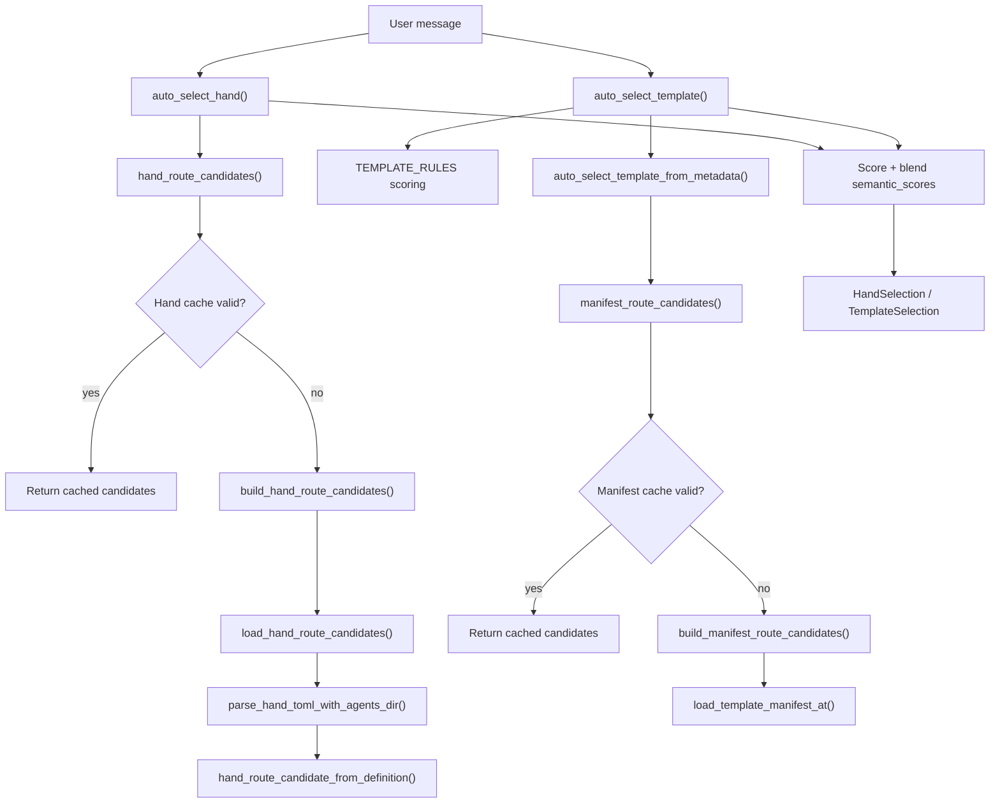

# Infrastructure Libraries — librefang-kernel-router-src

# librefang-kernel-router

Message-to-agent routing engine for the LibreFang kernel. Given a user message, this module determines which specialist agent template or multi-agent hand should handle it, using a blended scoring model of keyword matching and optional semantic similarity.

## Architecture



## Two Routing Domains

The module handles two distinct routing decisions that the kernel makes independently:

### Hand Routing

A **hand** is a multi-agent orchestration defined in a `HAND.toml` file. `auto_select_hand()` scores the message against phrases extracted from each installed hand's `[routing]` section and description.

**Phrase sources** (per hand):
| Source | Weight | Example |
|---|---|---|
| `routing.aliases` (strong) | 6 pts each | `"deep research"` |
| `routing.weak_aliases` (weak) | 1 pt each | `"research"` |
| Description-derived phrases | 6 pts each | `"systematic review"` |
| ID tokens (≥3 chars, non-generic) | 1 pt each | `"browser"` from `browser` |

Minimum score to match: **2** (a single weak hit is rejected as noise).

### Template Routing

A **template** is a single agent specialist. `auto_select_template()` evaluates the message against:

1. **`TEMPLATE_RULES`** — a curated table of 29 specialists, each with bilingual (English + Chinese) regex patterns classified as strong (weight 6) or weak (weight 1).
2. **Manifest metadata** — `agent.toml` files under the agents directory. The `[metadata.routing]` section can declare `aliases` (weight 6), `weak_aliases` (weight 1), and `exclude_generated = true` to suppress auto-generated phrases.
3. **Auto-generated phrases** from the template name, tags, and description (weight 2).

When multiple specialists score equally and the message contains multi-domain indicators (`"同时"`, `"multi"`, `"协作"`, etc.), the router falls back to the `"orchestrator"` template.

If nothing matches at all, `"orchestrator"` is returned as the default.

## Semantic Blending

Both routing functions accept an optional `semantic_scores: Option<&HashMap<String, f32>>` — a map from template/hand ID to cosine similarity score (0.0–1.0). These are blended into the keyword score:

| Component | Value |
|---|---|
| `MAX_SEMANTIC_BONUS` | 5 points (at similarity 1.0) |
| `SEMANTIC_ONLY_THRESHOLD` | 0.55 similarity for semantic-only fallback |

When keyword matching finds zero hits, the router checks semantic scores against the threshold. Any template or hand above 0.55 gets `(similarity × 5)` points, potentially routing purely on meaning. This is how Chinese/Japanese/Korean input routes correctly when embedding similarity is provided by the kernel.

**Keyword priority is preserved**: if keyword matching strongly favors candidate A and semantic scores favor candidate B, A wins because keyword points (6+ per strong hit) typically exceed the maximum semantic bonus of 5.

## Caching

Three global caches avoid redundant work on every inbound message:

| Cache | Static | Invalidation |
|---|---|---|
| `REGEX_CACHE` | `OnceLock<Mutex<HashMap<String, Regex>>>` | Never (compiled patterns are stable) |
| `HAND_ROUTE_CACHE` | `OnceLock<Mutex<Option<HandRouteCacheEntry>>>` | `invalidate_hand_route_cache()` |
| `MANIFEST_CACHE` | `OnceLock<Mutex<Option<ManifestCacheEntry>>>` | `invalidate_manifest_cache()` |

Both hand and manifest caches are keyed by directory path. If the `home_dir` or `agents_dir` changes between calls, the cache is automatically rebuilt.

Call `invalidate_hand_route_cache()` and `invalidate_manifest_cache()` after config hot-reload, agent install/uninstall, or hand registry changes.

## Home Directory Resolution

Hand routing resolves its base directory with this priority:

1. Explicit call to `set_hand_route_home_dir()` (highest)
2. `LIBREFANG_HOME` environment variable
3. `~/.librefang` (default)

Hands are loaded from `{home}/registry/hands/*/HAND.toml`. The agents registry at `{home}/registry/agents` is passed to `parse_hand_toml_with_agents_dir()` so hands that declare `base = "<template>"` for their agents can resolve correctly without log spam.

## Public API

### Routing Functions

```rust
pub fn auto_select_hand(
    message: &str,
    semantic_scores: Option<&HashMap<String, f32>>,
) -> HandSelection
```

Returns `HandSelection { hand_id: Option<String>, reason: String, score: usize }`. `hand_id` is `None` when no hand meets the minimum score.

```rust
pub fn auto_select_template(
    message: &str,
    agents_dir: &Path,
    semantic_scores: Option<&HashMap<String, f32>>,
) -> TemplateSelection
```

Returns `TemplateSelection { template: String, reason: String, score: usize }`. Falls back to `"orchestrator"` when nothing matches.

### Manifest Loading

```rust
pub fn load_template_manifest(
    home_dir: &Path,
    template: &str,
) -> Result<AgentManifest, String>
```

Loads `agent.toml` from `{home_dir}/workspaces/agents/{template}/agent.toml`. Template names are validated to contain only `[a-zA-Z0-9_-]`.

```rust
pub fn all_template_descriptions(agents_dir: &Path) -> Vec<(String, String)>
```

Returns `(template_name, embeddable_text)` pairs for all non-excluded templates. Used by the kernel to build embedding vectors for semantic routing. The `"assistant"` template is excluded from routing.

### Cache Management

```rust
pub fn set_hand_route_home_dir(home_dir: &Path)
pub fn invalidate_hand_route_cache()
pub fn invalidate_manifest_cache()
```

## Phrase Extraction Internals

The module extracts routing phrases from free-text descriptions and tags with language-aware logic:

- **ASCII phrases**: Split on whitespace/punctuation, strip generic English words (the 48-word `GENERIC_ENGLISH_WORDS` list), generate word-boundary regex patterns. Multi-word sequences and individual content words (≥4 chars) are both extracted.
- **CJK phrases**: Kept as-is when 2–32 characters long. Matched via `str::contains` on lowercased input rather than word-boundary regex, since CJK languages don't use whitespace delimiters.
- **Deduplication**: `dedupe()` preserves insertion order while removing duplicates.

The `phrase_matches()` function handles both cases: ASCII phrases compile to a regex with `[\s_-]+` between words (so `"code review"` matches `"code-review"` and `"code_review"`), while non-ASCII phrases use substring matching.

## TEMPLATE_RULES Reference

29 built-in specialists, each with bilingual strong/weak patterns:

| Template | Strong keywords (en) | Strong keywords (zh) |
|---|---|---|
| `hello-world` | hello, hi, hey, greet, welcome | 打招呼, 欢迎词, 自我介绍 |
| `coder` | implement, build, refactor, patch | 写代码, 实现功能, 脚本, 编码 |
| `debugger` | debug, traceback, stack trace | 报错, 异常, 错误日志, 故障排查 |
| `test-engineer` | test, unit test, integration test | 测试用例, 单元测试, 覆盖率 |
| `code-reviewer` | code review, review this diff/pr | 代码审查, 找回归风险 |
| `architect` | architecture, system/technical design | 架构设计, 模块划分, 技术方案 |
| `security-auditor` | security, vulnerability, XSS, CSRF | 安全审计, 漏洞, SQL注入 |
| `devops-lead` | deploy, CI/CD, Kubernetes, Docker | 部署, 上线, 容器, K8s |
| `researcher` | research, look up, fact check | 调研, 查资料, 事实核查 |
| `analyst` | business/competitive/trend analysis | 竞品分析, 漏斗分析 |
| `data-scientist` | ML, regression, classification | 统计建模, 预测模型 |
| `planner` | plan, roadmap, timeline, milestone | 项目计划, 里程碑, 任务拆解 |
| `writer` | write article, blog post, rewrite | 写一篇, 起草文章, 文案 |
| `tutor` | teach me, explain step by step | 教我, 辅导学习, 作业辅导 |
| `doc-writer` | docs, readme, documentation | 技术文档, 操作手册, 说明文档 |
| `translator` | translate, localization | 翻译, 中译英, 术语统一 |
| `orchestrator` | orchestrate, delegate, multi-agent | 多代理, 复杂任务, 拆成子任务 |
| ... | ... | ... |

See `TEMPLATE_RULES` in source for the complete list including `email-assistant`, `meeting-assistant`, `social-media`, `sales-assistant`, `customer-support`, `recruiter`, `legal-assistant`, `personal-finance`, `recipe-assistant`, `travel-planner`, `health-tracker`, `home-automation`, and `ops`.

## Dependencies

- **`librefang_types`** — `AgentManifest` struct definition
- **`librefang_hands`** — `parse_hand_toml_with_agents_dir()` for loading HAND.toml files
- **`regex_lite`** — Pattern compilation with case-insensitive matching
- **`serde_json`** — Parsing `[metadata.routing]` from manifest metadata