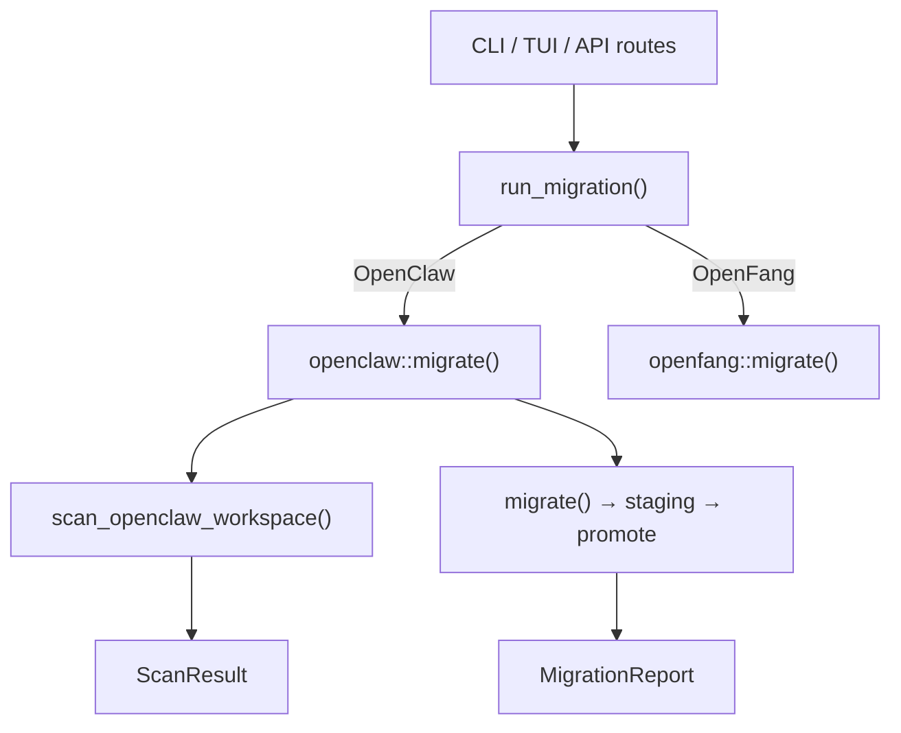

# Infrastructure Libraries — librefang-migrate-src

# librefang-migrate-src

Migration engine for importing agent configurations from external frameworks into LibreFang's native format.

## Overview

This module converts workspaces from other agent frameworks—primarily **OpenClaw** and **OpenFang**—into LibreFang's TOML-based configuration, agent manifests, secrets, memory files, sessions, and workspace directories. It supports both scanning (read-only preview) and full migration with workspace-level atomicity.



## Public API

### `run_migration`

Entry point dispatched by the CLI, TUI init wizard, and HTTP API routes.

```rust
pub fn run_migration(options: &MigrateOptions) -> Result<MigrationReport, MigrateError>
```

Routes to `openclaw::migrate()` or `openfang::migrate()` based on `MigrateOptions::source`. Returns `MigrateError::UnsupportedSource` for `LangChain` and `AutoGpt` (planned, not yet implemented).

### `MigrateOptions`

```rust
pub struct MigrateOptions {
    pub source: MigrateSource,    // OpenClaw | LangChain | AutoGpt | OpenFang
    pub source_dir: PathBuf,      // Source workspace directory
    pub target_dir: PathBuf,      // LibreFang home directory
    pub dry_run: bool,            // Preview only, no disk writes
}
```

### `MigrateError`

All error variants that can occur during migration:

| Variant | Meaning |
|---|---|
| `SourceNotFound` | Source directory does not exist |
| `ConfigParse` / `AgentParse` | Malformed source config |
| `Io` / `Yaml` / `TomlSerialize` | I/O or serialization failures |
| `Json5Parse` | Invalid JSON5 in `openclaw.json` |
| `UnsupportedSource` | Framework not yet supported |
| `InvalidId` | Agent ID contains path traversal (`../`, absolute path, NUL bytes) |
| `UnsupportedVersion` | `openclaw.json` declares schema version outside `{1, 2}` |
| `StagingExists` | Stale staging directory from a previous failed run |

## OpenClaw Migration

The `openclaw` module handles the full import pipeline for OpenClaw workspaces.

### Supported Source Formats

**Modern (JSON5):** A single `openclaw.json` file containing agents, channels, models, tools, and all other configuration. Also recognizes legacy filenames `clawdbot.json`, `moldbot.json`, and `moltbot.json`.

```
~/.openclaw/
├── openclaw.json          # JSON5 — primary config
├── auth-profiles.json     # Credentials (not migrated)
├── sessions/              # JSONL conversation logs
├── memory/                # Per-agent MEMORY.md files
├── memory-search/         # SQLite vector index (not portable)
├── skills/                # Skill definitions
└── workspaces/            # Per-agent working directories
```

**Legacy (YAML):** Older installations using `config.yaml` + `agents/<name>/agent.yaml` + `messaging/<channel>.yaml`.

### Workspace Detection

`detect_openclaw_home()` checks in order:

1. `OPENCLAW_STATE_DIR` environment variable
2. `~/.openclaw`, `~/.clawdbot`, `~/.moldbot`, `~/.moltbot`, `~/openclaw`, `~/.config/openclaw`
3. Windows: `%APPDATA%\openclaw`, `%LOCALAPPDATA%\openclaw`

A candidate directory is accepted if it contains a recognizable config file or has `sessions/` or `memory/` subdirectories.

### Scanning

`scan_openclaw_workspace(path)` returns a `ScanResult` listing agents, channels, skills, and whether memory exists—without modifying anything. Used by the TUI init wizard and API routes for preview.

### Migration Pipeline

`migrate(options)` performs the following steps:

1. **Idempotency check** — If `.openclaw_migrated` marker exists in the target, the migration is skipped to preserve user edits since the first import.

2. **Staging** — All writes go to a sibling `.migrate-staging` directory (see Atomicity below). If a stale staging directory exists from a previous failed run, the migration aborts with `StagingExists`.

3. **Config migration** — Converts global model defaults, memory settings, and channel configurations into `config.toml`. Writes API tokens to `secrets.env`.

4. **Agent migration** — Each agent entry produces `agents/<id>/agent.toml` with model config, system prompt, tool profile, capabilities, fallback models, skill allowlist, tool blocklist, and workspace path.

5. **Memory migration** — Copies `memory/<agent>/MEMORY.md` or `agents/<agent>/MEMORY.md` to `agents/<agent>/imported_memory.md`.

6. **Workspace migration** — Copies `workspaces/<agent>/` or `agents/<agent>/workspace/` to `agents/<agent>/workspace/`.

7. **Session migration** — Copies `sessions/*.jsonl` to `imported_sessions/`.

8. **Skipped features** — Cron, hooks, auth profiles, skills, vector index, and session/memory backend config are reported as skipped with actionable guidance.

9. **Promotion** — The staging tree is atomically moved into the real target. Existing files in the target are **never clobbered**; if a conflict exists, the staged copy is dropped and a warning is emitted.

10. **Marker** — `.openclaw_migrated` is written with a timestamp. Re-running the migration is a no-op until the user deletes this file.

### Atomicity and Safety

- **Workspace-level:** All writes target a staging directory first. Only after every migration step succeeds is staging promoted to the real target via per-file renames. A crash mid-migration leaves the staging directory intact for inspection; the real target is untouched.
- **File-level:** `atomic_write()` writes to a `.tmp` sibling, then renames into place, preventing torn writes.
- **Backup:** Before overwriting any existing file (`config.toml`, `agent.toml`, `imported_memory.md`), the original is renamed to `<name>.bak.<timestamp>`.
- **Non-clobbering promotion:** `promote_staging()` skips any file that already exists in the target, ensuring user edits are never silently overwritten.
- **Idempotency:** The `.openclaw_migrated` marker prevents accidental re-import.

### Security

- **Path traversal prevention (#3794):** `validate_migration_id()` rejects agent IDs containing `..`, absolute paths, or NUL bytes. Only single normal path components are accepted.
- **Schema version gating (#3797):** `openclaw.json` files declaring a version outside `{1, 2}` are rejected with `UnsupportedVersion`.
- **Secret file permissions:** `write_secret_env()` restricts `secrets.env` to mode `0o600` on Unix.
- **Secret validation:** Key and value must not contain newline characters.

### Channel Migration

Supports 13 channel types from the JSON5 config. Each channel is converted to a TOML table under `[channels.<name>]` in `config.toml`.

| Channel | Key fields migrated | Notes |
|---|---|---|
| Telegram | `bot_token_env`, `allowed_users`, policies | Token → `secrets.env` |
| Discord | `bot_token_env`, `allowed_users`, policies | Token → `secrets.env` |
| Slack | `bot_token_env`, `app_token_env`, policies | `allow_from` unmappable (channel-based, not user-based) |
| WhatsApp | `auth_dir` credentials copied | Baileys re-auth may be needed |
| Signal | `api_url` (from `http_host`+`http_port`), `account` | |
| Matrix | `access_token_env`, `homeserver_url`, `user_id`, `allowed_rooms` | Token → `secrets.env` |
| Google Chat | Service account file copied to `credentials/` | |
| Teams | `app_id`, `app_password_env`, `allowed_tenants` | Warns about `signature_required` default |
| IRC | `server`, `port`, `nick`, `use_tls`, `channels`, `password_env` | |
| Mattermost | `token_env`, `server_url` | |
| Feishu | `app_id`, `app_secret_env`, `region` (derived from domain) | |
| iMessage | Skipped | macOS-only, manual setup required |
| BlueBubbles | Skipped | No LibreFang adapter |

Policy mapping:

| OpenClaw DM Policy | LibreFang |
|---|---|
| `open` | `respond` |
| `allowlist` / `allow_list` | `allowed_only` |
| `pairing` / `disabled` | `ignore` |

| OpenClaw Group Policy | LibreFang |
|---|---|
| `open` / `all` | `all` |
| `mention` / `mention_only` | `mention_only` |
| `commands` / `slash_only` | `commands_only` |
| `disabled` / `ignore` | `ignore` |

### Agent Conversion

`convert_agent_from_json()` and `convert_legacy_agent()` produce a complete TOML agent manifest:

- **Model:** Splits `"provider/model"` references via `split_model_ref()`. Falls back to `anthropic/claude-sonnet-4-20250514` if no model is specified.
- **Provider mapping:** `map_provider()` normalizes provider names (e.g., `"claude"` → `"anthropic"`, `"gemini"` → `"google"`).
- **Fallback models:** Extracted from `OpenClawAgentModelDetailed::fallbacks` as `[[fallback_models]]` entries.
- **System prompt:** Extracted from the `identity` field, which may be a raw string or a structured object. `extract_identity_prompt()` recursively searches for common prompt-bearing keys (`systemPrompt`, `instructions`, `persona`, etc.).
- **Tools:** Mapped via `librefang_types::tool_compat::map_tool_name()`. Unrecognized tools are reported as warnings. Tool profiles (`minimal`, `coding`, `research`, etc.) are resolved via `ToolProfile::tools()`.
- **Capabilities:** Derived from the tool list—`shell` from `shell_exec`, `network` from `web_fetch`/`web_search`, `agent_message`/`agent_spawn` from `agent_send`/`agent_list`.
- **Tool blocklist:** OpenClaw's `tools.deny` list is preserved as `tool_blocklist`.
- **Skills:** Per-agent skill allowlists are preserved.
- **Workspace:** Custom workspace paths are preserved.

### Identity Prompt Extraction

The `identity` field in OpenClaw configs can take many shapes. `extract_identity_prompt()` handles:

- Raw string: `"You are a helpful assistant."`
- Structured objects with keys: `systemPrompt`, `system_prompt`, `prompt`, `instructions`, `instruction`, `content`, `text`, `value`, `persona`, `identity`, `description`
- Arrays of the above (joined with double newlines)
- Nested objects (recursed)

## OpenFang Migration

`openfang::migrate()` handles imports from OpenFang, a community fork using the same configuration format. It rewrites environment variable references and checks for schema drift via `warn_on_schema_drift()`.

## Migration Report

`MigrationReport` (from `report.rs`) tracks everything that happened:

- **`imported`**: List of `MigrateItem` entries (config, agents, channels, memory, sessions, secrets) with destination paths.
- **`skipped`**: List of `SkippedItem` entries with reasons (unsupported features, unmappable config).
- **`warnings`**: Non-fatal issues (unmapped tools, policy incompatibilities, backup notifications).

The report is serialized to `migration_report.md` in the target directory.

## Integration Points

This module is called from three places:

- **TUI init wizard** (`tui/screens/init_wizard.rs`): `detect_openclaw_home()` for auto-detection, `scan_openclaw_workspace()` for preview, `run_migration()` for execution.
- **HTTP API routes** (`src/routes/config.rs`): `migrate_detect`, `migrate_scan`, `run_migrate` endpoints.
- **External tests** (`librefang-migrate/tests/idempotency.rs`): Direct `MigrateOptions` construction.

Key dependencies on other crates:

- `librefang_types`: `KernelConfig` types, `CONFIG_VERSION`, `ToolProfile`, `tool_compat` functions
- External: `json5`, `serde_yaml`, `toml`, `serde_json`, `chrono`, `walkdir`, `dirs`, `thiserror`