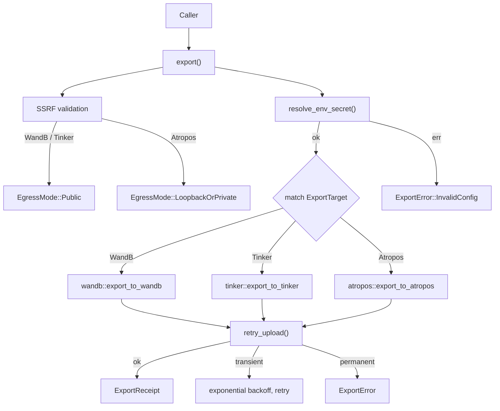

# Infrastructure Libraries — librefang-rl-export-src

# librefang-rl-export

Long-horizon RL rollout trajectory exporter — the LibreFang-side egress surface that uploads finished agent rollouts to upstream RL-tracking services.

## Purpose

When a reinforcement learning agent finishes a rollout, the trajectory data (token sequences, masks, scores, tool interactions) needs to land in an external service for training and analysis. This crate is the delivery layer: it takes opaque trajectory bytes produced by the rollout environment and ships them to the operator's chosen upstream — **Weights & Biases**, **Tinker**, or **Atropos** — without inspecting or transcoding the payload.

The crate is format-agnostic by design (RFC #3330). The wire format for trajectories is owned by the producer; this crate forwards bytes verbatim and will remain stable across format iterations.

## Architecture

## Public API

### `export(target, payload) -> Result<ExportReceipt, ExportError>`

The sole public entry point. Dispatches to the appropriate exporter based on `ExportTarget` variant. All I/O runs through the workspace-shared HTTP client (`librefang_http::proxied_client()`), respecting operator proxy and TLS configuration.

### `ExportTarget`

`#[non_exhaustive]` enum selecting the upstream:

| Variant | Authentication | Egress mode |
|---|---|---|
| `WandB` | API key via env-var indirection → HTTP Basic | Public only |
| `Tinker` | API key via env-var indirection → `X-API-Key` header | Public only |
| `Atropos` | None (local microservice) | Loopback / RFC-1918 only |

Each variant carries configuration specific to its upstream (project names, base URL overrides, tuning knobs). API keys are never inlined — the `*_env` fields hold the **name** of an environment variable, resolved at upload time via `resolve_env_secret()`. This keeps secrets out of config files, history snapshots, and process dumps.

### `RlTrajectoryExport`

The input payload:

- **`trajectory_bytes: Vec<u8>`** — opaque bytes from the rollout producer. Never inspected or validated by this crate.
- **`run_id: String`** — caller-side identifier, used as a hint where the upstream accepts one.
- **`toolset_metadata: Option<serde_json::Value>`** — structured metadata about the agent/environment. **Automatically redacted** before egress (see [Credential Redaction](#credential-redaction)).
- **`started_at` / `finished_at`** — wall-clock rollout window timestamps.

### `ExportReceipt`

The success result:

- **`target_run_url`** — browser-loadable URL pointing at the upstream's view of the upload.
- **`bytes_uploaded`** — byte count mirrored from the input payload.
- **`uploaded_at`** — wall-clock time the upload completed locally.

## Exporter Implementations

Each exporter follows a **register-then-submit** two-step pattern wrapped in the shared retry loop.

### Weights & Biances (`wandb.rs`)

1. `POST {base}/api/runs` — create a run under the given entity/project. Returns server-assigned `run_id` and a browser URL.
2. `POST {base}/files/{entity}/{project}/{run_id}` — upload trajectory bytes as an octet-stream artefact.

Authentication: HTTP Basic with literal user `api` and the API key as the password (W&B's documented convention). Entity is **required** — no fallback guess.

### Tinker (`tinker.rs`)

1. `POST {base}/api/v1/create_session` — register a client session. Tags are sorted for deterministic wire output. Returns `session_id`.
2. `POST {base}/api/v1/telemetry` — submit a single `GenericEvent` under the session. Trajectory bytes are base64-encoded in `event_data.trajectory_bytes_b64`.

Authentication: `X-API-Key` header. The key is forwarded verbatim; Tinker's upstream enforces the `tml-` prefix.

### Atropos (`atropos.rs`)

1. `POST {base}/register-env` — register as a rollout producer. Returns `env_id` and `wandb_name`.
2. `POST {base}/scored_data` — submit the trajectory as `ScoredData` JSON. Bytes are forwarded verbatim with `Content-Type: application/json`; Atropos validates.

No authentication. Atropos is a local FastAPI microservice — the SSRF guard **requires** loopback or RFC-1918 destinations and rejects public URLs. The trainer process must be running before the exporter connects; if it isn't, `register-env` returns HTTP 200 with a sentinel body and no `env_id`, which this crate surfaces as `ExportError::TrainerNotReady`.

## Error Handling (`error.rs`)

`ExportError` is `#[non_exhaustive]` and intentionally flat — callers generally render the upstream's message rather than translate it.

| Variant | Trigger | Retryable |
|---|---|---|
| `NetworkError(String)` | DNS, TCP, TLS, timeout failures | Yes |
| `AuthError` | HTTP 401/403 | No |
| `UpstreamRejected { status, body }` | Non-auth 4xx/5xx | Only 429 and 5xx |
| `MalformedResponse(String)` | 2xx body didn't match expected shape | No |
| `InvalidConfig(String)` | Empty keys, bad URLs, caught before I/O | No |
| `TrainerNotReady { status_label }` | Atropos trainer hasn't booted | No (caller should poll) |

Error bodies from the upstream are truncated to 4 KiB (`MAX_ERROR_BODY_BYTES`) to prevent pathological payloads from bloating the error value. Body decoding is lossy UTF-8 so non-text responses still surface something.

`classify_status()` maps 401/403 → `AuthError`, everything else → `UpstreamRejected`. `classify_response_decode_error()` splits `reqwest::Error` into decode failures (`MalformedResponse`) vs. transport failures (`NetworkError`) — this keeps contract drift separate from transient blips.

## Retry Logic (`retry.rs`)

`retry_upload()` runs an operation up to 3 attempts with exponential backoff (200ms, 400ms base). Only transient errors are retried:

- `NetworkError` — always
- `UpstreamRejected` with status 429 or 5xx — yes
- Everything else (auth, config, decode, trainer-not-ready) — no, returned immediately

The timing deliberately diverges from the workspace's LLM retry loop (`librefang_runtime::agent_loop::call_with_retry` uses 1000ms / 4 attempts). Exporters deal with post-rollout uploads, not interactive LLM calls, so sub-second retry gives faster feedback on genuine failures without burning time on routine cloud hiccups.

## SSRF Protection (`ssrf.rs`)

The exporter is the highest-risk SSRF surface in the workspace because it sends bytes to operator-supplied URLs. `validate_egress_url()` enforces an allowlist before any I/O:

**`EgressMode::Public`** (W&B, Tinker): Rejects loopback, RFC-1918 private, link-local, and known metadata hostnames. Only public DNS/IP destinations pass.

**`EgressMode::LoopbackOrPrivate`** (Atropos): Accepts only loopback (`127.0.0.0/8`, `::1`) and RFC-1918 (`10/8`, `172.16/12`, `192.168/16`). Rejects public destinations, link-local, and IMDS addresses.

Additional guards:
- Only `http` / `https` schemes allowed
- No userinfo in URLs (`user:pass@host` is rejected)
- IPv4-mapped IPv6 and NAT64 addresses are decoded and checked against the same blocklist

The policy mirrors `librefang_runtime_mcp::mcp_oauth::is_ssrf_blocked_url` but is duplicated here to avoid pulling the kernel's dependency tree into a leaf egress crate. The two must be kept in sync.

## Credential Redaction (`redact.rs`)

Before any metadata leaves the process, `redact_metadata()` walks the JSON tree and replaces credential-shaped substrings in string values:

| Pattern | Replacement | Example |
|---|---|---|
| JWT tokens (`eyJ...`) | `<REDACTED:JWT>` | `eyJhbGciOi...` |
| API keys (`sk-...`, `token=...`) | `<REDACTED:CREDENTIAL>` | `API_KEY=sk-live-abc123...` |
| Long base64 blobs (≥40 chars) | `<REDACTED:BLOB>` | `aGVsbG8gd29ybGQ...` |

JSON **keys** are never rewritten — only values. The regex set is duplicated from `librefang_kernel::trajectory::RedactionPolicy` (same dependency-inversion rationale as SSRF). A snapshot test (`regex_set_matches_kernel_snapshot`) compares the local patterns against `tests/fixtures/kernel_redaction_patterns.txt` and fails CI on drift.

## Secret Resolution

`resolve_env_secret()` implements the workspace's `*_env` convention: the `ExportTarget` variant stores the **name** of an environment variable, not the secret itself. At upload time:

1. Empty env-var name → `InvalidConfig` immediately (no env probe)
2. Unset env var → `InvalidConfig` naming the missing variable
3. Set-but-empty env var → `InvalidConfig`
4. Non-empty value → returned to the exporter

This means secrets never appear in `Debug` output, config snapshots, or error messages — only the env-var name is visible.

## HTTP Client

All outbound traffic flows through `librefang_http::proxied_client()`, the workspace's shared reqwest client. This is non-negotiable per the `librefang-extensions` convention: no bespoke `reqwest::Client` instances. The shared client carries the configured proxy, TLS fallback roots, and `User-Agent: librefang/<version>`.