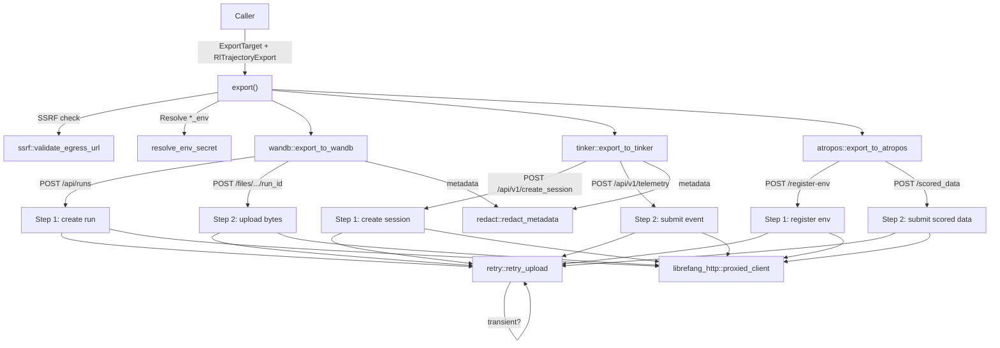

# Infrastructure Libraries — librefang-rl-export-src

# librefang-rl-export

Long-horizon RL rollout trajectory exporter — the workspace's egress surface that uploads finished agent rollouts to upstream RL-tracking services.

## Overview

This crate takes a completed RL trajectory (opaque bytes + metadata) and delivers it to one of three upstream targets:

| Target | Type | Auth | Local/Cloud |
|--------|------|------|-------------|
| **Weights & Biases** | Cloud experiment tracker | API key via HTTP Basic | Cloud |
| **Tinker** | Thinking Machines post-training API | `X-API-Key` header | Cloud |
| **Atropos** | NousResearch RL environments bus | None | Local FastAPI process |

The crate is **wire-format agnostic** — `RlTrajectoryExport.trajectory_bytes` is an opaque `Vec<u8>` that is forwarded verbatim. The serialization format is owned by the producer (locked separately by RFC #3330), so this crate can be integration-tested independently.

## Architecture

```mermaid
flowchart TD
    Caller -->|ExportTarget + RlTrajectoryExport| export["export()"]
    export -->|SSRF check| ssrf["ssrf::validate_egress_url"]
    export -->|Resolve *_env| resolve["resolve_env_secret"]
    export --> WandB["wandb::export_to_wandb"]
    export --> Tinker["tinker::export_to_tinker"]
    export --> Atropos["atropos::export_to_atropos"]
    WandB -->|POST /api/runs| WB1["Step 1: create run"]
    WandB -->|POST /files/.../run_id| WB2["Step 2: upload bytes"]
    Tinker -->|POST /api/v1/create_session| TK1["Step 1: create session"]
    Tinker -->|POST /api/v1/telemetry| TK2["Step 2: submit event"]
    Atropos -->|POST /register-env| AT1["Step 1: register env"]
    Atropos -->|POST /scored_data| AT2["Step 2: submit scored data"]
    WB1 & WB2 & TK1 & TK2 & AT1 & AT2 --> retry["retry::retry_upload"]
    retry -->|transient?| retry
    WandB & Tinker -->|metadata| redact["redact::redact_metadata"]
    WB1 & WB2 & TK1 & TK2 & AT1 & AT2 --> http["librefang_http::proxied_client"]
```

## Public API

### `export(target, payload) -> Result<ExportReceipt, ExportError>`

The single public entry point. Dispatches on the `ExportTarget` variant, performs SSRF validation and secret resolution, then delegates to the appropriate private module.

### `ExportTarget`

`#[non_exhaustive]` enum with three variants. Each secret-bearing variant stores the **name** of an environment variable (not the secret itself):

- **`WandB`** — requires `project`, `entity`, optional `run_id` hint, and `api_key_env`.
- **`Tinker`** — requires `project`, `api_key_env`, optional `base_url` override.
- **`Atropos`** — requires `project`, `base_url` (mandatory — no implicit localhost default), optional tuning knobs (`max_token_length`, `group_size`, `weight`).

Secret values are read at upload time via `std::env::var`. Missing or empty variables fail with `ExportError::InvalidConfig`.

### `RlTrajectoryExport`

Carries a finished rollout:

| Field | Purpose |
|-------|---------|
| `run_id` | Caller-side identifier; used as a hint where the upstream accepts one |
| `trajectory_bytes` | Opaque payload — not inspected, validated, or transcoded |
| `toolset_metadata` | Optional `serde_json::Value`; scrubbed for credentials before egress |
| `started_at` / `finished_at` | Wall-clock rollout window |

### `ExportReceipt`

Returned on success:

| Field | Purpose |
|-------|---------|
| `target_run_url` | Browser-loadable URL on the upstream (or closest equivalent) |
| `bytes_uploaded` | Byte count confirmed delivered |
| `uploaded_at` | Local timestamp of upload completion |

### `ExportError`

`#[non_exhaustive]` error enum:

| Variant | Meaning | Retryable? |
|---------|---------|------------|
| `NetworkError(String)` | Transport failure (DNS, TLS, timeout) | Yes |
| `AuthError` | 401/403 from upstream | No |
| `UpstreamRejected { status, body }` | Non-auth 4xx/5xx; body truncated to 4 KiB | Only 429 and 5xx |
| `MalformedResponse(String)` | 2xx body didn't match expected shape | No |
| `InvalidConfig(String)` | Bad config caught before any I/O | No |
| `TrainerNotReady { status_label }` | Atropos trainer hasn't booted yet | Caller should poll |

## Per-Target Details

### Weights & Biances (`wandb`)

Two-step flow:

1. **`POST {base}/api/runs`** — Create the run. Sends `project`, `entity`, `run_id` hint, time window, and (scrubbed) metadata. Receives server-assigned `run_id` and browser URL.
2. **`POST {base}/files/{entity}/{project}/{run_id}`** — Upload the raw trajectory bytes as `application/octet-stream`. Path segments are percent-encoded.

Authentication: HTTP Basic with literal user `api` and the API key as password (`Authorization: Basic base64("api:<key>")`).

SSRF mode: `Public` — loopback, private, and link-local destinations are rejected.

### Tinker (`tinker`)

Two-step flow mapped onto Tinker's session + telemetry surface (Tinker has no dedicated opaque-upload endpoint):

1. **`POST {base}/api/v1/create_session`** — Register a session with sorted tags (`["librefang-rollout", project]`), optional `user_metadata`, and `project_id`. Receives `session_id`.
2. **`POST {base}/api/v1/telemetry`** — Submit a single `GenericEvent` containing the trajectory bytes as standard base64 in `event_data.trajectory_bytes_b64`, plus timestamps and run ID.

Authentication: `X-API-Key` header. Tinker's SDK requires the `tml-` prefix; this crate forwards the key as-is and lets the upstream enforce it.

SSRF mode: `Public`.

Default base: `https://tinker.thinkingmachines.dev/services/tinker-prod`.

### Atropos (`atropos`)

Two-step flow against a local FastAPI microservice:

1. **`POST {base}/register-env`** — Register this producer with the running trainer. Sends `desired_name` (= project), `max_token_length`, `group_size`, `weight`. Receives `env_id` and `wandb_name`.
2. **`POST {base}/scored_data`** — Submit the trajectory bytes verbatim as `application/json`. The bytes **must already be valid `ScoredData` JSON** (`tokens`, `masks`, `scores`, …); if not, Atropos returns 422 surfaced as `UpstreamRejected`.

**Trainer-not-ready handling**: If the trainer hasn't booted, `/register-env` returns HTTP 200 with `{"status": "wait for trainer to start"}` and no `env_id`. The exporter converts this to `ExportError::TrainerNotReady` so callers can poll with backoff.

SSRF mode: `LoopbackOrPrivate` — only `127.0.0.0/8`, `::1`, and RFC-1918 (`10/8`, `172.16/12`, `192.168/16`) are accepted. No implicit default URL.

Default tuning: `max_token_length = 32768`, `group_size = 1`, `weight = 1.0`.

## Cross-Cutting Concerns

### SSRF Protection (`ssrf`)

All outbound base URLs are validated before any network I/O. Two modes:

- **`Public`** (W&B, Tinker): Rejects loopback, private, link-local, IMDS (`169.254.169.254`), known metadata hostnames (`metadata.google.internal`), non-HTTP schemes, and userinfo in URLs.
- **`LoopbackOrPrivate`** (Atropos): Accepts only loopback and RFC-1918; rejects everything else including public IPs and link-local/IMDS.

The guard handles IPv4-mapped IPv6 (`::ffff:127.0.0.1`) and NAT64 (`64:ff9b::`-prefixed) addresses. No DNS resolution is performed — blocked literal hostnames are checked string-wise.

### Credential Redaction (`redact`)

`toolset_metadata` is scrubbed before it leaves the process (W&B and Tinker both expose it in external UIs). Three regex patterns run on all string values at any nesting depth (keys are left intact):

| Pattern | Replaces with | Catches |
|---------|---------------|---------|
| JWT (`eyJ...`) | `<REDACTED:JWT>` | Three-segment base64url tokens |
| API key (`sk_...`, `token=...`) | `<REDACTED:CREDENTIAL>` | Key-shaped strings (16+ chars) |
| Long base64 (40+ chars) | `<REDACTED:BLOB>` | Opaque blobs |

The patterns are duplicated from `librefang_kernel::trajectory::RedactionPolicy` (rather than imported) to avoid pulling the kernel's ~50 transitive deps into a leaf crate. A snapshot test against `tests/fixtures/kernel_redaction_patterns.txt` catches drift.

### Retry Logic (`retry`)

Transient failures are retried with exponential backoff:

- **3 attempts** total (diverges from the workspace LLM retry loop's 4 attempts — see module docs for rationale).
- **200ms base delay**, doubling per attempt (200ms, 400ms).
- **Transient**: `NetworkError`, HTTP 429, HTTP 5xx.
- **Permanent** (returned immediately): `AuthError`, non-429 4xx, `MalformedResponse`, `InvalidConfig`, `TrainerNotReady`.

### HTTP Client

All outbound requests flow through `librefang_http::proxied_client()`, the workspace's shared reqwest client. This is mandatory — it carries the configured proxy, TLS fallback roots, and `User-Agent: librefang/<version>`.

## Contributing Notes

- **Adding a new target**: Add a variant to `ExportTarget`, create a new private module with `export_to_*` and `export_to_*_with_base` (the latter for wiremock tests), add the dispatch arm in `export()`, and wire the appropriate `EgressMode`.
- **Tuning retry timing**: Update `MAX_ATTEMPTS` / `BASE_DELAY_MS` in `retry.rs` **and** the module-level docstring explaining the divergence from the agent loop. Do not "fix" them to match `librefang_runtime` values.
- **Updating redaction patterns**: Edit the `*_PATTERN` consts in `redact.rs` **and** the fixture at `tests/fixtures/kernel_redaction_patterns.txt`. The snapshot test will fail on drift.
- **SSRF policy changes**: Must be mirrored in `librefang_runtime_mcp::mcp_oauth::is_ssrf_blocked_host`. The two are intentionally duplicated but must stay in sync.
- **Wire format changes**: This crate does not own the trajectory serialization format. Changes to `ScoredData`, W&B file artefacts, or Tinker telemetry shapes belong in the respective upstream SDKs or the RFC #3330 workstream.