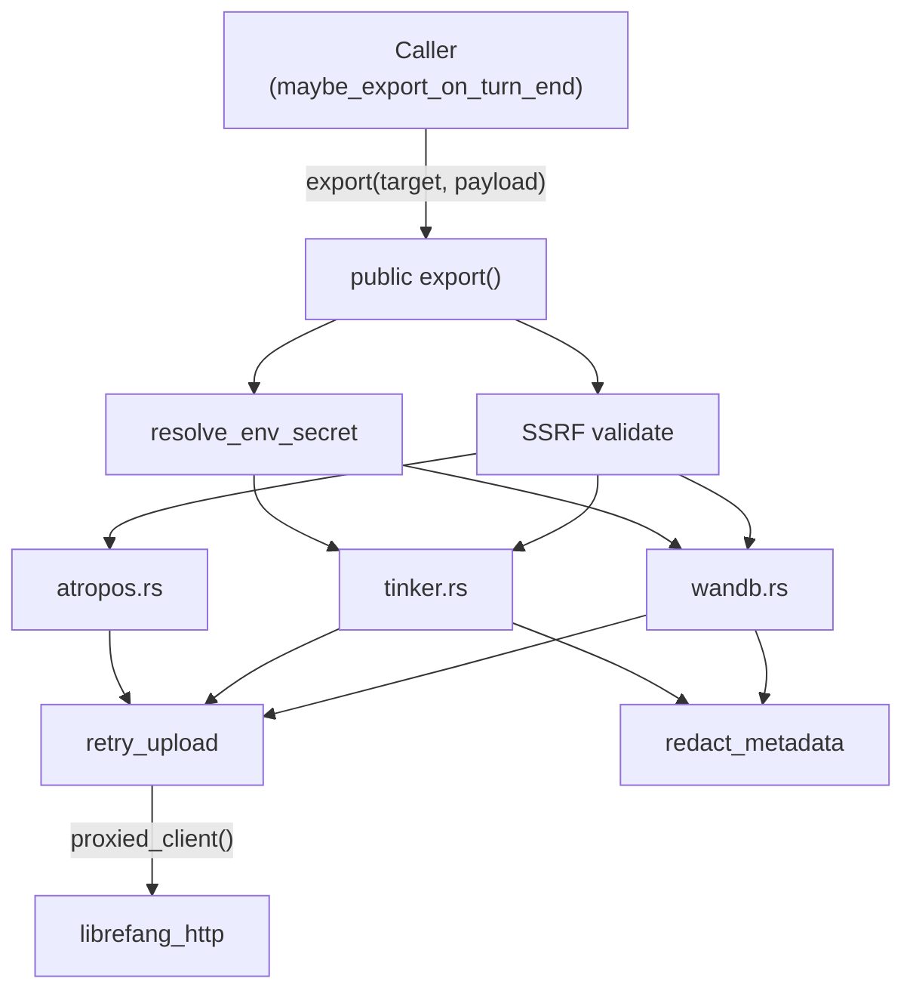

# Infrastructure Libraries — librefang-rl-export-src

# librefang-rl-export

Long-horizon RL rollout trajectory exporter — the LibreFang egress surface that uploads finished agent rollouts to external RL-tracking services.

## Purpose

When a long-horizon RL rollout completes, the producer holds a trajectory (token sequences, masks, scores) plus metadata describing the agent and environment that produced it. This crate takes that finished trajectory and delivers it to an operator-chosen upstream service. It is intentionally **wire-format agnostic**: the trajectory travels as opaque `Vec<u8>` bytes, and the crate never inspects, validates, or transcodes the payload. The wire format is owned by the producer and locked separately (RFC #3330).

## Architecture

```mermaid
flowchart TD
    Caller["Caller<br/>(maybe_export_on_turn_end)"]
    Caller -->|"export(target, payload)"| PubDisp["public export()"]
    PubDisp --> SSRF["SSRF validate"]
    PubDisp --> Secret["resolve_env_secret"]
    SSRF --> WBD["wandb.rs"]
    SSRF --> TNK["tinker.rs"]
    SSRF --> ATR["atropos.rs"]
    Secret --> WBD
    Secret --> TNK
    WBD --> Retry["retry_upload"]
    TNK --> Retry
    ATR --> Retry
    Retry -->|"proxied_client()"| HTTP["librefang_http"]
    WBD --> Redact["redact_metadata"]
    TNK --> Redact
```

## Public API

The crate exposes a single async entry point and three supporting types:

**`export(target: ExportTarget, payload: RlTrajectoryExport) -> Result<ExportReceipt, ExportError>`**

Dispatches to the appropriate backend based on the `ExportTarget` variant. All I/O flows through `librefang_http::proxied_client()`, the workspace's shared reqwest client (proxy config, TLS roots, `User-Agent: librefang/<version>`).

### `RlTrajectoryExport`

The payload describing a finished rollout:

| Field | Type | Purpose |
|---|---|---|
| `run_id` | `String` | Caller-side run identifier; forwarded as a hint when the upstream accepts one |
| `trajectory_bytes` | `Vec<u8>` | Opaque trajectory payload — never inspected by this crate |
| `toolset_metadata` | `Option<serde_json::Value>` | Structured metadata about the agent/environment; scrubbed for credentials before egress |
| `started_at` | `DateTime<Utc>` | Wall-clock start of the rollout window |
| `finished_at` | `DateTime<Utc>` | Wall-clock end of the rollout window |

### `ExportReceipt`

Returned on successful upload. Contains the upstream's public run URL (`target_run_url`), the number of bytes uploaded, and the local wall-clock completion time.

### `ExportError`

Non-exhaustive error enum. Key variants:

- **`InvalidConfig`** — rejected before any network I/O (empty project, missing env var, SSRF violation). Retrying won't help.
- **`AuthError`** — HTTP 401/403. The operator needs to refresh credentials.
- **`UpstreamRejected { status, body }`** — non-auth 4xx/5xx. Body is forwarded verbatim (truncated to 4 KiB).
- **`NetworkError`** — transport failure (DNS, TCP, TLS, timeout). Retried automatically.
- **`MalformedResponse`** — 2xx body didn't match the expected shape. Indicates upstream contract drift; hard failure.
- **`TrainerNotReady { status_label }`** — Atropos-specific: the trainer hasn't booted yet. Caller should poll with backoff.

## Export Targets

Each target follows a two-step "register, then submit" pattern. The `ExportTarget` enum is `#[non_exhaustive]`; additional targets can be added without breaking callers.

### Weights & Biances (`ExportTarget::WandB`)

**Wire flow:**

1. `POST {base}/api/runs` — create the run with project, entity, run ID hint, and window timestamps.
2. `POST {base}/files/{entity}/{project}/{run_id}` — upload the opaque trajectory bytes as an octet-stream artefact.

**Authentication:** HTTP Basic with the literal user `api` and the API key as the password. The key is read from the environment variable named by `api_key_env` at upload time.

**Constraints:** `project` and `entity` are both required — the previous `"default"` entity fallback silently landed runs in wrong buckets. Path segments in the upload URL are percent-encoded because entity/project/run_id are caller-controlled strings.

### Tinker (`ExportTarget::Tinker`)

**Wire flow:**

1. `POST {base}/api/v1/create_session` — register a session with tags and metadata.
2. `POST {base}/api/v1/telemetry` — submit a single `GenericEvent` under that session with the trajectory bytes base64-encoded in `event_data`.

**Authentication:** `X-API-Key` header, resolved from the environment variable named by `api_key_env`. The upstream enforces the `tml-` prefix; this crate forwards the key verbatim.

**Assumption:** Tinker has no dedicated opaque-trajectory upload endpoint. The `create_session` + `telemetry` pair is the closest stable match against the current SDK source. If Tinker ships a dedicated trajectory endpoint, this module should switch.

**Default base URL:** `https://tinker.thinkingmachines.dev/services/tinker-prod`. Overridable via `base_url` for self-hosted control planes.

### Atropos (`ExportTarget::Atropos`)

**Wire flow:**

1. `POST {base}/register-env` — register this producer with the running trainer, recover `env_id` and `wandb_name`.
2. `POST {base}/scored_data` — forward the trajectory bytes verbatim as `Content-Type: application/json`. The bytes **must already be valid `ScoredData` JSON** (`tokens`, `masks`, `scores`, …); Atropos validates server-side and returns 422 on malformed payloads.

**Authentication:** None. Atropos is a local FastAPI microservice, not a cloud-hosted service.

**SSRF policy:** This is the only target that **allows** loopback and RFC-1918 destinations — the trainer is a local process by design. Public IPs, link-local (including IMDS at 169.254.169.254), and non-loopback hostnames are rejected. There is no implicit `localhost:8000` default; operators must set `base_url` explicitly.

**Trainer-not-ready handling:** If the trainer hasn't called `/register` yet, Atropos returns HTTP 200 with `{"status": "wait for trainer to start"}` and no `env_id`. The exporter detects the missing `env_id` and returns `ExportError::TrainerNotReady` so callers can poll with backoff.

**Tuning knobs:** `max_token_length`, `group_size`, and `weight` are forwarded to `RegisterEnv`. Defaults are conservative: `32768`, `1`, `1.0`.

## Cross-cutting Concerns

### Secret Handling

API keys are **never** inlined into `ExportTarget`. Each secret-bearing variant carries an `api_key_env: String` field holding the **name** of the environment variable. `resolve_env_secret()` reads the env var at upload time and fails closed with `InvalidConfig` if unset or empty. The `Debug` impl on `ExportTarget` is safe because it renders env-var names, not values.

### SSRF Protection (`ssrf.rs`)

Two egress modes enforced before any I/O:

| Mode | Used by | Accepts | Rejects |
|---|---|---|---|
| `Public` | W&B, Tinker | Public IPs/hostnames | Loopback, RFC-1918, link-local, IMDS hostnames, userinfo in URLs, non-HTTP schemes |
| `LoopbackOrPrivate` | Atropos | Loopback, RFC-1918, `localhost` | Public IPs, link-local (incl. 169.254.169.254), IMDS hostnames, CGNAT, Azure IMDS IP |

The block list mirrors `librefang_runtime_mcp::mcp_oauth::is_ssrf_blocked_host` — both must change together. Includes IPv4-mapped IPv6 and NAT64 embedded addresses. No DNS resolution is performed; the check is on the URL string itself.

### Credential Redaction (`redact.rs`)

`toolset_metadata` is scrubbed before it leaves the process. Three regex patterns run on every string value (keys are left intact):

1. **JWT tokens** → `<REDACTED:JWT>`
2. **API-key-shaped strings** (`sk_…`, `token=…`, `bearer …`) → `<REDACTED:CREDENTIAL>`
3. **Long base64 blobs** (≥40 chars) → `<REDACTED:BLOB>`

The patterns are duplicated from `librefang_kernel::trajectory::RedactionPolicy` rather than imported (importing would pull ~50 transitive crates into a leaf egress crate). A snapshot test (`regex_set_matches_kernel_snapshot`) verifies parity against a checked-in fixture — CI fails if either side drifts.

### Retry Logic (`retry.rs`)

Transient errors are retried with exponential backoff: 3 attempts, 200ms base delay (200ms → 400ms). This is intentionally shorter than the workspace's LLM retry loop (4 attempts, 1000ms) because:

- Trajectory uploads happen post-rollout — no user is blocking on the retry budget.
- Sub-second retry gives fast feedback when an upstream is genuinely down.
- Rate-limit windows for W&B/Tinker/Atropos are seconds, not minutes.

**Transient** (retried): `NetworkError`, HTTP 429, HTTP 5xx.
**Permanent** (immediate return): `AuthError`, other 4xx, `MalformedResponse`, `InvalidConfig`, `TrainerNotReady`.

### Error Body Truncation

Upstream error response bodies are truncated to 4 KiB (`MAX_ERROR_BODY_BYTES`) before being stored in `UpstreamRejected`. This prevents pathological upstream payloads from bloating the error value. Decoding is lossy UTF-8 so non-text responses still surface something useful.

## Integration with the Codebase

The crate is called from the kernel's RL export orchestration layer:

- `build_payload()` (in `src/rl_export/mod.rs`) constructs `RlTrajectoryExport` instances.
- `maybe_export_on_turn_end()` calls `export()` with the configured `ExportTarget`.

All outbound HTTP uses `librefang_http::proxied_client()`, which carries the operator's proxy configuration and TLS fallback roots. The crate has no direct dependency on `librefang-kernel` or `librefang-runtime` — it is a leaf crate with a minimal dependency tree.