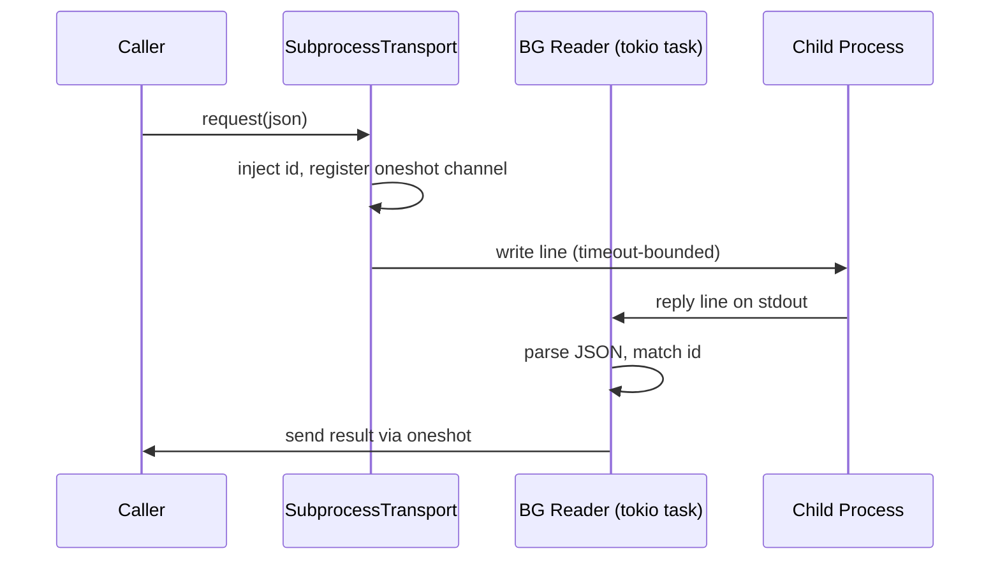

# Infrastructure Libraries — librefang-subprocess-src

# librefang-subprocess

Persistent JSON-over-stdio subprocess transport.

A small, dependency-light bridge for talking to a long-lived child process over a newline-delimited JSON request/reply protocol. It consolidates the plumbing that every LibreFang sidecar bridge was re-implementing: spawning the child, reading replies on a background task, matching them to waiters by `id`, bounding both the write and reply-line size, forwarding stderr to the log, and reaping the child on drop.

## Position in the Dependency Graph

Both `librefang-channels` and `librefang-runtime` need subprocess transport, so this crate lives below both and depends on **no** `librefang-*` crate.

```
librefang-runtime ──┐
                    ├──▶ librefang-subprocess ──▶ tokio, serde_json, tracing, thiserror, metrics
librefang-channels ─┘
```

The downstream caller `read_event_line` (in `librefang-channels/src/sidecar.rs`) uses the public `read_capped_line` helper directly.

## Protocol

The transport is deliberately protocol-light:

1. The caller supplies a JSON object as the request body.
2. The transport injects a monotonically increasing `"id"` field.
3. The full line `{"id": N, …caller fields}\n` is written to the child's stdin.
4. The child replies with a newline-delimited JSON line containing the matching `"id"`.
5. The reply convention shared across all bridges:
   - Success: `{"id": N, "ok": <value>}`
   - Failure: `{"id": N, "error": "<msg>"}`

## Architecture



Three background tasks are spawned at construction:

| Task | Purpose |
|------|---------|
| **Reader** | Reads stdout line-by-line via `read_capped_line`, matches replies to pending waiters by `id`, resolves oneshot channels. |
| **Stderr drain** | Forwards child stderr lines to `tracing::debug` so nothing blocks. |
| **(Implicit)** Child handle is held with `kill_on_drop(true)` — dropping the transport kills and reaps the child. |

## Key Types

### `TransportConfig`

Configuration for how to launch and frame a transport.

```rust
let cfg = TransportConfig::new(
    "my-sidecar",                          // command (resolved via PATH)
    vec!["--port".into(), "8080".into()],  // args
    Duration::from_secs(10),               // per-request timeout
    "context_engine",                      // label for logs & metrics
);
// cfg.max_reply_line_bytes defaults to 16 MiB
```

Fields:

- **`command`** (`String`) — Executable to launch.
- **`args`** (`Vec<String>`) — Arguments passed to the command.
- **`request_timeout`** (`Duration`) — Per-request wall-clock budget, applied to **both** the stdin write and the reply wait.
- **`max_reply_line_bytes`** (`usize`) — Cap on a single reply line. Over-cap drops the transport (the caller should fall back to an in-process path). Defaults to `DEFAULT_MAX_REPLY_LINE_BYTES` (16 MiB).
- **`label`** (`String`) — Short label for log messages and the `subprocess_transport_exited` metric.

### `TransportError`

Why a `request` call did not yield a successful reply:

| Variant | Meaning |
|---------|---------|
| `Dead` | The child has exited (or never spawned); no further requests can succeed. |
| `Timeout(Duration)` | The write or the reply wait exceeded the configured timeout. |
| `Remote(String)` | The child replied with `{"error": "<msg>"}`. |
| `BadRequest` | The request was not a JSON object, so an `id` could not be attached. |

### `SubprocessTransport`

A live connection to a long-lived child process. Cheap to clone-free share behind an `Arc`.

#### `SubprocessTransport::spawn(cfg) -> io::Result<Self>`

Spawns the child, starts the background reader and stderr drain tasks. Returns an error if the process fails to launch or if stdin/stdout are unavailable.

#### `SubprocessTransport::is_alive() -> bool`

Returns `true` until the child exits or a fatal protocol error (e.g. over-cap line) drops it.

#### `SubprocessTransport::request(&self, request: Value) -> Result<Value, TransportError>`

Sends one request and awaits its reply. `request` must be a JSON object; an `id` is injected before sending. Returns the `"ok"` payload on success.

**Timeout semantics**: the same `request_timeout` budget covers both the stdin write and the reply wait. A child that stops reading its stdin (filling the pipe buffer) cannot wedge the caller past the deadline — the write future is timeout-bounded.

**Error handling on timeout/write failure**: the transport marks itself dead and removes the pending waiter, so subsequent calls return `TransportError::Dead` immediately.

### `SupervisedTransport`

A `SubprocessTransport` that re-spawns the child after it dies.

```rust
let supervised = SupervisedTransport::new(cfg);
// Or with an explicit cooldown:
let supervised = SupervisedTransport::with_cooldown(cfg, Duration::from_secs(5));
```

- **Construction is lazy and never fails** — the child is spawned on the first `request` call.
- On child exit, the next `request` re-spawns a fresh child automatically.
- A `respawn_cooldown` rate-limits attempts so a persistently-broken command can't spawn-storm.
- `request` is the only contention point's gate: the liveness check and (re)spawn are serialized behind a `tokio::Mutex`, but the actual request runs on a cloned handle outside that lock, preserving the underlying transport's id-matched concurrency.

#### `SupervisedTransport::request(&self, request: Value) -> Result<Value, TransportError>`

Send a request, (re)spawning the child first if it is absent or dead. Delegates to the inner `SubprocessTransport::request` once a live transport is ensured.

## Low-Level Helpers

These are `pub` because downstream crates (notably `librefang-channels`) use them directly.

### `read_capped_line`

```rust
pub async fn read_capped_line<R: AsyncBufRead + Unpin>(
    reader: &mut R,
    buf: &mut Vec<u8>,
    max: usize,
) -> io::Result<Line>
```

Reads one `\n`-terminated line, capping accumulation at `max` bytes. The `AsyncBufRead` bound is deliberate — it ensures the per-byte read loop is served from an in-memory buffer, not issuing one syscall per byte on a raw `AsyncRead`. Always wrap stdout in `BufReader` before calling this.

Returns a `Line` enum:

| Variant | Meaning |
|---------|---------|
| `Data(String)` | A complete line (terminator stripped) or partial bytes at EOF. Lossy UTF-8 decode. |
| `Eof` | Stream ended with no pending bytes — clean idle shutdown. |
| `TooLong` | Line exceeded `max` before `\n`; the stream should be treated as untrustworthy. |

### `write_line_timeout`

```rust
pub async fn write_line_timeout(
    stdin: &mut ChildStdin,
    line: &[u8],
    timeout: Duration,
) -> io::Result<()>
```

Writes `line` to `stdin` and flushes, bounded by `timeout`. Bounds the **write itself**, not just a later reply wait. On timeout, returns `io::ErrorKind::TimedOut`.

## Stdio Pitfalls Handled

| Pitfall | Mitigation |
|---------|------------|
| Buggy child streams bytes without `\n`, growing memory without bound | `read_capped_line` enforces a byte cap; over-cap terminates the transport |
| Child stops reading stdin, filling the pipe buffer | `write_line_timeout` bounds the write with the same timeout budget as the reply wait |
| Child stderr blocks if not drained | A dedicated background task forwards stderr to `tracing::debug` |
| Zombie processes | `kill_on_drop(true)` on the child handle; `Drop` reaps automatically |

## Metrics

The crate emits one metric:

- **`subprocess_transport_exited`** (counter) — incremented when the background reader task ends (EOF, read error, or over-cap line). Tagged with `"label" => <config.label>`.

## Usage Pattern

```rust
use librefang_subprocess::{SubprocessTransport, SupervisedTransport, TransportConfig};
use serde_json::json;
use std::sync::Arc;
use std::time::Duration;

// One-shot transport (caller handles respawn logic):
let cfg = TransportConfig::new("my-sidecar", vec![], Duration::from_secs(10), "engine");
let transport = SubprocessTransport::spawn(cfg)?;
let reply = transport.request(json!({"method": "query", "arg": 42})).await?;

// Supervised (auto-respawns on crash):
let supervised = SupervisedTransport::new(cfg);
let reply = supervised.request(json!({"method": "query", "arg": 42})).await?;
```

Typical recovery strategy: match on `TransportError` and fall back to an in-process path. The supervised transport handles re-spawning automatically; callers just need to handle the `Dead` error during the cooldown window.