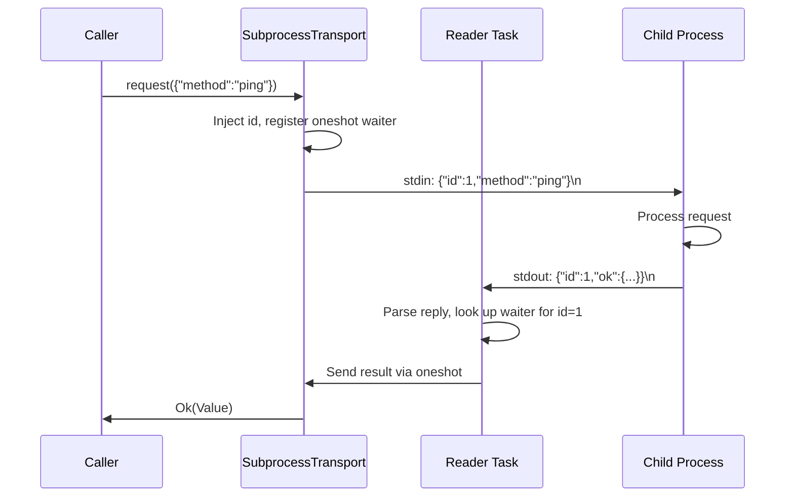

# Infrastructure Libraries — librefang-subprocess-src

# librefang-subprocess

Persistent JSON-over-stdio subprocess transport.

## Purpose

This crate provides a small, dependency-light bridge for communicating with a long-lived child process over a newline-delimited JSON request/reply protocol. It consolidates the boilerplate that every LibreFang sidecar bridge was re-implementing: spawning the child, reading replies on a background task, matching them to waiters by request ID, bounding both write and reply-line sizes, forwarding stderr to the log, and reaping the child on drop.

Both `librefang-channels` and `librefang-runtime` depend on this crate, so it sits below both in the dependency graph and imports no other `librefang-*` crate.

## Wire Protocol

The transport is deliberately protocol-light. The caller supplies a JSON request object; the transport injects a unique `id` and writes:

```json
{"id": 1, "method": "ping", ...}
```

The child must reply with one of:

```json
{"id": 1, "ok": <any JSON value>}
{"id": 1, "error": "<message string>"}
```

Replies are matched to in-flight requests by `id`. Any reply lacking an `id` field, or targeting an unknown `id`, is silently dropped.

## Architecture



**Components at a glance:**

| Component | Role |
|---|---|
| `SubprocessTransport` | Owns the child process, stdin handle, and the pending-request map. The public API. |
| `SupervisedTransport` | Wraps `SubprocessTransport` with automatic re-spawn after child death, gated by a cooldown. |
| `TransportConfig` | Configuration: command path, args, timeouts, line-size cap, log label. |
| `TransportError` | Enumerated failure modes: dead child, timeout, remote error, bad request. |
| `read_capped_line` | Byte-bounded line reader; prevents unbounded memory growth from a misbehaving child. |
| `write_line_timeout` | Timeout-bounded stdin write; prevents indefinite blocking on a full pipe. |

## `SubprocessTransport`

A live connection to a long-lived child process. Spawn the child and start background I/O tasks with `SubprocessTransport::spawn`:

```rust
let cfg = TransportConfig::new(
    "/usr/bin/sidecar-engine",
    vec!["--mode".into(), "json".into()],
    Duration::from_secs(10),
    "context_engine",
);
let transport = SubprocessTransport::spawn(cfg)?;
```

### What `spawn` sets up

1. **Child process** — launched with piped stdin/stdout/stderr and `kill_on_drop(true)`.
2. **Reader task** — a spawned Tokio task that reads newline-delimited lines from stdout via `read_capped_line`, parses JSON, extracts `id`, and routes replies to the correct oneshot waiter. On EOF, read error, or an over-cap line, the task marks the transport dead and drops all pending waiters (resolving them as `TransportError::Dead`).
3. **Stderr drain** — a spawned task that reads stderr line-by-line and emits each line at `DEBUG` level under the `subprocess_transport` target, tagged with the transport's label.

### `request`

```rust
pub async fn request(&self, request: Value) -> Result<Value, TransportError>
```

The sole RPC method. `request` must be a JSON object. The transport:

1. Checks liveness (`is_alive`). Returns `TransportError::Dead` if the child has exited.
2. Assigns a monotonically increasing `id` via `AtomicU64`.
3. Inserts the `id` into the request object and serializes it.
4. Registers a `oneshot::Sender` in the pending map under that `id`.
5. Writes the serialized line to stdin **with a timeout**. If the write exceeds `request_timeout`, the transport marks itself dead and returns `TransportError::Dead`.
6. Awaits the oneshot receiver **with a timeout**. On success returns the `ok` payload; on a remote error returns `TransportError::Remote`; on timeout returns `TransportError::Timeout`; on channel closure (child died) returns `TransportError::Dead`.

Both the write and the reply wait are individually bounded by `request_timeout`. This prevents two real failure modes:

- **Full pipe**: a child that stops reading its stdin would cause `write_all` to block indefinitely.
- **Silent child**: a child that received the request but never replied would hang the caller forever.

### Liveness

```rust
pub fn is_alive(&self) -> bool
```

Returns `true` until the reader task observes EOF, a read error, or an over-cap line. Once dead, all subsequent `request` calls return `TransportError::Dead` immediately.

### Drop behavior

Dropping a `SubprocessTransport` kills the child process (via `kill_on_drop`) and reaps it. Any pending requests resolve as `TransportError::Dead` because the reader task's oneshot senders are dropped when the pending map is cleared.

## `SupervisedTransport`

A `SubprocessTransport` that re-spawns the child after it dies.

```rust
let supervised = SupervisedTransport::new(cfg);
// or with an explicit cooldown:
let supervised = SupervisedTransport::with_cooldown(cfg, Duration::from_secs(5));
```

### Lazy construction

Construction is lazy and never fails — the child is spawned on the first `request` call. A consumer can hold a `SupervisedTransport` unconditionally and let calls fall back while the child is down.

### Re-spawn with cooldown

When `request` detects that the current transport is dead, `ensure_live` is called under a `tokio::Mutex`. If the cooldown interval since the last spawn attempt has not elapsed, the call returns `TransportError::Dead` immediately — this prevents spawn-storming when the child command is persistently broken. Once the cooldown elapses, the next `request` triggers a fresh `SubprocessTransport::spawn`.

The default cooldown is 5 seconds. Use `with_cooldown` to set a custom interval (including `Duration::ZERO` for testing).

### Concurrency model

The brief liveness check and potential (re)spawn are serialized behind the `current` mutex, but the actual request runs on a cloned `Arc<SubprocessTransport>` outside that lock. This preserves the underlying transport's id-matched concurrency — multiple concurrent requests to a live transport proceed in parallel.

## `TransportConfig`

```rust
pub struct TransportConfig {
    pub command: String,
    pub args: Vec<String>,
    pub request_timeout: Duration,
    pub max_reply_line_bytes: usize,
    pub label: String,
}
```

| Field | Purpose |
|---|---|
| `command` | Executable path (resolved via `PATH`). |
| `args` | Arguments passed to the command. |
| `request_timeout` | Per-request wall-clock budget, applied to both the stdin write and the reply wait. |
| `max_reply_line_bytes` | Cap on a single reply line. Over-cap drops the transport (the reader task breaks). Default: 16 MiB (`DEFAULT_MAX_REPLY_LINE_BYTES`). |
| `label` | Short identifier for log lines and the `subprocess_transport_exited` metric (e.g. `"context_engine"`). |

Use the `TransportConfig::new` constructor for defaults, then mutate fields as needed.

## `TransportError`

```rust
pub enum TransportError {
    Dead,                    // Child exited or never spawned
    Timeout(Duration),       // Write or reply wait exceeded timeout
    Remote(String),          // Child replied with {"error": "..."}
    BadRequest,              // Request was not a JSON object
}
```

Callers typically match on `TransportError` to decide whether to retry, fall back to an in-process path, or propagate the error.

## Utility Functions

### `read_capped_line`

```rust
pub async fn read_capped_line<R: AsyncBufRead + Unpin>(
    reader: &mut R,
    buf: &mut Vec<u8>,
    max: usize,
) -> std::io::Result<Line>
```

Reads one `\n`-terminated line byte-by-byte from a buffered reader, capping accumulation at `max` bytes. Returns `Line::Data`, `Line::Eof`, or `Line::TooLong`.

**Why `AsyncBufRead` and not `AsyncRead`?** The bound is intentional. Without buffering, reading one byte at a time would issue one syscall per byte — catastrophic at 4–16 MiB message sizes. The `AsyncBufRead` bound makes the buffering requirement compile-time-checked rather than implicit.

**Partial lines at EOF**: If the stream closes after emitting bytes but before `\n`, those bytes are returned as `Line::Data`. Downstream JSON parsing will reject the truncated payload, so this surfaces as an error rather than silent corruption.

### `write_line_timeout`

```rust
pub async fn write_line_timeout(
    stdin: &mut ChildStdin,
    line: &[u8],
    timeout: Duration,
) -> std::io::Result<()>
```

Writes `line` to `stdin` and flushes, bounded by `timeout`. On timeout returns `std::io::ErrorKind::TimedOut`. The `line` parameter should already include any trailing `\n`.

## Metrics

When the reader task terminates (for any reason), it increments:

```
subprocess_transport_exited{label="<label>"}
```

This provides an operator-actionable signal that a sidecar has exited and callers are now falling back.

## Stdio Safety Guarantees

| Pitfall | Mitigation |
|---|---|
| Unbounded line from a buggy child | `read_capped_line` with configurable `max_reply_line_bytes`; over-cap kills the transport. |
| Write blocking on a full pipe | `request` wraps the `write_all` + `flush` in `tokio::time::timeout`. |
| Child outliving the transport | `kill_on_drop(true)` on the `Command`; `_child` field held for the lifetime of `Self`. |
| Non-JSON or malformed replies | Silently dropped at `WARN` level; the originating request eventually times out. |
| Reply without an `id` | Silently dropped. |

## Integration Points

`librefang-subprocess` is consumed throughout the codebase wherever a sidecar subprocess is needed:

- **`librefang-channels`** — the bridge (`bridge.rs`), sidecar manager (`sidecar.rs`), message journal, group history, and HTTP client all spawn transports for various external tools.
- **`librefang-runtime`** — the artifact store uses a supervised transport for context engine communication.
- **`librefang-wire`** — peer connections spawn transports as part of the handshake and verification flow.
- **`librefang-api`** — integration and load tests spawn test servers and registries via `TransportConfig`.

The typical pattern in consuming code:

```rust
// During initialization
let transport = SupervisedTransport::new(TransportConfig::new(
    "/usr/bin/some-sidecar",
    vec![],
    Duration::from_secs(5),
    "some_sidecar",
));

// During request handling — falls back gracefully
async fn handle(&self, input: Value) -> Value {
    match self.transport.request(input).await {
        Ok(result) => result,
        Err(_) => self.fallback_in_process(input),
    }
}
```