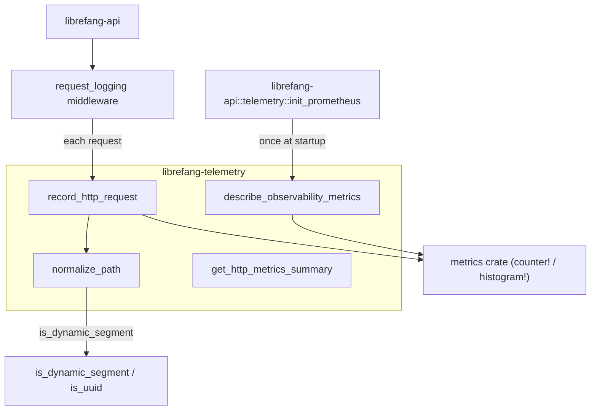

# Infrastructure Libraries — librefang-telemetry-src

# librefang-telemetry

OpenTelemetry + Prometheus metrics instrumentation for LibreFang.

This crate is the centralized telemetry layer for the LibreFang Agent OS. It provides HTTP metrics recording, path normalization to control metric cardinality, and metric description registration for Prometheus export. It wraps the `metrics` crate macros into a stable public API consumed primarily by `librefang-api`.

## Architecture

## Public API

Three functions are re-exported at the crate root (`librefang_telemetry::`) alongside the config module:

| Export | Purpose |
|---|---|
| `record_http_request` | Record one HTTP request's counter and histogram |
| `normalize_path` | Collapse dynamic path segments (UUIDs, hex IDs) to `{id}` |
| `get_http_metrics_summary` | Backward-compatible stub; real output comes from `PrometheusHandle` |
| `config::TelemetryConfig` | Re-export from `librefang-types` |

## Module Structure

### `config`

A convenience re-export. The canonical `TelemetryConfig` lives in `librefang_types::config::types` alongside all other kernel configuration. This module exists so that `use librefang_telemetry::config::TelemetryConfig` compiles without requiring a direct dependency on `librefang-types`.

### `metrics`

The core of the crate. Contains all recording logic and path normalization.

#### `normalize_path(path: &str) -> String`

Collapses high-cardinality path segments into `{id}` to prevent metric label explosion.

**Algorithm:**

1. Split the path on `/`.
2. Walk segments left-to-right. Preserve known static segments: `api`, `v1`, `v2`, `a2a`.
3. For every other segment, look ahead to the next segment. If the next segment is a dynamic identifier (UUID or hex string of 8–64 characters), emit the current segment unchanged, then emit `{id}` in place of the dynamic one, and skip ahead by 2.
4. Otherwise emit the segment as-is.

**Examples:**

| Input | Output |
|---|---|
| `/api/health` | `/api/health` |
| `/api/agents/550e8400-e29b-41d4-a716-446655440000/message` | `/api/agents/{id}/message` |
| `/api/agents/deadbeef01234567/message` | `/api/agents/{id}/message` |
| `/.well-known/agent.json` | `/.well-known/agent.json` |
| `/api/my-agent/status` | `/api/my-agent/status` |

The lookahead pattern avoids false positives on hyphenated words like `well-known` or `my-agent` — these don't match the hex-only constraint and are preserved as-is.

#### `is_dynamic_segment(s: &str) -> bool`

Returns `true` if the segment is either:

- A standard UUID in `8-4-4-4-12` hex format (e.g., `550e8400-e29b-41d4-a716-446655440000`).
- A pure hex string between 8 and 64 characters with no hyphens (e.g., `deadbeef01234567`, SHA-256 hashes).

This intentionally does **not** match short strings, non-hex words, or hyphenated identifiers that fail the UUID structure check.

#### `record_http_request(path, method, status, duration)`

The main entry point called by `librefang-api`'s request-logging middleware on every inbound HTTP request.

It normalizes the path, then emits two metrics via the `metrics` crate:

| Metric | Type | Labels |
|---|---|---|
| `librefang_http_requests_total` | counter | `method`, `path` (normalized), `status` |
| `librefang_http_request_duration_seconds` | histogram | `method`, `path` (normalized) |

The histogram records `duration.as_secs_f64()`. Data flows to whichever recorder was installed by `librefang-api::telemetry::init_prometheus` (typically a Prometheus exporter).

#### `describe_observability_metrics()`

Registers `# HELP` and `# TYPE` metadata for all LibreFang observability metrics so the Prometheus exporter produces self-documenting scrape output. Call once after the metrics recorder is installed. The call is idempotent — duplicate descriptions are deduped by the recorder.

**Registered metrics:**

| Metric | Kind | Description |
|---|---|---|
| `librefang_http_requests_total` | counter | Total HTTP requests by method/path/status |
| `librefang_http_request_duration_seconds` | histogram (seconds) | Request wall-clock latency by method/path |
| `librefang_queue_wait_seconds` | histogram (seconds) | CommandQueue lane permit wait time |
| `librefang_mcp_reconnect_total` | counter | MCP server reconnect attempts by server id / outcome |
| `librefang_llm_provider_errors_total` | counter | LLM provider errors by provider / HTTP status |
| `librefang_tool_call_total` | counter | Tool invocations by tool name / outcome |

#### `get_http_metrics_summary() -> String`

A backward-compatible stub. It returns a comment explaining that metrics are exported via the Prometheus recorder. Callers that need the full Prometheus text output should use the `PrometheusHandle` directly (available from `librefang-api::telemetry`).

## Integration Points

**Inbound callers:**

- `librefang-api`'s `request_logging` middleware calls `record_http_request` on every request.
- `librefang-api`'s `init_prometheus` calls `describe_observability_metrics` once at startup.

**Dependency on the metrics recorder:**

This crate uses `metrics::counter!` and `metrics::histogram!` macros. These are no-ops until a global recorder is installed. The recorder lifecycle is managed by `librefang-api::telemetry::init_prometheus`, which must run before any metrics are recorded. If telemetry is disabled or the recorder hasn't been installed yet, the macros silently discard data.