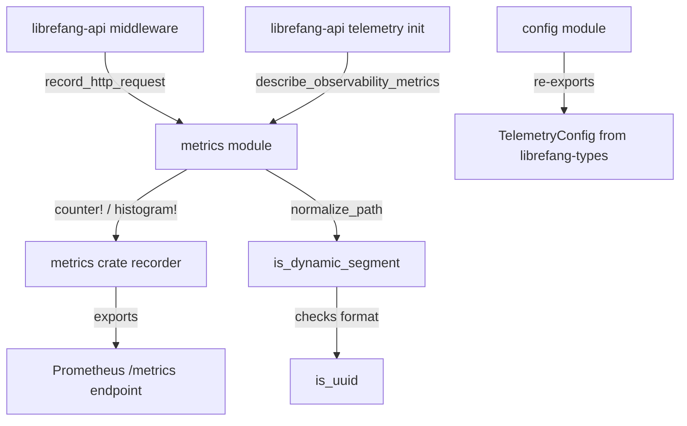

# Infrastructure Libraries — librefang-telemetry-src

# librefang-telemetry

OpenTelemetry + Prometheus metrics instrumentation for the LibreFang Agent OS. This crate provides centralized telemetry (metrics and tracing) used across all LibreFang crates.

## Architecture


```mermaid
graph TD
    A[librefang-api middleware] -->|record_http_request| M[metrics module]
    I[librefang-api telemetry init] -->|describe_observability_metrics| M
    M -->|counter! / histogram!| R[metrics crate recorder]
    R -->|exports| P[Prometheus /metrics endpoint]
    M -->|normalize_path| N[is_dynamic_segment]
    N -->|checks format| U[is_uuid]
    C[config module] -->|re-exports| T[TelemetryConfig from librefang-types]
```

## Module Structure

| Module | Purpose |
|--------|---------|
| `config` | Re-exports `TelemetryConfig` from `librefang-types` for convenience |
| `metrics` | HTTP metrics recording, path normalization, and metric descriptions |

The public API surface is:

- `record_http_request` — records an HTTP request with method, path, status, and duration
- `normalize_path` — collapses high-cardinality path segments into `{id}` placeholders
- `get_http_metrics_summary` — backward-compatible stub; real output comes from the `PrometheusHandle` in `librefang-api`

## Path Normalization

High-cardinality labels in Prometheus explode metric cardinality. The `normalize_path` function collapses dynamic segments so that paths like `/api/agents/550e8400-e29b-41d4-a716-446655440000/message` and `/api/agents/a1b2c3d4-e5f6-7890-abcd-ef1234567890/message` both become `/api/agents/{id}/message`.

### How it works

The path is split on `/`, then segments are walked left-to-right:

1. **Reserved segments** (`api`, `v1`, `v2`, `a2a`) are preserved as-is.
2. For all other segments, the function looks ahead to the next segment. If that next segment is dynamic (UUID or hex), the current segment is preserved and the dynamic one is replaced with `{id}`.
3. Empty segments (leading/trailing slashes) are preserved.

### What counts as dynamic

The `is_dynamic_segment` function matches two patterns:

| Pattern | Example | Criteria |
|---------|---------|----------|
| UUID | `550e8400-e29b-41d4-a716-446655440000` | Exactly 5 hyphen-separated groups of hex digits with lengths 8-4-4-4-12 |
| Hex ID | `deadbeef01234567` | Pure ASCII hex, 8–64 characters, no hyphens |

This intentionally avoids matching hyphenated words like `well-known` or `my-agent`, which are not identifiers.

## Recording HTTP Requests

`record_http_request` is the primary entry point, called from the request-logging middleware in `librefang-api`. It emits two metrics:

**`librefang_http_requests_total`** — counter with labels:
- `method` — HTTP method (e.g. `GET`, `POST`)
- `path` — normalized path
- `status` — HTTP status code as a string

**`librefang_http_request_duration_seconds`** — histogram with labels:
- `method` — HTTP method
- `path` — normalized path

Both delegate to the `metrics` crate macros (`metrics::counter!`, `metrics::histogram!`). Data flows through whichever recorder has been installed — typically the Prometheus exporter set up by `librefang-api::telemetry::init_prometheus`.

```rust
use std::time::Duration;
use librefang_telemetry::record_http_request;

let start = std::time::Instant::now();
// ... handle request ...
record_http_request("/api/agents/550e8400-.../message", "POST", 200, start.elapsed());
```

## Describing Metrics

`describe_observability_metrics` registers `# HELP` and `# TYPE` metadata with the Prometheus exporter for all LibreFang observability metrics:

| Metric | Type | Description |
|--------|------|-------------|
| `librefang_http_requests_total` | counter | Total HTTP requests by method/path/status |
| `librefang_http_request_duration_seconds` | histogram | Request wall-clock time (seconds) |
| `librefang_queue_wait_seconds` | histogram | Time waiting for a CommandQueue lane permit |
| `librefang_mcp_reconnect_total` | counter | MCP server reconnect attempts by server/outcome |
| `librefang_llm_provider_errors_total` | counter | LLM provider errors by provider/HTTP status |
| `librefang_tool_call_total` | counter | Tool invocations by name/outcome |

Call this once after installing the metrics recorder. It is idempotent — duplicate descriptions are deduped by the recorder. This is called from `init_prometheus` in `librefang-api::telemetry`.

## Configuration

The `config` module re-exports `TelemetryConfig` from `librefang-types::config`. This keeps the canonical configuration struct co-located with all other kernel configuration types while allowing downstream code to import from either location:

```rust
// Both work identically:
use librefang_types::config::TelemetryConfig;
use librefang_telemetry::config::TelemetryConfig;
```

## Integration with the Rest of LibreFang

| Caller | What it calls | When |
|--------|---------------|------|
| `librefang-api::middleware::request_logging` | `record_http_request` | On every HTTP request |
| `librefang-api::telemetry::init_prometheus` | `describe_observability_metrics` | Once at startup |

The metrics recorder itself is not installed by this crate. That responsibility belongs to `librefang-api::telemetry`, which wires up the Prometheus exporter. This crate only provides the recording and normalization logic that sits on top of the `metrics` facade.