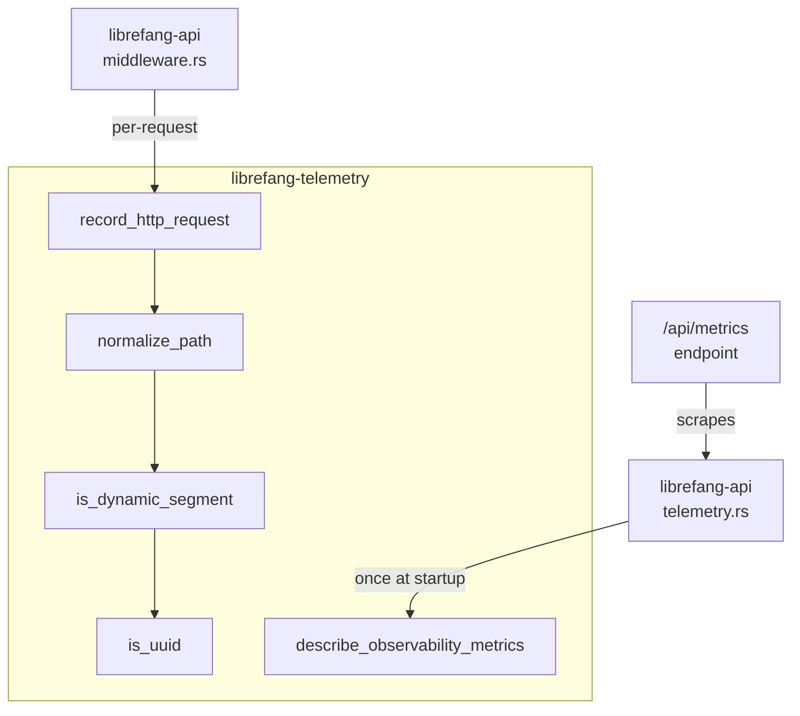

# Infrastructure Libraries — librefang-telemetry-src

# librefang-telemetry

OpenTelemetry + Prometheus metrics instrumentation for the LibreFang Agent OS. This crate provides a centralized telemetry layer that normalizes HTTP request paths and records metrics through the standard `metrics` crate, whose recorder is installed upstream in `librefang-api`.

## Architecture


```mermaid
graph TD
    MW["librefang-api<br/>middleware.rs"]
    TEL["librefang-api<br/>telemetry.rs"]
    API["/api/metrics<br/>endpoint"]

    subgraph "librefang-telemetry"
        RHR["record_http_request"]
        NP["normalize_path"]
        IDS["is_dynamic_segment"]
        IU["is_uuid"]
        DOM["describe_observability_metrics"]
    end

    MW -->|"per-request"| RHR
    RHR --> NP
    NP --> IDS
    IDS --> IU
    TEL -->|"once at startup"| DOM
    API -->|"scrapes"| TEL
```

## Module Structure

| File | Purpose |
|------|---------|
| `config.rs` | Re-exports `TelemetryConfig` from `librefang-types` for backward compatibility |
| `metrics.rs` | HTTP metrics recording, path normalization, and metric description registration |
| `lib.rs` | Crate root; re-exports `record_http_request`, `normalize_path`, `get_http_metrics_summary` |

## Public API

### `record_http_request`

```rust
pub fn record_http_request(path: &str, method: &str, status: u16, duration: Duration)
```

The primary entry point, called by the request-logging middleware in `librefang-api` on every inbound HTTP request. It normalizes the path, then emits two metrics:

| Metric | Type | Labels |
|--------|------|--------|
| `librefang_http_requests_total` | counter | `method`, `path` (normalized), `status` |
| `librefang_http_request_duration_seconds` | histogram | `method`, `path` (normalized) |

The histogram records the wall-clock duration in seconds.

### `normalize_path`

```rust
pub fn normalize_path(path: &str) -> String
```

Collapses high-cardinality dynamic segments in an HTTP path into `{id}` to prevent label explosion in Prometheus. For example:

| Input | Output |
|-------|--------|
| `/api/health` | `/api/health` |
| `/api/agents/550e8400-e29b-41d4-a716-446655440000/message` | `/api/agents/{id}/message` |
| `/api/agents/deadbeef01234567/message` | `/api/agents/{id}/message` |
| `/.well-known/agent.json` | `/.well-known/agent.json` |
| `/api/my-agent/status` | `/api/my-agent/status` |

The normalization strategy is segment-aware: it preserves known structural segments (`api`, `v1`, `v2`, `a2a`) and only replaces a segment when it is followed by a dynamic identifier. This avoids false positives on hyphenated words like `well-known` or `my-agent`.

**What counts as dynamic:**

- **UUIDs** — the standard `8-4-4-4-12` hex pattern (e.g., `550e8400-e29b-41d4-a716-446655440000`).
- **Pure hex strings** of length 8–64 with no hyphens (e.g., SHA-256 hashes, short hex IDs like `deadbeef01234567`).

The helper functions `is_dynamic_segment` and `is_uuid` are implementation details (private) and are not part of the public API.

### `describe_observability_metrics`

```rust
pub fn describe_observability_metrics()
```

Registers `# HELP` and `# TYPE` metadata for all LibreFang observability metrics with the installed recorder. Called once during startup by `librefang-api::telemetry::init_prometheus`. Idempotent — duplicate registrations are deduped by the recorder.

The metrics registered span three categories:

**HTTP metrics:**

| Metric | Type | Description |
|--------|------|-------------|
| `librefang_http_requests_total` | counter | Total HTTP requests by method/path/status |
| `librefang_http_request_duration_seconds` | histogram (seconds) | Request latency by method/path |

**Agent infrastructure (#3495):**

| Metric | Type | Description |
|--------|------|-------------|
| `librefang_queue_wait_seconds` | histogram (seconds) | Time waiting for a CommandQueue lane permit |
| `librefang_mcp_reconnect_total` | counter | MCP reconnection attempts by server and outcome |
| `librefang_llm_provider_errors_total` | counter | LLM provider errors by provider and status |
| `librefang_tool_call_total` | counter | Tool invocations by name and outcome |

**Cron scheduler:**

| Metric | Type | Description |
|--------|------|-------------|
| `librefang_cron_fires_total` | counter | Cron fires by agent and outcome (ok/error/timeout) |
| `librefang_cron_auto_disabled_total` | counter | Jobs auto-disabled after consecutive failures |

### `get_http_metrics_summary`

```rust
pub fn get_http_metrics_summary() -> String
```

Legacy function retained for backward compatibility. The actual Prometheus scrape now goes through the `PrometheusHandle` installed in `librefang-api::telemetry` and is served at `/api/metrics`. This function returns a comment string explaining that. New code should use the handle or endpoint directly.

## Configuration

`TelemetryConfig` is defined in `librefang-types::config::types` alongside all other kernel configuration. This crate re-exports it at `librefang_telemetry::config::TelemetryConfig` so that existing import paths continue to resolve.

## Integration Points

This crate does not install a metrics recorder itself. The recorder (a Prometheus exporter backed by a `PrometheusHandle`) is set up in `librefang-api::telemetry::init_prometheus`. The functions here emit data through the `metrics` crate's global facade, which routes to whatever recorder is active.

**Callers:**

- `librefang-api::middleware::request_logging` → `record_http_request` — called on every HTTP request passing through the middleware stack.
- `librefang-api::telemetry::init_prometheus` → `describe_observability_metrics` — called once at application startup to register metric descriptions.

## Testing

The `metrics.rs` module includes inline `#[cfg(test)]` tests covering:

- Path normalization with UUIDs, hex strings, hyphenated words, and well-known paths.
- Dynamic segment detection for UUIDs, hex strings, short strings, and regular words.

Run with:

```sh
cargo test -p librefang-telemetry
```