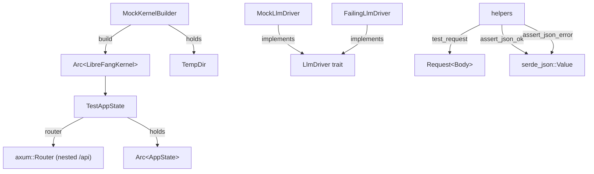

# Infrastructure Libraries — librefang-testing-src

# librefang-testing — Test Infrastructure

## Purpose

`librefang-testing` provides reusable mock infrastructure for testing LibreFang API routes and kernel operations without starting a full daemon or requiring network access. It builds **real** kernel and app-state instances with minimal, deterministic configuration — in-memory SQLite, temporary directories, and no networking — so integration tests exercise the same code paths as production while remaining fast and isolated.

## Architecture



Tests outside this crate consume the API like this:

```rust,ignore
let test = TestAppState::new();
let router = test.router();
let response = router.oneshot(test_request(Method::GET, "/api/health", None)).await;
let json = assert_json_ok(response).await;
```

## Key Components

### MockKernelBuilder

File: `mock_kernel.rs`

Constructs a real `LibreFangKernel` via `LibreFangKernel::boot_with_config` with a deterministic, lightweight configuration:

- **In-memory SQLite** — database file lives under a temp directory (`data/test.db`)
- **Temp home directory** — all paths (skills, workspaces, data) are scoped to a `tempfile::TempDir`
- **Networking disabled** — `config.network_enabled = false`
- **Self-handle wired** — calls `kernel.set_self_handle()` so internal `kernel_handle()` lookups succeed identically to production

#### Vault Key Stabilization

Parallel integration tests share a process-wide credential vault file. Without coordination, one test's `init()` can overwrite another's master key, causing decryption failures. `MockKernelBuilder::build` pins a deterministic `LIBREFANG_VAULT_KEY` environment variable (32 zero bytes, base64-encoded) exactly once per process via `std::sync::Once`. This eliminates the race condition.

#### Catalog Seeding

By default, the kernel boots with `sync_registry` which fetches model catalog data from `github.com/librefang-registry`. This is network-dependent and flakes on CI runners due to rate-limiting or partitioned networks. Use `with_catalog_seed` to replace the catalog with a deterministic baseline:

```rust,ignore
let (kernel, _tmp) = MockKernelBuilder::new()
    .with_catalog_seed(test_catalog_baseline())
    .build();
```

`test_catalog_baseline()` returns a minimal `(Vec<ProviderInfo>, Vec<ModelCatalogEntry>)` pair containing `gpt-4o-mini` under the `openai` provider. Add entries to this function as additional tests require specific model IDs.

#### Builder API

| Method | Description |
|--------|-------------|
| `new()` | Default minimal config |
| `with_config(f)` | Apply arbitrary `FnOnce(&mut KernelConfig)` to customize config before boot |
| `with_catalog_seed(seed)` | Replace post-boot catalog with deterministic entries |
| `build()` | Returns `(Arc<LibreFangKernel>, TempDir)` — caller **must** hold `TempDir` |
| `test_kernel()` | Convenience: equivalent to `MockKernelBuilder::new().build()` |

The `TempDir` guard is critical: dropping it deletes the temp directory on disk, invalidating all kernel file paths (SQLite DB, skill files, workspace directories, etc.). Keep it alive for the entire test lifetime.

### TestAppState

File: `test_app.rs`

Wraps `MockKernelBuilder` output into a production-identical `AppState` and constructs an axum `Router` with all main API routes nested under `/api`.

#### Construction

```rust,ignore
// Default
let test = TestAppState::new();

// Custom kernel
let test = TestAppState::with_builder(
    MockKernelBuilder::new().with_catalog_seed(test_catalog_baseline())
);

// From pre-existing kernel
let test = TestAppState::from_kernel(kernel, tmp);
```

#### Auth Configuration

| Method | Purpose |
|--------|---------|
| `with_api_key(key)` | Sets the global API key accepted by auth middleware |
| `with_user_api_keys(keys)` | Populates per-user API key list (`Vec<ApiUserAuth>`) |

These set runtime locks on `AppState`. They are **not** written to disk by `with_config_path`. If a test reloads config from disk and needs these values to persist, bake them into `KernelConfig` via `MockKernelBuilder::with_config`.

#### Config Serialization

`with_config_path(path)` serializes the kernel's internal `KernelConfig` to TOML at the given path. Used by config-reload endpoint tests that read from disk.

#### Router

`router()` returns a fully wired `Router` covering:

- **System**: health, status, version, metrics
- **Agents**: full CRUD + message, stop, model, mode, session, tools, skills, logs
- **Profiles**: list and get
- **Skills**: list and create
- **Config**: get, schema, set, reload
- **Memory**: search and stats
- **Usage**: stats and summary
- **Tools & Commands**: list and get
- **Models & Providers**: list
- **Sessions**: list

All routes are nested under `/api`, matching production routing.

#### Deconstruction

`into_parts()` consumes the `TestAppState` and returns `(Arc<AppState>, TempDir, Option<PathBuf>)` for tests that need direct ownership.

### MockLlmDriver

File: `mock_driver.rs`

A configurable fake `LlmDriver` that returns canned responses and records every call. Implements the `LlmDriver` trait from `librefang-runtime`.

#### Response Sequencing

Pass a `Vec<String>` of response texts to `new()`. Responses are returned in order. When the list is exhausted, the driver wraps around and repeats the **last** response indefinitely.

```rust,ignore
// Returns "first", then "second", then "second", "second", ...
let driver = MockLlmDriver::new(vec!["first".into(), "second".into()]);

// Always returns "hello"
let driver = MockLlmDriver::with_response("hello");
```

#### Configuration

| Method | Default | Description |
|--------|---------|-------------|
| `with_tokens(input, output)` | `10` / `5` | Override token usage in responses |
| `with_stop_reason(reason)` | `EndTurn` | Override stop reason |

#### Call Recording

Every `complete()` or `stream()` call is recorded as a `RecordedCall`:

| Field | Content |
|-------|---------|
| `model` | Model name from the request |
| `message_count` | Number of messages sent |
| `tool_count` | Number of tool definitions |
| `system` | System prompt, if any |

Retrieve recordings:

```rust,ignore
let calls = driver.recorded_calls();
let count = driver.call_count();
```

This is used across the codebase to verify that the kernel sends the expected model, message count, and tool count to the LLM driver during session operations (summary invocation, agent messaging, etc.).

#### Streaming

`stream()` simulates streaming by sending a single `TextDelta` event followed by `ContentComplete`, then returning the full `CompletionResponse`. This exercises the streaming code path without requiring a real provider.

### FailingLlmDriver

A second mock that always returns an `LlmError::Api` with status 500. Used for testing error-handling paths in the kernel and API layer. Its `is_configured()` returns `false`.

```rust,ignore
let driver = FailingLlmDriver::new("something went wrong");
```

### HTTP Helpers

File: `helpers.rs`

#### test_request

```rust
pub fn test_request(method: Method, path: &str, body: Option<&str>) -> Request<Body>
```

Builds an axum-compatible HTTP request. When `body` is `Some`, automatically sets `content-type: application/json`.

#### assert_json_ok

```rust
pub async fn assert_json_ok(response: Response<Body>) -> serde_json::Value
```

Asserts status is `200 OK`, parses the body as JSON, and returns the `serde_json::Value`. Panics with a descriptive message including the raw body on failure.

#### assert_json_error

```rust
pub async fn assert_json_error(response: Response<Body>, expected_status: StatusCode) -> serde_json::Value
```

Same as `assert_json_ok` but asserts a specific error status code instead of `200`.

Both assertion functions delegate to the private `read_body` helper which collects the response body bytes into a UTF-8 string using `http_body_util::BodyExt`.

## Usage Patterns

### Basic Route Test

```rust,ignore
use axum::http::Method;
use librefang_testing::{TestAppState, test_request, assert_json_ok, assert_json_error};
use tower::ServiceExt;

let test = TestAppState::new();
let router = test.router();

// Success case
let response = router
    .oneshot(test_request(Method::GET, "/api/health", None))
    .await
    .unwrap();
let json = assert_json_ok(response).await;
assert_eq!(json["status"], "ok");

// Error case
let response = router
    .oneshot(test_request(Method::GET, "/api/agents/nonexistent", None))
    .await
    .unwrap();
let json = assert_json_error(response, StatusCode::NOT_FOUND).await;
```

### Kernel-Level Test with Custom Config

```rust,ignore
use librefang_testing::{MockKernelBuilder, test_catalog_baseline};

let (kernel, _tmp) = MockKernelBuilder::new()
    .with_config(|cfg| {
        cfg.default_model.provider = "openai".into();
        cfg.default_model.model = "gpt-4o-mini".into();
    })
    .with_catalog_seed(test_catalog_baseline())
    .build();
// Use kernel directly for kernel-layer tests
```

### LLM Driver Mocking for Session Operations

The `MockLlmDriver` is used by kernel-level session tests to verify LLM interaction without real API calls. The kernel's `session_ops` module (e.g., summary invocation) uses `MockLlmDriver::with_response` and then inspects `recorded_calls()` to assert correct prompt construction:

```rust,ignore
let driver = MockLlmDriver::with_response("Summary text here");
// ... wire driver into kernel session ...
// ... trigger session operation ...
let calls = driver.recorded_calls();
assert_eq!(calls.len(), 1);
assert_eq!(calls[0].model, "gpt-4o-mini");
```

## Cross-Crate Dependencies

| Consumer | What it uses |
|----------|-------------|
| `librefang-api` integration tests | `TestAppState`, `test_request`, `assert_json_ok`, `assert_json_error`, `test_catalog_baseline` |
| `librefang-kernel` tests | `MockKernelBuilder::with_config` for session reset scope tests |
| `librefang-runtime` session ops | `MockLlmDriver::with_response` for summary driver tests |

## Re-exports

The crate root re-exports the primary API for convenience:

```rust,ignore
pub use helpers::{assert_json_error, assert_json_ok, test_request};
pub use mock_driver::{FailingLlmDriver, MockLlmDriver};
pub use mock_kernel::{test_catalog_baseline, CatalogSeed, MockKernelBuilder};
pub use test_app::TestAppState;
```