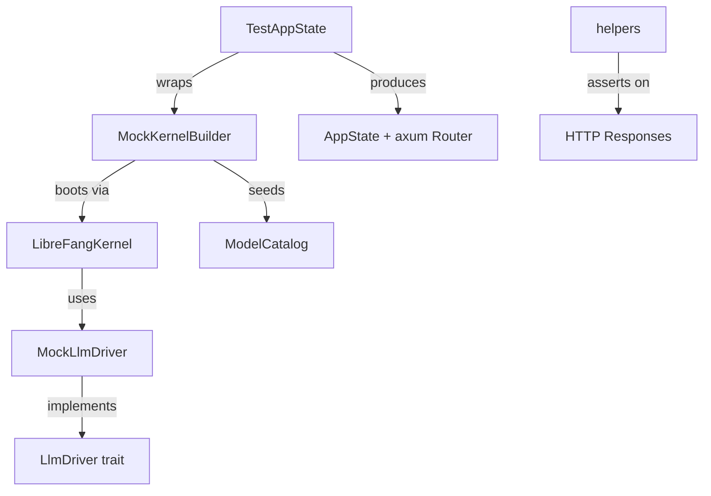

# Infrastructure Libraries — librefang-testing-src

# librefang-testing — Test Infrastructure

## Purpose

`librefang-testing` provides mock infrastructure for unit and integration testing API routes, kernel subsystems, and LLM-driven agents without starting a full daemon or requiring network access. It is used across the entire workspace — by `librefang-kernel` integration tests, `librefang-api` route tests, `librefang-cli` HTTP client tests, and `librefang-desktop` connection/shortcut tests.

The crate does not contain test suites itself (beyond a small self-test module). It is a **dev-dependency library** consumed by other crates' test code.

## Architecture


```mermaid
graph TD
    TA[TestAppState] -->|wraps| MKB[MockKernelBuilder]
    TA -->|produces| APP[AppState + axum Router]
    MKB -->|boots via| K[LibreFangKernel]
    MKB -->|seeds| MC[ModelCatalog]
    K -->|uses| MDB[MockLlmDriver]
    MDB -->|implements| LD[LlmDriver trait]
    H[helpers] -->|asserts on| RESP[HTTP Responses]
```

Four public modules, all re-exported from the crate root:

| Module | Key types/functions | Role |
|---|---|---|
| `mock_kernel` | `MockKernelBuilder`, `test_catalog_baseline`, `test_kernel` | Boot a real kernel with in-memory SQLite and a temp directory |
| `mock_driver` | `MockLlmDriver`, `FailingLlmDriver` | Fake LLM provider with canned responses and call recording |
| `test_app` | `TestAppState` | Full `AppState` + axum `Router` for HTTP-level route testing |
| `helpers` | `test_request`, `assert_json_ok`, `assert_json_error` | Build HTTP requests and assert on responses |

---

## MockKernelBuilder

The central piece of the crate. Constructs a real `LibreFangKernel` instance using `LibreFangKernel::boot_with_config`, but with:

- **In-memory SQLite** — database file lives under a temp directory (not `:memory:` — `boot_with_config` requires a file path)
- **Temp home directory** — `tempfile::TempDir` provides `home_dir` and `data_dir`; the caller must hold the `TempDir` guard for the kernel's lifetime
- **Networking disabled** — `config.network_enabled = false` prevents outbound connections
- **Deterministic secrets** — `LIBREFANG_VAULT_KEY` and `LIBREFANG_STATE_SECRET` are pinned to stable base64-encoded 32-byte-zero values via `std::sync::Once`, preventing race conditions between parallel test processes that share an OS keyring or vault file

### Builder API

```rust,ignore
let (kernel, _tmp) = MockKernelBuilder::new()
    .with_config(|cfg| {
        cfg.default_model.provider = "openai".into();
    })
    .with_catalog_seed(test_catalog_baseline())
    .build();
```

- **`with_config(fn)`** — mutate `KernelConfig` before boot. Use this to override default model, channels, external auth settings, etc.
- **`with_catalog_seed((providers, models))`** — replace the model catalog after boot with deterministic entries, bypassing `sync_registry`'s network fetch
- **`build()`** — returns `(Arc<LibreFangKernel>, TempDir)`. The kernel has `set_self_handle` called on it so `kernel_handle()` lookups work identically to production (fixes #3652)

### Catalog Seeding

Without seeding, the model catalog is populated by `librefang_runtime::registry_sync::sync_registry`, which fetches from `github.com/librefang-registry`. This is flaky on CI (rate limits, network partitions) and produces inconsistent results across test shards.

`test_catalog_baseline()` returns a minimal `(Vec<ProviderInfo>, Vec<ModelCatalogEntry>)` pair containing the `openai` provider and `gpt-4o-mini` model — sufficient for the `librefang-api` integration test suite. Add entries to this function as tests require additional model/provider shapes.

### Vault Key and State Secret Initialization

Two `Once`-guarded functions run before every kernel boot:

- `ensure_test_vault_key()` — sets `LIBREFANG_VAULT_KEY` to a fixed base64 value if not already set. Prevents parallel test processes from racing on the shared keyring file.
- `ensure_test_state_secret()` — sets `LIBREFANG_STATE_SECRET` to the same fixed value. Required when `external_auth.enabled = true` in config; the kernel refuses to boot without a well-shaped secret.

These only set the environment variable when it's absent, so explicit overrides from the test process or CI environment are respected.

### Convenience Function

`test_kernel()` is shorthand for `MockKernelBuilder::new().build()`.

---

## MockLlmDriver

A configurable implementation of the `LlmDriver` trait that returns canned responses and records all calls. Thread-safe — internal state uses `Arc<Mutex<...>>`.

### Basic Usage

```rust,ignore
let driver = MockLlmDriver::new(vec![
    "First response".into(),
    "Second response".into(),
]);
```

Responses are returned in order. When the list is exhausted, the driver wraps around to the **last** response indefinitely. At least one response is required (panics on empty).

### Builder Configuration

```rust,ignore
let driver = MockLlmDriver::with_response("Hello!")
    .with_tokens(100, 50)           // input=100, output=50 (default 10/5)
    .with_stop_reason(StopReason::MaxTokens);  // default EndTurn
```

- **`with_tokens(input, output)`** — override token usage counts in the `TokenUsage` response
- **`with_stop_reason(reason)`** — override the `StopReason` in the response

### Call Recording

Every call to `complete` or `stream` records a `RecordedCall`:

| Field | Description |
|---|---|
| `model` | Model name from the request |
| `message_count` | Number of messages sent |
| `tool_count` | Number of tool definitions |
| `system` | System prompt if provided |

Inspect recorded calls:

```rust,ignore
assert_eq!(driver.call_count(), 2);
let calls = driver.recorded_calls();
assert_eq!(calls[0].model, "gpt-4o-mini");
```

### Streaming

The `stream` implementation calls `complete` internally, then emits `StreamEvent::TextDelta` followed by `StreamEvent::ContentComplete` over the provided channel. This simulates a single-chunk streaming response.

### FailingLlmDriver

A separate driver that always returns an `LlmError::Api` error with status 500. Use it to test error-handling paths:

```rust,ignore
let driver = FailingLlmDriver::new("something went wrong");
```

`is_configured()` returns `false` for `FailingLlmDriver`, `true` for `MockLlmDriver`.

---

## TestAppState

Wraps `MockKernelBuilder` output into a production-equivalent `AppState` and provides a fully-wired axum `Router`. This is the entry point for HTTP-level route testing.

### Construction

```rust,ignore
// Default
let test = TestAppState::new();

// Custom kernel configuration
let test = TestAppState::with_builder(
    MockKernelBuilder::new().with_config(|cfg| { /* ... */ })
);

// From an existing kernel
let test = TestAppState::from_kernel(kernel, tmp);
```

### Router

`test.router()` returns an `axum::Router` with all API routes nested under `/api`, mirroring production:

- System: `/health`, `/status`, `/version`, `/metrics`
- Agents: CRUD, messaging, session management, tool/skill binding, logs
- Profiles, skills, config, memory, budget/usage, tools, models, providers, sessions

Send test requests using `tower::ServiceExt`:

```rust,ignore
let app = test.router();
let response = app.oneshot(
    test_request(Method::GET, "/api/health", None)
).await.unwrap();
let json = assert_json_ok(response).await;
```

### Authentication Setup

- **`with_api_key(key)`** — sets the global API key in the `AppState` runtime lock. Auth middleware will accept this key in `Authorization: Bearer <key>` headers.
- **`with_user_api_keys(keys)`** — populates the per-user API key list for multi-user auth scenarios.

Note: these set runtime locks on `AppState`, not the kernel config. If a test reloads config from disk (via `with_config_path`), bake auth keys into the kernel config via `MockKernelBuilder::with_config` instead.

### Config File Serialization

`with_config_path(path)` serializes the kernel's internal `KernelConfig` to a TOML file. Useful for tests that exercise `/api/config/reload`, which reads from disk. Only kernel config is written — `AppState` runtime values (API keys, user keys) are not included.

### Decomposition

`into_parts()` consumes the `TestAppState`, returning `(Arc<AppState>, TempDir, Option<PathBuf>)` for tests that need direct ownership of the components.

### AppState Internals

`build_state` constructs the `AppState` with:
- The kernel from the builder
- An `Instant::now()` start timestamp
- An idempotency store backed by the kernel's SQLite pool (same persistence path as production, #3637)
- A `WebhookStore` loaded from a temp file
- Default rate limiters, trusted proxy config (header trust off), media driver cache, and all other fields matching the production `AppState` shape

---

## HTTP Helper Functions

### test_request

```rust
pub fn test_request(method: Method, path: &str, body: Option<&str>) -> Request<Body>
```

Builds an `axum::http::Request<Body>`. When a body is provided, sets `content-type: application/json` automatically. Returns an empty body when `None`.

### assert_json_ok

```rust
pub async fn assert_json_ok(response: Response<Body>) -> serde_json::Value
```

Asserts status is `200 OK`, parses the response body as JSON, and returns the `serde_json::Value`. Panics with the status code and raw body text on failure.

### assert_json_error

```rust
pub async fn assert_json_error(response: Response<Body>, expected_status: StatusCode) -> serde_json::Value
```

Same as `assert_json_ok` but asserts the status matches `expected_status` instead of `200`. Use for testing error responses.

---

## TempDir Lifetime Management

`MockKernelBuilder::build()` and `TestAppState` both return `TempDir` guards. **The caller must hold the `TempDir` for the entire lifetime of the kernel or app state.** Dropping it early deletes the temp directory, invalidating all file paths the kernel uses (database, vault, webhooks, skill files, agent workspaces).

In practice, bind the `TempDir` in the same scope as the test:

```rust,ignore
let test = TestAppState::new();
let router = test.router();
// `test` holds `_tmp` internally — don't drop `test` until the test ends
```

---

## Integration Across the Workspace

The call graph shows `MockKernelBuilder::build()` is called from:

- **`librefang-kernel`** — WASM agent integration tests, workflow integration tests, audit retention tests
- **`librefang-api`** — webchat sync dashboard
- **`librefang-cli`** — HTTP client construction, MCP backend creation
- **`librefang-desktop`** — server startup, connection testing, shortcut plugin building, build script
- **`src/kernel/cron_bridge.rs`** — HTTP client construction for cron delivery

This makes `librefang-testing` a foundational crate — any change to `MockKernelBuilder` or `TestAppState` has workspace-wide impact on test compilation and behavior.