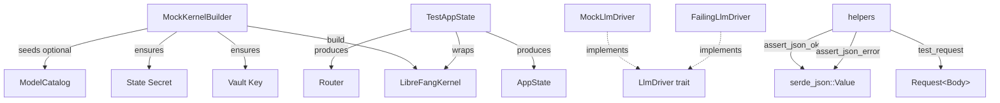

# Infrastructure Libraries — librefang-testing-src

# librefang-testing — Test Infrastructure

Provides mock infrastructure for unit and integration testing API routes without starting a full daemon or requiring network access.

## Architecture


```mermaid
graph TD
    MKB[MockKernelBuilder] -->|build| K[LibreFangKernel]
    MKB -->|ensures| VK[Vault Key]
    MKB -->|ensures| SS[State Secret]
    MKB -->|seeds optional| MC[ModelCatalog]
    TA[TestAppState] -->|wraps| K
    TA -->|produces| AS[AppState]
    TA -->|produces| R[Router]
    MD[MockLlmDriver] -.->|implements| LD[LlmDriver trait]
    FD[FailingLlmDriver] -.->|implements| LD
    H[helpers] -->|test_request| REQ[Request&lt;Body&gt;]
    H -->|assert_json_ok| JV[serde_json::Value]
    H -->|assert_json_error| JV
```

All four components are designed to compose: `MockKernelBuilder` produces a real kernel, `TestAppState` wraps it into a production-compatible `AppState`, `MockLlmDriver` substitutes the LLM provider, and `helpers` simplifies HTTP request/response handling.

---

## MockKernelBuilder

Boots a real `LibreFangKernel` with minimal configuration: in-memory SQLite, a temp directory, and networking disabled. Uses `LibreFangKernel::boot_with_config` internally — not a stub — so tests exercise the same initialization path as production.

### Process-wide safety guarantees

Two `Once`-guarded initializations run before any kernel boots:

- **`ensure_test_vault_key`** — sets `LIBREFANG_VAULT_KEY` to a deterministic base64 value so parallel tests don't race on the process-shared `.keyring` file.
- **`ensure_test_state_secret`** — sets `LIBREFANG_STATE_SECRET` to a valid base64-encoded 32-byte value so kernels booting with `external_auth.enabled = true` don't abort.

Both only set the env var when it's unset, so a test can override with its own value before calling `build()`.

### Catalog seeding

By default, `boot_with_config` calls `sync_registry` which fetches from `github.com/librefang-registry` — flaky on CI when rate-limited or network-partitioned. Call `with_catalog_seed(test_catalog_baseline())` to replace the catalog with a deterministic set of providers and models:

```rust,ignore
let (kernel, _tmp) = MockKernelBuilder::new()
    .with_catalog_seed(test_catalog_baseline())
    .build();
```

`test_catalog_baseline()` provides a minimal `openai` provider with `gpt-4o-mini`. Add entries to that function as new tests require specific model shapes.

### Builder API

| Method | Purpose |
|--------|---------|
| `new()` | Default minimal config |
| `with_config(fn)` | Mutate `KernelConfig` before boot |
| `with_catalog_seed(seed)` | Override model catalog post-boot |
| `build()` | Returns `(Arc<LibreFangKernel>, TempDir)` |

**The caller must hold `TempDir`** for the lifetime of the test. Dropping it deletes the temp directory and invalidates all kernel file paths.

```rust,ignore
let (kernel, _tmp) = MockKernelBuilder::new()
    .with_config(|cfg| {
        cfg.default_model.provider = "openai".into();
    })
    .with_catalog_seed(test_catalog_baseline())
    .build();
```

`test_kernel()` is a convenience function equivalent to `MockKernelBuilder::new().build()`.

---

## TestAppState

Wraps `MockKernelBuilder` output into an `AppState` and provides an axum `Router` wired with all production API routes. The `AppState` is the same type used in production — not a mock — so middleware, auth, and route handlers run identically.

### Construction paths

- **`TestAppState::new()`** — default mock kernel, no customization.
- **`TestAppState::with_builder(builder)`** — customize kernel before boot.
- **`TestAppState::from_kernel(kernel, tmp)`** — bring your own kernel (caller holds `TempDir`).

### Router

`test.router()` returns a `Router` with all API routes nested under `/api`, matching production. This includes agents CRUD, skills, config, memory, budget, system endpoints, and more.

### Auth configuration

| Method | Effect |
|--------|--------|
| `with_api_key(key)` | Sets the global API key on the runtime lock |
| `with_user_api_keys(keys)` | Pre-populates per-user API key list |

Note: these modify `AppState` runtime locks, not the kernel config file. For config-reload tests that read from disk, bake keys into `KernelConfig` via `MockKernelBuilder::with_config`.

### Config snapshot

`with_config_path(path)` serializes the kernel's `KernelConfig` to a TOML file at the given path. Use this for tests that exercise config-reload endpoints.

### Destructuring

`into_parts()` returns `(Arc<AppState>, TempDir, Option<PathBuf>)` when a test needs direct ownership of all components.

### AppState wiring details

`build_state` constructs the full `AppState` including:
- `bridge_manager` (initialized to `None`)
- `channels_config` from kernel config
- `idempotency_store` backed by the same SQLite pool as production
- `webhook_store` writing to a temp file
- `gcra_limiter` with zero capacity (no rate limiting in tests by default)
- `trusted_proxies` / `trust_forwarded_for` set to production defaults

---

## MockLlmDriver

A configurable `LlmDriver` implementation that returns canned responses and records all calls for post-test assertions.

### Basic usage

```rust,ignore
let driver = MockLlmDriver::new(vec![
    "First response".into(),
    "Second response".into(),
]);

// or single repeated response:
let driver = MockLlmDriver::with_response("Always this");
```

Responses are returned in order. When the list is exhausted, the driver returns the last response for all subsequent calls.

### Customization

```rust,ignore
let driver = MockLlmDriver::with_response("hi")
    .with_tokens(100, 50)                  // input=100, output=50 (default: 10, 5)
    .with_stop_reason(StopReason::MaxTokens); // default: EndTurn
```

### Call recording

Every `complete()` and `stream()` call records a `RecordedCall`:

| Field | Content |
|-------|---------|
| `model` | Model name from the request |
| `message_count` | Number of messages |
| `tool_count` | Number of tool definitions |
| `system` | System prompt if present |

Inspect recordings with `driver.recorded_calls()` or `driver.call_count()`.

### Streaming

`stream()` delegates to `complete()`, then emits `StreamEvent::TextDelta` followed by `StreamEvent::ContentComplete` on the provided channel.

### FailingLlmDriver

A separate driver that always returns `LlmError::Api { status: 500, ... }`. Use it for testing error-handling paths:

```rust,ignore
let driver = FailingLlmDriver::new("something went wrong");
```

`is_configured()` returns `false` for `FailingLlmDriver`, `true` for `MockLlmDriver`.

---

## Helpers

### test_request

```rust
fn test_request(method: Method, path: &str, body: Option<&str>) -> Request<Body>
```

Builds an axum-compatible HTTP request. When `body` is `Some`, sets `content-type: application/json`.

```rust,ignore
let req = test_request(Method::GET, "/api/health", None);
let req = test_request(Method::POST, "/api/agents", Some(r#"{"name": "test"}"#));
```

### assert_json_ok

```rust
async fn assert_json_ok(response: Response<Body>) -> serde_json::Value
```

Asserts status 200 and parses the body as JSON. Returns the parsed value. Panics with the response body in the error message on failure.

### assert_json_error

```rust
async fn assert_json_error(response: Response<Body>, expected_status: StatusCode) -> serde_json::Value
```

Same as `assert_json_ok` but asserts a specific error status code. Returns the parsed JSON body for further assertion on error details.

---

## Typical test pattern

```rust,ignore
use axum::http::Method;
use librefang_testing::*;

#[tokio::test]
async fn test_create_agent() {
    let app = TestAppState::new();
    let router = app.router();

    let req = test_request(
        Method::POST,
        "/api/agents",
        Some(r#"{"name": "test-agent"}"#),
    );

    let response = router.oneshot(req).await.unwrap();
    let body = assert_json_ok(response).await;

    assert_eq!(body["name"], "test-agent");
}
```

For tests that need a specific LLM behavior, inject `MockLlmDriver` or `FailingLlmDriver` through the kernel's driver registry after building.