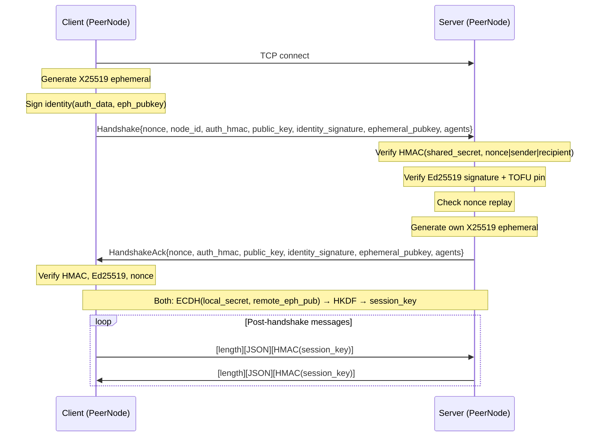

# Infrastructure Libraries — librefang-wire-src

# librefang-wire-src

Agent-to-agent networking over the LibreFang Wire Protocol (OFP). Provides TCP-based peer discovery, multi-layer authentication, and framed JSON-RPC messaging between LibreFang kernels.

## Security Model

OFP uses two independent authentication layers, both required for a successful handshake:

1. **Network admission (HMAC-SHA256)** — keyed by `shared_secret` over `nonce | sender_node_id | recipient_node_id`. Coarse "cluster password" gate. The triple binding prevents cross-node replay within a federation that shares one `shared_secret`.

2. **Per-peer identity (Ed25519)** — every node persists a keypair in `<data_dir>/peer_keypair.json`. The handshake carries the sender's public key plus a signature over the same auth-data string the HMAC covers. Recipients verify and TOFU-pin the public key to the sender's `node_id`. A leaked `shared_secret` alone cannot impersonate a pinned peer.

3. **Forward-secret session keys (X25519 ECDH, #4269)** — each handshake generates a fresh ephemeral X25519 keypair. Both sides ECDH to produce a shared point, then HKDF-SHA256 derives the per-message session key. The ephemeral private keys are dropped after the handshake. A future compromise of `shared_secret` or static Ed25519 keys cannot decrypt recorded past traffic.

OFP frames are **plaintext** on the wire. Confidentiality must come from the deployment layer (WireGuard, Tailscale, SSH tunnel, etc.).

## Module Structure

```
librefang-wire/src/
├── lib.rs            # Crate root, re-exports
├── keys.rs           # Ed25519 identity: generation, persistence, signing, verification
├── kex.rs            # Ephemeral X25519 key exchange + HKDF session key derivation
├── message.rs        # WireMessage envelope, request/response/notification types, framing
├── peer.rs           # PeerNode: TCP listener, handshake, connection loops, rate limiting
├── registry.rs       # PeerRegistry: in-memory tracking of known peers and remote agents
└── trusted_peers.rs  # Persistent TOFU pin store (JSON on disk)
```

## Handshake Flow



### Step-by-step

1. **TCP connect** — client opens a connection; server accepts into `handle_inbound`.
2. **Client sends Handshake** — includes a UUID nonce, HMAC over `nonce|sender_node_id|recipient_node_id`, Ed25519 public key + signature (scope includes the ephemeral pubkey), and the X25519 ephemeral public key.
3. **Server verifies HMAC** — before recording the nonce (#3880), before any other work. Binds the handshake to this specific recipient node (#3875).
4. **Server verifies Ed25519 identity** — checks the signature over `auth_data[|ephemeral_pubkey]`, then TOFU-pins or compares the public key against the existing pin for that `node_id`. Downgrade (peer previously had identity, now omits it) is rejected.
5. **Server checks nonce replay** — `NonceTracker` records the nonce; duplicates within the 5-minute window are rejected.
6. **Server responds with HandshakeAck** — mirrors the same fields: its own nonce, HMAC, Ed25519 identity, and X25519 ephemeral.
7. **Client verifies the ack** — same checks in reverse (HMAC, identity, nonce).
8. **Both derive session key** — if both sides sent `ephemeral_pubkey`, each calls `EphemeralKex::derive_session_key` with the remote ephemeral and a transcript of both nonces. If either side omitted it (legacy peer), falls back to `derive_session_key(shared_secret, our_nonce, their_nonce)`.
9. **Post-handshake messaging** — every frame carries a trailing HMAC-SHA256 keyed by the session key.

## Key Components

### `keys` — Ed25519 Identity

**`Ed25519KeyPair`** — holds a 32-byte seed and the base64-encoded public key. `sign(data)` returns a base64 signature. `fingerprint()` returns `SHA-256(public_key_b64)` hex for out-of-band verification.

**`PeerKeyManager`** — loads or generates `<data_dir>/peer_keypair.json`. Migrates PR-1 files (no `node_id` field) by minting a UUID and rewriting. Best-effort `chmod 600` on Unix.

**`verify_signature(public_key, data, signature)`** — standalone Ed25519 verification used during handshake processing.

**`fingerprint_of_pubkey(public_key)`** — stable hex fingerprint for OOB comparison, surfaced via `GET /api/network/status`.

### `kex` — Ephemeral Key Exchange

**`EphemeralKex`** — holds a per-handshake X25519 `StaticSecret` (zeroizes on drop). Usage:

```rust
let our_kex = EphemeralKex::generate()?;
let our_pub = our_kex.public_b64(); // goes on the wire

// After receiving remote ephemeral:
let transcript = handshake_transcript(&client_nonce, &server_nonce);
let session_key = our_kex.derive_session_key(&remote_pub_b64, &transcript)?;
// our_kex is dropped here — private key is gone
```

`derive_session_key` performs ECDH, rejects the all-zero shared secret (low-order public key attack), then HKDF-SHA256 with the transcript as salt and info string `b"librefang-ofp/v1/session-key"`. The info string is the protocol-versioning hook — change it on a breaking derivation change so old and new clients cannot accidentally agree on a key.

**`handshake_transcript(client_nonce, server_nonce)`** — concatenates nonces in fixed order (client first, server second) to produce the HKDF salt. Both sides must call with the same argument order regardless of which role they play.

### `message` — Wire Protocol Types

All communication uses JSON-framed messages over TCP with a 4-byte big-endian length prefix.

**`WireMessage`** — envelope with `id` and a `WireMessageKind` discriminated by JSON `"type"` tag.

**Request variants** (`WireRequest`): `Handshake`, `Discover`, `AgentMessage`, `Ping`. Each tagged by `"method"`.

**Response variants** (`WireResponse`): `HandshakeAck`, `DiscoverResult`, `AgentResponse`, `Pong`, `Error`. Tagged by `"method"`.

**Notification variants** (`WireNotification`): `AgentSpawned`, `AgentTerminated`, `ShuttingDown`. Tagged by `"event"`.

**Forward compatibility** — every enum has an `Unknown` arm via `#[serde(other)]`. Unknown messages decode successfully so the TCP link stays alive (#3544). `classify_unknown(body, msg)` inspects the raw JSON to recover the tag string for logging.

**Framing functions**: `encode_message`, `decode_length`, `decode_message`.

### `peer` — PeerNode

**`PeerNode`** — the core networking type. Binds a TCP listener, accepts inbound connections, and connects outbound to known peers.

**Construction**:
- `PeerNode::start(config, registry, handle)` — legacy, HMAC-only identity.
- `PeerNode::start_with_identity(config, registry, handle, keypair, trust_store_dir)` — preferred. Binds an Ed25519 identity and optionally persists TOFU pins to disk.

**`PeerConfig`** fields:
| Field | Purpose |
|---|---|
| `listen_addr` | TCP bind address |
| `node_id` | This node's UUID |
| `shared_secret` | Required HMAC key (empty = refuse to start) |
| `max_messages_per_peer_per_minute` | Rate limit (default 60, 0 = unlimited) |
| `max_llm_tokens_per_peer_per_hour` | Optional token budget cap |

**`PeerHandle` trait** — the kernel implements this to route remote requests to local agents:
- `local_agents()` — list agents for handshake/discovery
- `handle_agent_message(agent, message, sender)` — dispatch to local LLM
- `discover_agents(query)` — search local agents
- `uptime_secs()` — for Pong responses

**Outbound operations**:
- `connect_to_peer(addr, handle)` / `connect_to_peer_with_id(addr, handle, recipient_node_id)` — open connection, handshake, then spawn a long-lived `connection_loop` task.
- `send_to_peer(node_id, agent, message, sender, handle)` — open a short-lived connection, handshake, send one `AgentMessage`, read one response, close.

### Security Internals (peer.rs)

**`NonceTracker`** — time-windowed (5-minute) deduplication of handshake nonces. Uses `DashMap::entry` for atomic check-and-insert (no TOCTOU). Capped at 100k entries. GC sweeps only trigger at 80% capacity to amortize the O(n) scan.

**`PeerRateLimiter`** — two independent limits per peer:
- Message rate: N `AgentMessage` requests per 60-second window (default 60).
- Token budget: optional cumulative cap per 3600-second window.

**TOFU pin map** (`pinned_pubkeys`) — bounded at 100k entries. Hydrated from `TrustedPeers` store at startup. Downgrade detection: if a `node_id` was previously seen with an Ed25519 identity, a subsequent handshake without one is rejected.

**Pre-handshake DoS mitigations**:
- `HANDSHAKE_READ_TIMEOUT_SECS = 10` — deadline on the first frame read before any authentication.
- `MAX_PREHANDSHAKE_MESSAGE_SIZE = 64 KiB` — caps body allocation for unauthenticated frames (handshake messages are ~1 KiB; legitimate handshakes never approach this).
- Post-handshake reads allow the full `MAX_MESSAGE_SIZE` (16 MiB).

**Per-message authentication** — post-handshake, every frame carries a trailing 64-char hex HMAC keyed by the session key. `write_message_authenticated` / `read_message_authenticated` handle framing. The `session_key` field is derived via ECDH (preferred) or legacy HMAC-SHA256 over `shared_secret + nonces`.

**Message size enforcement** — `MAX_PEER_MESSAGE_BYTES = 64 KiB` caps `AgentMessage` payloads before they reach the LLM pipeline, preventing a federated peer from draining the receiver's budget.

### `registry` — Peer Registry

**`PeerRegistry`** — `Arc<DashMap>`-backed store of `PeerEntry` records (node metadata + agent list + connection state). Shared across all Tokio tasks for a given `PeerNode`.

### `trusted_peers` — Persistent TOFU Pins

**`TrustedPeers`** — JSON-file-backed store of `(node_id, public_key, fingerprint)` triples. Loaded at startup; new pins are written through on every TOFU first-contact. Corrupt or unreadable files prevent startup (fail-loud rather than silently dropping pins).

## Integration with the Kernel

The kernel wires into this crate at two points:

1. **Startup** — `start_ofp_node` in `src/kernel/background_lifecycle.rs` creates a `PeerConfig`, loads the Ed25519 keypair via `PeerKeyManager::load_or_generate`, opens a `TrustedPeers` store, and calls `PeerNode::start_with_identity`. The kernel itself implements `PeerHandle` (in `src/kernel/mod.rs`) to expose `local_agents`, `discover_agents`, and `handle_agent_message`.

2. **API surface** — `src/routes/network.rs` and integration tests read from `PeerRegistry` and `PeerNode` to serve:
   - `GET /api/network/status` — `identity_fingerprint`, `pinned_peer_count`
   - `GET /api/network/peers` — list of connected peers
   - `GET /api/network/trusted-peers` — pinned identity list with fingerprints

## Backward Compatibility

All security fields (`public_key`, `identity_signature`, `ephemeral_pubkey`) are `Option<String>` on the wire with `#[serde(default, skip_serializing_if = "Option::is_none")]`. Peers running older protocol versions omit these fields and fall back to HMAC-only authentication with the legacy `derive_session_key(shared_secret, nonces)` path. A mixed-version federation interoperates at the security level of the oldest participant.

The `Unknown` enum arms and `classify_unknown` function handle forward compatibility: messages from newer protocol versions decode without error and are logged at warn level with the unrecognized tag string.