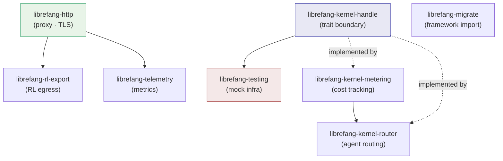

# Infrastructure Libraries

# Infrastructure Libraries

Shared foundations that every other LibreFang crate depends on — HTTP transport, kernel trait boundaries, cost tracking, routing, telemetry, testing utilities, RL data export, and framework migration.

## Purpose

This module group provides the cross-cutting libraries that sit below the application layer and above the external world. Nothing here is a user-facing feature on its own; instead, these crates are the connective tissue that the runtime, API, and agent system build on.

## Sub-modules at a glance

| Crate | Role |
|---|---|
| [librefang-http](librefang-http-src.md) | Centralized `reqwest::Client` builder — uniform proxy settings, bundled TLS CA fallback |
| [librefang-kernel-handle](librefang-kernel-handle-src.md) | Trait definitions that decouple the agent runtime from any concrete kernel |
| [librefang-kernel-metering](librefang-kernel-metering-src.md) | LLM token/cost tracking with SQLite storage and budget enforcement |
| [librefang-kernel-router](librefang-kernel-router-src.md) | Message → agent routing via keyword + semantic similarity scoring |
| [librefang-telemetry](librefang-telemetry-src.md) | OpenTelemetry / Prometheus HTTP metrics and path normalization |
| [librefang-testing](librefang-testing-src.md) | `MockKernelBuilder` and `TestAppState` for isolated integration tests |
| [librefang-rl-export](librefang-rl-export-src.md) | Ships RL rollout trajectories to W&B, Tinker, or Atropos |
| [librefang-migrate](librefang-migrate-src.md) | Imports agent configurations from OpenClaw and OpenFang workspaces |

## How they relate

**Three layers emerge:**

1. **Transport** — `[librefang-http]` is the sole exit point for outbound HTTP. Every crate that needs network access (`librefang-rl-export`, provider health probes, telemetry scrapes) calls `proxied_client_builder()` here, which applies proxy configuration and falls back to bundled Mozilla CA roots when the system store is missing.

2. **Kernel contracts and components** — `[librefang-kernel-handle]` defines the role traits (`Arc<dyn SomeRoleTrait>`) that the runtime codes against. The concrete kernel implements these traits, delegating to `[librefang-kernel-metering]` for budget checks and `[librefang-kernel-router]` for message routing. Router and metering collaborate: a routed agent invocation may trigger a cost reservation before the LLM call dispatches.

3. **Supporting utilities** — `[librefang-telemetry]` instruments the API layer with Prometheus counters; `[librefang-testing]` builds real kernel instances against in-memory SQLite so integration tests exercise production paths without network; `[librefang-migrate]` and `[librefang-rl-export]` handle specialized I/O (import and export respectively) both relying on the shared HTTP transport.

## Key cross-module workflows

**Provider health probes** — API route handlers call through the runtime's provider health module, which uses `proxied_client_builder()` from `[librefang-http]` to construct TLS-safe, proxy-aware clients before probing LLM endpoints.

**Budget-gated LLM calls** — The runtime reserves budget through `[librefang-kernel-metering]` before dispatching an LLM call, then settles the reservation with actual token counts. The metering engine checks both spent (SQLite) and pending (in-memory ledger) to prevent concurrent requests from collectively overshooting caps.

**Test isolation** — `[librefang-testing]`'s `MockKernelBuilder` produces `Arc<LibreFangKernel>` instances backed by temporary directories and in-memory databases. Because the runtime only depends on the traits in `[librefang-kernel-handle]`, tests can substitute stubs for individual roles without modifying production code.

**RL trajectory export** — `[librefang-rl-export]` takes opaque rollout bytes and uploads them (with retry logic for transient failures) to the configured upstream service, using the shared HTTP client for all network I/O.