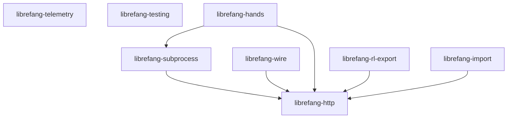

# Infrastructure Libraries

# Infrastructure Libraries

Shared foundations that every other LibreFang crate builds on — networking, process management, telemetry, testing, and data exchange. Nothing in this module knows about agents or LLMs directly; instead, it provides the plumbing that higher crates consume.

## What's Here

| Sub-module | One-line role |
|---|---|
| [HTTP Client](librefang-http-src.md) | Single `reqwest::Client` builder with bundled CA roots, system cert fallback, and unified proxy configuration |
| [Wire Protocol](librefang-wire-src.md) | TCP peer-to-peer messaging with HMAC + Ed25519 handshake |
| [Subprocess](librefang-subprocess-src.md) | JSON-over-stdio transport for long-lived sidecar bridges |
| [Telemetry](librefang-telemetry-src.md) | `metrics`-facade helpers for HTTP request recording and path normalization |
| [RL Export](librefang-rl-export-src.md) | Egress surface that ships finished RL rollout trajectories to external trackers |
| [Testing](librefang-testing-src.md) | `MockKernelBuilder`, `MockLlmDriver`, and request helpers for route-level tests |
| [Import](librefang-import-src.md) | Migration engine converting OpenClaw / OpenFang workspaces into LibreFang format |
| [Hands](librefang-hands-src.md) | Discovery, installation, and lifecycle management of pre-built autonomous agent packages |

## Dependency Flow

```mermaid
graph TD
    HTTP["librefang-http"]
    WIRE["librefang-wire"]
    SUB["librefang-subprocess"]
    TELEM["librefang-telemetry"]
    RLE["librefang-rl-export"]
    TEST["librefang-testing"]
    IMP["librefang-import"]
    HANDS["librefang-hands"]

    SUB --> HTTP
    WIRE --> HTTP
    HANDS --> HTTP
    RLE --> HTTP
    IMP --> HTTP
    HANDS --> SUB
```

`librefang-http` sits at the bottom of the graph — every crate that makes outbound HTTP calls (`librefang-wire` for discovery, `librefang-hands` for marketplace fetches, `librefang-rl-export` for uploads, `librefang-import` for remote sources) depends on it for consistent TLS and proxy behaviour.

`librefang-subprocess` is similarly foundational: both `librefang-channels` and `librefang-runtime` use it to spawn and communicate with sidecar bridges. The kernel's background agent startup and agent spawn paths both flow through `subprocess::spawn` → `new` → `with_cooldown`.

`librefang-telemetry` instruments the HTTP layer from the outside — `librefang-api` middleware calls `record_http_request` per request, and the Prometheus endpoint exposes the results.

## Key Cross-Module Workflows

**Starting a background agent.** The kernel calls through `background_lifecycle` → `artifact_store::run_startup_gc_once` → `subprocess::spawn` → `subprocess::new` → `with_cooldown`. This same subprocess path is also traversed when spawning an interactive agent (`spawn_agent_inner` → `hooks::fire` → `subprocess::spawn`).

**Fetching a Hand from the marketplace.** `HandsHubClient` (in `librefang-hands`) builds an HTTP client via `librefang-http`, calls `fetch_index`, and falls back through `get_with_retry`. The downloaded definition is parsed by `parse_hand_definition` and installed locally by `HandRegistry`.

**Migrating from another framework.** CLI, TUI, or API all converge on `run_migration()` in `librefang-import`, which calls framework-specific migrators (`openclaw::migrate`, `openfang::migrate`). If the source workspace is remote, the HTTP client handles the connection.

**Exporting an RL rollout.** The producer hands an opaque `Vec<u8>` trajectory to `librefang-rl-export`, which delivers it over HTTP to the configured upstream service. The crate intentionally never inspects the payload.

**Testing an API route.** `MockKernelBuilder` assembles a `LibreFangKernel` with vault keys, state secrets, and optional model catalog. `TestAppState` wraps it into an `AppState` + `Router`. Tests call helpers like `test_request` and `assert_json_ok` against the router — no daemon or network required.